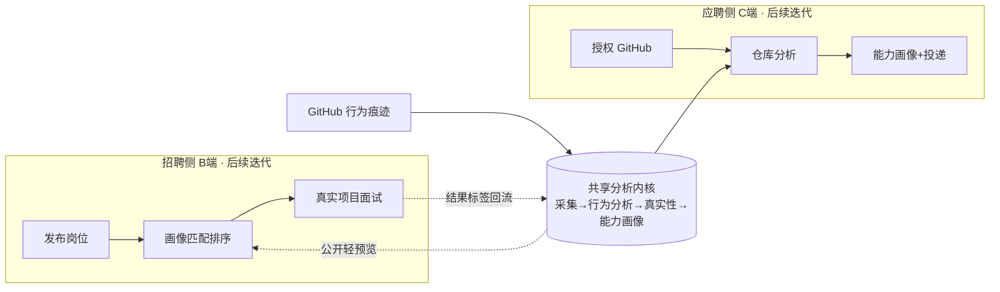
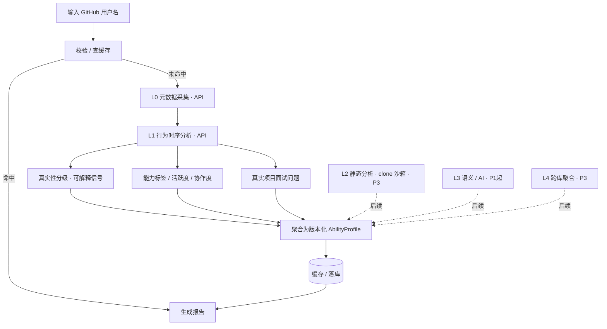

# JobAgent 产品需求文档（PRD）

> 文档版本：v0.3
> 日期：2026-09-10（v0.3 补章：2026-09-25）
> 状态：**#1–#8 已于 2026-09-10 拍板（见《待拍板决策清单》）；#4 当日修订为"海内外同步"**。v0.2 据决策结果与《市场调研-AI求职赛道》回灌，v0.1 的 `【待决策 #n】` 标记统一转为"已决策"。**v0.3 补 B 端角色边界（§3.3 / §4.4 / §5 / F10 / F11）＝决策 #17、C 端优先重排＝#18，两项已于 2026-09-25 拍板、均未实施**，设计全文见 [design-recruiter-roles-20260925.md](design-recruiter-roles-20260925.md)。
> 关联文档：
> - 《产品构想-以GitHub为桥梁的招聘系统.md》（定位与市场背景）
> - 《讨论记录-01-切入口与MVP收敛-20260910.md》（本 PRD 的收敛依据）
> - [design-recruiter-roles-20260925.md](design-recruiter-roles-20260925.md)（B 端角色与组织：现状、立场、权限矩阵）
> - 落地页工程：`../job-agent-landing`（Astro）

---

## 1. 背景与问题

AI 正在让传统技术招聘链路失真（背景详见构想文档第 2 章）：

- **简历**是自我描述，可被 AI 批量生成、美化、造假；
- **关键词筛选**筛的是"文案能力"而非"工作能力"；
- **面试**可被"面经 / 八股"训练，与真实工作脱节；
- 与此同时，**GitHub 本身也被 AI 污染**（一键生成模板仓库、刷 star、灌水 commit），只看表面数据同样会被骗。

GitHub 留下的是**行为痕迹**（commit 演进、PR 协作、Issue 讨论、被他人 merge 的代码），是"做过的事"而非"说过的话"。

**产品要解决的核心问题**：把开发者的 GitHub 痕迹，转化为**可信、可解释、可复核**的能力证据，并让招聘侧与应聘侧围绕同一份证据对齐。

---

## 2. 产品定位与目标

### 2.1 一句话定位

AI 时代，以 GitHub 为"可验证工作证据"的招聘（B）+ 应聘（C）双向闭环平台。

### 2.2 愿景与阶段目标

- **愿景**：让录用决策基于"可验证的真实工作证据"，而非可被生成 / 训练的自我描述。
- **本期（MVP）目标**：验证**单账号 GitHub 深度分析报告**本身是否"有区分度、可行动"——这是后续一切双边功能的地基。
- **非目标（本期明确不追求）**：不做双边交易闭环、不追求岗位 / 简历规模、不做支付；**不做全自动后台投递（无人值守批量爬虫投递）、内推自动化**（效率工具主场，JobAgent 定位为可被其携带/互操作的"可信画像消费端"）；**Chrome 扩展一键填充调整为 P1 做**（决策 #15，2026-09-11 拍板，差异化在于填充数据来自 GitHub 验证过的可信画像而非用户自编简历）。

### 2.3 产品总路径（最终形态，非本期范围）



**关键架构原则**：`共享分析内核` 与 B/C 界面解耦，是本期唯一必须先建牢的部分。

---

## 3. 目标用户与核心场景

### 3.1 用户分层（沿用"全纳入"决策，分期落地）

| 用户 | 本期关系 | 核心诉求 |
| --- | --- | --- |
| 技术岗开发者（C） | **MVP 主要使用者** | 知道自己的 GitHub 在招聘方眼中长什么样、如何改进、后续如何被推荐 |
| 技术招聘方 / 技术负责人（B） | MVP 轻量触达，后续主力付费方 | 低成本核验候选人真实水平、拿到可追问的真实项目问题 |
| 非技术岗求职者 | 后续 | 用作品集 / 案例 / 证书等多元证据源生成同构画像（schema 已预留） |
| 海外 / 国内用户 | **海内外同步**（决策 #4 修订）：P0 即中英双语、双区域可访问 | Gitee 作为首个并行证据源在 GitHub 内核验证后接入；合规 GDPR 与个保法双线前置 |

### 3.2 MVP 核心用户故事

- **US-1（访客，无登录）**：作为访客，我在落地页输入一个公开 GitHub 用户名，就能看到一份带证据的精简能力画像，从而在 1 分钟内理解产品价值。
- **US-2（开发者本人）**：作为开发者，我授权自己的 GitHub，得到更完整的画像与可执行改进建议，并能生成一份可分享给招聘方的验证报告链接。
- **US-3（招聘方，轻量）**：作为招聘方，我粘贴一个公开账号，看到候选人的能力标签、真实性分级与"基于其真实项目"的面试问题，用于准备面试（决策 #1：C 授权为主脊，B 端保留公开轻预览，完整雇佣级报告需本人授权）。

### 3.3 两侧的实现边界（v0.3 补，2026-09-25）

§3.1 是**用户分层**，不是**账号分层**。产品到今天为止的实现里，应聘方与招聘方**共用同一个登录账号**，区分只发生在三处：

| 维度 | 应聘方（C） | 招聘方（B） |
| --- | --- | --- |
| 登录/身份 | **无独立身份**。`accounts` 只记"通过 GitHub/Gitee OAuth 登录的开发者"，无角色字段 | 同左——今天一个"招聘方"与一个"开发者"在数据上无法区分 |
| 授权（数据来源） | 本人 OAuth + claim → 权威画像（决策 #1-A/#6-A） | 不持有画像；消费已生成的画像快照 |
| 可见性 | 全开放：结论 / 技能 / 匹配 / 简历 / 投递 | 登录解锁原始证据外链、面试题、`interview-kit.md`（[design-auth-gating](design-auth-gating-20260919.md)） |
| 界面 | 画像报告 + `ResumeBuilder` + `JobRecommendations` + `ApplicationTracker` + 扩展 | `CandidateWorkspace` + `InterviewPlanner` + 面试包导出 |
| 归属（DB） | `applications` 按 `profile_id` 归属、**无账号归属** | `interviews` 按 `created_by_account_id` 行级归属（012） |
| 商业 | 免费 | **PRD 认定的主力付费方，但付费主体在数据模型中尚不存在** |

这个"无角色"状态是 item45 落地面试计划表时的**有意取舍**（当时选"个人效率工具最小做法：不引入 recruiter 角色/组织实体"），不是遗漏。它带来三个今天就可复现的后果：`GET /candidates` 允许匿名分页遍历整个画像库、投递记录任何人不登录即可写改、招聘方动作没有可引用的身份。**补齐这一层的提案见 §4.4 与 F10，设计全文见 [design-recruiter-roles-20260925.md](design-recruiter-roles-20260925.md)，决策项为 #17。**

---

## 4. 产品范围

### 4.1 本期 MVP（P0）—— 不依赖待决策项即可启动

1. 公开 GitHub 用户名 → 触发分析（**无需登录**，B/C 通用）；
2. 分析深度仅 **L0 元数据 + L1 行为时序**，**不 clone 仓库**；
3. 产出**能力画像报告**：能力标签（带证据引用）、真实性**分级 + 证据信号**（不输出单一"真实度 %"）、活跃度 / 协作度概览、3~5 个真实项目面试问题；
4. 报告可缓存、可通过链接只读分享；
5. **落地页 `#demo` 接入真实引擎**，替换当前仅写 `localStorage` 的演示逻辑，并保留内测留资；
6. 分析过程版本化、证据可回溯（同一输入 + 同一分析版本 → 可复现）。
7. **海内外同步（决策 #4）**：报告与界面 P0 即中英双语（i18n）、部署保证两区域可访问、合规按 GDPR 与《个人信息保护法》双线前置；证据源仍先以 GitHub 跑通内核（海内开发者同样普遍使用 GitHub）。

### 4.2 P1（紧随其后）

> **实现状态注记（2026-09-22）**：下列 P1 条目多数已在 MVP 阶段提前落地，本节保留为原始范围规划，实际进度以 handoff 为准：
> - **GitHub OAuth 本人认领**：已落地（handoff item28–32，含真实 OAuth 端到端、return_to 深链、授权分级闸）；
> - **Gitee 适配器 + Gitee OAuth**：已落地（item14、item33，含双源融合 platform=all，item20/22/23/27）；
> - **报告异议入口**：已落地（item37 P0-2，报告页局限区 mailto，PRD F6.4 的 P0 兜底先于 P1 接通处理流程）；
> - **Chrome 扩展一键填充**：已落地并经真实 Greenhouse/Lever 真机验证（item9、item40、item46），CWS 上架为外部待办；Workday 直渲染租户端到端仍待验证；
> - **L3 语义层**：未启动（不 clone，仍属后续）。
> - 此外 P2 的职位聚合、画像↔岗位匹配、岗位定向简历、演示模式（免注册试用）等亦已提前实现，见 handoff item10/12/17/18/21。

- 开发者 GitHub OAuth **本人认领**与完整报告、改进建议（决策 #1/#6：本人授权为权威报告）；
- 招聘方"公开轻预览"界面与面试问题增强；
- **Gitee 适配器**：作为 GitHub 内核验证通过后的**第一个并行证据源**（决策 #4 修订，自 P3 提前；复用 EvidenceSource 抽象，不改动分析内核）；
- L3 语义层：基于代码 / README 的领域与设计决策推断（仍可不 clone，先用 API 取关键文件内容）；
- 报告异议 / 申诉入口（真实性误伤的纠错通道，合规必需）；
- **Chrome 扩展一键填充**（决策 #15，2026-09-11 拍板）：支持 Workday / Greenhouse / Lever 三大主流 ATS，填充数据来自可信画像（姓名、邮箱、GitHub、技能、教育等），用户主动触发、确认后提交；差异化卖点"投出 GitHub 验证过的你"。

### 4.3 P2 / P3（"系统"层，验证通过后再建）

- **P2**：**职位聚合（岗位搜集，决策 #16 确认按原计划 P2 启动）**→ 岗位发布、画像 vs 岗位匹配排序、一键投递、面试结果标签回流、订阅 / 增值付费。职位聚合是匹配/投递的前置基础设施，先聚焦海外技术岗数据源（Wellfound、YC Jobs、RemoteOK 等），轻量爬虫+公开 API，日更增量。
- **P3**：L2 clone 静态分析（隔离沙箱）、L4 跨库 / 身份聚合、非技术岗多元证据源（Gitee 已提前至 P1，见上）。

### 4.4 B 端角色与组织（v0.3 新增 · #17 已拍板 2026-09-25 · 未实施）

**范围**：给"招聘方"一个可记录、可撤销、可被引用的身份，并据此收紧对外招聘面的访问。**不含**团队协作、企业实体、席位与计费。

- **立场（2026-09-25 选定）**：**分期**——先做"角色声明 + 访问闸"这一刀，组织/团队/席位进 [deferred-items.md](deferred-items.md) 挂起并写明触发条件。
- **排期（2026-09-25 选定）**：**上线后第一迭代**，不并入当前上线 MVP（当前唯一硬阻塞仍是形态 C 控制台部署）。**注：同日的 [#18 C 端优先重排](design-c-side-first-20260925.md) 提案把本表 F11（投递归属）提前、F10（招聘方声明）留在原序**，理由是 F11 保护的是求职者自己的数据；该改序待拍板。
- **机制**：招聘方是一个**显式声明**，不是权限等级。应聘侧无需声明（其功能今天对任何登录用户开放），招聘侧声明后解锁人才检索与面试计划；无审核、无企业邮箱验证、无组织归属。
- **为什么不做角色枚举**：`role ∈ {candidate, recruiter, both}` 会立刻引出"未声明者算什么"与"C 端为何也要声明"两个无必要的问题；只回答"有没有声明"这一问即可。
- **验收标准（概要）**：① 未声明身份访问人才检索与面试写侧端点被明确拒绝、不静默降级；② 声明与撤销均可在界面一次完成，且**撤销后既有面试/投递数据不丢**；③ 声明状态不被后台账号清理任务静默改掉（该风险见 [design-recruiter-roles §7.1](design-recruiter-roles-20260925.md)，必须随本项一起闭）；④ `analyzer-core` 与 `/analyze` 配额顺序零改动；⑤ 单张画像的公开只读口径**不变**（决策 #1-A 的既定取舍，本项不收紧）。
- **待拍板**：是否连面试写侧一起收紧、声明是否需门槛、投递记录是否补账号归属、人才检索门到"登录"还是"声明"、是否拆分阻塞上线的第一刀 —— 五项见 [design-recruiter-roles-20260925.md §8](design-recruiter-roles-20260925.md)。

---

## 5. 核心概念定义

| 概念 | 定义 |
| --- | --- |
| **证据内核（Analyzer Core）** | 输入平台账号、输出版本化能力画像的独立服务，对 B/C 界面无感知 |
| **能力画像（AbilityProfile）** | 一个账号在某时间窗、某分析版本下的结构化能力与真实性结论集合 |
| **证据项（EvidenceItem）** | 支撑某条结论的最小原始事实指针（某次 commit / PR / Issue / 仓库），可点击回溯 |
| **真实性分级（Authenticity）** | `likely_authentic / mixed_signals / suspicious / insufficient_data` 四级 + 置信度 + 可解释信号，**不使用单一百分比分数**（决策 #2 已确认） |
| **分析层（L0–L4）** | 见第 7 章，分析深度与成本分层 |
| **结果标签（Outcome Label）** | 面试 / 录用结果对画像预测的校准信号，长期数据壁垒（P2 起采集） |
| **招聘方声明（Recruiter Declaration）**（v0.3） | 登录账号上一次显式、可撤销、无审核的自我声明"此账号用于招聘"，记为 `accounts.recruiter_declared_at` 时间戳。**不是权限等级、不是角色枚举、不是组织成员身份**；解锁招聘方面向的界面与端点，是付费主体与企业协作的前置。提案见 §4.4，设计见 [design-recruiter-roles-20260925.md](design-recruiter-roles-20260925.md) |
| **使用侧（Audience Side）**（v0.3） | 同一登录账号所面对的两套界面（应聘方消费自己的画像与投递，招聘方检索与安排面试）。**是界面划分，不是账号划分**；两侧共用 `accounts`，今天无角色字段 |

---

## 6. 功能需求（FR）与验收标准

优先级：P0 = MVP；P1/P2/P3 见 4.2 / 4.3。

### F1 分析触发（P0）

- **描述**：输入 GitHub 用户名，校验合法性与账号是否存在，触发或命中缓存返回画像。
- **验收标准**：
  1. 合法用户名：存在缓存且未过期则直接返回；否则进入分析队列；
  2. 用户名不存在 / 被封禁：返回明确、友好的错误态，不生成画像；
  3. 空输入、非法字符、超长输入有前端 + 后端双重校验；
  4. 分析进行中有 loading / 进度反馈，失败可重试且不重复计费 / 不击穿配额。

### F2 数据采集 L0+L1（P0）

- **描述**：仅通过 GitHub API 采集元数据与行为时序数据，不 clone。
- **采集范围（L0）**：账号基础信息、公开仓库列表、语言构成、star/fork、贡献活跃度概览、PR/Issue 计数。
- **采集范围（L1）**：commit 时间分布与突发模式、commit author 身份一致性、PR 评审 / 合并周期、Issue→PR 关联、持续月数、外部仓库被 merge 贡献的线索。
- **验收标准**：
  1. 每个结论字段都能回溯到对应原始 API 记录（存指针，不做无标注的全量拷贝）；
  2. 单账号调用次数有**调用预算上限**并被记录（实测后填值，见第 9 章 NFR-1）；
  3. 触发限频时优雅降级（先返回 L0，L1 异步补齐），不向用户暴露原始报错；
  4. 遵守 GitHub API 服务条款，使用条件请求 / 缓存减少重复调用。

### F3 真实性分级（P0）

- **描述**：基于 L0/L1 信号给出分级与**可解释信号列表**，不输出单一百分比。
- **典型信号（示例，非最终规则）**：提交高度集中于极短时间窗、commit message 高度雷同、author 身份异常单一 / 多变、仓库与已知模板雷同线索、star 增长与贡献严重背离、缺少真实 PR/Issue 协作。
- **验收标准**：
  1. 输出四级状态 + 置信度 + 每条信号的 `severity / detail / evidence_refs`；
  2. **证据不足时必须输出 `insufficient_data`，禁止臆断**；
  3. 任一"可疑"结论都能展开看到支撑证据；
  4. 信号规则 / 模型带版本号，规则变更可追溯、可回放历史画像。

### F4 能力画像与标签（P0）

- **描述**：聚合产出能力标签（语言 / 框架 / 领域）、活跃度、协作度、项目复杂度概览，每个标签带置信度与证据引用。
- **验收标准**：
  1. 每个能力标签至少关联 1 条 `evidence_ref`，无证据不下结论；
  2. 区分"使用过"与"有深度"两档，不把语言占比直接等同于熟练度；
  3. 报告显著位置标注**数据时间窗与分析版本**；
  4. 明确列出"无法判断"的维度（caveats），不掩盖盲区。

### F5 真实项目面试问题（P0）

- **描述**：基于该账号真实仓库 / PR 生成 3~5 个"为什么这样设计 / 这段如何演进"的问题，每个问题标注其证据来源。
- **验收标准**：
  1. 每个问题都绑定 `basis_evidence_ref`，杜绝与本人项目无关的通用八股；
  2. 证据不足时减少问题数量并说明，不硬凑；
  3. 问题表述中立，不预设候选人缺陷。

### F6 报告展示与只读分享（P0）

- **描述**：结构化展示画像；生成只读分享链接。
- **验收标准**：
  1. 分享页在未登录态可访问，且同样展示证据与时间窗 / 版本；
  2. 页面明确区分"已验证信号"与"系统推断"；
  3. 提供"数据来源与局限"说明区块；
  4. 支持本人 / 被分析方提交异议的入口位（P1 接通处理流程，P0 先留表单 / 邮件入口）。

### F7 落地页 Demo 接入（P0）

- **描述**：改造 `job-agent-landing/src/components/Demo.astro`，将"输入用户名"由本地留资改为调用真实分析引擎并跳转 / 内嵌展示精简画像；保留内测留资。
- **验收标准**：
  1. 输入后能看到真实（精简）画像或明确错误态；
  2. 保留并去重记录内测用户名；
  3. 未接入引擎的环境可回退到"留资模式"，不阻断落地页部署；
  4. 落地页文案中删除 / 替换"真实度 98%"这类与正式口径冲突的示意（示意数据需明确标注；"真实度 98%"示意已按决策 #2 移除）。

### F8 本人 OAuth 认领（P1）

- **描述**：开发者 OAuth 授权后认领本人公开画像，获得完整报告与改进建议（范围按决策 #1：C 端授权为主脊）。
- **验收标准（概要）**：最小化授权范围；仅读取授权允许的数据；可解绑；改进建议每条绑定证据与可执行动作。

### F9+（P2/P3，仅列方向，本期不展开）

岗位发布、匹配排序、投递与状态流转、结果标签回流、付费；L2 clone 静态分析、L4 聚合、Gitee、非技术证据源。

### F10 招聘方声明与访问闸（v0.3 新增 · #17 已拍板 · 上线后第一迭代 · 未实施）

- **描述**：给账号一个显式、可撤销、无审核的"我用于招聘"声明，据此解锁并收紧招聘方面向的表面（人才检索、筛选工作台、面试计划）。设计全文见 [design-recruiter-roles-20260925.md](design-recruiter-roles-20260925.md)，范围与非目标见 §4.4。
- **验收标准**：
  1. **未声明即拿不到批量画像**：`GET /candidates` 对匿名 / demo 返回 401、对已登录未声明返回 403（新错误码 `RECRUITER_DECLARATION_REQUIRED`，与既有 `AUTH_REQUIRED` 同族），返回体不含任何画像字段；
  2. **报告页不出现半屏数据**：未声明身份访问招聘方视图渲染声明墙（纯 SSR、带 `return_to` 深链回跳，复用 `GateCard`），墙必须同时替换掉 SSR 首屏直出的候选人列表，不能只挡 XHR；
  3. **声明与撤销一次完成**，两者都只动 `accounts.recruiter_declared_at` 单列；撤销后既有面试数据仍对本人可见、不丢；
  4. **声明不被后台任务静默改掉**：账号运维清理（`auth cleanup`）永不清理、也永不重置已声明账号，该不变式有测试钉住；
  5. **文档同步**：该端点与 `/auth/me` 新字段改闸后，`docs/API.md` 的访问前提说明随之更新（`api-doc-consistency` 守护覆盖）；`docs/design-auth-gating §4` 的"不做白名单"表述改口（两份文档不得互相矛盾）；
  6. 单张画像的公开只读口径（`GET /profiles/:id`、`/exportable`、`by-subject`）**完全不变**，`analyzer-core` 不引入任何身份概念。

### F11 投递记录归属（v0.3 新增 · #17 · **已落地 2026-09-25，handoff item61**）

- **描述**：`applications` 补可空 `created_by_account_id`。写入时按当前身份落归属、匿名写为 `NULL`；更新时拒绝非归属方改写有主记录，`NULL` 行沿用现状。**今天该表的唯一写入方是报告页 `ApplicationTracker`（扩展不写投递记录）**，所以这是一处只影响一条链路的修补。
- **验收标准**：
  1. 登录用户创建的投递记录携带归属；匿名创建仍成功、`created_by_account_id` 为 `NULL`；
  2. 非归属方 PATCH 有主记录返回 **404**（对齐 `PATCH /interviews/:id` 既有的"非本人资源一律 404、不泄露存在"约定），不回显记录内容；
  3. 存量行不回改（无法反推当时身份，id 为 `app-<uuid>` 不可枚举）；
  4. 投递追踪的既有匿名 E2E 不回归为需要登录（未认领画像链路保持原样）；
  5. **认领即隐私开关**：画像一旦被本人认领，其投递的读与写只认本人（未登录 401、他人 403），且报告页对该访客**完全不挂载**投递区块（不是挂载后再报错）；未认领画像不设限。

---

## 7. 分析管道与分层



- **MVP 只走实线部分**：L0 → L1 → 真实性 / 能力 / 问题 → 聚合画像。
- 降级策略：L0 先行返回，L1 异步补齐；任一层失败不产生"看似完整"的报告。

---

## 8. 核心数据模型（能力画像契约，v0.1）

> 设计原则：**证据源无关、结论必有证据、版本化可复现、不使用单一真实性百分比**。
> 以下为字段契约草案（TypeScript 描述），最终以技术方案评审为准。

```ts
// 统一证据项：任何结论都由 EvidenceItem 支撑；GitHub 只是第一个 source
interface EvidenceItem {
  evidenceId: string;
  sourcePlatform: 'github' | 'gitee' | 'portfolio' | string; // 为多证据源预留
  sourceType: 'commit' | 'pr' | 'issue' | 'repo' | 'contribution' | 'file';
  url: string;                 // 可点击回溯到原始记录
  occurredAt?: string;         // ISO 时间，可空
  layer: 'L0' | 'L1' | 'L2' | 'L3' | 'L4';
  claim: string;               // 该证据支持的结论（人话）
  rawRef: string;              // 原始对象指针（如 commit sha / PR number），不存冗余全量
}

type AuthenticityStatus =
  | 'likely_authentic'   // 多数信号指向真实
  | 'mixed_signals'      // 信号冲突，需人工判断
  | 'suspicious'         // 存在较强异常信号
  | 'insufficient_data'; // 证据不足，禁止臆断

interface AuthenticitySignal {
  code: string;            // 规则/模型信号码，带版本
  severity: 'info' | 'warn' | 'risk';
  label: string;           // 人话标题
  detail: string;          // 具体描述
  evidenceRefs: string[];  // -> EvidenceItem.evidenceId
}

interface AbilityProfile {
  profileId: string;
  analyzerVersion: string;             // 分析引擎版本，保证可复现
  generatedAt: string;
  dataWindow: { since: string; until: string };
  analysisLayers: Array<'L0' | 'L1'>;  // MVP 仅 L0/L1
  subject: {
    platform: 'github';
    login: string;
    displayName?: string;
    avatarUrl?: string;
    profileUrl: string;
    claimed: boolean;                  // 是否经本人 OAuth 认领
  };
  summary: {
    headline: string;
    seniorityHint?: { band: string; confidence: number; evidenceRefs: string[] };
  };
  skillTags: Array<{
    name: string;
    kind: 'language' | 'framework' | 'domain';
    depth: 'used' | 'proficient';      // 区分"用过"与"有深度"
    confidence: number;
    evidenceRefs: string[];
  }>;
  activity: {
    longevityMonths?: number;
    cadenceSummary?: string;
    burstPattern?: AuthenticitySignal; // 时序异常作为信号而非分数
    metrics?: Record<string, number>;  // 仅放可由 API 直接得到的计数
  };
  collaboration: {
    prSummary?: string;
    externalMergedContributions?: string[]; // 被他人项目 merge 的强信号
    evidenceRefs: string[];
  };
  authenticity: {
    status: AuthenticityStatus;
    confidence: number;                // 置信度，非"真实度百分比"
    signals: AuthenticitySignal[];
  };
  interviewQuestions: Array<{ question: string; intent: string; basisEvidenceRef: string }>;
  improvementSuggestions?: Array<{ suggestion: string; why: string; evidenceRefs: string[] }>; // C 端 P1
  caveats: string[];                   // 明确"无法判断"的盲区
}
```

> P2 起新增 `JobProfile`（岗位要求）与 `MatchResult`（画像 vs 岗位匹配 + 可解释理由），不在本期定义。

---

## 9. 非功能需求（NFR）

| 编号 | 类别 | 要求 |
| --- | --- | --- |
| NFR-1 | 外部配额 | 实测并记录"单画像 API 调用预算"；使用条件请求 / ETag 缓存；认证 token 安全管理；**具体限额以 GitHub 官方最新文档为准（待核对，见风险 R1）** |
| NFR-2 | 安全 | MVP **不 clone、不执行任何仓库代码**；P3 引入 clone 时必须隔离沙箱 + 大小 / 超时 / 递归深度限制 |
| NFR-3 | 隐私合规 | 最小化采集与存储；优先存证据指针而非全量原始数据；分析 / 分享链路可审计；提供异议入口；自动化决策需告知（详见第 10 章） |
| NFR-4 | 可复现 | 画像绑定 `analyzerVersion` 与数据时间窗；规则变更可对历史输入回放 |
| NFR-5 | 性能 | 报告首屏建议目标值（**内部建议、待压测校准**）：L0 秒级返回，L1 异步补齐；具体 P95 阈值在技术方案中按实测确定 |
| NFR-6 | 容错 | 任一层失败显式标注缺失，不输出"看似完整"的报告；外部 API 故障有降级与重试上限 |
| NFR-7 | 可观测 | 记录分析成功率、各层耗时、配额消耗、缓存命中率、各真实性信号触发分布 |
| NFR-8 | 可访问 / 国际化 | **海内外同步（决策 #4）**：落地页与报告 P0 即中英双语（i18n，用户可见字符串走 `t()`、中英 key 对齐）；部署保证两区域可访问；不做单一语言优先 |

---

## 10. 合规与隐私（设计前置，最终以法务 / 法规原文为准）

- **数据来源合法性**：MVP 仅处理**公开数据**或**本人 OAuth 授权数据**；明确公示采集范围、用途、留存周期。
- **自动化决策与画像风险**：对"可识别个人"输出能力 / 真实性结论并可能用于雇佣，方向上涉及画像与自动化决策相关规则（**海内外同步，GDPR 与中国《个人信息保护法》双线并行**）。**具体法条与合规动作待查原文 / 法务（R2）**，设计上先做到：
  1. 结论以"辅助参考 + 可解释证据"呈现，不替代人做录用决定；
  2. 被分析方可查看、异议、申请更正；
  3. 优先走"本人授权 / 本人分享"路径，降低未同意分析个人的风险；
  4. 不输出可能构成歧视的敏感推断（年龄、性别、地域、健康等）。
- **数据安全**：token、授权令牌加密存储；分享链接不可枚举、可撤销。

---

## 11. 成功指标与验证设计

### 11.1 北极星（候选）

**被完整查看或被分享的"可信能力画像"数量**（衡量证据内核是否真正产生价值，而非注册量）。

### 11.2 MVP 验证漏斗（落地页真实埋点）

输入用户名 → 分析成功率 → 报告完整查看率 → 分享 / 留资转化率。

### 11.3 去风险实验（对应讨论记录 4.2，开发同期进行）

- **样本**：20~50 个真实账号，含已知 AI 模板 / 疑似刷量账号与公认强工程师（人工标注）。
- **判定 1 · 可分性**：真实性信号在标注集上的精确率 / 召回；**具体合格阈值为内部基线，需在小样本上校准后再定，不预设对外承诺数字**。
- **判定 2 · 可行动性**：邀请少量技术招聘方盲看报告，评估"是否能据此采取下一步面试动作"。
- **门槛**：两项均达到内部基线，才进入 P2 系统层建设。

---

## 12. 待决策问题（Open Questions）

> **#1–#4 均已于 2026-09-10 拍板（下表"助手建议"列即最终选择，完整记录见《待拍板决策清单》）；其中 #4 当日由"先海外"修订为"海内外同步"。** 本表保留为决策溯源。

| # | 问题 | 助手建议 | 影响范围 |
| --- | --- | --- | --- |
| 1 | 第一界面以 C 端本人授权为主，还是 B 端粘贴即分析为主？ | C 端授权为主脊 + B 端轻预览 | F1/F6/F8、合规路径、冷启动 |
| 2 | 是否放弃"真实度 98%"单一标量，改为分级 + 证据 + 置信区间？ | 放弃单分数 | F3、F7、落地页文案 |
| 3 | MVP 是否只做 L0+L1、不 clone，并先把落地页 demo 接真？ | 是 | 第 4/7/9 章范围 |
| 4 | 先押海外还是海内外同步？ | **海内外同步**（修订；中英双语、双区域、合规双线，Gitee 内核验证后即并行） | 市场、架构多平台优先级 |
| 17 | ✅ 已拍板 2026-09-25：B 端是否需要招聘方角色与组织？ | 分期：先"招聘方声明 + 访问闸"（零新表），组织/团队/席位缓做 | F10/F11、§3.3、§4.4、账号与投递数据模型、合规；设计见 [design-recruiter-roles-20260925.md](design-recruiter-roles-20260925.md) |
| 18 | ✅ 已拍板 2026-09-25：C 端下一迭代做什么，才能"替真实求职者走完一轮求职"？ | 按六步判据分期修链 C-A→C-D：先修技能表达与建议生产，再修交付物卫生，最后建"我的求职"；并把 #17 的 F11 提前、F10 留后 | 第 1–4 章范围优先级、F4/F5/F8/F10/F11、§11.1 北极星、analyzer 技能目录；方案见 [design-c-side-first-20260925.md](design-c-side-first-20260925.md) |

---

## 13. 里程碑（建议，待决策后定档）

1. **M1 分析内核 + 报告（P0）**：L0/L1 管道、AbilityProfile v0.1、**中英双语**报告页、双区域可访问部署、落地页 demo 接真；并行跑标注样本实验。
2. **M2 认领与轻 B 端（P1）**：OAuth 认领、改进建议、公开轻预览、异议处理、L3 语义问题增强、**Gitee 首个并行证据源（#4 修订提前）**。
3. **M3 双边闭环（P2）**：岗位、匹配、投递、结果标签回流、付费验证。
4. **M4 多平台 / 非技术（P3）**：L2 沙箱静态分析、L4 聚合、更多证据源与非技术岗多元证据（Gitee 已提前至 M2）。

---

## 14. 风险登记册

| 编号 | 风险 | 等级 | 缓解 | 状态 |
| --- | --- | --- | --- | --- |
| R1 | GitHub API 限额 / 计费规则不确定，规模化受阻 | 中 | 实测调用预算、缓存、token 池、L0 优先降级 | 待核对官方文档 |
| R2 | 未同意对个人打分用于雇佣的合规风险 | 高 | 优先本人授权路径、可解释、异议入口、法务评审 | 待法务 / 原文 |
| R3 | clone 任意仓库的供应链与成本风险 | 中（MVP 暂不涉及） | MVP 不 clone；P3 隔离沙箱 | 已在范围上规避 |
| R4 | 市场需求为假设，可能不成立 | 高 | 20~50 标注账号实验 + 落地页真实漏斗 | 待验证 |
| R5 | 真实性误伤真实开发者 | 中高 | 不输出单分数、证据可解释、`insufficient_data` 兜底、申诉通道 | 设计中 |
| R6 | 真实性规则被反向刷分 | 中 | 信号组合而非单阈值、规则版本化、持续迭代 | 长期跟进 |
| R7 | 国内 GitHub 访问不稳定 | 中 | 海内外同步：双区域部署/访问优化，Gitee 内核验证后即并行接入（#4） | 设计中 |
| R8 | 招聘方身份在数据模型中不存在，招聘侧表面处于"人人可访问"的默认放开状态（v0.3） | 中高 | F10/F11（#17 待拍板）：人才检索与面试写侧加声明闸、投递记录补账号归属；**上线后第一迭代启动，不并入当前 MVP** | 已拍板，未实施 |

---

## 15. 附录

### 15.1 术语

见第 5 章。

### 15.2 参考资料（沿用构想文档，未在本次独立复核）

- LibreHire —— 基于真实 commit 数据的开发者评分工具：https://github.com/ayushmaanBora/libreHire
- Star —— AI 人才发现平台：https://github.com/bigsparsh/star
- GitHub developer-search 主题（含 github-talent-mcp）：https://github.com/topics/developer-search
- GitHub Jobs 退休后 GitHub 仍是技术招聘渠道的讨论：https://utkrusht.ai/blog/best-channels-to-hire-project-based-developers
- resume-as-code 趋势：https://github.com/topics/resume-as-code
- GitHub API 官方文档（**限额等数据待核对，未直接引用具体数字**）：https://docs.github.com/

### 15.3 信心与证据说明

- 本 PRD 的**范围收敛、分层架构、数据模型、功能拆解与风险识别**为产品 / 工程判断，信心 **8/10**。
- 信心 **低于 7**、已在正文显式标注的项：GitHub API 具体配额（R1/NFR-1）、法律条款细节（R2/第 10 章）、市场接受度与具体数值阈值（R4/11.3、NFR-5）。这些一律以官方文档、法规原文或实验结果为准，未做无依据假设或数字填充。
