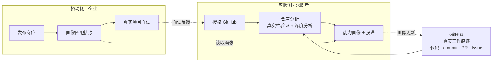

# 招聘系统产品构想 —— 以 GitHub 为桥梁

> 日期：2026-09-10
> 状态：讨论稿（2026-09-10 已决策：目标用户 / 商业模式 / 市场地域 **全纳入产品迭代**）
> 范围：先做招聘系统，后续扩展应聘系统；落地页使用 Astro

---

## 1. 一句话定位

**AI 时代，把 GitHub 当作求职者的"可验证工作证据"，做一个招聘（B端）+ 应聘（C端）双向闭环平台。**

---

## 2. 核心洞察：AI 时代为什么招聘/应聘方式必须改变

### 2.1 传统链路的失效

| 传统环节 | 问题 |
| --- | --- |
| 简历 | 是**自我描述**，AI 能批量生成、美化、造假 |
| 关键词筛选 | 筛的是"文案能力"，不是"工作能力" |
| 面试 | 能被"面经"训练，八股题与实际工作脱节 |
| 背调 | 主观、滞后、成本高 |

### 2.2 GitHub 提供的是什么

GitHub 留下的是**行为痕迹**，是"做过的事"而不是"说过的话"：

- **commit 历史**：开发节奏、长线投入、代码演进过程
- **PR 协作**：代码评审、协作规范、沟通质量
- **Issue 讨论**：问题定位能力、技术判断
- **项目结构**：架构设计、工程化水平
- **开源贡献**：在真实项目中被 merge 的代码

### 2.3 反面：AI 也在污染 GitHub

- 一键生成的模板/AI 仓库（clone 后无真实开发过程）
- 刷 star、刷贡献
- 灌水 commit、异常 commit 时间模式

> **结论：这个产品的护城河不是"看 GitHub"，而是"鉴别 GitHub 真实性 + 深度分析"。**

---

## 3. 市场现状（已查证）

方向被多次验证，但现有玩家几乎都是**单点工具**，没有一家做成双向闭环平台。

| 已有尝试 | 类型 | 说明 |
| --- | --- | --- |
| [LibreHire](https://github.com/ayushmaanBora/libreHire) | 开源评分工具 | 只用真实 commit 数据、字节加权语言熟练度、已验证公开贡献给开发者打分，明确对抗"关键词堆砌的简历" |
| [Star](https://github.com/bigsparsh/star) | AI 人才发现 | 聚合 GitHub、Stack Overflow、Dev.to 等多平台，用 AI 匹配招聘者的自然语言查询 |
| [github-talent-mcp](https://github.com/topics/developer-search) | 招聘搜索工具 | 用 MCP 协议搜索、打分、排序 GitHub 开发者 |
| GitHub Jobs（官方职位板） | 已退休 | 官方职位板关闭，但 GitHub 本身仍是技术招聘第一渠道 |
| [resume-as-code](https://github.com/topics/resume-as-code) | 简历即代码 | 用 Git 管理简历、GitHub Pages 托管，代表"简历工程化"趋势 |

**机会点**：把"仓库分析 / 评分"做成招聘 + 应聘的完整闭环产品。

---

## 4. 产品定位：双向闭环 + 真实性验证

### 4.1 招聘侧（B端 · 企业）

1. **发布岗位**：技术栈、能力标签、项目要求
2. **画像匹配排序**：候选人的能力画像 vs 岗位要求，自动匹配、排序
3. **真实项目面试**：基于候选人真实仓库生成面试问题（问"你为什么这样设计"，而不是八股）

### 4.2 应聘侧（C端 · 求职者）

1. **授权 GitHub**：OAuth 登录，授权读取公开仓库
2. **仓库分析**：真实性验证 → 深度分析（代码质量、活跃度、协作、项目复杂度）
3. **能力画像 + 投递**：生成能力标签、可执行的改进建议（如"commit 集中在 3 天，建议养成长线贡献"）、岗位推荐、一键投递

### 4.3 反馈闭环

面试结果回流 → 求职者按建议改进仓库 → 画像持续更新 → 下次投递更有竞争力

### 4.4 核心护城河

**真实性验证引擎**：识别 AI 生成仓库（克隆模板、无真实开发过程）、刷 star、异常 commit 模式，确保"证据可信"。

---

## 5. 系统架构示意

---

## 6. 技术选型讨论

### 6.1 落地页：Astro（已定）

- **适合**：产品官网、SEO、内容营销（GitHub 分析白皮书等）
- **建议**：首页放一个"输入 GitHub 用户名 → 查看能力画像"的**实时演示框**，访客一试就懂产品价值，同时收集种子用户

### 6.2 主应用

- 需要登录态（GitHub OAuth）、动态分析、数据库、匹配引擎
- 可选形态：Astro（SSR 能力）+ 独立前端（React/Vue islands），或独立全栈框架
- 分析管道：GitHub REST/GraphQL API + 仓库克隆静态分析 + AI 模型评分

### 6.3 待验证的技术点

- GitHub API 限额（未认证 60 次/小时，认证 5000 次/小时）对批量分析的影响
- 仓库 clone + 静态分析的资源成本
- 国内外访问差异（GitHub 在国内访问不稳定，因地域全纳入产品迭代，需兼容 Gitee 等国内平台）
- 多平台证据源扩展性（作品集、项目案例、证书等，服务于非技术岗的后续纳入）

---

## 7. 决策记录与后续待办

### 7.1 已决策（2026-09-10）：三个方向全纳入产品迭代

不再二选一，全部作为产品迭代的覆盖方向逐步落地；具体优先级与节奏后续细化。

| 维度 | 决策 | 纳入产品迭代的含义 |
| --- | --- | --- |
| 目标用户 | ✅ 全纳入 | 技术岗与非技术岗全部覆盖。技术岗优先验证（GitHub 证据天然适配），迭代中为非技术岗引入作品集、项目案例、证书等多元证据源 |
| 商业模式 | ✅ 全纳入 | 企业 SaaS（B端订阅）与双边平台增值（C端深度分析、岗位推荐、画像服务）双轨推进，收费节奏在迭代中验证 |
| 市场地域 | ✅ 全纳入 | 海内外兼顾。核心依赖 GitHub 全球生态，迭代中兼容 Gitee 等国内平台并落实本地化合规 |

### 7.2 仍需细化的事项

| # | 事项 | 说明 |
| --- | --- | --- |
| 1 | 数据合规 | 用户授权范围、公开数据使用边界、GDPR / 个保法要求 |
| 2 | MVP 范围 | 最小闭环：GitHub OAuth → 仓库分析 → 能力画像 → 岗位投递 → 匹配排序 |
| 3 | 迭代优先级 | 三个已决策维度各自的落地顺序与验证节奏 |

---

## 8. 参考资料

- [LibreHire —— 基于真实 commit 数据的开发者评分工具](https://github.com/ayushmaanBora/libreHire)
- [Star —— AI 人才发现平台](https://github.com/bigsparsh/star)
- [GitHub developer-search 主题（含 github-talent-mcp）](https://github.com/topics/developer-search)
- [GitHub Jobs 退休后，GitHub 仍是技术招聘第一渠道（Utkrusht）](https://utkrusht.ai/blog/best-channels-to-hire-project-based-developers)
- [resume-as-code —— 简历即代码趋势](https://github.com/topics/resume-as-code)
