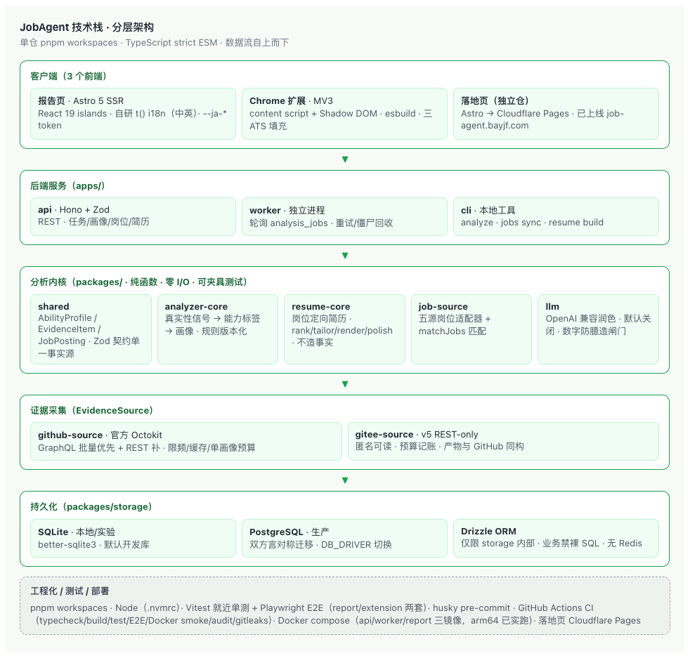

# 技术栈总览 · 分层架构（JobAgent）

- 状态：现行（2026-09-16 起，与 AGENTS.md / README / handoff 保持同步）
- 定位：一页看懂 JobAgent **当前**技术栈的分层架构、各包职责与关键取舍；决策过程见 [技术选型-MVP-20260910.md](技术选型-MVP-20260910.md)，工程硬约束以 [../AGENTS.md](../AGENTS.md) 为准，门面摘要见 [../README.md](../README.md)
- 日期：2026-09-16

## 0. 一句话

TypeScript（strict、ESM）全栈 + **pnpm workspaces** 单仓；后端 Hono + Zod，分析逻辑全是**纯函数包**（零 I/O 可夹具测试）；SQLite（本地/实验）+ PostgreSQL（生产）双方言持久化；前端 Astro + React islands + 独立 Chrome 扩展 + 独立落地页。

## 1. 分层总览



```text
┌─ 客户端层 ────────────────────────────────────────────────┐
│  apps/report（Astro 5 SSR + React 19 islands + 自研 t()）   │
│  apps/extension（MV3 + content script + Shadow DOM + esbuild）│
│  job-agent-landing（独立仓，Astro → Cloudflare Pages 已上线）│
└───────────────┬───────────────────────────────────────────┘
                │ HTTPS / REST
┌─ 后端服务层 ──▼───────────────────────────────────────────┐
│  apps/api（Hono + Zod，REST）                              │
│  apps/worker（独立进程，轮询 analysis_jobs，重试/僵尸回收）  │
│  apps/cli（本地批量分析 / 岗位同步 / 简历生成）              │
└───────────────┬───────────────────────────────────────────┘
┌─ 分析内核层 ──▼──────────（纯函数 · 零 I/O）────────────────┐
│  shared（Zod 契约单一事实源）                               │
│  analyzer-core（真实性信号→能力标签→画像，规则版本化）        │
│  resume-core（岗位定向简历 rank/tailor/render/polish）      │
│  job-source（五源岗位适配器 + matchJobs 匹配）              │
│  llm（OpenAI 兼容润色，默认关闭）                           │
└───────────────┬───────────────────────────────────────────┘
┌─ 证据采集层 ──▼───────────────────────────────────────────┐
│  github-source（官方 Octokit，GraphQL 优先 + REST 补）     │
│  gitee-source（v5 REST-only，匿名可读）                    │
└───────────────┬───────────────────────────────────────────┘
┌─ 持久化层 ────▼───────────────────────────────────────────┐
│  packages/storage（SQLite + PostgreSQL 双方言，Drizzle 仅限内部）│
│  db/migrations/{sqlite,postgres}（对称编号迁移）            │
└───────────────────────────────────────────────────────────┘
（工程化横切：Vitest / Playwright E2E / husky / GitHub Actions CI / Docker compose）
```

## 2. 各层明细

### 2.1 客户端层（3 个前端）

| 组件 | 技术 | 职责 |
| --- | --- | --- |
| `apps/report` | Astro 5 SSR + React 19 islands；自研 `t()` i18n（中英 key 对齐守护）；`--ja-*` 设计 token | 报告页 + 分享链接 + 首页分析入口 + 岗位推荐 + 简历生成（ResumeBuilder） |
| `apps/extension` | Manifest V3 + content script + Shadow DOM 面板 + esbuild；Chrome 原生 `_locales`（zh_CN/en） | 三大 ATS 一键填充 + 画像加载 + 岗位匹配面板 + 简历深链 |
| `job-agent-landing`（独立仓） | Astro；Cloudflare Pages；构建时环境变量驱动真实流程回退 | 已上线 https://job-agent.bayjf.com |

### 2.2 后端服务层

| 组件 | 技术 | 职责 |
| --- | --- | --- |
| `apps/api` | Hono + Zod + @hono/node-server | POST /analyze、jobs/profiles 查询、岗位四端点、job-recommendations、/resumes/build（只读、不入库）、demo 三态身份与配额闸 |
| `apps/worker` | 独立进程 | 轮询认领 analysis_jobs → 采集（L0/L1）→ 分析 → 写画像快照；失败重试上限 3、not_found 不重试、僵尸任务回收；demo 并发闸 |
| `apps/cli` | Node + parseArgs | analyze/batch、jobs sync/search/stats/match、resume build/batch、demo seed/cleanup、migrate 三件套 |

### 2.3 分析内核层（纯函数 · 零 I/O · 规则版本化）

| 包 | 职责 | 关键点 |
| --- | --- | --- |
| `shared` | AbilityProfile / EvidenceItem / JobPosting / ResumeDraft 等 Zod 契约 | 单一事实源；`superRefine` 强约束（如简历 source=profile 必带 evidenceRefs）；含纯函数 matchScoreTier、LocalProfileFields 投影/迁移 |
| `analyzer-core` | 行为信号→真实性分级（四态+置信度）→能力标签→画像装配 | 规则版本化（RULE_VERSION 0.2）；B-4 技术词典词边界提取；B-5 fuseInputs 双源融合；不感知来源平台 |
| `resume-core` | 画像+岗位+匹配→岗位定向简历 | no-fabrication：只重排不改写、每断言挂 evidenceRefs；数字防臆造闸门；出口 Schema.parse 双保险 |
| `job-source` | 五源岗位适配器 + normalize + ingestor + matchJobs | RemoteOK/Remotive/Greenhouse/Lever/HN；httpClient 超时/重试/代理；匹配 title×3/tags×2/desc×1 |
| `llm` | LlmClient 端口 + OpenAI 兼容客户端 + LlmResumePolishProvider | 默认关闭（无 key 返 null）；强约束 prompt + Zod 校验 + 不变量回退 |

### 2.4 证据采集层

| 包 | 技术 | 职责 |
| --- | --- | --- |
| `github-source` | 官方 Octokit；GraphQL 批量优先、REST 补 | L0 元数据 + L1 行为时序；限频/ETag 缓存/单画像预算 |
| `gitee-source` | v5 REST-only（无 GraphQL） | 匿名可读公开数据；预算记账/404 归一/分页；产出与 GitHub 同构的源无关 AnalyzerInput |

### 2.5 持久化层

| 项 | 技术 | 说明 |
| --- | --- | --- |
| 数据库 | SQLite（better-sqlite3，本地/实验）+ PostgreSQL（生产） | `DB_DRIVER` 切换；方言差异只允许出现在 `packages/storage` 内部 |
| ORM | Drizzle ORM | 仅 storage 内部类型化查询；业务模块禁裸 SQL |
| 迁移 | `db/migrations/{sqlite,postgres}` 对称编号 | 迁移器 + migrate-down + check-migrations.sh 对齐校验 + 一致性测试；PG 并发首迁移 advisory lock 串行化 |
| 刻意不用 | Redis、消息队列、clone 沙箱 | 最小依赖原则（详见 deferred-items） |

## 3. 横切事实（一页速记）

- **内核与 I/O 分离（硬约束）**：analyzer-core / resume-core / job-source / shared 纯函数包不发请求、不读库、不读文件；外部响应一律用录制夹具/fake 测试。
- **契约单一事实源**：共享类型只放 `packages/shared`，全链路复用，禁止各处重复定义。
- **用户可见文案中英双语并行**：报告页/扩展各自字典 + key 对齐守护；GitHub 内容全英文。
- **设计 token**：颜色/间距/圆角/阴影只走 `packages/ui-tokens` 的 `--ja-*` 变量，禁止 hex 字面量（tokens-guard 守护）。
- **确定性测试**：不调真实 GitHub/LLM；测试默认零网络。
- **演示模式**：三态身份（anonymous/demo/user），配额三道闸，画像缓存命中先于权限、不扣配额。

## 4. 工具链与工程化

| 类 | 技术 |
| --- | --- |
| 包管理 | pnpm workspaces（13 workspace，不用 npm/yarn） |
| 语言/运行时 | TypeScript（strict、ESM）；Node 版本以 `.nvmrc` 为准 |
| 测试 | Vitest 就近单测（全仓约 500+）；Playwright E2E 两套（report `pnpm e2e` + extension `pnpm e2e:extension`） |
| 静态/CI | husky pre-commit（typecheck）；GitHub Actions（typecheck/test/build/E2E/Docker build smoke/audit/gitleaks，Node 24） |
| 容器 | Docker multi-stage + docker-compose（api/worker/report 三镜像；SQLite 默认、`--profile with-pg` 加 Postgres）；arm64 实跑验证 |
| 部署 | 落地页 Cloudflare Pages 已上线；api/worker/report 生产部署目标待定（compose 按本地/staging） |

## 5. 数据流（一次分析）

1. 用户（报告页/扩展/CLI）→ `POST /analyze`（api）→ 命中未过期画像快照直接返回（缓存优先，任何身份放行不扣配额）。
2. 否则创建 `analysis_jobs(queued)` → Worker 认领：采集 L0 写轻画像 → 补 L1 行为时序（GitHub/Gitee 按 platform 路由；`all` 双源融合）。
3. `analyzer-core` 纯函数计算真实性信号、能力标签、规则化面试题 → 完整 `AbilityProfile` 快照写 `profiles`、证据写 `evidence`（分享链接永远指向生成时版本）。
4. 消费侧：报告页 SSR 渲染 / 扩展一键填充 / `job-recommendations` 匹配 / `resume build` 出岗位定向简历（不入库）。

## 6. 关联文档

- 选型决策过程：[技术选型-MVP-20260910.md](技术选型-MVP-20260910.md)
- 工程硬约束与运行架构：[../AGENTS.md](../AGENTS.md)
- 门面摘要：[../README.md](../README.md)
- 现状/待办：[../handoff.md](../handoff.md)
- 缓做清单：[deferred-items.md](deferred-items.md)
