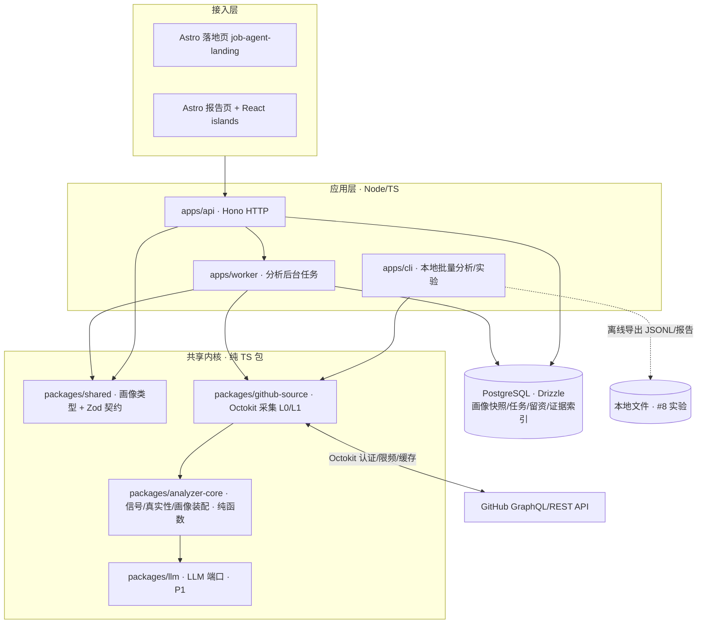

# JobAgent 技术选型（MVP / M1）

> 文档版本：v0.1
> 日期：2026-09-10
> 状态：**建议稿**。选型基于①《PRD.md》P0 范围、②对你现有工程的实际栈盘点、③对 GitHub 官方文档的核实。涉及待拍板决策处均标注 `【待决策 #n】`。
> 关联：《PRD.md》《讨论记录 01》《待拍板决策清单》《产品构想》。

---

## 1. 选型方法与原则

1. **复用你已验证的技术栈**，不为新项目引入无关学习成本（现有栈盘点见第 3 章，均来自你工程里的 `package.json`）。
2. **分析内核与 Web/界面解耦、可独立运行**：内核要能以 CLI / 脚本方式跑（直接支撑决策 #8 的 20–50 账号实验），不依赖服务器和数据库。
3. **一份能力画像类型，全链路共享**：用 TypeScript 把 PRD 第 8 章的数据契约做成共享包，前端、API、Worker 共用，杜绝接口漂移。
4. **MVP 最小基础设施**：能不引入的中间件（Redis、消息队列、容器编排）一律后置，先用数据库表 + 单进程解决。
5. **外部依赖端口化**：GitHub 数据源、LLM、存储都走内部接口，未来加 Gitee、换模型、换数据库时只换适配器。
6. **可复现优先**：分析逻辑纯函数化、带 `analyzerVersion`；外部响应落固定夹具（fixture），测试不打真实 GitHub。

---

## 2. 选型结论速览

| 层 | 推荐选型 | 版本基线（你工程已在用） | 主要备选 | 一句话理由 |
| --- | --- | --- | --- | --- |
| 语言/运行时 | **TypeScript（strict）+ Node ESM** | Node ≥22、TS 5.x | Python（仅未来 L2/ML 局部引入） | 全栈一种语言，共享画像类型，复用你的经验 |
| 工程组织 | **npm workspaces monorepo** | npm 10、workspaces（agent-dev 同款） | pnpm workspace | 与你现有 monorepo 习惯一致 |
| 落地页/报告页 | **Astro 5 + React islands** | Astro ^5.12、React 19 | Next.js 15 全栈 | 落地页已存在；报告以内容展示为主，交互用 island |
| 后端 API | **Hono + Zod** | Hono ^4.7、zod ^3.24 | Next API Routes / Express | 你已在用；轻、可移植到 Node/边缘 |
| 数据库 | **PostgreSQL + Drizzle ORM** | drizzle-orm ^0.41、postgres-js | SQLite（仅本地实验） | 托管多用户服务用 Postgres；Drizzle 你已会，可平滑切换 |
| 异步任务 | **数据库任务表 + Worker 轮询** | — | Redis + BullMQ（规模化后） | MVP 省掉 Redis，单 Worker 足够 |
| GitHub 采集 | **Octokit，GraphQL 批量优先 + REST 补** | 新增 | 纯 REST | 少往返、省配额；官方 SDK、TS 友好 |
| GitHub 认证 | **GitHub App（生产）+ PAT（本地）** | 新增 | 仅 PAT / OAuth App | 额度更高，且天然承载 P1 的用户 OAuth 授权 |
| LLM | **端口化 LLM 客户端，结构化输出经 Zod 校验**；P0 面试题先用规则生成 | 新增 | 直接绑某厂商 SDK | 可换模型；P0 不依赖 LLM 也能跑 |
| 静态分析 L2 | **MVP 不做、仅留接口**；P3 隔离沙箱内进行 | — | 起步即 clone | 规避成本与供应链安全（PRD NFR-2） |
| 鉴权 | P0 不登录；**P1 走 GitHub App 的 user OAuth + 签名 Cookie 会话** | 新增 | Auth.js 等 | 与采集侧同一套 GitHub App，少一套凭证 |
| 部署 | **容器化 Node（api+worker）+ 托管 Postgres + Astro 静态/SSR 托管**，海外优先 | wrangler（你装过） | 单机 docker-compose / Cloudflare 全栈 | 先单体后拆分；具体厂商与价格部署时按官网当期定 |
| 可观测 | 结构化日志 + 健康检查 + 指标埋点；错误追踪后置 | — | 一上来接全套 APM | 满足 NFR-7 即可，不过度 |
| 测试/质量 | **Vitest + Playwright + 固定夹具**，TS strict、ESLint、GitHub Actions | vitest ^3、Playwright ^1.62 | — | 与你现有工程一致 |

---

## 3. 选型依据：你现有工程的技术栈事实（来自本地 `package.json`）

> 这些是从你本机工程直接读到的事实，用于"复用已验证栈"，不是外部声称。

- **语言/运行时**：`agent-dev` 要求 Node `>=22`、ESM（`"type":"module"`）、TypeScript 5.8、用 `tsx` 直接跑 TS；多个项目统一 TS。
- **monorepo 习惯**：`agent-dev` 用 **npm workspaces**（`apps/*` + `packages/*`），根脚本用 `concurrently` 起多进程、`vitest` 统一测试。
- **前端**：`apps/studio` 用 **React 19 + Vite 7**；`pr-helper` 用 **Next.js 15 + React 19 + Tailwind**；图标多用 `lucide-react`，状态用过 `zustand`。
- **后端**：`apps/daemon` 用 **Hono 4 + @hono/node-server + Zod**。
- **数据层**：`packages/storage` 用 **Drizzle ORM + sql.js**；`soft-desk` 用 `better-sqlite3`；`pr-helper` 用 **postgres-js**；`soft-desk` 还接过 **Supabase**。即 SQLite 与 Postgres 你都有实操。
- **测试**：普遍 **Vitest**，E2E 用 **Playwright**。
- **落地页**：`job-agent-landing` 用 **Astro 5.12**（纯静态、无框架依赖）。
- **部署痕迹**：`agent-dev` devDependencies 含 `wrangler`（Cloudflare），说明你接触过边缘/Workers 部署。

**结论**：推荐栈几乎全部落在你已验证的能力圈内，新增的只有"GitHub 采集（Octokit）、GitHub App、LLM 客户端"三块业务相关依赖。

---

## 4. 从 PRD 推导的技术约束

| PRD 要求 | 技术约束 |
| --- | --- |
| 单账号分析需数十至上百次 GitHub 调用、L0 先返回 L1 异步补（F2/NFR-6） | 需要**后台任务 + 任务状态**，不能在一个 HTTP 请求里同步跑完 |
| 证据可回溯、画像可复现（F2/F4、NFR-4） | 原始响应留痕（精简快照 + ETag）、分析逻辑纯函数化并带版本号 |
| GitHub API 有明确限额（NFR-1） | 认证化调用、批量查询、条件请求、缓存、调用预算与限频退避 |
| 报告可只读分享、未登录可访问（F6） | 公开只读接口 + 不可枚举分享标识；画像以快照存储，不随源数据变化而漂移 |
| MVP 不 clone（F2/NFR-2，【待决策 #3】） | 采集层只走 API；文件级分析（L2/L3）以接口预留，不引入沙箱 |
| 未来接 Gitee / 非技术证据源 | 数据源抽象为 `EvidenceSource` 接口；画像 schema 证据源无关 |
| 海外优先（【待决策 #4】） | 部署选址以稳定访问 `api.github.com` 为前提；国内访问/Gitee 后置 |

---

## 5. 总体架构



**要点**：
- `analyzer-core` **不做 I/O**：输入是采集到的结构化数据，输出是 `AbilityProfile`，因此 CLI、Worker、未来的实时接口都能复用，且可对固定夹具做单元测试。
- `github-source` 是第一个 `EvidenceSource`；Gitee 未来以同接口新增第二个实现，内核不动。
- API 与 Worker 可同仓不同进程，MVP 甚至可单机同时起；日后横向拆分不影响内核。

---

## 6. 分层选型详述

### 6.1 语言与运行时：TypeScript（推荐）vs Python

| 维度 | TypeScript + Node（推荐） | Python |
| --- | --- | --- |
| 与前端/落地页共享类型 | **可直接共享画像契约** | 需跨语言维护 schema |
| 你的熟练度（据现有工程） | **高**（全项目 TS） | 未见 Python 工程痕迹 |
| L0/L1 行为分析（计数/时序/规则） | 完全够用 | 够用 |
| 未来 L2 静态分析 / ML 真实性模型 | 生态一般 | **更强（tree-sitter、科学计算、ML）** |

- **结论**：MVP/M1 用 **TypeScript**。为未来保留口子：若 P3 的代码静态分析 / ML 信号确实需要 Python，把它做成**独立的分析微服务**，通过内部接口被 `analyzer-core` 调用即可，主栈不返工。

### 6.2 工程组织：npm workspaces monorepo

- 与 `agent-dev` 一致，零额外学习成本；内部包用 `file:`/workspace 协议互相引用（你已这么用）。
- 建议包/应用划分见第 7 章。

### 6.3 前端与页面：Astro + React islands（推荐）vs Next.js 全栈

- **落地页保持独立 Astro 工程**（已可部署），只把 `Demo.astro` 的提交目标从本地 `localStorage` 改为调用 API。
- **报告页用 Astro SSR 读取画像快照渲染**（SEO 友好、加载快、契合"内容型报告"）；展开证据、标签筛选等交互用 **React island**（你熟 React 19/Vite）。
- 备选 **Next.js 15**（你在 `pr-helper` 用过）：当 B/C 后台变重、需要大量路由与服务端逻辑时再迁；MVP 不必上。
- 样式建议沿用你熟的 **Tailwind**（多项目在用），落地页现有全局 CSS 可逐步统一，不强求一次性重写。

### 6.4 后端 API：Hono + Zod

- 复用 `agent-dev` 的 Hono 经验；`@hono/node-server` 直接跑在 Node 上，未来也能迁边缘运行时。
- **所有外部输入（用户名、分享标识、Webhook、LLM 输出）用 Zod 校验**，与 `shared` 里的画像契约共用同一套 schema。

### 6.5 数据存储：PostgreSQL + Drizzle（推荐）

| 方案 | 适用 | 权衡 |
| --- | --- | --- |
| **Postgres + Drizzle（推荐）** | 从第一天就是托管多用户、公开分享链接的在线服务 | 需一个数据库实例；Drizzle 让方言切换成本低 |
| SQLite | 本地离线、#8 标注实验、单机工具 | 并发/托管/备份弱，在线服务迟早要迁 |

- **建议组合**：在线服务用 **Postgres**（你用过 Supabase / postgres-js，本地用 Docker 起 Postgres 或连免费托管层）；**#8 的 20–50 账号实验用 CLI 直接导出 JSONL/SQLite，不起服务**。
- 核心表（M1）：`profiles`（画像快照 JSONB + 版本 + 时间窗）、`evidence`（证据索引/精简原始快照）、`analysis_jobs`（任务状态/重试）、`waitlist`（落地页留资）、（P1）`accounts/claims`。
- **缓存策略**：画像以**快照**存储（分享链接永远指向生成时的版本，避免源数据变化导致结论漂移）；GitHub 原始响应用 ETag 条件请求 + 精简缓存，不做无标注全量拷贝（PRD F2）。

### 6.6 异步任务：数据库任务表 + Worker（MVP）vs Redis/BullMQ

- **MVP 用 `analysis_jobs` 表（状态：queued/running/succeeded/failed、attempts、进度阶段 L0/L1）+ 单 Worker 轮询/认领**，不引入 Redis。
- 触发即建任务，API 立即返回 `jobId`；L0 完成先写一版"轻画像"，L1 完成后升级为完整画像（对应 PRD 的 L0 先行、L1 补齐）。
- 当出现"多 Worker 并发、延迟敏感、需要延迟/定时队列"时，再换 **BullMQ + Redis**，任务模型不变、只换实现。

### 6.7 GitHub 数据采集（本系统的关键路径）

**SDK**：官方 **Octokit**（`octokit` 伞包，含 REST/GraphQL；配 `@octokit/plugin-throttling`、`@octokit/plugin-retry` 自动处理次级限频与重试）。

**REST vs GraphQL**：
- **GraphQL 批量优先**：一次查询取回 user + repositories + 各自 default branch、近期 pullRequests/issues、贡献概览，显著减少往返；REST 用于 GraphQL 不便分页或拿不到的字段。
- 注意：GraphQL 按"点（point）"计费，**查询越大点成本越高，并非必然比 REST 省**，需在 spike 中实测单画像点成本（见第 10 章）。

**认证方式：生产用 GitHub App，本地用 PAT**
- GitHub App 可获得**高于个人令牌的额度**，并且它的 **user-to-server OAuth** 正是 P1"开发者本人授权认领"所需，一次建设、两步复用，避免后期从 PAT/OAuth App 返工。
- 本地开发与离线实验用只读 public 的细粒度 PAT 即可。

**已核实的 GitHub API 限额（2026-09-10 检索 GitHub 官方文档，具体以官网最新为准）**：

| 接口 | 未认证 | 认证用户（PAT / 代用户的 OAuth） | 备注 |
| --- | --- | --- | --- |
| REST | 60 次/小时 | **5,000 次/小时** | GitHub Enterprise Cloud 组织拥有的 GitHub App 可达 15,000 次/小时 |
| GraphQL | — | **5,000 点/小时/用户**（按点非按次，单次查询≥1 点，成本随节点数增加） | GitHub App 额度更高（官方博客口径约 10,000–12,500 点/小时） |
| 次级限频 | — | REST 单端点约 >900 点/分钟、GraphQL >2,000 点/分钟会触发 | 需退避并读 `retry-after` |

> 来源：GitHub Docs《Rate limits for the REST API》https://docs.github.com/en/rest/using-the-rest-api/rate-limits-for-the-rest-api ；《Rate limits and query limits for the GraphQL API》https://docs.github.com/en/graphql/overview/rate-limits-and-query-limits-for-the-graphql-api 。**非企业版 GitHub App 的确切额度公式需在开工前对照官方文档再确认一次（见第 12 章 V1）。**

**工程要求**：单画像调用预算（实测后填）、ETag 条件请求、缓存命中优先、限频自动退避、剩余额度监控（NFR-1/NFR-7）、绝不把 token 下发到前端。

### 6.8 LLM 层：端口化、结构化、可复现

- **P0 的 F5 面试问题先用规则/模板生成**（基于真实仓库名、PR、Issue 拼"为什么这样设计"的问题），**不依赖 LLM**，保证可复现与零成本。
- **P1 引入 `packages/llm`**：定义与厂商无关的接口；走 OpenAI 兼容协议以保留可替换性；**强制结构化 JSON 输出并用 Zod 校验**；每条模型产出的结论必须带 `evidenceRefs`，**校验不通过 / 无证据支撑的结论直接丢弃**（防止模型编造，呼应 PRD"无证据不下结论"）。
- 画像中记录所用模型与 prompt 版本，保证可复现。**具体模型厂商、版本、单价不在此锁定，选型时以当期官方资料做一次成本 spike（V4）。**

### 6.9 L2 静态分析：MVP 只留接口

- 采集器接口预留 `fetchFileTree/readFile`（经 API 读单文件，不 clone）与未来的 `cloneAnalyze`（P3）。
- P3 真要 clone 时：**隔离沙箱（容器）、仓库大小/超时/递归深度上限、绝不执行仓库内代码**（NFR-2）；优先用纯 JS 的 `isomorphic-git` 而非 shell 调 git，减少注入面。

### 6.10 鉴权（P1）

- P0 公开分析无需登录。P1 用**同一个 GitHub App 走 user OAuth** 完成本人认领，服务端用**签名、HttpOnly Cookie** 维持会话；最小化 scope，支持解绑。
- 会话具体辅助库到 P1 启动时再定（该生态迭代快，不提前锁定），避免引入过时依赖。

### 6.11 部署与托管（海外优先，【待决策 #4】）

- **形态**：`api` 与 `worker` 打成容器镜像，MVP 用**单台小规格主机 / 单容器编排**（如 Fly.io / Railway / Render 一类，**当期免费额度与价格以官网为准，本文不写死**）；Postgres 用托管服务（Supabase/Neon 一类，你已接触 Supabase）；Astro 落地页/报告页部署到静态/边缘托管（Vercel/Netlify/Cloudflare Pages 一类）。
- **为什么不全程 Cloudflare Workers**：分析任务是"多次串行外部调用 + 等待"的长任务，更适合常驻 Node Worker；Workers 更适合短小请求。Hono 保持可移植，未来部分接口可上边缘。
- 配置走环境变量并用 Zod 校验（12-factor）；密钥不入库。国内访问优化与 Gitee 随 #4 后置。

### 6.12 可观测、配置与安全

- 结构化 JSON 日志（轻量方案即可）、`/health` 健康端点；埋点：分析成功率、L0/L1 耗时、GitHub 配额消耗、缓存命中率、各真实性信号触发分布（NFR-7）。
- 错误追踪（Sentry 兼容方案）可在上线后补，不阻塞 M1。
- 安全：服务端保管 GitHub 凭证；分享标识用不可枚举随机串并可撤销；对入参做限流与校验；不输出敏感推断（PRD 第 10 章）。

### 6.13 测试与工程质量

- **`analyzer-core`：Vitest 单测 + 固定 GitHub 响应夹具**，覆盖每条真实性信号与"证据不足→`insufficient_data`"分支（这是产品可信度的核心，测试优先级最高）。
- **API/Worker**：对夹具跑集成测试；**E2E（Playwright）**覆盖"输入用户名→生成→报告→分享链接"主链路。
- `tsc --strict`、ESLint、GitHub Actions 跑 typecheck+test（你已有 `.github/workflows` 习惯）。

---

## 7. 推荐工程结构

> 建议直接在当前文档所在目录 `C:\000mycodes\job-agent` 内搭建（这里已有 PRD 等文档）；落地页维持在独立的 `..\job-agent-landing`，通过 API 对接，暂不挪动你的现有工程。

```
job-agent/
├─ PRD.md / 讨论记录 / 决策清单 / 技术选型（本文）
├─ package.json                 # npm workspaces 根
├─ tsconfig.base.json           # strict 公共配置
├─ packages/
│  ├─ shared/                   # AbilityProfile/EvidenceItem 类型 + Zod 契约（单一事实源）
│  ├─ github-source/            # Octokit 客户端、GraphQL 查询、L0/L1 采集器、限频/缓存（EvidenceSource 首个实现）
│  ├─ analyzer-core/            # 纯函数：行为信号→真实性分级→能力标签→画像装配；规则版本化
│  └─ llm/                      # LLM 端口 + 结构化输出校验（P1）
├─ apps/
│  ├─ api/                      # Hono：触发分析、查询任务/画像、只读分享接口
│  ├─ worker/                   # 消费 analysis_jobs，调 github-source+analyzer-core，写画像
│  ├─ cli/                      # 本地批量分析：jobagent analyze <user>，导出 JSONL/报告（供 #8 实验）
│  └─ report/                   # Astro 报告页（SSR 读画像）+ React islands（也可后续并入落地页工程）
├─ drizzle/                     # Drizzle 迁移
└─ tests/fixtures/github/       # 录制的 GitHub 响应夹具（强/弱/可疑账号样本，脱敏）
```

---

## 8. 一次分析的关键数据流（M1）

1. 落地页/接口收到用户名 → Zod 校验 → 查 `profiles` 是否有未过期快照（有则直接返回）。
2. 无快照：建 `analysis_jobs(queued)`，API 返回 `jobId`；前端轮询/SSE。
3. Worker 认领任务：`github-source` 用 GitHub App 凭证经 **GraphQL 批量取 L0** → 立刻写一版轻画像（状态 `partial:L0`）。
4. 继续取 **L1 行为时序**（commit 节奏、author 一致性、PR 周期等）。
5. `analyzer-core`（纯函数、带版本）计算真实性信号、能力标签、规则化面试题，产出完整 `AbilityProfile`，写 `profiles`（JSONB 快照）与 `evidence`。
6. 任务置 `succeeded`；报告页/分享链接读取该**不可变快照**渲染。
7. 任一层失败：状态显式标注缺失，不输出"看似完整"的报告（NFR-6）。

---

## 9. M1 落地顺序（建议）

1. **W1 骨架 + 契约**：monorepo、`shared`（把 PRD 第 8 章落成 TS 类型 + Zod）。
2. **W2 采集 + 内核（不起 Web）**：`github-source`（Octokit/GraphQL/限频）+ `analyzer-core`（L0/L1 信号）+ `cli`，先在命令行对真实账号出 JSON。
3. **W2–W3 并行跑决策 #8 实验**：用 CLI 跑 20–50 标注账号，校准信号（这一步决定后续要不要建 Web，顺序上最优先去风险）。
4. **W3 服务化**：Postgres + Drizzle、`analysis_jobs`、`api` + `worker`。
5. **W4 报告与分享**：Astro 报告页 + React island + 只读分享链接。
6. **W4 接落地页**：改 `Demo.astro` 调真实接口，保留留资与无后端回退。
7. **M1 末**：补全测试、CI、结构化日志与部署流水线。
> P1 再做：GitHub App 用户 OAuth 认领、`llm` 包与 L3、B 端轻预览、异议处理。

---

## 10. 技术风险与必须先做的 Spike

| 编号 | 风险/未知 | 验证方式（Spike） | 通过标准（方向） |
| --- | --- | --- | --- |
| S1 | 单账号 GitHub 调用/点成本未知，可能撞限额 | 用 GitHub App/PAT 对 5 个真实账号实测 L0+L1 的 REST 次数与 GraphQL 点耗、耗时 | 得出"单画像预算"区间，确认认证额度下可支撑目标日产量 |
| S2 | GraphQL 大查询点成本可能反超 REST | 对比"GraphQL 批量"与"REST 多次"两种取法的点/次数与耗时 | 确定每类数据的最优取法并写入采集器 |
| S3 | L0/L1 信号能否区分真假仓库 | 对 #8 标注集跑 `analyzer-core`，输出混淆情况 | 强工程师不被误判为可疑（硬约束），可疑样本有可解释信号 |
| S4 | LLM 结构化输出稳定性（P1） | 小样本测结构化 JSON 合规率、无证据幻觉率 | 经 Zod + 证据校验后，不合法产出可被稳定拦截 |
| S5 | 托管 Postgres / 主机到 GitHub API 的网络稳定性（海外） | 在候选部署区域实测连通与延迟 | 选稳定区域；记录国内不可达作为已知限制 |
| S6 | 在线服务数据库选型返工 | 用 Drizzle 隔离方言，先本地/托管 Postgres 跑通 | 切换数据库不改业务代码 |

---

## 11. 与待拍板决策的关系（选型对决策的依赖）

- 本选型默认采纳推荐组合中的 **#3（只做 L0/L1、不 clone）** 与 **#4（海外优先）**。
  - 若 **#3 改为起步即 L2 clone**：需新增隔离沙箱基础设施，并可能引入第 6.1 节预留的 Python 分析服务，M1 工作量显著上升。
  - 若 **#4 改为国内外同步**：需同时实现 Gitee `EvidenceSource`、考虑国内部署与访问，W2 起就要双线，节奏变慢。
- **#1（B/C 谁先）与 #2（真实性形态）基本不改变本技术栈**：只影响先做哪个界面、报告组件如何渲染；`analyzer-core` 与数据层不变。#2 选"分级+证据"时，报告组件直接消费 `authenticity.status/signals`（schema 已按此设计）。
- **#5（主应用形态）由本选型给出落地建议**：Astro+React islands + Hono，内核独立；若你更倾向单一 Next.js 全栈，`packages/*` 内核可原样复用，只替换 `apps/*` 层，损失可控。

---

## 12. 待核实清单与参考来源

**开工前需再核实（不凭记忆锁定）**：
- V1：非企业版 **GitHub App 的确切 REST/GraphQL 额度公式**（对照官方文档，本文数字为 2026-09-10 检索值）。
- V2：Octokit 各包当前稳定版本与 GraphQL 分页最佳实践（以 npm/GitHub 官方为准）。
- V3：Node 22、Astro 5、React 19、Hono 4、Drizzle 的当前稳定版本与兼容矩阵（以你 lockfile 与官方发布说明为准）。
- V4：LLM 厂商、上下文长度、结构化输出能力与单价（选型当期做成本 spike）。
- V5：候选托管厂商（主机/Postgres/页面托管）的当期价格与免费额度。

**参考来源**：
- GitHub REST 限额官方文档：https://docs.github.com/en/rest/using-the-rest-api/rate-limits-for-the-rest-api
- GitHub GraphQL 限额官方文档：https://docs.github.com/en/graphql/overview/rate-limits-and-query-limits-for-the-graphql-api
- GitHub Octokit 官方组织：https://github.com/octokit
- 本地工程依据：`C:\000mycodes\agent-dev`（workspaces/Hono/Drizzle/Vitest）、`job-agent-landing`（Astro）、`pr-helper`（Next/postgres-js）等的 `package.json`

---

### 信心与证据说明

- **信心 9/10**：技术栈与你现有能力的匹配度——结论直接来自本机多个工程的 `package.json` 事实。
- **信心 8/10**：总体架构、分层取舍、monorepo 划分、"内核先行/CLI 支撑实验"的工程路径——属成熟工程判断。
- **信心 8/10**：第 6.7 节 GitHub 限额数字——来自 GitHub 官方文档且为本次实时检索；但官方可能调整，故列 V1 开工前复核。
- **信心低于 7（已单独标注）**：具体托管价格与免费额度（V5）、LLM 厂商/单价（V4）、非企业 GitHub App 精确额度公式（V1）——这些随时间/厂商变化，文档未编造数值，要求落地前以官方当期资料核实。
