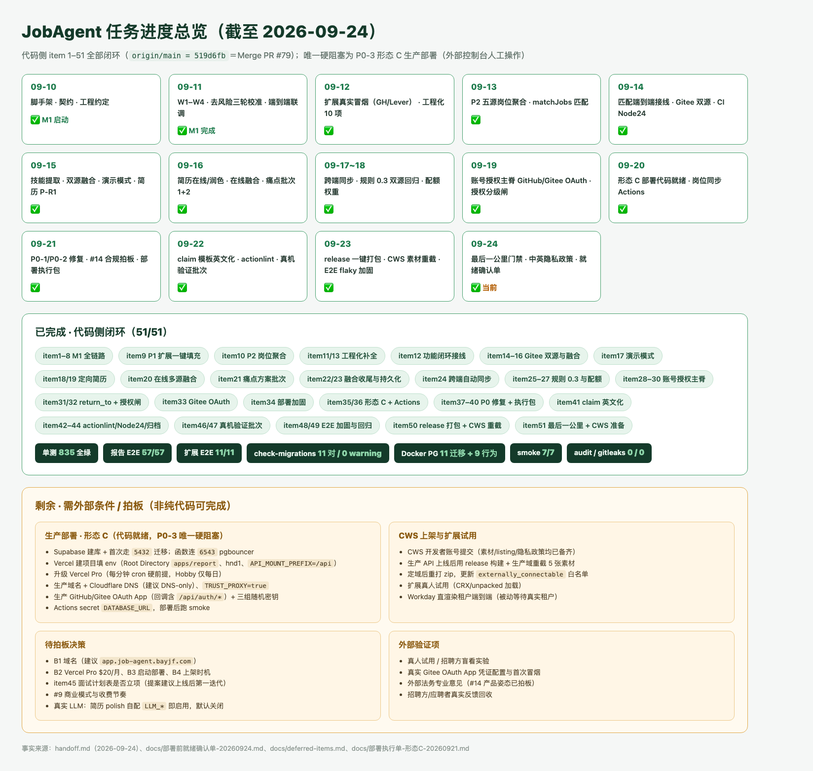

# Handoff

JobAgent 当前状态，截至 2026-09-24。

> 本文件只保留「项目当前状态 + 活跃任务 + 最近变更 + 文档索引」，是接手（人或 AI agent）的第一入口；**只写状态与结论，明细一律放进对应文档并在此给链接，不在本文件展开**。
> 设计/结论全文放 [docs/](docs/)；缓做事项放 [docs/deferred-items.md](docs/deferred-items.md)；场景化导航见 [docs/README.md](docs/README.md)。
> **归档惯例（对齐 agent-world，2026-09-18 起执行）**：①本文件只保留「项目当前状态 + 活跃任务 + 最近 5 条变更 + 文档索引」；②编号待办标 ✅ 后，详细过程（实现步骤 / commit 链 / 踩坑 / 验证数据）整块滚入 `docs/handoff-archive-YYYY-MM-DD.md`，本文件只留**一行结论 + commit hash**；③真正在推进 / 还在跑的活跃项保留详情。归档文件冻结只读、不再追加。

## Project documents

📚 **文档地图（按场景怎么读 + 状态约定）**：[docs/README.md](docs/README.md)。以下为全部文档直达（本区是完整清单的单一事实源，docs/README 只做场景导航、不重复清单）：

- [README.md](README.md) — 项目门面、技术栈、规划命令、铁律
- [AGENTS.md](AGENTS.md) — AI coding agent 工程约定单一事实源（CLAUDE.md 仅引用它）
- [CONTRIBUTING.md](CONTRIBUTING.md) — 本地开发 / 测试 / 提交 / PR 统一要求
- [MIGRATION_CONVENTION.md](MIGRATION_CONVENTION.md) — 数据库迁移命名/文件头/幂等/回滚规范
- [git-commit-message.md](git-commit-message.md) — 英文原子 Conventional Commits 规范
- [PULL_REQUEST_WORKFLOW.md](PULL_REQUEST_WORKFLOW.md) — 分支职责、PR 评审与合并流程
- [docs/产品构想-以GitHub为桥梁的招聘系统.md](docs/产品构想-以GitHub为桥梁的招聘系统.md) — 原始构想：定位、市场、B/C 双向闭环（历史）
- [docs/讨论记录-01-切入口与MVP收敛-20260910.md](docs/讨论记录-01-切入口与MVP收敛-20260910.md) — 切入口、护城河、L0–L4 分层、MVP 收敛过程（历史）
- [docs/讨论记录-02-投递功能与竞品分析-20260911.md](docs/讨论记录-02-投递功能与竞品分析-20260911.md) — 投递功能方向、Jobright 深度竞品分析、四种技术路径对比、职位聚合/Chrome 扩展可行性、3 项待拍板决策（历史）
- [docs/PRD.md](docs/PRD.md) — 产品范围、F1–F9、AbilityProfile/EvidenceItem 契约、指标、风险 ★
- [docs/技术选型-MVP-20260910.md](docs/技术选型-MVP-20260910.md) — 技术栈选型、运行架构、目录规划、M1 排期与 Spike ★
- [docs/技术栈总览-分层架构-20260916.md](docs/技术栈总览-分层架构-20260916.md) — 当前技术栈分层架构一页总览：客户端/服务/内核/采集/持久化五层、各包职责、横切事实与数据流（现行，与 AGENTS/README 同步）
- [docs/市场调研-AI求职赛道-20260910.md](docs/市场调研-AI求职赛道-20260910.md) — AI 求职赛道市场调研：市场格局、功能全景、代表性产品画像、信任风险与 P0/P1/P2 跟进建议（现行）
- [docs/市场调研-招聘市场痛点-20260916.md](docs/市场调研-招聘市场痛点-20260916.md) — 中国招聘市场双方痛点调研：企业端（寻源/筛选/造假/误聘）与求职者端（反馈缺失/定位模糊/竞争加剧）量化痛点、共同根源与对 JobAgent 的可信信号启示（现行）
- [docs/设计-痛点解决方案-20260916.md](docs/设计-痛点解决方案-20260916.md) — 12 项痛点→解决方案对位表 + 实施批次拆分：批次1 纯产品化（企业核验视图/面试准备包/落地页文案）、批次2 新接口（人才检索/筛选工作台/投递追踪）、批次3 外部条件；**批次 1 代码项 + 批次 2 已于 2026-09-16 落地（见 item21，落地页文案在独立仓未改、批次3 待外部条件）**（现行）
- [apps/extension/README.md](apps/extension/README.md) — P1 浏览器扩展试用指南：本地服务、开发者模式加载、Greenhouse/Lever 一键填充步骤与已知限制（现行）
- [docs/待拍板决策清单-20260910.md](docs/待拍板决策清单-20260910.md) — #1–#14；#1–#8 已拍板（#4 当日修订为海内外同步），#9–#13 延后，#14 已于 2026-09-21 拍板 ★
- [docs/deferred-items.md](docs/deferred-items.md) — 缓做/低优事项登记表（挂起项 + 触发条件的单一事实源）
- [docs/handoff-archive-2026-09-19.md](docs/handoff-archive-2026-09-19.md) — handoff 历史归档（2026-09-19）：item28 账号授权主脊（GitHub OAuth 登录/会话/认领）明细 + item29 报告页登录认领前端接线与 CLI `auth cleanup` 明细（归档，只读不追加）
- [docs/handoff-archive-2026-09-20.md](docs/handoff-archive-2026-09-20.md) — handoff 历史归档（2026-09-20）：item30 真实 GitHub OAuth 端到端、item31 return_to 深链、item32 授权分级闸、item33 Gitee OAuth、item34 部署加固、item35 形态 C 部署就绪、item36 岗位同步 Actions/API 文档明细 + 当时 Git 同步态（归档，只读不追加）
- [docs/handoff-archive-2026-09-21.md](docs/handoff-archive-2026-09-21.md) — handoff 历史归档（2026-09-21）：item37 已完成部分（P0-1 证据落库/P0-2 异议入口/#14 合规拍板）、item38 评审瑕疵收尾与形态 C 同域守护、item39 形态 C 部署执行包、item40 CWS 素材包与扩展四缺陷、item42 actionlint CI、item43 Windows 跨设备 Node24 全量回归（781/52/9 实测表）、item44 归档维护明细 + 当时 Git 同步态（归档，只读不追加）
- [docs/handoff-archive-2026-09-24.md](docs/handoff-archive-2026-09-24.md) — handoff 历史归档（2026-09-24）：item50 部署前收尾 T1–T8（release 打包/CWS 重截/文档修正）、item51 部署前最后一公里验证 + CWS 准备（835 单测/57 E2E/隐私政策/两个 smoke 修复/就绪确认单）、item45 面试计划表 Interviews（双方言迁移 012/登录闸三端点/报告页 island/862 单测/60 E2E）明细（归档，跨天只读）
- [docs/handoff-archive-2026-09-23.md](docs/handoff-archive-2026-09-23.md) — handoff 历史归档（2026-09-23）：item47 两端字段对齐/PG 测试真实验证、item48 评审 A 组本地闭环（A1–A7）、09-22 七项加固明细（归档，只读不追加）
- [docs/handoff-archive-2026-09-22.md](docs/handoff-archive-2026-09-22.md) — handoff 历史归档（2026-09-22）：item46 扩展真机验证批次（#52/#53 真实 Greenhouse 一键填充 + 跨端同步、#54 API 改走 background SW 代发、#55 公开只读 by-subject 端点与客户端、#56 电话区号/城市消歧、#57 personal website 填充、扩展 E2E 补 by-subject 链路 10/10、两端字段不对称缺口）+ 从主文件裁出的 09-21 两条流水（归档，只读不追加）
- [docs/handoff-archive-2026-09-18.md](docs/handoff-archive-2026-09-18.md) — handoff 历史归档（2026-09-18）：已完成编号待办 item 1–27 明细 + 2026-09-17 及更早最近变更 + 历史 Git 同步态（归档，只读不追加）
- [docs/design-i18n-20260910.md](docs/design-i18n-20260910.md) — i18n 设计：自研 `t()` + 中英 JSON 字典、key 对齐守护、分享链接语言固定、不翻译边界；§8 扩展落地（navigator 协商 + localStorage 覆盖 + MV3 `_locales`）（现行）
- [docs/design-tokens-20260910.md](docs/design-tokens-20260910.md) — 设计 token 设计：`--ja-*` 三层变量体系、组件禁 hex、与落地页 `--lui-*` 互不约束；§8 共享包 `packages/ui-tokens` + 扩展 Shadow DOM `:host` 接入（现行）
- [docs/design-storage-dual-dialect-20260911.md](docs/design-storage-dual-dialect-20260911.md) — 持久化层 SQLite/Postgres 双方言适配设计：统一 async 仓储接口、双 schema/双实现、对称迁移目录、createStorage 工厂（现行）
- [docs/API.md](docs/API.md) — HTTP API 接口文档：/auth/*（GitHub/Gitee OAuth 登录/会话/本人认领）、/analyze（含画像缓存）、/demo/*、/jobs、/profiles（含 exportable/job-recommendations/applications）、/candidates、/job-postings、/resumes/build、/internal/cron/*（形态 C serverless 定时端点）、/health 与错误码、形态 C `/api` 挂载前缀说明（现行）
- [docs/设计-职位聚合-Spike-20260913.md](docs/设计-职位聚合-Spike-20260913.md) — P2 职位聚合 Spike：8 数据源实测结论（RemoteOK/Remotive/GH/Lever 可用，YC/Wellfound 反爬暂缓）、最小链路设计与推荐组合、JobPosting 类型依据（现行）
- [docs/design-job-ingestion-20260913.md](docs/design-job-ingestion-20260913.md) — P2 职位聚合采集管道工程设计：job_postings 表迁移 005（双方言）、IJobPostingsRepository、packages/job-source 适配器+编排、CLI jobs sync 触发、分期 P2-A~D、测试与落代码清单（现行，可直接据此编码）
- [docs/design-match-wiring-20260914.md](docs/design-match-wiring-20260914.md) — 第一档·画像↔岗位匹配端到端接线设计：API 端点（GET /profiles/:id/job-recommendations + POST match 接受 profileId）、报告页推荐岗位 island、扩展侧栏匹配度面板、验收标准与缓做项（现行）
- [docs/design-gitee-source-spike-20260914.md](docs/design-gitee-source-spike-20260914.md) — Gitee 证据源 Spike：v5 仅 REST 无 GraphQL、匿名可读、L0 充分/L1 基本可行、与 GitHub 关键差异、未来 gitee-source 设计（现行，仅结论不实现）
- [docs/design-gitee-source-20260914.md](docs/design-gitee-source-20260914.md) — Gitee 第二证据源实现设计（G-A）：v5 REST 采集序列、→AnalyzerInput 十条映射规则、内核最小参数化、gitee-source 文件清单与测试、CLI --platform（现行，可直接据此编码；G-A CLI 闭环 + G-B 在线选源已随 item14 落地，2026-09-14~15）
- [docs/design-extension-match-ui-20260914.md](docs/design-extension-match-ui-20260914.md) — 扩展面板匹配 UI 设计：#10 可解释性后从 top1 轻量升级为 top5 完整展示，四态/匹配依据/证据外链/i18n/token（现行）
- [docs/design-extension-e2e-20260914.md](docs/design-extension-e2e-20260914.md) — 扩展浏览器级 E2E 设计：--headless=new 加载 unpacked MV3、独立 playwright.extension.config、route 拦截零网络、首批 5 用例与边界（现行）
- [docs/design-behavior-diversity-20260915.md](docs/design-behavior-diversity-20260915.md) — 方案 B 设计：双源 events 聚合源无关 BehaviorEventSummary、analyzer 保守弱信号 narrow_activity_scope（规则 0.1→0.2）、缺失降级矩阵、校准与原子提交规划（现行）
- [docs/design-skill-extraction-20260915.md](docs/design-skill-extraction-20260915.md) — B-4 技能标签精确提取：技术词典单一事实源、topics/描述/仓名/commit/PR 多信号、词边界防误匹配与别名归一、深度与置信度公式（现行）
- [docs/design-cross-source-fusion-20260915.md](docs/design-cross-source-fusion-20260915.md) — B-5 跨源镜像去重与最小双源融合：共享 commit oid 识别镜像、fuseInputs 纯函数逐字段融合规则、CLI --platform all；**§8 在线 API/Worker 多源融合（platform=all）2026-09-16 已落地（item20）；跨源 PR/issue 同帖去重、融合双源徽标（报告页/人才库）、扩展面板 all 入口 2026-09-17 已落地（item22）；FusionReport 随融合画像快照持久化 + 报告页去重统计 2026-09-17 已落地（item23）**；**all 融合作业配额权重（demo 扣 2）+ 跨源同帖去重 7 天窗锁定 2026-09-18 已落地（item27）**，Gitee OAuth 已随 item33 落地（2026-09-19，见 design-gitee-oauth）；剩余 Gitee 认证限频、跨源 L2 比对缓做（现行）
- [docs/design-demo-mode-20260915.md](docs/design-demo-mode-20260915.md) — 演示模式设计：anonymous/demo/user 三态 Principal、权限矩阵、会话+IP+Worker 三道配额闸、迁移 006–008 双方言、IDemoSessionsRepository、/demo/* 端点与 /analyze 配额改造、预置快照秒进、report/extension/cli 落地、5 项待拍板（现行，**步骤 1–9 已全部落地，见活跃待办 item17；配额 3/24h 与 TTL 24h 已于 2026-09-21 拍板（#14 同批）**）
- [docs/design-targeted-resume-20260915.md](docs/design-targeted-resume-20260915.md) — 岗位定向简历生成设计：画像范围硬约束（no-fabrication，每条挂 evidenceRefs）、新建纯函数包 packages/resume-core（rank 岗位定向排序 + buildResume 装配 + md/html 渲染）、shared ResumeDraft/LocalResumeFields 契约、P-R1 CLI→P-R2 API/报告页→P-R3 LLM 受约束润色分期、5 项待拍板（现行，**P-R1/P-R2/P-R3 可闭环子项已落地：shared 契约 + packages/resume-core（含 polish 安全层）+ packages/llm 端口/fake + CLI resume build/batch + API POST /resumes/build + 报告页 ResumeBuilder island + 扩展深链 CTA + **OpenAI 兼容 LLM client 与 API 可选 polish（默认关闭）**，见活跃待办 item18；**§10 五项 2026-09-16 已决策**：不持久化/只存本机/浏览器打印 PDF/LLM 默认关闭+OpenAI 兼容自配/语言手选；本地档案统一列 item19，版本管理入 deferred**）
- [docs/design-auth-gating-20260919.md](docs/design-auth-gating-20260919.md) — 账号收尾两刀设计：OAuth `return_to` 同源深链回跳（`sanitizeReturnTo` 白名单防开放重定向）+ 报告页授权分级闸（两档模型 / 可见性矩阵 / SSR `resolveViewer` / `GateCard` / interview-kit 401），含 JSON API 边界与落地记录（现行，handoff item31/32）
- [docs/design-c-side-first-20260925.md](docs/design-c-side-first-20260925.md) — **C 端优先重排方案（#18 已拍板 2026-09-25；批次 0 隐私已落地＝item61，批次 1–4 待推进）**：按"能不能替一个真实求职者走完一轮求职"给六步判据 + 逐条实查断点（技能目录 62 条零 AI/Agent 词且无自由文本逃逸口、`improvementSuggestions` 契约有生产者零、简历 md 下载丢 `local`、内部批注印进交付物、投递数据匿名可读写、面试表挂 /recruit 且候选人只取前 100、岗位库 ~3.4k/17 家自选且日更 cron gated 在未配的 secret）+ C-A~C-D 四期（每期带用户视角完成定义）+ 与 #17 的改序关系（F11 提前、F10 留后）+ 三条待勾问题
- [docs/design-recruiter-roles-20260925.md](docs/design-recruiter-roles-20260925.md) — **B 端角色与组织设计（#17 已拍板 2026-09-25，未实施）**：两侧"共用账号、无角色"的现状实查表 + 三个今日可复现的洞（`/candidates` 匿名可遍历、投递记录无归属、招聘动作无身份）、立场=声明式角色（`accounts.recruiter_declared_at` 一列）而非 RBAC、迁移 013 草案、A/D/U/R 四态权限矩阵、`PUT`/`DELETE /auth/recruiter` 契约、三条非显然后果（`auth cleanup` 会物理删除招聘方账号 / 收紧后 `/recruit` 近乎空 / 声明不可由访问推导）、落地顺序与文档联动、5 个待拍板子问题＝决策 #17（现行，handoff item59）
- [docs/design-gitee-oauth-20260919.md](docs/design-gitee-oauth-20260919.md) — Gitee 平台 OAuth 登录与本人画像认领设计：Gitee OAuth2 协议事实与相对 GitHub 三处差异、`GiteeAuthProvider`、平台无关 `registerOAuthFlow`、公开 `GET /auth/providers`、报告页 Gitee 登录入口与按画像主体平台的登录墙、零迁移/零 shared 契约改动、确定性测试与外部项（现行，handoff item33）
- [docs/deployment-runbook-20260920.md](docs/deployment-runbook-20260920.md) — 部署/上线 Runbook：**形态 C 已拍板并代码就绪（Cloudflare 管落地页+DNS；Vercel 单项目同域跑 Astro SSR 报告页与 `/api/*` Hono，Node runtime，region hnd1；Supabase Postgres；常驻 Worker→Vercel Cron 每分钟认领一个任务）**，含 Vercel 项目 6 步设置、Supabase 开库/5432 首次迁移、Pro 每分钟 cron 硬前提、OAuth `/api` 回调与 `API_MOUNT_PREFIX`、形态 A/B 备选、Docker、定时任务映射、10 项 smoke（现行；尚未真实部署，控制台操作待用户，handoff item35）
- [docs/评审-MVP-20260921.md](docs/评审-MVP-20260921.md) — MVP 上线就绪度评审（2026-09-21）：总结论未达可上线 MVP、3 个 P0（证据不落库/异议入口缺失/未部署）；**P0-1、P0-2 已修复并全链路验证（commits 80b8a81、3babb8f），#14 合规已拍板（同日），仅剩 P0-3 形态 C 部署待用户控制台操作**（现行）
- [docs/proposal-interview-planner-20260922.md](docs/proposal-interview-planner-20260922.md) — 面试计划表（安排面试+追踪结果）范围/数据模型/角色前提拍板提案：建议不进当前上线 MVP、作为上线后第一迭代（**已于 2026-09-24 拍板并落地，item45，见提案 §7**）
- [docs/评审-MVP-20260922.md](docs/评审-MVP-20260922.md) — MVP 上线就绪度评审（2026-09-22，基于实测）：P0-1/P0-2 代码实查确认闭环，工程门禁（typecheck/check-migrations/build/报告 E2E 52/52/扩展 E2E 9/9）全绿，**唯一剩余 P0-3 形态 C 部署**；新发现本机 macOS 26 下 embedded-postgres 18.1.0-beta.15 的 PG 二进制启动 FATAL（postmaster multithreaded 检测误报，非代码缺陷，CI 不受影响）（现行）
- [docs/评审-MVP-20260925.md](docs/评审-MVP-20260925.md) — 第三次 MVP 上线就绪评审（2026-09-25，全条实测+逐条 file:line 复验）：判据改为"C 端六步链能否在一次部署内连续走完"，**结论＝未达核心完全可用 MVP**，代码侧新暴露 4 条 P0（岗位池生产无写入者并连带断掉简历入口 / `partial` 与 `?notfound` 让失败不显式 / 无"我的"页回访即失联 / 删除与解绑只有口头承诺），工程门禁与 0.4 校准全绿（现行）
- [docs/部署执行单-形态C-20260921.md](docs/部署执行单-形态C-20260921.md) — 形态 C 上线照勾操作序列（Runbook §4-C/§10/§11 的执行版）：A 本地前置→B Supabase（6543 函数/5432 迁移）→C 三随机密钥→D 生产 OAuth App（回调含 /api）→E Vercel（Root Directory=apps/report、hnd1、env 总表、Pro 每分钟 cron、cron token 走控制台不入 Git）→F 域名/DNS 灰云→G Actions 5432 secret→H CLI 预热三预置画像（demo seed 只读不预热）→I 落地页构建变量→J 人工 smoke；配 `tools/gen-deploy-secrets.sh`、`tools/smoke-deploy.sh`（现行，2026-09-21，item39）
- [docs/部署前就绪确认单-20260924.md](docs/部署前就绪确认单-20260924.md) — 形态 C 上线前最后一轮"代码/产物侧"门禁实测记录（A1–A7 + B1–B4）：835 单测/报告 E2E 57/扩展 11、Docker PG 11 迁移+9 行为、Vercel 产物、smoke 7/7（含 worker lazy-sources 与脚本断言两个真实修复）、audit/gitleaks 0、CWS 隐私政策/权限/素材；结论＝代码侧门禁全绿，唯一硬阻塞 P0-3 控制台人工部署（现行，2026-09-24，item51）
- [docs/privacy-policy-20260924.md](docs/privacy-policy-20260924.md) — 中英双语隐私政策权威源（10 节×2 语言：处理信息/不收集/用途/共享受托方/留存删除/国际传输/权利/未成年人/安全/变更联系），与在线页 `/[locale]/privacy` 同步，CWS 上架填 `https://<app-origin>/en/privacy`（现行，2026-09-24，item51）

## 当前状态

- 阶段：**M1 核心开发 + 工程化补全完成，P1·Chrome 扩展真实环境冒烟通过（Greenhouse + Lever），进入扩展稳定期**。M1·W1~W4、W3-6 SQLite/Postgres 双方言、#8 去风险、端到端联调、真实性三轮校准均已完成。**2026-09-12 一次性完成 10 项工程化补全**（见活跃待办 item 11）：Playwright E2E 主链路（顺带修复两个 React island 缺 `client:load` 致浏览器内无交互的真实 bug）、Dockerfile/docker-compose、embedded-postgres 真实 PG 行为测试、pre-commit 卡死修复、画像缓存、CLI markdown/html 导出、docs/API.md、report i18n 测试补齐增强、waitlist CLI 只读子命令（`4474978`）。**真实性第三轮双向校准完成**：标注账号扩到 26 个（22 正 + 4 负），真实账号 0 误报为 suspicious、可疑账号 0 漏报为 likely_authentic，analyzer-core 32 测试。**P1·Chrome 扩展第 3 步真实环境冒烟完成（2026-09-12）**：真实 Greenhouse 岗位页跑通「按钮→面板→画像→一键填充」四环，first_name 真实写入，修复 4 个真实问题；同日 **Lever 真实岗位页零改动跑通（name+github 写入）**；**Workday 实测 4 家租户受限（外链官网/反爬/不直渲染），已加 shadow DOM 定位并登记限制**；**2026-09-13 扩展 summary→自定义问题映射完成（Greenhouse question_* 与 Lever questions[*]，共享 findLabeledQuestion，17 测试）**。**P2 职位聚合 Spike 完成（2026-09-13）**：JobPosting 类型落地 shared，8 数据源实测（RemoteOK/Remotive/Greenhouse/Lever/HN 可用，YC/Wellfound 反爬暂缓），结论见 docs/设计-职位聚合-Spike-20260913.md。**P2-A/B 采集管道编码完成（2026-09-13）**：双方言迁移 005 `job_postings` + storage 岗位仓储 + 新包 `packages/job-source`（RemoteOK/Remotive/Greenhouse/Lever 四适配器 + 归一化 + 编排）+ CLI `jobs sync/search/stats`；真实四源首次入库 2044、二次 sync 全量 unchanged 幂等，全仓三件套全绿（明细见活跃待办 item 10）。全仓 typecheck/test/build 三件套全绿（明细见活跃待办 item 10）。**P2-C/D 完成（2026-09-13）**：HN「Who is hiring」月度自由文本适配器（真实 2026-09 帖 260 条评论→240 入库/20 跳过、二次 sync 全量 unchanged 幂等）+ 纯函数 matchJobs 技能匹配 + API 四个 /job-postings 端点 + CLI jobs match，本批 5 个功能原子提交均已 push。**2026-09-13 收尾 P2 两项遗留**：Lever 种子从 alluxio 1 家实测扩到 9 家（1589 真实岗位离线 ingest 验证）、HN 月度 cron 配置写入设计 §7.3（顺带补 cli `start` 脚本让文档命令可跑），明细见最近变更。**P2 采集出站代理落地（2026-09-13）**：job-source http-client 真正消费 JOB_HTTP_PROXY（undici ProxyAgent + 同实例 fetch；CLI 回退 HTTPS_PROXY/HTTP_PROXY），本机经代理实测 Lever 九家全入库 1588（含此前直连超时的 Shield AI 472/Palantir 311），3 个原子提交已 push。**2026-09-14 功能路线盘点（见活跃待办 item 12，⏳ 待拍板未启动）**：P2 岗位库 / 匹配引擎已就位但缺“画像→岗位”用户入口，首推画像↔岗位匹配端到端接线（API profileId 匹配 / 报告页推荐区块 / 扩展匹配度面板），并行候选 #12 Gitee（触发条件已到）。**第一档·画像↔岗位匹配端到端接线已完成（2026-09-14，已 push 并经 PR #23 并入 main）**：①API 接线（`e16589b`）——新增 `GET /profiles/:id/job-recommendations`（从画像快照取 skillTags 调 matchJobs 打分排序，query 过滤 remote/sources/salary_min/limit/candidate_limit）+ `POST /job-postings/match` 接受可选 profileId（优先于显式 skills），9 个新集成测试，api 共 35 测试全绿；②报告页推荐岗位 island——新增 `JobRecommendations.tsx`（loading/error/empty/list 四态，匹配分三档色，命中技能 chip，岗位链接跳 sourceUrl），插入能力标签区块后，8 个 i18n key 中英同构（report 22 测试含 key 对齐守护），全用 `--ja-*` token 无硬编码 hex；③扩展侧栏匹配度——画像加载后自动调 `POST /job-postings/match` 传 profileId，展示 top 1 匹配分/命中技能/岗位@公司/技能命中计数，四态渲染不阻塞一键填充，新增 `matchJobs()` API 客户端 helper + 3 单测，扩展共 20 测试全绿。设计文档 `docs/design-match-wiring-20260914.md`。全仓 typecheck/test/build 全绿。缓做：缺失技能精确提取、LLM 匹配理由、向量召回、当前 ATS 岗精确匹配（第一档用岗位库 top 匹配轻量版）。**#12 Gitee 第二证据源 G-A 已落地（2026-09-14）**：新增 `packages/gitee-source`（v5 REST-only）+ shared/analyzer 多平台参数化 + CLI `--platform` 命令行闭环，复用 analyzer 内核、信号规则零改动，详见活跃待办 item 14。**2026-09-15 方案 B（行为多样性）落地**：GitHub/Gitee 双源把 public events 聚合成源无关 `BehaviorEventSummary`（跨仓广度/事件类型分布）随 `AnalyzerInput` 传入，analyzer-core 新增保守弱信号 `narrow_activity_scope`（恒 warn、不升 risk；外部 merged PR、events 多仓或协作事件反向豁免），**规则版本 RULE_VERSION 0.1→0.2**（analyzerVersion=0.1-0.2，旧信号保留 r0.1 前缀、新信号 r0.2）；analyzer 41 / gitee-source 40 / github-source 24 单测全绿，全仓 typecheck+test+build+迁移校验通过，双源（GitHub 26 + Gitee 9）真实回归已完成、零误伤闭环（见 item14）。

**工程 / 分发下一步**：真实用户装扩展试用（CRX/unpacked 先行已建议）；生产部署时按设计 §7.3 挂日更 / 月度定时任务。**2026-09-14 扩展补齐 i18n 与设计 token**：报告页 W4 早已落地（22 i18n 测试、`--ja-*` token），本次补齐第二个前端 apps/extension——token 单一事实源上移新包 `packages/ui-tokens`（`:root,:host` 双选择器，report re-export、扩展 Shadow DOM 内加载），扩展面板全量 `t()` 中英双语（navigator 协商 + localStorage 覆盖 + 面板切换器）、MV3 manifest 走原生 `_locales/{en,zh_CN}`、panel.css 零颜色字面量（守护测试），扩展测试 17→42，全仓三件套全绿，明细见最近变更。
- **2026-09-14 工程化补全·组合一（4 个原子提交，已 push、CI 全绿并经 PR #24 并入 main）**：①CI 补 Playwright E2E（装 Chromium + `pnpm e2e`）与 Docker build smoke（api/report 两个 target，worker 与 api 共用 node-runtime 层）；②修 Dockerfile deps 阶段漏 COPY `packages/job-source`/`packages/ui-tokens`/`apps/extension` 的 package.json——P2、ui-tokens 抽包后镜像内 `pnpm install --frozen-lockfile` 必失败的真实隐患；③新增报告页推荐岗位 island E2E 4 用例（列表/空/错误/中文，page.route mock 接口），全量 E2E 10→14 全绿，并给 report dev server 加 `--no-toolbar`（Astro Dev Toolbar 的 island inspector 在 shadow DOM 里 pretty-print 各 island props、含全部 i18n 文案，会让全局文本定位误匹配，已实测定位）；④docs/API.md 补 `GET /profiles/:id/job-recommendations` 与 `POST /job-postings/match` 的 profileId 二选一（skills/profileId 二选一、profileId 优先，原职位聚合节顺延 §3.3）。全仓 typecheck/test/build 全绿。
- **2026-09-14 #10 匹配可解释性贯穿四层 + Gitee 证据源 Spike + CI actions 升 Node24（6 个功能原子提交，已 push、CI 全绿）**：①可解释匹配——matchJobs 拆出 title/tags/description 三项 fieldScores（权重 3/2/1、和=总分）与逐技能 skillHits（保留 matchedSkills 向后兼容），API 为 profileId 推荐挂逐技能 skillReasons（命中字段/depth/confidence）与去重 evidence 字典、每个命中可回溯画像证据，报告页增可展开「匹配依据」（分数分解+证据外链、旧响应健壮回退）与 4 个中英 key，扩展补类型/透传（面板匹配 UI 仍为第一档遗留待办）；E2E 全量 15。②Gitee Spike 仅出文档不实现（design-gitee-source-spike-20260914）：v5 REST-only、L0 充分/L1 基本可行、内核不改、实现仍缓做（deferred #12 更新触发条件）。③CI 四 action 升 node24 大版本清 Node20 deprecation，待 push 后 CI 验证。全仓 typecheck/单测/build/check-migrations/E2E 全绿。
- 仓库：https://github.com/bayernjf/job-agent （public）；长期分支 `main`、`dev`；脚手架、CI 修复（`e7730fe`）、调研文档、PRD v0.2/双市场与 M1·W1 持久化层（`73f5172`/`86f6d86`/`946c25c`/`2cb8842`）均已 push 至 `origin/dev`，本地与远端一致。
- 落地页已上线：https://job-agent.bayjf.com （仓库 `bayernjf/job-agent-landing`，Cloudflare Pages，详见其 handoff）。
- 待办：活跃待办 item 1–16 全部 ✅ 完成；**item 17 演示模式代码（步骤 1–9）已全部落地，仅剩需外部条件的拍板/部署/真人项（见 item17 与已知限制）**；**item 18 岗位定向简历 P-R1/P-R2/P-R3 可纯代码闭环子项已全部落地（2026-09-16）：含 OpenAI 兼容 LLM client + env 工厂 + API 可选 `polish`（默认关闭、失败回退），设计 §10 五项已拍板（不持久化/只存本机/浏览器打印 PDF/LLM 默认关闭+OpenAI 兼容自配/语言手选）**。**item 19 进度（已全部完成，2026-09-16）**：②报告页「AI 润色」开关 UI 已完成并 push（`a6b7487`/`c3a97ee`，中英 i18n + token 样式 + 2 E2E + 真实浏览器中英回退复验）；①**本地档案 canonical 统一已落地（本批，见 item19 ①）**——shared 单一 `LocalProfileFields` 契约 + 两投影/旧键迁移纯函数（23 单测），报告页与扩展都改用 `jobagent.localProfile`、各自本域一次性迁移旧键，报告页表单 period 拆为结构化 start/end，两套 E2E 16/16 + 真实浏览器迁移/投影复验通过。**item19 关闭**；**item20 在线多源融合画像（platform=all）已落地（2026-09-16，代码/单测/E2E 全绿，已 push）**——报告首页第三平台选项一次作业双采 GitHub+Gitee、镜像去重产出融合画像，零迁移/零契约改动，Gitee 404 正常降级、瞬时错误上抛重试，顺带修复选中态未定义 token 的真实 UI bug，详见 item20；~~仅剩跨端自动同步（需账号体系或 `chrome.storage` 通道，缓做见 deferred）~~ **跨端自动同步已落地（item24，2026-09-17，经 PR #55 并入 main）**。**item21–item25 全部落地并已入 `main`**：item21 招聘痛点批次 1+2、item22/23 跨源融合收尾与 FusionReport 持久化（PR #54，merge `188cff7`）、item24 本地档案跨端自动同步与 item25 `self_pr_ratio` 规则强化（RULE_VERSION 0.2→0.3，PR #55，merge `1ca0f7e`）。其余为外部/缓做项：真实启用 LLM 需用户自配 `LLM_*` env（厂商/费用用户定）、服务端 PDF、简历版本管理（随持久化，见 deferred）。**item26 规则 0.3 真实双源回归复核已完成（2026-09-18，见 item26 与最近变更）：holilayet 回归 mixed_signals、22 正样本 0 误报、双源 narrow 零触发，0.3 零误伤、无需微调内核，活跃待办 item1–26 全部关闭。** **item27（2026-09-18）换 Windows 设备全量复核全绿 + all 融合作业 demo 配额按权重扣 2（env DEMO_FUSION_QUOTA_COST，整单拒绝不部分扣）+ 跨源同帖去重 7 天窗锁定（CROSS_SOURCE_THREAD_WINDOW_MS，`<=` 边界测试钉契约），活跃待办 item1–27 全部关闭。** 其余待推进项均卡在外部条件或拍板（生产域名与真实部署、账号体系方向、LLM 厂商；demo 配额/TTL 与 #14 合规已分别于 2026-09-18/21 拍板），见「已知限制」与 docs/deferred-items.md。**2026-09-18 macOS 跨设备健康巡检在权威 Node 24 下全绿（666 单测 / 报告 E2E 37 / 扩展 E2E 9 / 迁移 0 warning），并复核关闭 GitHub App 额度 V1 待核实项，零代码改动（见最近变更首条）。** **item28 本人授权主脊（GitHub OAuth 登录 + accounts/auth_sessions 迁移 010/011 + 本人认领 claim，决策 #1-A/#6-A）代码/测试/文档已全部落地（2026-09-18，6 个本地英文原子提交已 push，含 `9a48761` docs(handoff)）：登录用户可触发分析且不占 demo 配额、认领本人画像，AuthMe 不外发 email；全仓 typecheck/test（含真实 embedded PG 7/7）/build、check-migrations 11 对全绿。剩余真实 OAuth 凭证（外部）与授权分级闸（下一刀，范围待讨论）见 item28 与已知限制。** **item29 账号主脊前端接线 + 认证数据运维清理已落地（2026-09-19，4 个本地英文原子提交已 push：`d88328a` db → `c6492ab` cli → `a914500` report → `e298559` docs）**：报告站点全局头部 AccountMenu（GitHub 登录/登录态/退出）+ 报告页本人 ClaimProfile 认领 CTA/已验证徽章（claimed 走 SSR 无 JS），中英 i18n + token 样式 + 6 个零网络 E2E；CLI `jobagent auth cleanup`（清过期/撤销会话与无活会话的未认领账号，默认 24h/30d）+ storage 双方言 purgeExpired/deleteUnclaimed + 确定性单测；扩展评估为不适用（content script 只读、OAuth/HttpOnly cookie 不适用，panel 已有 claimedBadge），不改扩展码。全仓 712 单测 + 报告 E2E 43/43 全绿，并经内置浏览器真实复验匿名登录入口。明细归档 item29。** **item30 真实 GitHub OAuth 登录本地端到端打通（2026-09-19，3 个代码提交已 push `24a1908`/`9191a25`/`d559735` docs）**：建本地 OAuth App（凭证入 gitignored `.env`），修服务端换 token 不走代理（新增 proxy-bootstrap 启动装 undici 全局 ProxyAgent）与本地跨端口不带会话 cookie（认证 island 改 `credentials:'include'`）两处根因；真实浏览器完成 GitHub 登录、退出、本人「认领此画像」并核验 DB 落库，api 111 测试 + account-auth E2E 6/6 全绿。生产凭证/域名、授权分级闸等仍为外部项（见 item30 与已知限制）。** **item31/32（2026-09-19）账号收尾两刀已落地（3 个代码提交已 push `ba21d04`/`4600a87`/`9d15a29` docs）**：OAuth `return_to` 同源深链回跳（白名单防开放重定向）+ 报告页授权分级闸（未登录折叠招聘方证据外链/面试题、面试包 401，登录 user 全见；结论/技能/匹配/简历/投递与匹配理由证据仍公开），JSON API 字段级裁剪缓做；设计与可见性矩阵见 [docs/design-auth-gating-20260919.md](docs/design-auth-gating-20260919.md)。

## 活跃待办（下一步）

> 启动前决策 #1–#8 已于 2026-09-10 拍板。**item 1–36 代码可闭环子项全部 ✅（2026-09-20，已随 PR #69 并入 `main`）**。**item37（2026-09-21，当前唯一活跃项）**：MVP 上线评审接力——P0-1 ✅ worker 证据落库（`80b8a81`）、P0-2 ✅ 报告页异议 mailto（`3babb8f`）、#14 ✅ 留存/删除/链接撤销拍板并把 demo 对齐为 3 次/24h（`df96c8f`/`7aa5482`/`66dc168`），仅剩 **P0-3 形态 C 真实部署（控制台操作需用户本人）**。**item38（2026-09-21，评审非阻塞瑕疵收尾 + 形态 C 同域守护测试）已 ✅，已随 PR #70 合入 main**。**item39/40（2026-09-21）亦 ✅，已随 PR #70 合入 main**：item39 形态 C 部署执行包（照勾执行单 + 密钥生成/部署后 smoke 脚本，控制台步骤仍需用户本人）；item40 CWS 上架素材包（5 截图 + 2 宣传图 + 中英 listing + 可复现脚本）并顺带修复四个真实扩展缺陷（Lever `tel`/`url` 字段收集、平铺 label 动机问题识别、样式表 WAR 放行、长面板高度约束）。**item41（2026-09-22）采集层证据 claim 模板英文化已 ✅（commit `3ddd18c`，已随 PR #72 合并）**：deferred 中该项的触发条件随 CWS 上架准备到达，按方向 A 两源五类模板统一改英文，零 schema/迁移/内核改动，旧画像快照不回改。**item42/43/44（2026-09-21 于 Windows 克隆完成、2026-09-22 在 macOS 重建）已 ✅（item43 Node24 基线随 PR #70、item42 actionlint 与 item44 09-21 归档随 PR #72 合并）**：item42 CI 固化 actionlint job、item43 Windows 跨设备 Node v24 全量验证回归（781/52/9 与 macOS 基线逐项一致）、item44 handoff 裁剪归档——三者原在 Windows 以临时编号创建后因跨设备未同步丢失，已在 macOS 按当前编号重建（明细见 09-21 归档 §5–§7）。**item50 部署前收尾批次（T1–T8）亦于 2026-09-23 晚完成：release 一键打包脚本、CWS 素材在英文画像上重截闭环、deferred 触发点与 4 处过时文档修正，jobs-sync guard/Vercel 构建/bash 3.2 兼容零改动验证通过。至此代码与离线可备项全部清空，剩余仅外部项：P0-3 控制台部署、CWS 开发者账号上架（真实生产域落地后用 release 构建重截一次）、真人试用/招聘方盲看、Workday 直渲染租户、法务意见。**item45 面试计划表（安排面试+追踪面试结果）已于 2026-09-24 拍板并一口气落地（见活跃待办 45，已随 PR #81 并入 `main`）。****历史背景：item28–37 均已由用户 push。**item35（形态 C 生产部署代码就绪，已 push）**：常驻 Worker 轮询→Vercel Cron 单任务端点、报告页+API Vercel 单项目同域 `/api`、Supabase PgBouncer 连接与 `DB_AUTO_MIGRATE`、`API_MOUNT_PREFIX=/api` 修复同域 OAuth 回调、vercel.json 与生产 env 占位、Runbook 形态 C 全文。**item36（2026-09-20，岗位同步 Actions workflow + 形态 C API 文档，2 个英文原子提交已 push：`ca18b98` → `e8b40b1`）**：岗位日更/HN 月更 GitHub Actions workflow 落地（需配 Actions secret `DATABASE_URL`）、docs/API.md 补内部 cron 端点与形态 C 路径/env 说明。**代码就绪但尚未真实部署**——Supabase 建库、Vercel 项目（Pro 是每分钟 cron 硬前提）、生产域名/DNS、生产 OAuth App、随机密钥均为外部项（见 item35/36 与 Runbook §11）。item30–36 详细过程已归档至 [docs/handoff-archive-2026-09-20.md](docs/handoff-archive-2026-09-20.md)（冻结只读），item28/29 见 [docs/handoff-archive-2026-09-19.md](docs/handoff-archive-2026-09-19.md)，更早 item 1–27 见 [docs/handoff-archive-2026-09-18.md](docs/handoff-archive-2026-09-18.md)，本区只留一行结论索引：

1. ✅ **M1·W1 持久化层 + 首个迁移**（2026-09-11）
2. ✅ **M1·W2 github-source + analyzer-core + cli**（2026-09-11）
3. ✅ **#8 去风险 S1/S2 spike**（2026-09-11）
4. ✅ **修复 spike 暴露 3 个 bug + 回归**（`b77ec11`，2026-09-11）
5. ✅ **#8 重新批量验证 + 真实性三轮双向校准**（26 账号：22 正 0 误报 + 4 负 0 漏报，2026-09-11~12，`46e8157`/`13e4f5e`/`70505c5`）
6. ✅ **M1·W3 服务化**（W3-1~W3-6，四表+仓储+worker+api+双方言，2026-09-11，`07e0fd9`…`e204798`）
7. ✅ **M1·W4 报告与分享**（W4-1~W4-6，Astro 7 SSR + i18n + token + 只读分享 + 落地页接线，2026-09-11）
8. ✅ **端到端联调**（api+worker+report 三服务主链路，2026-09-11）
9. ✅ **P1·Chrome 扩展一键填充**（第 1–3 步 + Lever 零改动跑通 + Workday 受限登记；summary→自定义问题映射；i18n+设计 token，2026-09-11~14，`975e367`/`ed69003`/`d959c83`/`54b513e`/`3e74f40`/`c5f8006`/`0b342a4`）——剩余外部项（真实用户装扩展试用、分发策略 CRX 先行已采纳、Workday 直渲染租户端到端）见「已知限制」
10. ✅ **P2·职位聚合**（JobPosting 契约 + Spike + 采集管道 + 五源入库 2044/1588 + matchJobs 匹配 + 四 API 端点 + 出站代理，2026-09-13，`2a9c9b4`/`631deb0`/`ca431a9`/`52e8d7d`）
11. ✅ **工程化补全 10 项**（Playwright E2E/Docker/真实 PG/pre-commit 卡死修复/画像缓存/CLI 导出/API 文档/waitlist CLI/i18n 测试，2026-09-12，`4474978`）
12. ✅ **P2 之后功能闭环路线**（第一档画像↔岗位匹配端到端接线 PR #23；第二档 #10 可解释性 + 扩展匹配 UI + 分档统一 + Gitee G-A/B；第三档继续缓做，2026-09-14，`e16589b`）
13. ✅ **工程化补全·组合一**（Dockerfile 漏 COPY 修复 + CI 补 E2E/Docker smoke + 推荐岗位 E2E + API 文档，PR #24；Docker arm64 运行时实跑 + PG 并发首迁移修复 `141ee9a`，2026-09-14~16）
14. ✅ **#12 Gitee 第二证据源**（G-A CLI 闭环 + G-B 在线选源 + events 方案 A + 行为多样性方案 B 规则 0.1→0.2，2026-09-14~15）
15. ✅ **B-4 技能标签精确提取**（技术词典 + 多信号 + 词边界，`e1ffd81`，2026-09-15）
16. ✅ **B-5 跨源镜像去重 + 最小双源融合**（`fuseInputs` 纯函数 + CLI `--platform all`，`b69372b`/`ce6e6ae`/`894b540`，2026-09-15）
17. ✅ **演示模式 Demo Mode**（三态身份 + 三道配额闸 + 迁移 006–008 + 九步落地，2026-09-15，`e391389`…`29bb399`）——剩余外部项（配额数值/TTL、部署形态、生产 cleanup cron、真人试用）见「已知限制」
18. ✅ **岗位定向简历生成**（P-R1 规则版 + P-R2 在线消费 + P-R3 可闭环子项含 OpenAI 兼容 LLM 润色默认关闭；§10 五项已拍板，2026-09-15~16）——真实 LLM 需自配 `LLM_*`、服务端 PDF/版本管理缓做
19. ✅ **简历后续两项**（报告页 AI 润色开关 + 本地档案 canonical 统一，2026-09-16，`a6b7487`/`c3a97ee`/`760c349`/`9037c5d`/`353cfb5`）
20. ✅ **在线多源融合画像 platform=all**（Worker/API/报告首页接线 + 缓存平台隔离 + UI bug 修复，2026-09-16）
21. ✅ **招聘痛点解决方案·批次 1+2**（核验视图/面试准备包/人才检索/筛选工作台/投递追踪，9 提交顶部 `d713f65`，2026-09-16）
22. ✅ **跨源融合收尾三项**（PR/issue 同帖去重 + 扩展 all 第三键 + 双源徽标，PR #54，2026-09-17，`62a9b71`/`c223832`/`98ab90e`）
23. ✅ **FusionReport 持久化 + 报告页去重统计**（PR #54，2026-09-17，`4d13405`…`415bdde`）
24. ✅ **本地档案跨端自动同步**（chrome.storage + externally_connectable，PR #55，2026-09-17，`194a490`/`9bf1f95`/`984813a`）——生产域名未定，externally_connectable 白名单含占位
25. ✅ **self_pr_ratio 判定强化 + 规则 0.2→0.3**（PR #55，2026-09-17，`be07ab6`/`fe47f68`）
26. ✅ **规则 0.3 真实双源回归复核**（GitHub 26/26 + Gitee 9 成功零误伤，holilayet 回归 mixed，2026-09-18）
27. ✅ **换 Windows 设备全量复核 + all 融合作业 demo 配额权重扣 2 + 跨源同帖去重 7 天窗锁定**（2026-09-18，`CROSS_SOURCE_THREAD_WINDOW_MS` 导出锁定、`DEMO_FUSION_QUOTA_COST` 可配）
28. ✅ **本人授权主脊：GitHub OAuth 登录 + accounts/auth_sessions + 本人认领（决策 #1-A/#6-A）**（2026-09-18，6 提交 `53072c3` shared → `5ff8c9c` db → `0cc4fa3` storage → `5dfa0b3` api → `0f4ce17` docs(api) → `9a48761` docs(handoff)；明细归档 [handoff-archive-2026-09-19](docs/handoff-archive-2026-09-19.md) §1）
29. ✅ **账号主脊前端接线 + 认证数据运维清理（报告页 AccountMenu/ClaimProfile + CLI `auth cleanup`）**（2026-09-19，4 提交 `d88328a` db → `c6492ab` cli → `a914500` report → `e298559` docs(handoff)；明细归档 [handoff-archive-2026-09-19](docs/handoff-archive-2026-09-19.md) §2）
30. ✅ **真实 GitHub OAuth 登录本地端到端打通（出站代理 + 跨端口 cookie 两处根因修复，真实浏览器验证登录/退出/认领落库）**（2026-09-19，3 提交 `24a1908` api → `9191a25` report → `d559735` docs(handoff)；明细归档 [handoff-archive-2026-09-20](docs/handoff-archive-2026-09-20.md) §1）
31. ✅ **OAuth 登录后 `return_to` 深链回跳（`sanitizeReturnTo` 白名单防开放重定向）**（2026-09-19，`ba21d04` api + `9d15a29` docs(auth)；明细归档 09-20 §2，设计 [design-auth-gating-20260919](docs/design-auth-gating-20260919.md)）
32. ✅ **报告页授权分级闸（未登录看公开门面，登录 user 解锁证据外链/面试题/面试包，interview-kit 未登录 401）**（2026-09-19，`4600a87` report；明细归档 09-20 §3，设计 [design-auth-gating-20260919](docs/design-auth-gating-20260919.md)；JSON API 字段级裁剪缓做见 deferred）
33. ✅ **Gitee 平台 OAuth 登录与本人画像认领（对称 GitHub 主脊的第二个 AuthProvider，零迁移）**（2026-09-19，3 提交 `694d6da` api → `04b15fd` report → `9e9be65` docs(auth)；明细归档 09-20 §4，设计 [design-gitee-oauth-20260919](docs/design-gitee-oauth-20260919.md)；真实 Gitee App 凭证首次冒烟为外部项）
34. ✅ **部署加固批次（GateCard Gitee 登录墙 E2E + 部署/上线 Runbook + README/docs 导航，零产品代码改动）**（2026-09-20，`372dfa7` test(report) → `faa489d` docs(deploy) Runbook → `fda3d59` docs(handoff)；明细归档 09-20 §5，Runbook [deployment-runbook-20260920](docs/deployment-runbook-20260920.md)）
35. ✅ **形态 C 生产部署代码就绪：Vercel 单项目同域（报告页 `/` + Hono `/api/*`）+ Supabase Postgres + Vercel Cron 替代常驻 Worker**（2026-09-20，7 提交 `d34b64d`…`2dd7eb3`；明细归档 09-20 §6；**尚未真实部署**，Supabase/Vercel Pro/生产域名/OAuth App/随机密钥等控制台待办见 Runbook §11）
36. ✅ **岗位同步 GitHub Actions workflow（每日四源/每月 HN）+ 形态 C API 文档（§5 内部 cron 端点、`/api` 前缀约定）**（2026-09-20，`ca18b98` ci(deploy) → `e8b40b1` docs(api)，后者为 `bab3dd8` push 前 amend；明细归档 09-20 §7；上线前需配 Actions secret `DATABASE_URL`=5432 Session pooler 串）
37. 🔄 **MVP 上线评审接力（2026-09-21，见 [docs/评审-MVP-20260921.md](docs/评审-MVP-20260921.md)）**：P0-1 ✅ worker 成功分支补 evidence 落库（`80b8a1`）、P0-2 ✅ 报告页 mailto 异议入口（`3babb8f`），全链路验证 worker 24/24、report 33/33、E2E 52/52；**#14 合规与 demo 配额已于 2026-09-21 拍板并落地**：画像/证据长期留存+应求删除、分享链接不自动过期+应求撤销（均走异议 mailto），demo 每会话 3 次分析、会话 TTL 24h（默认值由 7 天改为 `86400000`，API 测试 150/150）；**仅剩 P0-3 形态 C 部署待用户参与（当前活跃项）**
38. ✅ **评审非阻塞小瑕疵收尾 + 形态 C 同域挂载守护测试（2026-09-21，已随 PR #70 合入 main）**：①CLI `analyze` 接通 usage 早已承诺但 parseArgs 未注册的 `--format json|markdown|html`（复用既有 `renderProfile`，非法值退出 2，+3 单测，CLI 20/20）；②报告页形态 C 同域行为补守护——新增纯函数 `stripApiPrefix`（从 `pages/api/[...slug].ts` 抽出，钉死 `/api`→`/`、`/api-docs` 不误剥等边界，4 单测）与 `resolveBrowserApiBase`（`api-base.ts` 解析逻辑抽纯函数，钉死显式 PUBLIC_API_BASE 优先 / Vercel 回落 `/api` / 本地空串，4 单测；PUBLIC_* 经 Vite 静态替换、vi.stubEnv 改不到，故测可注入纯函数），report 单测 33→41；全仓 typecheck/单测（api 150、report 41、CLI 20）/build、`ASTRO_ADAPTER=vercel` 构建、check-migrations 0 warning、报告 E2E 52/52 全绿。**至此纯代码侧可闭环项全部清空，剩余仅 P0-3 控制台部署与外部项**
39. ✅ **形态 C 部署执行包（2026-09-21，已随 PR #70 合入 main）**：把 Runbook 形态 C 落成照勾执行的 [docs/部署执行单-形态C-20260921.md](docs/部署执行单-形态C-20260921.md)（A–J 阶段 + Vercel env 总表 + 故障速查；纠正 `demo seed` 为只读就绪检查、真正预热用 `jobagent analyze <login>`，`DEMO_PRESET_LOGINS` 默认空、生产须显式配 `github:torvalds,github:bayernjf,github:MSNightmare`）+ 两个对齐 `tools/check-migrations.sh` 风格的只读脚本：`tools/gen-deploy-secrets.sh`（生成 CRON_SECRET/AUTH_STATE_SECRET/DEMO_IP_SALT，`--out` 写 chmod 600、文件存在拒绝覆盖，真实密钥不入库）、`tools/smoke-deploy.sh`（部署后验 `/api/health`、首页/`/en/`、cron 无 token→401/带 token→200、未知 job→404、presets→200，末尾打印人工 checklist）。**Supabase/Vercel Pro/域名 DNS/生产 OAuth/Actions secret/首次 5432 迁移等控制台操作仍只能用户本人执行（P0-3）**
40. ✅ **Chrome Web Store 上架素材包 + 顺带修复四个真实扩展缺陷（2026-09-21，已随 PR #70 合入 main）**：`apps/extension/store-assets/`（不打包进 dist）产出合规素材——5 张 1280×800 截图（扩展匹配面板 / 匹配依据证据 / 一键填充结果 / 英文可信画像报告 / 招聘方人才库）+ 必需 440×280 小宣传图 + 可选 1400×560 marquee（sips 核验尺寸全部精确合规）+ 可复现 `capture.mjs`（Playwright：真实本地 API 数据、仅 ATS 宿主页 mock、强制 `locale:'en-US'`）+ 高仿真 Lever `ats-job.html`、`promo.html` 与 README（官方规格出处、复现命令、中英 listing 文案；规格取自 developer.chrome.com 官方仓库 raw markdown，**现版无 920×680**，截图 1280×800 直角 full bleed）。截图过程挖出并修复四个真实缺陷：**填充覆盖**——①`collectFields` 漏收 `input[type=tel|url]`，致真实 Lever 电话 / LinkedIn / GitHub 字段填不进；②`findLabeledQuestion` 对 label 与字段平铺（无包裹 div、无 id-for）的表单误取容器首个 label，动机问题漏填，补「紧邻前兄弟 `<label>`」优先匹配；**样式呈现**——③manifest 缺 `web_accessible_resources` 致 content script 注入的 tokens/panel.css 在真实网页被拒（面板裸样式；WAR matches 用 `https://*/*`，content_scripts 式 path 通配会使扩展整体加载失败）；④长面板无 max-height 顶部溢出且与悬浮按钮重叠（加 `max-height: calc(100vh - 96px)` + 内部滚动，保留 fab 作唯一收起入口）。扩展单测 15→17、E2E 补样式回归断言且 9/9，浏览器实测一键填充由 2 字段增至 6 字段（name/email/phone/linkedin/github/why）。**待外部：CWS 开发者账号上架、生产 API 构建重截（去掉高级字段 localhost placeholder）**；~~证据 claim 采集层中文模板英文化缓做（见 deferred）~~ **已落地（item41，2026-09-22）**
41. ✅ **采集层证据 claim 模板英文化（2026-09-22，deferred 触发条件随 CWS 上架准备到达，方向 A 最小改法，commit `3ddd18c`）**：`github-source`/`gitee-source` 的 `evidence.ts` 五类 claim 模板（账号/仓库/提交兜底/PR/Issue）由写死中文统一改英文（如 `Repository owner/name (Lang): N stars / M forks, last pushed YYYY-MM-DD`、`PR "title" (owner/repo#123)`）；claim 仅存储/展示、全仓无任何代码解析其文本，故零 schema、零迁移、零内核改动；`analyzer-core` 测试夹具 `test-input.ts` 与 CLI 测试夹具同步改英文。验证（Node v24.0.0，fnm）：全仓 typecheck 全 Done、`pnpm -r test` 全绿（api 150、report 41、CLI 20 等）、`pnpm -r build` 全 Done、check-migrations 0 warning、`git diff --check` 干净。**注意**：历史画像快照里的旧中文 claim 不回改（快照不可变），仅新分析生效；若未来要按 locale 分别渲染中英文（方向 B `claimEn` 字段 / C claim 结构化），按 deferred 该行备注作为新事项登记。
42. ✅ **CI 补 actionlint job（2026-09-21 于 Windows 克隆首建、2026-09-22 在 macOS 重建，`a2d949a` ci，已随 PR #72 合并）**：ci.yml 新增独立 actionlint job（checkout 后 `docker run rhysd/actionlint:1.7.12 -color`，镜像 tag 钉死 1.7.12），push/PR 自动静态校验全部 workflow（ci.yml、jobs-sync.yml）；落地前用 actionlint 1.7.12 验证——Windows 二进制与 macOS Docker 同一镜像全量扫均 exit 0；明细归档 09-21 §5
43. ✅ **Windows 跨设备 Node v24 全量验证回归（2026-09-21 实跑、2026-09-22 重建记录 `1eec48a`，已随 PR #70 合并）**：Windows 11 全新 clone（fnm Node v24.0.0＋`.nvmrc`、pnpm 10.12.1、frozen-lockfile 523 包、better-sqlite3 本机编译 abi 137）复跑全部门禁——build/typecheck 通过、串行单测 **13 套 781/781**（storage 14 文件 115/115，含 **Windows 真实 embedded PG 7/7**，冷启动 47.5s 在 120s hook 内）、check-migrations 11 对 0 warning、报告 Playwright E2E **52/52（2.2m）**、扩展 E2E **9/9（30.5s）**，与 macOS 基线逐项一致、**零代码改动**；两个环境假象已实证（pnpm 引擎警告误报 / 后台假 exit 1）；明细归档 09-21 §6
44. ✅ **handoff 最近变更裁剪归档（2026-09-22，`b0ade28`，已随 PR #72 合并）**：item37 已完成部分与 item38–40、item42–43 明细滚入 [handoff-archive-2026-09-21](docs/handoff-archive-2026-09-21.md)，主文件恢复「当前状态 + 活跃任务 + 最近 5 条变更 + 文档索引」；明细归档 09-21 §7
45. ✅ **面试计划表 Interviews：安排面试并追踪面试结果（2026-09-24 拍板并落地，4 提交 `43cadbe` shared → `5725c5c` db → `e919556` api → `4ca82c4` report，已随 PR #81 并入 main）**：招聘方在候选人×岗位排面试、流转状态、登记结果；双方言迁移 012（`interviews` 18 列 3 索引）+ 登录闸 `POST/GET/PATCH /interviews` + 报告页 /recruit `InterviewPlanner` island（47 中英 i18n key、3 个零网络 E2E）；采个人效率工具最小做法（不引入 recruiter 角色，`created_by_account_id` 行级归属），`application_id` 可空以免污染求职者侧公开投递漏斗；862 单测 / 报告 E2E 60（+3）/ check-migrations 12 对全绿。5 个默认决策、对提案数据模型的修正与明细见提案 §7 与 [handoff-archive-2026-09-24](docs/handoff-archive-2026-09-24.md) §4。
46. ✅ **扩展真机验证批次（2026-09-22，任务 #52–#57，4 个代码原子提交 `acd27bd`/`69d8bc8`/`b32a588`/`18f7d8e`，已随 PR #72 合并）**：真实 Greenhouse（Discord 岗）一键填充 + 报告页↔扩展跨端同步真机通过；真机暴露并修复四个真实缺陷——#54 content script 在 HTTPS ATS 页直连 API 被 CORS/混合内容/PNA 拦截（status 0），改走 background service worker 代发；#55 画像快照过 24h TTL 后匿名扩展 403 DEMO_REQUIRED，新增公开只读 `GET /profiles/by-subject/:platform/:login`（只回 profileId 指针、无 TTL/不扣配额/不触发），扩展单源先 by-subject、404 才回退 /analyze；#56 Greenhouse 城市被误填进电话区号框（findFields 加 exclude 消歧）；#57 Website/personalSite 未填（shared 加 personalWebsite 槽 + 双向投影，Greenhouse/Lever 填 Website 且排除 LinkedIn/GitHub）。真机 Fill 7 字段逐项核对通过、未点 Submit。扩展浏览器 E2E 补 by-subject 链路后 **10/10**，静态门禁全绿（api 157、typecheck/build/check-migrations）。明细见 [handoff-archive-2026-09-22](docs/handoff-archive-2026-09-22.md) §1–§8。**遗留待拍板**：~~报告页表单缺 LinkedIn、扩展面板缺 personalSite 的两端字段不对称（归档 §7）~~ **已由 item47 闭环**；manifest 生产占位域待形态 C 定域后重建
47. ✅ **两端本地档案字段对齐（T1）+ PG 测试真实验证（T2）+ 文档基线（T3）+ deferred 复核（T4）**（2026-09-22，7 提交 `6e7b478`…`e1a155f`；明细归档 [handoff-archive-2026-09-23](docs/handoff-archive-2026-09-23.md) §1）
48. ✅ **09-22 上线就绪评审 A 组本地闭环（A1–A7 全部完成）**（2026-09-22，6 提交 `e546d06`…`9ad1fbe`；明细归档 [handoff-archive-2026-09-23](docs/handoff-archive-2026-09-23.md) §2）
49. ✅ **部署前测试基建加固 + 全量回归基线（2026-09-23，#113–116 全部完成）**：#113 扩展 E2E flaky 加固（统一 30s 结果等待 + SW 二段 warmup + 单测超时 60s→120s，连跑 2 轮 11/11）、#114 跨端口 cookie 回归自动化（全部组件 fetch 带 `credentials:'include'` + 源码扫描守护测试 11 例）、#115 批次归档与 handoff 瘦身（[09-23 归档](docs/handoff-archive-2026-09-23.md)）、#116 Node v24 部署前全量回归基线（typecheck/test/build 全 Done、报告 E2E 53/53、扩展 E2E 11/11、check-migrations 11 对 0 warning）。
50. ✅ **部署前收尾批次 T1–T8（2026-09-23 晚，5 提交 `174e878`…`0fc2bf2`，已随 PR #77 合并）**：release 一键 zip 打包、CWS 素材在英文画像上重截闭环、deferred 触发点与 4 处过时文档修正，jobs-sync guard/Vercel 构建/bash 3.2 兼容零改动验证通过；明细归档 [handoff-archive-2026-09-24](docs/handoff-archive-2026-09-24.md) §1
51. ✅ **部署前最后一公里验证 + CWS 上架前准备（2026-09-24，6 提交 `153bec9`…`cd1a3c7`，已 push 并随 PR #79 并入 main）**：A 组门禁（835 单测/Docker PG 11 迁移+9 行为/Vercel 产物/smoke 7/7/audit·gitleaks 0）、B 组 CWS（中英隐私政策权威源+在线页、权限说明、listing 复核、素材 sips 校验）、就绪确认单；smoke 挖出 worker lazy-sources 与脚本断言两个真实修复；明细归档 [handoff-archive-2026-09-24](docs/handoff-archive-2026-09-24.md) §2。**结论：代码侧上线门禁全绿，唯一硬阻塞 P0-3 控制台人工部署。**
52. ✅ **交付态总览图重制 + 当前 HEAD 最终全量回归 + 上线预检脚本（2026-09-24，3 提交 `f988d7f` 总览 / `631f245` preflight / `f889bce` docs，已随 PR #81 并入 main）**：①任务进度总览重制为 09-24 版（HTML 源随 PNG 一并入库，替换 09-20 旧版引用）；②Node v24.0.0 最终回归全绿——单测 **835**、报告 E2E **57/57**、扩展 E2E **11/11**、check-migrations **0 warning**；③新增 `tools/preflight.sh` 一键本地预检（typecheck→迁移→单测→build→audit，首败即停，`--e2e` 追加两套 Playwright），audit 钉官方 registry（镜像源无 audit 端点），README/AGENTS 同步。
53. ✅ **部署前收尾·第一档纯代码加固 T1–T3（2026-09-24，7 个英文原子提交，已随 PR #81 并入 main）**：①**T2 深健康检查**——持久化层新增 `StorageContext.ping()`（SQLite/Postgres 均 `SELECT 1`，方言差异收敛在 storage 层、业务模块零裸 SQL），API `GET /health?deep=1`（浅检查保持不查 DB、恒定 200 向后兼容；深检查 DB 可达 200 带 `db:'ok'`+`dbLatencyMs`，不可达 503 `db:'unreachable'`），`smoke-deploy.sh` 加 deep 断言，docs/API.md §4 补文档；②**T1 demo 配额 API 层并发压测**——新增 `apps/api/src/demo-quota-concurrency.test.ts` 4 用例（单源突发恰好 3 放行不超发、`platform=all` 加权 cost=2 原子扣减不部分扣、不同 IP/会话配额桶隔离、all+单源混合恰好打满 3），内存 SQLite、零真实网络；③**T3 隐私政策一致性守护**——新增 `apps/report/src/pages/privacy-content.test.ts` 5 用例，纯文本解析钉死权威源 `docs/privacy-policy-20260924.md` ↔ `privacy.astro` 中英各 10 节标题与 lastUpdated 逐字一致（测试刻意置于 `src/pages/` 以避开 `[locale]` 方括号目录被 glob 当字符类漏扫）。验证（Node v24.0.0 / fnm）：全仓 typecheck/build 全 Done、单测全绿（api **166**、report **57**、storage 含真实 embedded Postgres 的 ping 用例）、check-migrations 11 对 0 warning、`git diff --check` 干净；本批仅加测试与 health 只读探针、无 UI 主链路改动，浅 `/health` 响应字段保持完全一致，故未重跑 Playwright E2E。
54. ✅ **上线前门禁补缺口批次 T0–T3（2026-09-24 深夜，5 个代码/文档原子提交 + `2d9aa3d` docs(handoff)，已随 PR #82 并入 main）**：接手实查发现 handoff 与仓库真实状态不符、且部署面有三处无人守护的缺口。①**T0 状态纠偏**——item45/52/53 标注的「本地未 push」全部过期：`origin/dev` 早已等于本地 `dev`（`bb09b61`），三批共 15 提交**已随 PR #81（merge `f538283`）并入 `main`**，`origin/main..origin/dev` 为 0；②**T1 部署冒烟补口（`8a62f69` + `43c9671`）**——`tools/smoke-deploy.sh` 自动项 7→**10**：补 item45 新增的 `/api/interviews` 匿名 401 登录闸与 `/api/auth/providers`（断言 `github.configured=true`，等于顺带验生产 OAuth 凭证真填了没），Runbook §10 增第 11 项人工勾选；形态 C 等价环境（node standalone + 预迁移 SQLite + `DB_AUTO_MIGRATE=false`）**实测 10/10**；③**T2 环境变量四处一致性守护（`8b0d525`→`b0e083a`）**——`docs/API.md` env 表曾把 `DEMO_SESSION_TTL_MS` 默认写成已废弃的 7 天（代码自 2026-09-21 起是 24h），且缺 `DEMO_FUSION_QUOTA_COST`/`GITHUB_TOKEN`/`GITEE_TOKEN`/`JOB_HTTP_PROXY` 四行，`.env.example` 缺 `ASTRO_ADAPTER`/`EXTENSION_RELEASE`/`EXTENSION_SITE_ORIGIN` 三个构建期变量；全部补齐后新增 `apps/api/src/env-doc-consistency.test.ts` **5 用例**，把「代码读取点 ↔ `.env.example` ↔ docs/API.md ↔ 部署执行单 E3 总表」钉成测试（`env.KEY→DEMO_DEFAULTS` 映射从加载器源码反解，测试里不抄第二份事实），并用三处植入变异验证守护真会报错；④**T3 预检脚本补形态 C 产物闸（`53d6a16`）**——`tools/preflight.sh` 新增 `--deploy`，把此前手敲的三项收进一条命令：`ASTRO_ADAPTER=vercel` 产物构建、一次性 Docker Postgres（迁移跑两遍验幂等 + storage 全量套件打真实 PG，无 docker 则 SKIP 不阻塞）、扩展 CWS release 打包；参数解析改循环使 `--e2e --deploy` 可叠加、未知参数直接报错，`--help` 改 awk 不再钉死行号。验证（Node v24.0.0 / fnm）：**`bash tools/preflight.sh --e2e --deploy` 十阶段全绿**——单测 **867**（api 171→**176**）、报告 E2E **60/60**、扩展 E2E **11/11**、check-migrations **12 对 0 warning**、Docker PG **12 迁移两次幂等 + `postgres-behavior` 10 例真实跑通**、release zip 重打成功且临时容器由 RETURN trap 清理干净、audit 0 漏洞、`git diff --check` 干净。**新发现 footgun（本批未修，见 item55）**：`pnpm migrate:up` 忽略 `DB_PATH`。明细见 [handoff-archive-2026-09-24](docs/handoff-archive-2026-09-24.md) §5。
55. ✅ **迁移 CLI 目标库与 `DB_PATH` 对齐（2026-09-25，item54 发现的 footgun 已修，提交链见 §Git 状态）**：`packages/storage/src/cli.ts` 原来只认位置参数、缺省硬编仓库根 `data/job-agent.db`，而 `createStorage()` 读 `process.env.DB_PATH`——两条路可指向不同库（预演时就这样把 012 误迁进了本机开发库）。现在 SQLite 目标库优先级统一为 **`--db <path>`（或位置参数）> `DB_PATH` > 仓库根缺省**，规则抽成纯函数 `resolveSqliteDbPath()`（`src/cli-config.ts`）就近 5 用例守护，且每次执行先打印 `[migrate] sqlite <path> (from argument|DB_PATH|default)` 让操作者看得见自己正在动哪个库；值原样传给 better-sqlite3（不在 CLI 里 resolve），与运行时的 cwd 相对语义逐字一致。**顺带挖出第二个真实故障**：`scripts/migrate-down` 调的是 `dist/cli.js migrate down`，而 CLI 的位置参数 0 就是命令名 → 该脚本**一直**输出 `Unknown command: migrate` 并 exit 1（AGENTS/MIGRATION_CONVENTION 宣传的「回滚一步」入口从来没通过），已改为 `dist/cli.js down "$@"`。另外 postgres 模式现在显式拒收库路径参数（`--db` 在 pg 下无意义、静默忽略同样是误导）。验证（Node v24.0.0）：`DB_PATH=/tmp/x.db pnpm migrate:up` 只建 `/tmp/x.db` 并报 `(from DB_PATH)`、`--db` 报 `(from argument)`、无参报 `(from default)` 指向仓库根、pg+`--db` 报错、`./scripts/migrate-down` 真实回滚掉临时库的 012；**全程 `data/job-agent.db` 的 sha256 不变**；`bash tools/preflight.sh` 全绿（单测 **872**，storage 129→**134**）。语义变更已写进 [MIGRATION_CONVENTION.md](MIGRATION_CONVENTION.md) §5 与 AGENTS 命令清单（详细规则放规范文档，本行只记结论）。
56. ✅ **文档链接完整性批次（2026-09-25，提交链 `1e23bef` docs → `77fc944` test(api) → `19508a6` docs(agents) → `ef6a039`/`639e2fd` docs(handoff)，已随 PR #84 并入 main）**：首扫全仓 56 个 Markdown 文件挖出 **30 条指向不存在文件的相对链接**——①`handoff-archive-2026-09-18`（21 条）、`-09-21`（2 条）、`评审-MVP-20260922`（5 条）写于内容还在仓库根 `handoff.md` 时，搬进 `docs/` 后 `docs/x.md`、`PULL_REQUEST_WORKFLOW.md` 整体偏一层；②真打错 2 条：`deferred-items.md` 的 `../部署执行单-形态C-20260921.md` 多跳一层、`handoff.md` item51 行的 `docs/handoff-archive-20260924.md` 少两个连字符。**只改链接目标、不动任何记录文字**（"冻结归档不再追加"仍成立，断链本来就读不通）。新增 `apps/api/src/doc-links.test.ts`（2 用例：全量相对链接可达 + 「至少扫到 >150 条」防空转），放在另两条仓库级文档守护旁边，随 `pnpm -r test` 进 CI 与 preflight；**植入坏链探针验证真会报出「文件 → 目标」、删探针即复绿**。AGENTS「测试与验证」加一条 **文档即被测面**：路由（`api-doc-consistency`）、env 四处对齐（`env-doc-consistency`）、Markdown 链接（`doc-links`）三条守护以报错为准，不靠人眼对齐。验证（Node v24.0.0）：`bash tools/preflight.sh` 五阶段全绿，单测 **872→874**（api 176→178）、check-migrations 12 对 0 warning、audit 0 漏洞、`git diff --check` 干净；本批纯 markdown + 只读测试，无 UI/主链路改动，未重跑两套 Playwright。
57. ✅ **文档命令可跑性审计 + 第 4 条文档守护（2026-09-25，提交链 `ca276f6` docs → `34db637` test(api) → 本 docs(handoff)）**：结论先行——**现行 45 个操作文档里只有 1 条真坏命令（已修）**，但这类「文档写着、实际跑不通」已被证明三次，所以补了守护而不是只改一处。本轮已两次证明「文档写着、实际跑不通」是真实故障类——`scripts/migrate-down` 从来没跑通过（AGENTS 与 MIGRATION_CONVENTION §5 都宣传它）、`docs/API.md` 的 TTL 默认值是错的。下一步把 **AGENTS / README / CONTRIBUTING / MIGRATION_CONVENTION / docs/API.md 里每一条命令行逐条实跑**，分「本地可跑 / 需 docker / 需 token / 只能控制台」四类，产出可跑性清单并修掉能修的。**实做结果（2026-09-25）**：扫描面＝仓库根 `*.md` + `docs/*.md`（**排除 `handoff-archive-*`**，冻结归档的命令快照描述的是当时状态、不作可跑性承诺），四类规则——裸 `pnpm <name>` 必须是根 script 或 pnpm 内置、`pnpm --filter <pkg> <script>` 必须在该包 package.json 里、`tools/*.sh` 必须存在、文档写到的 `apps|packages/*/dist/...` 入口所属包必须存在。**唯一真坏命令**：handoff「已知限制」里把扩展打包写成根 package.json 的短形式 script（根上并没有 `release` 这个 script），正确形式是 `pnpm --filter @jobagent/extension release`，已修。**真实执行核对**（不是看文档）：CLI 七个子命令 `--help` 逐个跑通（analyze/batch/waitlist/jobs/demo/auth/resume，帮助文本与 AGENTS 用法一致）、`tools/preflight.sh --help` 与 `tools/smoke-deploy.sh --help` 跑通、迁移 CLI 四种路径来源上一批已逐个实测、部署执行单阶段 H 用的是完整可跑形式 `node apps/cli/dist/index.js analyze <login>` 而非裸 `jobagent`。**顺带确认的坑**：`apps/cli` 声明了 `jobagent` bin，但工作区根 `node_modules/.bin` 里没有它（无包依赖 `@jobagent/cli`），所以把裸 `jobagent …` 当"可直接粘贴的命令"就是空头承诺——现行文档的 4 处裸用法是命名描述（`docs/API.md`、`docs/deferred-items.md` 各 1，其余在归档），未改，但**新文档不要写裸 `jobagent`**。**守护落地**：新增第 4 条 `apps/api/src/doc-commands.test.ts`（四类规则 + 「≥25 篇文档 / ≥40 条命令引用」反空转断言；植入四发探针分别命中四类、撤掉即复绿），AGENTS「文档即被测面」升为四条。附带学到的约束：**守护不区分"要跑的命令"与"被批评的命令"**，所以文档里描述某条坏命令时不要原样把命令串放在行内代码里（本批记录 item57 时就被自己的守护挡了一次，改为描述形式而非加例外清单——保持规则严格比省事更重要）。验证（Node v24.0.0）：`bash tools/preflight.sh` 五阶段全绿、单测 **874→876**（api 178→180）、check-migrations 12 对 0 warning、audit 0 漏洞、`git diff --check` 干净；纯文档 + 只读测试，无 UI 与主链路改动，未重跑两套 Playwright。
58. ✅ **决策 #1-A/#6-A 的「未经本人授权」显著标注落地（2026-09-25，合规第一刀，代码 `e4d5985`、经 PR #87 交付；合并/push 态请实查）**：2026-09-10 拍板时承诺"未授权仅给公开轻预览且**显著标注**"，但实现只做了「已认领才显示 `claimed-badge`」这一半，**未认领侧没有任何标注**——demo 会话可对任意公开账号出完整画像、结论全公开、招聘方看不出本人认没认过。补两处人机界面：①**报告页头部**琥珀左边框提示条「本画像由公开行为数据自动生成，尚未经本人授权或认领……」（`data-testid="unclaimed-notice"`，SSR 直出不依赖 JS），并给 `ClaimProfile` 加 `unclaimedNoticeTestId` prop，认领成功即收起，避免"本人已验证"与"未经本人认领"同屏矛盾；②**企业工作台候选人卡片**逐卡显示 `本人已验证 / 未经本人认领`（招聘方视图是最锋利场景，原先完全看不出认领态）。中英 3 组 key 同构（既有 i18n 对齐守护覆盖），样式全走 `--ja-*` token（`--ja-color-warning`/`--ja-color-amber-50`，正文 `--ja-color-fg` 保对比度）。**已知语义余量**：融合画像（`platform=all`）存储行解析不出认领态，提示条会持续显示——方向保守（该融合快照确实未被认领），不算错报。验证（Node v24.0.0）：`preflight --e2e` 全绿——单测 **876**、报告 Playwright **60→61**（双语标注 + 认领后收起 + 工作台三卡徽章）、扩展 E2E 11/11、迁移 12 对 0 warning、audit 0 漏洞。同批在 [docs/deferred-items.md](docs/deferred-items.md) 合规线登记三条（commit `docs: record the compliance preconditions for resume intake`）：B 端代传简历建画像＝**法务书面意见 + 隐私政策重写 + 境内资质**三者齐备前不得开工；本人上传的「简历↔画像对账」＝先做 5 份真实简历文本抽取 spike、开工即代码级强制原文不留存；其余公开出口标注覆盖＝触发条件到位再做。**明确不做**：完整 B 端简历导入在法务前置完成前不碰。**与 #17/#18 的关系**：本条只补标注，不引入招聘方角色；角色与访问闸归 item59（#17），简历相关入口的优先级归 item60（#18）。
59. 🔄 **B 端角色与组织：#17 已拍板（2026-09-25，选 A + 五子问采纳建议），未实施**：回答"项目怎么分应聘者与招聘方"时实查出的结论——**代码里没有 B/C 两套账号，两侧只是同一身份上的两套视图**（`accounts` 010 无角色列、`Principal` 只有 anonymous/demo/user、报告页 `resolveViewer` 只有两档），且"没有角色"是 item45 落地面试计划表时**有意**选的"个人效率工具最小做法"、不是遗漏。代价是三个今日即可复现的洞：① `GET /candidates` 无身份要求，匿名即可分页遍历整个画像库（`apps/api/src/index.ts:1384`）；② 投递记录写入与改状态无归属无登录（`:1439`/`:1469`，009 迁移注释自陈 "No accounts yet"）；③ 招聘方动作只有"登录"这半身份，付费主体 / 企业协作 / "查看是否告知本人"三件事无处挂靠。**两个立场已选定**：分期（第一期只做"角色声明 + 访问闸"，组织/团队/席位挂 deferred 带触发条件）、排期（**上线后第一迭代，不并入当前上线 MVP**，与唯一硬阻塞 P0-3 解耦）。主张：招聘方是**一次显式、可撤销、无审核的声明**而非权限等级（应聘侧不需声明故不做 `role` 枚举），零新表——`accounts` 加 `recruiter_declared_at`、`applications` 加可空 `created_by_account_id`。**设计预查出的三条非显然后果（落地时逐条要有测试）**：`deleteUnclaimed` 会**物理删除**"无认领 + 会话全过期"的招聘方账号、声明随之静默消失（招聘方通常根本不认领），须补 `recruiter_declared_at IS NULL` 条件；收紧后 `/recruit` 只剩 3 个预置画像，**近乎空是预期不是 bug**；声明**不得**由"访问过人才库"推导，否则"招聘方是显式声明的一群人"这个合规前提失效。**同批回写**：PRD v0.3（§3.3 两侧实现边界对照 / §4.4 范围与非目标 / §5 两个新概念 / F10+F11 验收 / R8 风险 / §12 指向 #17）、决策清单 **#17**（A/B/C 选项 + 5 个待勾子问题 + 与 #1/#6/#9 的依赖）、deferred 两条（组织席位计费、"谁看了我"回告）与一条就地纠偏（见下）。**顺带核实的两处文档口径**：#6-A 的"未授权仅给公开轻预览且显著标注"里"轻预览"＝**字段级折叠**、与 PRD F1"公开账号免登录 B/C 通用"并不矛盾，真正缺过的一直只有"显著标注"（item58 已补两处）；deferred「B/C 完整后台」行的触发条件**早已满足**（实验 26 账号三轮校准 item5/26、P2 item10/12、招聘工作台 item21/45），已就地标注"剩余仅角色层"，避免下一位误以为整块后台都还挂着。设计全文 [docs/design-recruiter-roles-20260925.md](docs/design-recruiter-roles-20260925.md)。
60. 🔄 **C 端优先重排：#18 已拍板（2026-09-25，选 A，三子问采纳建议），实施任务 T01–T22 见方案 §9；T01–T07 已落地（item61–65），T08 回归未跑**：用户指定新方向——**先做 C 端、功能尽可能全且突出核心功能**，且用户本人就是第一个真实使用者（2026 年 AI Agent 方向求职）。方案不列新功能，而是按"能否替一个真实求职者走完一轮求职"的**六步判据**（说得清我 → 指得清路 → 交得出东西 → 守得住隐私 → 管得住管道 → 找得到岗）逐条实查断点，全部带 `file:line`：① **最致命**——技能目录 62 条里 `agent/rag/langchain/prompt/mcp/vector/openai/anthropic` **零命中**，唯一 AI 项是 `data-ml` 域标签封顶 0.7（`analyzer-core/src/skills-catalog.ts:85`），且 framework/domain 标签**唯一生产者就是遍历目录**（`skills.ts:94-143`，无自由文本逃逸口）→ 产品今天说不清用户本人的能力；② `AbilityProfile.improvementSuggestions` 契约齐全而**全仓零生产者**，内核明明已算出 `narrow_activity_scope`/`self_pr_ratio`/`activity.metrics`；③ 交付物三处硬缺陷——简历 md 下载请求体**漏带 `local`**（`ResumeBuilder.tsx:275-285` 对比 html 的 `:188-198`，投出去的简历没有姓名邮箱教育经历）、内部批注被渲染成交付简历的一节（`render/markdown.ts:91-95`）、headline 硬编码英文且无 platform 分支（`summary.ts:19-24`，Gitee 画像也写 "GitHub developer"）；④ 隐私——投递三端点无身份校验（`api/index.ts:1429/1439/1469`）而 profileId 在每条分享链接里；⑤ 管道——`profiles.listBySubject` 存在却无调用方、`AccountMenu.tsx:19` 收到 `claimedProfileId` 从不渲染、面试表只挂 `/recruit` 且候选人只取 `/candidates?limit=100`（没进前 100 就建不出行）、`platform=all` 融合画像永不可认领（`[profileId].astro:152`）；⑥ 供给——~3.9k 岗位里 ~3.4k 来自 17 家自选公司、推荐只取最新 500 行再打分且不读已投递（零去重）、跨源重复只标记不合并、**日更 cron 整体 gated 在未配置的 `DATABASE_URL` secret 上而形态 C 未部署 → 岗位池是死的**。**四期 C-A/C-B/C-C/C-D** 各带"用户视角完成定义"，并给出"突出核心功能"的过滤器：任何不能强化"这条来自你真实做过的事"的表面都不做。**与 #17 的关系是改序不是推翻**：F11（投递归属，保护的是求职者自己的数据）**提前**，F10（招聘方声明 + `/candidates` 加闸）维持原序留在后面，并写明顺序约束（先做仅登录不分角色的临时形态，日后只换判据不改归属列）。三条待勾（决策 #18）：技能表达是否只能靠目录（建议 A 扩目录 + B topics 直取，LLM 打标缓做）、融合画像怎么算本人（建议任一源命中并记录实走平台）、隐私修复是否抢在 C-A 之前（建议是，与 C-A 并行）。方案 [docs/design-c-side-first-20260925.md](docs/design-c-side-first-20260925.md)。
61. ✅ **批次 0 投递管道隐私落地（2026-09-25，即 item60 的 T01–T03b / #17-F11 提前项）**：迁移 013 两侧各一份给 `applications` 加可空 `created_by_account_id`（**不回改历史行**——当时身份无法反推；不加索引，PATCH 走主键）→ storage 双实现把归属校验做在**仓储层内部**（`update(id, patch, ownerAccountId?)`：传入即校验、非主返回 undefined 与"不存在"同形；不传则完全不校验，只有内部推进路径这么用）→ api 三端点 + 报告页 SSR 挂载闸。**隐私判据取"画像认领状态"而不是"是否登录"**：未认领画像没有可授权的主体、报告按 #1-A 本就公开，所以匿名求职链路逐字保留（PRD F11 验收 4 不破）；一旦本人认领，读与写只认那个 platform+login（未登录 401、他人 403），且报告页对非本人**不挂载**投递区块（不是挂载后再吃 401）。落地时把这条规则写回方案 §7，原先标记的"T03b 与 PRD F11 验收 4 冲突"就此消解，两条同时成立。列表响应**刻意剥掉** `createdByAccountId`（单行响应回显的必然是自己的或无主的），与"email 绝不外发"同一口径；SSR 侧走纯函数 `canViewApplications`、API 侧 `requireProfileOwner`，两边共用同一组存储行列值，防"页面渲染了、请求全 401"。验证（Node v24.0.0）：`pnpm -r typecheck` 全 Done、`pnpm -r test` **883** 单测全绿（api 180→**183**、report 58→**61**）、`pnpm -r build` 全 Done、`bash tools/check-migrations.sh` **13 对 0 warning**、报告 Playwright **64/64**（新增 `e2e/application-privacy.spec.ts` 3 例；人才库 fixture 多一张已认领卡，相应断言 3→4 并加"本人已验证"徽章校验）、`git diff --check` 干净。**两轮自证**：摘掉仓储归属分支后新用例必红（`× records creator ownership…`，exit 1）装回即复绿；**另补一条真实 embedded-Postgres 用例**——sqlite 侧用例不能替 Postgres 实现背书，两方言是各一份 repo 代码。同步 `docs/API.md` §3.6 访问前提表、AGENTS 运行架构第 9 条、PRD F11 状态与新增验收 5。剩余 F10（招聘方声明 + `/candidates` 加闸）按 #18 维持"上线后第一迭代"，迁移编号 014 已为它预留。
62. ✅ **批次 1 起手：T04 技能目录 AI/Agent 层 + T11 简历下载丢字段（2026-09-25，4 个本地提交 `d4930b9` → `325dc7e` → `be907d4` → `9d13d03`，未 push）**：目录 62 条对 `agent/rag/prompt/mcp/eval/gpt` **零命中**，而 framework/domain 标签的唯一生产者就是遍历目录（无自由文本逃逸口）→ 产品说不清用户自己的能力。新增约 19 条 framework 词条，**只收歧义足够低的写法**：裸 `agent`/`agents`/`prompt`/`eval`/`gpt`/`lora`/`chroma`/`sdk` 一律不做别名（词边界匹配下 `\bagent\b` 命中 "user-agent"、`\beval\b` 命中每次 eval() 调用、`\bgpt\b` 在基础设施代码里是 GUID Partition Table、`\blora\b` 是 LoRaWAN、`\bchroma\b` 是配色库），方向与内核一致——**宁漏报不误报**。因 topics 走**小写精确相等**，GitHub 真实 topic 的连字符拼写逐字录入（`ai-agents`/`agentic-workflows`/`mcp-servers`/`modelcontextprotocol`）。T11：简历 md 下载请求体漏带 `local`，而姓名/邮箱/教育/工作经历**只存在于用户手填**，等于投出去的附件没有联系方式（html 预览路径一直是对的）。**两条实测纠正**（写进方案 §9 实测纠正小节，别再踩）：① 我第一次报"新标签没出来"是**假象**——`pnpm --filter @jobagent/cli build` 不重建 `analyzer-core` 的 dist，CLI 跑的是 61 条旧目录，**真账号实测前必须 `pnpm -r build`**；② 我推测"L0 没采 topics"是**错的**，`github-source/src/graphql.ts:82/127` 一直在取并映射。全量重建后实测 `bayernjf`（规则 0.1-0.3）：`ai agents` = **proficient / 0.85 / 5 条证据**，是该画像置信度最高的框架标签。**三条守护 + 两轮自证**：正向（多源命中+证据可回溯）、连字符 topic 正向、五短语负向、以及一条**读目录本身**的禁裸词用例；植入 `'agent'` 作别名后行为用例与目录用例**双双变红**（`alias "agent" … too ambiguous`），撤掉复绿。**顺带记一个隐患**：framework 标签上限 8（`skills.ts:172-175` 按置信度截断），新词进目录后 `vue` 被挤掉——当前可接受，但 T05/T14 让 AI 标签变密之前须重估该上限，否则静默丢标签。验证（Node v24.0.0）：`pnpm -r test` **888** 全绿（analyzer 67→**71**）、报告 Playwright **65/65**、`pnpm -r typecheck`/`pnpm -r build` 全 Done、`git diff --check` 干净。**偏差一条**：这 4 个提交 subject 长 58–64 字符，超出 AGENTS 的 ≤50 约定（同批之前的 11 个提交均 ≤50）；4 个都未 push，改写还是留着由用户定。**下一步**：T05（topics 兜底生产者）→ T06（PR diff 规模入证据）→ T07（headline 平台化）→ T08（规则 0.3→0.4 + 26 GitHub/9 Gitee 双向零误伤，**两侧 token 已实测可用**）。
63. ✅ **T05 topics 兜底 + 规则版本 0.4 发布（2026-09-25，本地提交，未 push）**：目录是 framework/domain 标签的唯一生产者，所以没收的技术永远进不了画像 —— 新增兜底生产者只吃 **topics**（不碰自由文本），并把保守规则定成四条：同一 topic 至少 2 个仓库、深度一律 `used`（作者自打标签证明方向不证明熟练度）、置信度封顶 0.6（目录内词条可到 0.85）、最多 3 条且与目录/语言标签去重。**规则来自实测而非想象**：第一版兜底在 `bayernjf` 上吐出 `github config` / `developer tools` / `software delivery` 三条噪声（还给了 `github config` 一个 proficient/0.45），据此加类别词停用表 + 两仓门槛 + 取消 proficient，复测噪声清零。framework 上限 8→10 同批做，但**结论要改口径**：提到 10 也没把 `vue` 找回来（`rag`/`model context protocol` 等真实标签一起进了前十，`vue` 以 used/0.4 落门外）——问题不是上限太小，是一堆并列 0.5 的弱信号在抢名额，真正的修法是让排序兼顾 depth 与仓库数，留作 T14。**顺带抓出一条假绿守卫**：我最初把「单仓话题被门槛丢弃」和「最多 3 条上限」写进同一个用例，摘掉两仓门槛后 15 个用例**仍然全绿**（那条断言实际是被上限挤掉的）；拆成两个独立用例后禁用门槛立刻变红，教训已写进方案 §9 实测纠正第 5 条。**`RULE_VERSION` 0.3→0.4 已发**（行为变了就必须改版本，否则同一 analyzerVersion 对应两套输出、可复现性失效；信号码是字面量常量、不由版本派生，旧快照不受影响），但 **T08 的 26 GitHub + 9 Gitee 双向零误伤回归还没跑 —— 0.4 在回归通过前不得上线**。验证（Node v24.0.0）：`pnpm -r typecheck`/`pnpm -r build` 全 Done、`pnpm -r test` **893** 全绿（analyzer skills 套件 8→**16**）、报告 Playwright **65/65**、`git diff --check` 干净；`pnpm -r build` 后才做真账号实测（item62 记的那条 dist 陷阱这次避开了）。另：本批 6 个提交因 subject 超 50 字符已 `reset --soft` 重写（全部未 push，重写后 `git diff` 对旧 HEAD **完全为空**，body 原样保留）。
64. ✅ **T06 PR 改动规模入证据（2026-09-25，本地提交，未 push）**：先修一个**潜伏的假数据**——Gitee 的 PR 映射把 `additions/deletions/changedFiles` 硬编成 0（原 `gitee-source/src/mappers.ts:142-144`），而这三个字段自 2026-09-14 落地起**全仓零消费者**（唯一"读"它们的地方是 GitHub 自己的解析赋值），所以那颗 0 从没被读到过；T06 一开始消费，Gitee 画像就会宣称「此人合并了 0 行代码」。改为 **`number | null`**（`analyzer-core/src/input.ts`），语义是"该证据源不提供"。落地三处：GitHub PR 证据 claim 追加 `· +A/-D across N files`（任一项缺失就整段省略，`github-source/src/evidence.ts`）；`activity.metrics` 新增 `mergedDiffLines` 与 `largestMergedPrDiff`，**只在至少一个合并 PR 有统计时出现**，否则键缺席而非 0（`analyzer-core/src/activity.ts`）。真账号实测 `bayernjf`：**mergedDiffLines 15547 / largestMergedPrDiff 4692 / 38 个合并 PR** —— 简历与面试包第一次拿到"改动量"这种可复核数字（消费它们的是 T13/T14）。验证（Node v24.0.0）：`pnpm -r build` 后 typecheck 全 Done、`pnpm -r test` **899** 全绿（analyzer 79、github-source 新增 `evidence.test.ts` 3 例、gitee-source 用例改断言 null）、报告 E2E **65/65**、`git diff --check` 干净。**自曝两处自己的错**：① 我第一版断言把 140+6 写成 141，被自己的用例抓出来（代码算的 146 才是对的）；② 又一次差点被 dist 陈旧坑到 —— 改 `analyzer-core` 的类型后下游 typecheck 报的是旧 dist，必须先 `pnpm --filter @jobagent/analyzer-core build`。另：CLI `analyze` **不落库**（只出 JSON/走内存），所以证据 claim 文案的真账号实测只能到单测层，metrics 才是实测出来的。**下一步**：T07（headline 平台化）→ T08 双向零误伤回归（token 双侧已实测可用）。
65. ✅ **T07 headline 平台化 + 双语（2026-09-25，4 个代码提交 `fbe4b23` shared → `0fe3ab8` analyzer → `0d395a4` resume → `efd8352` report，未 push）**：模板与取法收敛到 `packages/shared` 的 `composeHeadline(facts, locale)` + `headlineFactsFromProfile(profile)`——**放 shared 不是为了复用方便，是因为分析内核写的那句和渲染侧拼的那句必须同一套取法**，分两处写迟早漂移成两种口径。三处读者表面改现拼：报告页概述（`[profileId].astro`，原先中文页面直接贴英文原句）、简历 header 与 summary 首句（`tailor.ts`）、面试准备包（`interview-kit.ts`）；`summary.headline` 仍是数据层英文原文，接口不返回中文句（写进 `docs/API.md` 的 `GET /profiles/:id` 响应字段说明）。平台名按 `subject.platform` 取，Gitee 主体不再被写成 GitHub。**顺手拆掉两颗连带雷**：① headline 原本自带 `${login} — ` 前缀，与简历 `# {name} — {headline}` 模板相加会渲染成 **"alice — alice — …"**（真实画像里 displayName≠login 时才看不出来），故 `HeadlineFacts` 刻意不含 login；② 快照原取 `input.repos[0].primaryLanguage`＝**采集顺序第一个仓**的语言，不等于主力语言，现与渲染侧统一取 `skillTags` 第一个 language 标签。**刻意留在英文表面的**：`storage/entities/candidate.ts:80`（人才库检索索引，该层无读者语言）、`toExportableProfile.headline` 与扩展填充（要随界面语言得给契约加语言入参，本批不做，见方案 §9 T07 注）。规则版本：行为变了，归入**尚未发布**的 0.4（`rules.ts`），**T08 双向零误伤回归通过前 0.4 不得上线**。验证（Node v24.0.0）：`pnpm -r typecheck`/`pnpm -r build` 全 Done、`pnpm -r test` **911** 全绿（较 T06 后 +12：shared 新增 `headline.test.ts` 8 例、analyzer 新增 `summary.test.ts` 3 例、resume +1 例）、报告 Playwright **66/66**（新增"Gitee 主体不得写 GitHub"1 例）、`git diff --check` 干净。**守卫可证伪性怎么来的**：本想植入"平台名写死 github"探针，被自动分类器以"操纵代码库"拦下；改用本次的真实事故作证——改动落地瞬间 `render.test.ts`/`tailor.test.ts`/`resume-commands.test.ts` **自己变红**并打印出 `# alice — alice — typescript 开发者`，这块表面确实有人看着。**自曝一处偏差**：`fbe4b23` 的 subject 52 字符超出 AGENTS 的 ≤50，试图 `--amend` 收窄同样被分类器拦下，只能留着（与 item62 那批同类偏差）。**真账号实测（不是夹具）**：`bayernjf` GitHub 画像存句 `TypeScript developer with 77 public repos and 88 months of GitHub activity`，同一快照现拼中文为 `TypeScript 开发者，77 个公开仓库，在 GitHub 持续活跃 88 个月`，且 `stored === composeHeadline(facts,'en')` 为真；`--platform gitee` 真跑同一登录名得 `Gitee developer with 1 public repo`（无 GitHub、缺月数时不留残句）；离线 `resume build --locale zh-CN` 出的 md **首行** `# bay — TypeScript 开发者，77 个公开仓库，在 GitHub 持续活跃 88 个月`——姓名只出现一次。正对照也做了：把同一份真画像的 `subject.platform` 翻成 gitee，中文句里 `GitHub` 确实换成 `Gitee`。**顺手登记相邻缺口 T23**（方案 §9 批次 3）：中文简历概述里仍露出内核写的英文散文 `50 PR(s) opened, 38 merged`（`collaboration.prSummary`/`cadenceSummary`/信号 label+detail 同一类），T07 只管了 headline，没顺手把这条做半。
**下一步**：T09（`improvementSuggestions` 生产者）→ T12（交付物卫生）。
66. ✅ **T08 规则 0.4 双向零误伤回归通过（2026-09-25，实跑，`rules.ts` 注释已改写）**：`cli batch data/regress-accounts.txt` 双平台各跑一遍（GitHub 26/26 采集成功；Gitee 26 输入里 9 个可解析、17 个 `users not found`，与 0.3 基线同形）。**判据结果**：22 个正样本无一被降为 `suspicious`、4 个负样本无一升为 `likely_authentic`、Gitee 9 个状态与基线逐条一致 → **0.4 可以上线**（此前 rules.ts 上挂着"回归未跑不得上线"的闸，现解除）。3 处状态漂移：`kentcdodds` likely→mixed（`external_contributions` 从信号集里消失）、`wycats` mixed→likely（同信号出现）、`MSNightmare` suspicious→insufficient_data（转 `empty_activity`）。**归因写成证明而不是推测**：相对 0.3 代码态提交 `be07ab6`，`signals.ts` 与 `github-source` 的 `collector/graphql/rest` **逐字节未变**（`git diff --quiet` 实查），本批只改了技能标签/目录、activity 计数、headline、PR 证据 claim 文本与三个 diff 字段的类型放宽，而 `signals.ts` 对 `.claim`/`skillTag`/`metrics.`/`additions`/`headline` **零引用**（grep 0 命中）——代码不可能改变分级，漂移只能来自线上数据（L1 恒定只采约 10 仓，8 天足够换窗口）。**比较脚本先自检再采信**：基线自比 exit 0（健康用例），把 0.2 那次真实缺陷（`holilayet` mixed→likely）当输入则 exit 1（可证伪用例），否则"零误伤"这句话没有证据力。踩坑记录：第一版我用 `git log -S"RULE_VERSION = '0.3'"` 取基线，拿到的其实是 **0.4 的 bump 提交**（`-S` 也匹配字符串被删除），差点把"逐字节未变"做成恒真断言——基线必须是引入 0.3 的那个提交 `be07ab6`。产物 `data/regress-{github,gitee}-20260925.jsonl` 为真实账号数据、`data/` 已 gitignore 不入库。
67. 🔄 **第三次 MVP 上线就绪评审（2026-09-25，结论＝未达"核心完全可用 MVP"，见 [docs/评审-MVP-20260925.md](docs/评审-MVP-20260925.md)）**：这次换了判据——不看"代码有没有写"，看**"一次全新部署 + 零额外配置下，C 端六步链能不能连续走完"**，于是暴露出四条此前没被记过的 P0：**P0-1 岗位池在生产没有写入者**（Vercel cron 只有 process-job/cleanup，Actions 缺 `DATABASE_URL` 就 `::warning` 跳过；本机 `jobs stats` active=2303/inactive=0、`last_seen_at` 停在 09-14，因为 `markStale` 只在 sync 里跑），而简历唯一入口是推荐卡 → **第 3 步跟着第 6 步一起断**；**P0-2 失败不显式**（`worker:246` 全仓唯一一次 `profiles.insert` 且 `status` 硬编 `complete` ⇒ 三处 `=== 'complete'` 判断里的 `partial` 分支生产不可达；DB 异常一律重定向 `?notfound=1` 而**全仓没有页面读 `notfound`**）；**P0-3 无"我的"页**（`profiles.listBySubject` 在 `apps/` 零调用）；**P0-4 删除/解绑只有口头**（`app.delete(` 0 命中，PRD:230 验收与隐私页第 5 节都落空）。评审同时**推翻两处自家文档**：AGENTS 运行架构第 3 条"先写 partial:L0 轻画像"不实（已就地改正并指向 P0-2）、`deferred-items.md:47` 的"未登录 API 面基本拿不到证据 URL"不实（`match-explain.ts:81` 匿名返回 url）。**四条 P0 已立单**：方案 §9 新增**批次 6**（T24 岗位池写入者+自选岗位入口 / T25 失败显式化含 L0 早返回 / T26 删除与解绑 / T27 三处 fail-open 收口），P0-3 由既有 **T17** 承载但从批次 4 提到上线前；执行顺序段与评审 §3/§7 已互相引用，别再按叙事编号找。**待用户决定的三件事**：① 这 4 条 P0 是否作为上线前必修（评审建议是，且第 1、2 周即可做完）；② "自选岗位"入口是否做（做了第 3 步就不再依赖岗位池存活）；③ 岗位池是否在部署阶段先手动 sync 一次并配 Actions secret。

> **决策 #4 修订为"海内外同步"**：双语、双区域部署、合规双线与 Gitee 节奏的影响见 [待拍板决策清单 #4](docs/待拍板决策清单-20260910.md) 与 [PRD NFR-8](docs/PRD.md)。

> 剩余推进项均卡外部条件 / 拍板（部署形态与生产域名、demo 配额数值与 TTL、账号体系方向、LLM 厂商、#14 合规、Workday 直渲染租户、扩展真人试用），详见「已知限制 / 待核实」与 [docs/deferred-items.md](docs/deferred-items.md)。

## 最近变更
- 2026-09-25：**T08 规则 0.4 双向零误伤回归通过（item66）**——`cli batch` 双平台实跑：GitHub 26/26 采集成功、22 正样本 0 误报、4 负样本 0 漏报，Gitee 可解析 9 账号与 0.3 基线逐条一致，`rules.ts` 上"回归未跑不得上线"的闸解除。3 处漂移（kentcdodds/wycats/MSNightmare）归因为线上数据：**相对 0.3 代码态 `be07ab6`，`signals.ts` 与 github-source 的 collector/graphql/rest 逐字节未变**，而 signals.ts 对本批改动的表面零引用。比较脚本先自检（基线自比 exit 0、喂入 0.2 那次真实 `holilayet` 缺陷则 exit 1）再采信。**踩坑**：用 `git log -S"RULE_VERSION = '0.3'"` 找基线会命中 **0.4 的 bump 提交**（`-S` 连删除一起匹配），差点把关键论证做成恒真断言。
- 2026-09-25：**第三次 MVP 上线就绪评审（item67，新文档 [docs/评审-MVP-20260925.md](docs/评审-MVP-20260925.md)）**——判据换成"一次全新部署 + 零额外配置下六步链能否连续走完"，结论 **未达核心完全可用 MVP**：新暴露 4 条 P0（岗位池生产无写入者并连带打死简历入口 / `partial` 与 `?notfound` 让失败不显式 / 无"我的"页回访即失联 / 删除与解绑只有口头承诺），另记 8 条 P1（匿名可烧 LLM、`matchRatePerHour` 是死旋钮、`TRUST_PROXY` fail-open、cron 信任可伪造头、三条 auth 模块零测试、`check-migrations.sh` 不在 CI、ui-tokens 被 `-r test` 静默跳过、四条文档守护只测存在性）。评审同时推翻两处自家文档并就地修正：AGENTS"先写 partial:L0"不实、`deferred-items:47`"未登录 API 拿不到证据 URL"不实。代码侧今日实测：911 单测 + 报告 E2E 66/66 + typecheck/build/migration 对齐全绿。
- 2026-09-25：**T07 headline 平台化 + 双语（item65，4 个本地提交 `fbe4b23`/`0fe3ab8`/`0d395a4`/`efd8352`，未 push）**——文案模板与取法收敛到 `shared` 的 `composeHeadline`/`headlineFactsFromProfile`（放 shared 的理由是"内核写的那句"与"渲染拼的那句"必须同一套取法，分两处必漂移），报告页概述、简历 header、面试包三处按读者语言现拼，Gitee 主体不再被写成 GitHub。顺手拆掉两颗连带雷：headline 原自带 login 前缀，与简历 `# {name} — {headline}` 相加会渲染成 "alice — alice — …"；快照原取 `repos[0].primaryLanguage`（采集顺序第一个仓）而非主力语言。`summary.headline` 仍为数据层英文原文（`docs/API.md` 已写明）。行为变化归入**未发布**的 0.4，T08 回归通过前不得上线。验证：typecheck/build 全 Done、`pnpm -r test` **911** 全绿（+12）、报告 Playwright **66/66**、`git diff --check` 干净。守卫可证伪性不靠植入探针（被自动分类器拦下），靠本次真实事故——三个下游用例在改动瞬间自己变红并打印出重复的 `alice — alice`。
- 2026-09-25：**T06 PR 改动规模入证据（item64，本地提交，未 push）**——动手前先挖掉一个潜伏假数据：Gitee 的 PR 映射把 `additions/deletions/changedFiles` 硬编成 0，而这三个字段自 2026-09-14 起全仓零消费者，所以那颗 0 从没被读到过；一旦 T06 开始读，Gitee 画像就会宣称"此人合并了 0 行代码"。改为 `number | null`（＝该源不提供），证据 claim 追加 `· +A/-D across N files`、`activity.metrics` 新增 `mergedDiffLines`/`largestMergedPrDiff`，两者都遵循**未知就整段缺席**。真账号实测 `bayernjf`：15547 行 / 最大单 PR 4692 行 / 38 个合并 PR。验证：typecheck/build 全 Done、单测 **899**、报告 E2E **65/65**、`git diff --check` 干净；自曝两处错（断言算错被自己用例抓出、又一次差点被旧 dist 骗到，改 analyzer 类型后须先重建该包）。
- 2026-09-25：**T05 topics 兜底 + 规则 0.4（item63，5 个本地提交，未 push）**——目录不再是能力的唯一出口：兜底生产者只吃 topics，规则由真账号实测定出四条（同一 topic ≥2 仓、深度一律 used、置信度封顶 0.6、最多 3 条并与目录/语言去重），因为第一版在 `bayernjf` 上吐出 `github config`/`developer tools`/`software delivery` 三条噪声。framework 上限 8→10 同批改，但**实测证明上限不是 `vue` 消失的原因**（并列 0.5 的弱信号在抢名额），排序修正留给 T14。另抓出并修好一条**假绿守卫**（两仓门槛被上限掩盖，拆开即红），教训进方案 §9。`RULE_VERSION` 发 0.4，**T08 双向零误伤回归未跑 → 0.4 不得上线**。验证：typecheck/build 全 Done、单测 **893**（analyzer skills 套件 8→16）、报告 E2E **65/65**、`git diff --check` 干净。本批另完成一次本地历史重写：6 个 subject 超 50 字符的未 push 提交 `reset --soft` 重提，重写后对旧 HEAD `git diff` 为空。
- 2026-09-25：**批次 1 起手 T04 + T11（item62，4 个本地提交 `d4930b9`/`325dc7e`/`be907d4`/`9d13d03`）**——技能目录补进 19 条 AI/Agent framework 词条（此前 62 条对该领域**零命中**，而目录是标签唯一生产者，故画像根本说不清 agent/RAG/MCP 工作）；刻意不收裸 `agent`/`prompt`/`eval`/`gpt`/`lora`/`chroma` 这类歧义词，并加一条**读目录本身**的禁裸词守护（植入 `'agent'` 后行为用例与目录用例双双变红）。修掉简历 md 下载漏带 `local` 的真实缺陷（附件里没有姓名邮箱教育经历，html 预览路径一直是对的）。实测 `bayernjf`：`ai agents` 拿到 proficient / 0.85 / 5 条证据。两条踩坑记录进方案 §9：**CLI 实测前必须 `pnpm -r build`**（`--filter @jobagent/cli build` 不重建 analyzer dist，我因此先得出过错误的"没标签"结论），以及 topics 其实一直在采集、坑在**精确相等**要求连字符拼写逐字录入。验证：单测 **888**、报告 E2E **65/65**、typecheck/build 全 Done。
- 2026-09-25：**批次 0 投递管道隐私落地（item61，#17-F11 按 #18 提前）**——迁移 013 两侧各一份把投递行绑到创建账号（可空、历史行不回改），归属校验做在仓储层内部而非各端点自行拼装，报告页对非本人**不挂载**投递区块。隐私判据最后落在"**认领即隐私开关**"而不是"登录与否"：未认领画像沿用 #1-A 的公开口径，所以匿名求职链路一字未动，PRD F11 验收 4 与新加的隐私闸同时成立——这消解了方案 §7 里我标为"需用户点头"的那处冲突。列表响应剥掉账号 id、非主改有主行一律 404（不泄露存在），SSR 与 API 共用同一组存储行列值。**自证两轮**：摘掉归属分支新用例必红；另补一条真实 embedded-Postgres 用例（sqlite 用例不能替 PG 方言背书）。验证：typecheck/build 全 Done、单测 **883** 全绿（api 183、report 61）、迁移 **13 对 0 warning**、报告 Playwright **64/64**、`git diff --check` 干净。
- 2026-09-25：**「未经本人授权」显著标注落地（item58，合规第一刀，代码 `e4d5985` / PR #87）**——补上 2026-09-10 决策 #1-A/#6-A 承诺却从未实现的那一半：未认领画像此前在任何界面都没有来源与效力标注（只有已认领才显示徽章），招聘方工作台更是完全看不出认领态。现报告页头部 SSR 直出琥珀提示条（中英双语、指向既有异议入口），`ClaimProfile` 认领成功后自动收起避免同屏矛盾，`/recruit` 候选人卡片逐卡标 `本人已验证 / 未经本人认领`。同批把三条合规缓做项正式登记进 `docs/deferred-items.md`：B 端代传简历建画像（法务+隐私政策+资质三重前置）、本人上传的简历↔画像对账（先做 PDF 文本抽取 spike、开工即代码级不留存原文）、其余公开出口的标注覆盖。验证：`preflight --e2e` 全绿——单测 **876**、报告 E2E **60→61**、扩展 E2E 11/11、迁移 12 对 0 warning、audit 0 漏洞。
- 2026-09-25：**C 端优先重排方案落文档（item60，提案 #18，零代码）**——用户指定"先做 C 端、功能尽可能全且突出核心功能"（本人将用此产品求职），据此按六步求职判据逐条实查断点：**技能目录 62 条对 agent/RAG/prompt/MCP/eval 零命中且 framework·domain 标签唯一生产者就是遍历目录（无自由文本逃逸口）→ 产品说不清用户自己的能力**；`improvementSuggestions` 契约齐全但全仓零生产者；简历 md 下载请求体漏带 `local`（投出去的简历没有姓名邮箱教育经历）；内部批注被渲染成交付简历的一节；投递三端点无身份校验；面试表只挂 `/recruit` 且候选人取前 100（没进前 100 建不出行）；`platform=all` 融合画像永不可认领；**岗位池是死的**（日更 cron gated 在未配的 `DATABASE_URL` secret，形态 C 未部署）。产出 C-A~C-D 四期（每期带用户视角完成定义）+ "突出核心功能"的过滤器，并**把 #17 改序**：F11（投递归属，保护求职者自己的数据）提前、F10（招聘方声明）留后，顺序约束写明。方案 [docs/design-c-side-first-20260925.md](docs/design-c-side-first-20260925.md)。
- 2026-09-25：**B 端角色与组织设计落文档（item59，纯文档批次，零代码改动，等决策 #17）**——实查确认"两侧不是两套账号、是同一身份的两种视图"（`accounts` 无角色列、`Principal` 三态、报告页两档），并定位出三个今日即可复现的洞：`/candidates` 匿名可分页遍历画像库、投递记录任何人可写可改、招聘方动作无身份。已定立场：**分期**（先"声明式角色 + 访问闸"，零新表；组织/席位/计费挂 deferred 带触发条件）+ **上线后第一迭代**（与唯一硬阻塞 P0-3 解耦）。设计里预先查出 `auth cleanup` 的 `deleteUnclaimed` 谓词会物理删掉招聘方账号并让声明静默消失，已把修复写进设计而非留给实现者。回写 PRD v0.3（§3.3/§4.4/§5 概念/F10/F11/R8/§12）、决策清单新增 #17、deferred 新增两条并就地纠偏一条过期触发条件；顺带核实 #6-A"公开轻预览"的口径是**字段级折叠**、与 PRD F1"免登录 B/C 通用"不矛盾。
- 2026-09-25：**文档命令可跑性审计 + 第 4 条文档守护（item57，提交链见活跃待办）**——扫现行 45 个操作文档（根 `*.md` + `docs/*.md`，排除冻结归档）的四类命令面：裸 `pnpm <name>`、`pnpm --filter <pkg> <script>`、`tools/*.sh`、`apps|packages/*/dist/...` 入口。**唯一真坏命令**＝handoff 里把扩展打包写成根短形式 script 的那条（根上没有该 script，应为 `pnpm --filter @jobagent/extension release`），已修。真跑核对：CLI 七子命令 `--help`、两条 tools 脚本 `--help` 全通，部署执行单用的是完整可跑形式而非裸 `jobagent`（顺带确认 `jobagent` bin 未 link 进根 `node_modules/.bin`，故裸写法是空头承诺，已在 item57 记为写作约束）。新增 `apps/api/src/doc-commands.test.ts`（4 类规则 + ≥25 文档/≥40 命令反空转断言，四发植入探针各命中一次、撤掉复绿），AGENTS「文档即被测面」升为四条守护。`preflight` 五阶段全绿、单测 **876**（api 180）、迁移 12 对 0 warning、`git diff --check` 干净；无 UI 改动故未重跑 Playwright。
- 2026-09-25：**文档链接完整性批次（item56，提交链见活跃待办，已随 PR #84 并入 main）**——全仓 56 个 md 首扫出 **30 条断链**（21+2+5 条来自归档/评审文档写于内容还在仓库根时、搬进 `docs/` 后整体偏一层；2 条真打错：`deferred-items.md` 多跳一层、`handoff.md` 归档文件名少两个连字符），只改链接目标不动记录文字；新增 `apps/api/src/doc-links.test.ts` 把「全仓 Markdown 相对链接可达」钉成守护（含防空转的「至少扫到 >150 条」断言，植入坏链探针实测会报「文件 → 目标」、删掉复绿），随 `pnpm -r test` 进 CI；AGENTS 增 **文档即被测面** 一条（路由 / env / 链接三条仓库级守护以报错为准）。`preflight` 五阶段全绿、单测 **874**（api 178）、`git diff --check` 干净。

## 已知限制 / 待核实

- 启动前决策 #1–#8 已于 2026-09-10 拍板；#9–#13 保持延后、#14 已于 2026-09-21 拍板（见待拍板决策清单），不得把"助手建议"当作"已决策"实现。
- **生产部署：形态 C 已拍板、代码就绪、尚未真实部署（item35，2026-09-20）**：Cloudflare 管落地页（独立仓 Pages，已上线 https://job-agent.bayjf.com）+ DNS；Vercel 单项目同域跑报告页与 `/api/*`（Node runtime、hnd1）；Supabase Postgres（函数走 6543 事务池化 + `DB_AUTO_MIGRATE=false`，迁移走本地 5432）；常驻 Worker 由 Vercel Cron 每分钟调 `/api/internal/cron/process-job` 替代（**每分钟 cron 是 Vercel Pro 硬前提，Hobby 仅每日**），cleanup 每日；岗位日更/HN 月更由 GitHub Actions workflow `.github/workflows/jobs-sync.yml` 承载（item36 已落地：每日/每月定时 + 手动触发，需配 Actions secret `DATABASE_URL`=5432 Session pooler 串）。**待用户在控制台完成（Runbook §4-C/§11 有逐步清单）**：Supabase 建库+首次迁移、Vercel 建项目填 env（含 `API_MOUNT_PREFIX=/api`）与升级 Pro、生产域名（占位 `app.job-agent.bayjf.com`）与 Cloudflare DNS（建议 DNS-only）、生产 GitHub/Gitee OAuth App（回调 `/api/auth/*`）、`CRON_SECRET`/`AUTH_STATE_SECRET`/`DEMO_IP_SALT` 随机值、Actions secret `DATABASE_URL` 并手动跑一次 daily、部署后跑 smoke 9–10。**Docker 备选仍可用**：三 target 双栈已实跑验证（2026-09-14 amd64 / 2026-09-16 arm64，含 advisory lock 并发首迁移修复 `141ee9a`），compose 按本地/staging 写、镜像未推 registry。
- **真实性算法已知边界**：wycats/sindresorhus/bayernjf/kentcdodds 这类"组织核心维护者/高 star 自建库、个人外部 PR 少"的账号会保守落 mixed_signals（而非 suspicious），要进一步降到 likely_authentic 需 L2 组织成员关系数据（MVP 不做）；买粉丝 / followers 增长曲线检测留 L2/P2。**规则 0.3（item25，2026-09-17）已经真实双源回归验证（2026-09-18，item26）**——`self_pr_ratio` 单独触发即判 mixed 的收紧改动零误伤：holilayet 回归 mixed、其余 25 个 GitHub 账号判定稳定，Gitee 9 成功账号 narrow 零触发；详见最近变更 2026-09-18。CI 已于 2026-09-14 补齐 Playwright E2E 与 Docker build smoke，并已在 GitHub Actions 的 ubuntu runner 上首次实跑全绿（E2E 14 + Docker build smoke，run 34800965598；report typecheck 本就由 `pnpm -r typecheck` 覆盖）。**CI actions 已升 Node24（2026-09-14，`66fc398`）并经 CI 确认 Node20 deprecation annotation 清零（run 34805609743 annotations=0）**；扩展浏览器级 E2E 已纳入 CI 并在 ubuntu 首次实跑通过（run 34820116589：report E2E 20 + Extension E2E 5）。
- **P1 扩展开放项**：**2026-09-22 真机验证闭环（item46，#52–#57）**——真实 Greenhouse（Discord 岗）一键填充 + 报告页↔扩展跨端同步在用户日常 Chrome 通过：API 改经 background service worker 代发（#54，解决 HTTPS ATS 页 content script 直连 status=0）、超 24h TTL 旧画像走新增公开只读 `GET /profiles/by-subject/:platform/:login` 匿名加载（#55，不扣配额/不触发分析）、电话区号与城市字段消歧（#56）、Website/personalSite 填充（#57），真机一次 Fill 7 字段正确、EEO/薪资/授权刻意留空、未点 Submit，扩展浏览器 E2E 10/10（明细见 [09-22 归档](docs/handoff-archive-2026-09-22.md)）；**两端本地档案字段不对称已闭环（item47，2026-09-22）**——报告页 ResumeBuilder 补 LinkedIn 输入、扩展面板 Local details 补 personalSite 输入，shared 两字段独立透传、简历 contact 行独立渲染 LinkedIn（填了才显示、中英都显示），扩展 E2E 增至 11/11。分发策略已建议 **CRX/unpacked 手动加载先行**（用户"好的"采纳）；正式扩展图标已于 2026-09-18 替换占位（品牌绿渐变底 + 白色代码符号 + 验证徽章，16/48/128 三尺寸），**CWS 上架素材包已备齐并于 2026-09-23 重截（item40 + item50/T6，`apps/extension/store-assets/`：5 张 1280×800 截图 + 440×280 必需图 + 1400×560 marquee + 中英 listing 文案；现版素材基于规则 0.3 英文画像、无 localhost、无 dev toolbar；待 CWS 开发者账号上架，真实生产域落地后需用 `pnpm --filter @jobagent/extension release` 构建按 deferred 登记行再重截一次）**；同日修复 Lever 真实表单填充覆盖（`tel`/`url` 输入收集、平铺 label 动机问题识别）与面板样式（WAR 放行样式表、长面板高度约束），一键填充实测覆盖 name/email/phone/linkedin/github/why 六字段；**Workday 端到端待验证**——实测 4 家真实租户（NVIDIA 302 官网、GM 维护页、Walmart/FMC 只渲染导航壳且 cxs API 反爬 403）无法取得可填表单，适配器已具备 shadow DOM 定位 + first/last 拆分，待找到直渲染表单的真实 Workday 租户页再端到端验证（触发条件：某 Workday 客户岗位页直接渲染 `data-automation-id` 表单且 API 可访问）；Greenhouse/Lever 的 summary→question_* 自定义问题映射已落地（`findLabeledQuestion` + `SUMMARY_HINTS`，2026-09-18 关键词扩充至 17 个并加防误伤反例测试；cover_letter 为 file input 时自动跳过、改走问题字段；薪资/引流/链接/授权/年限类问题刻意不写），真实公司问题措辞不在词表内仍是预期边界；填充字段命中依赖用户本地补填（email/phone/linkedin/location，仅存本机 localStorage）。
- **扩展本地档案跨端同步（item24，2026-09-17）的未闭环项**：①**真实跨域往返已于 2026-09-22 真机验证通过（item46 / #53）**——用户日常 Chrome 加载 unpacked 扩展 + 真实 Greenhouse HTTPS 岗位页，报告页 ResumeBuilder 推送的 Email/Phone/Location 正确出现在 content script 面板 Local details；同期修复 content script 在 HTTPS ATS 页直连 API 被拦截的问题（#54 改走 background service worker 代发）。手动复验步骤仍见 [apps/extension/INSTALL.md](apps/extension/INSTALL.md)；②`externally_connectable` 白名单仍含**生产占位** `https://job-agent.bayjf.com`，生产报告页域名确定后必须同步更新 manifest，否则线上报告页连不上扩展（已登记 [docs/deferred-items.md](docs/deferred-items.md)「生产报告页域名与扩展白名单」）；③manifest `key` 把扩展 ID 固定为 `dgbnkdljapgglpdcmncbleioocbjfmmc`，**此前加载过无 `key` 旧构建的用户需先移除旧版再重新 Load unpacked**，否则 ID 不同、报告页无法连通；④多端并发只做 last-write-wins，不解决冲突。
- ~~GitHub API 限额开工前需复核非企业 GitHub App 精确额度~~ **已于 2026-09-18 复核关闭（技术选型 V1）**：非企业 installation token 起步 **5,000**（REST 为次/小时、GraphQL 为点/小时），>20 仓库每仓 +50/小时、组织 >20 成员每人 +50/小时，上限均为 **12,500/小时**；GHEC 组织为 REST 15,000/小时、GraphQL 10,000 点/小时。已写回技术选型 6.7 表格、第 12 章 V1 与信心说明（来源：docs.github.com 当期 REST/GraphQL rate limit 页）。
- 托管价格、LLM 厂商/单价待当期 spike；本机访问 GitHub 直连不稳定（全局代理 127.0.0.1:7897 常未开启，需临时直连重试，勿改全局配置）。
- **演示模式上线前外部项（代码已闭环，见 item17 / 设计 §16）**：`platform=all` 融合作业扣减权重已于 2026-09-18 拍板（扣 2、env 可配，见 item27）；其余会话次数/IP 窗配额与 TTL 数值仍待拍板（当前为可配建议默认）；**部署形态已拍板为 C（Vercel 同域，见 item35）——同域下无 CORS/Cookie 跨域问题，Vercel 在反代后必须设 `TRUST_PROXY=true`，形态 A/B 备选仍需 CORS_ALLOW_ORIGINS**；3 个预置示例账号已选定并真实预热（torvalds/bayernjf/MSNightmare，`demo seed` 3 ready，建议配置 DEMO_PRESET_LOGINS）；demo/auth cleanup 已由 Vercel Cron `/api/internal/cron/cleanup?task=all` 每日承载（形态 C），自托管形态仍挂 `jobagent demo cleanup`/`auth cleanup`；真人试用与配额压测未做。
- **账号授权主脊（item28 后端 2026-09-18 / item29 前端 + 清理 2026-09-19 / item30 真实 OAuth 本地打通 2026-09-19）的未闭环项**：①**本地真实 GitHub OAuth 已端到端打通并验证（item30）**——已建本地 OAuth App（App id 3868123，仅 localhost 回调），凭证只在 gitignored `.env`；登录、退出、本人认领均在真实浏览器验证、DB 落库。两个环境要点：服务端换 token 走 `JOB_HTTP_PROXY`（Node fetch 不读代理 env，见 proxy-bootstrap.ts）、本地跨端口前端用 `credentials:'include'`。**仍待外部**：生产 OAuth App 凭证 + 生产域名/回调（本地 App 未注册生产域）、生产固定 `AUTH_STATE_SECRET`、按域名设 `AUTH_CALLBACK_BASE_URL`/`CORS_ALLOW_ORIGINS`/`TRUST_PROXY`；②**授权分级闸已落地（item32，2026-09-19，`4600a87`）**：报告页两档模型——未登录（anonymous/demo）看公开门面，登录 user 解锁招聘方三视图原始证据外链、面试题、面试准备包（端点未登录 401），结论/技能/匹配/简历/投递与匹配理由证据保持公开；JSON API（`/profiles/:id`、`exportable`）字段级裁剪缓做（exportable 无证据/面试题、扩展依赖其公开，触发条件＝公开分享后 API 被抓取滥用，已记 deferred），见 [design-auth-gating](docs/design-auth-gating-20260919.md)；③~~Gitee 平台登录（Gitee OAuth）~~ **Gitee OAuth 登录与本人认领已落地（item33，2026-09-19，`694d6da`/`04b15fd`，零迁移）**，与 GitHub 对称（双源采集 Gitee 早已支持，accounts.platform 本就预留 gitee）；仅剩真实 Gitee OAuth App 凭证配置（gitignored `.env`）与首次真实冒烟属外部项（见 [design-gitee-oauth §9](docs/design-gitee-oauth-20260919.md)）；④过期/已撤销 `auth_sessions` 与未认领 accounts 的**清理本体 `jobagent auth cleanup` 已落地（item29，默认会话留 24h、未认领账号留 30d）**，生产 cron 调度仍随部署补（与 demo cleanup 同批，已记 deferred）；⑤报告站点登录/退出/认领前端入口已落地（item29：全局 AccountMenu + 报告页 ClaimProfile，claimed 走 SSR）；**扩展不加该入口**（content script 注入第三方 ATS 域、OAuth/HttpOnly cookie 不适用，panel 仅显示认领徽章）；⑥**OAuth 登录后 `return_to` 深链回跳已落地（item31，2026-09-19，`ba21d04`）**：纯函数 `sanitizeReturnTo` 同源相对路径白名单（拦协议相对/绝对 URL/scheme/控制字符/超长/回 `/auth/`，防开放重定向）+ 短期 HttpOnly Cookie 流转、回调二次校验、用完即删，报告页登录墙与 AccountMenu 均带当前页深链，见 [design-auth-gating](docs/design-auth-gating-20260919.md)。

## Git 状态

- 当前工作分支：`dev`（track `origin/dev`）；分支策略：日常改动直接在 `dev` 提交，`main` 仍需 PR（细节见 [PULL_REQUEST_WORKFLOW.md](PULL_REQUEST_WORKFLOW.md)）。

- **当前同步态（2026-09-25 02:30 `git fetch` 后实查）**：**`origin/main` = `9f3098a`＝Merge PR #84**（item56 全量并入 main）、**`origin/dev` = `639e2fd`（⊆ main，由用户 push）**；本行落笔时本地 `dev` 与 `origin/dev` 齐平、item57 已进 `main`（PR #85）。**本文档不再记录 push/合并态**：自动化合并在 push 后约 5 分钟内改写的正是这几行，任何断言写完即过期——要当前态请实查 `git fetch` 后 `git rev-list --count origin/dev..dev` 与 `gh pr list`。并入路径：**PR #82**＝item54、**PR #83**＝item55、**PR #84**＝item56（`pr-helper-by-bayernjf` 自动化在 `dev` 有新提交后自动建并合 `dev → main`，见 [PULL_REQUEST_WORKFLOW.md](PULL_REQUEST_WORKFLOW.md) 末注）、更早的 item45/52/53 随 **PR #81**（`f538283`）。**本轮教训仍成立**：本文件的 push/merge 声明在一天内失效四次，任何同步态结论写之前先 `git fetch` + `git rev-list --count origin/dev..dev` 实查（已写成 AGENTS 硬规则）。
  **最新交付态基线（item57，Node v24.0.0 实测）**：`bash tools/preflight.sh` 五阶段全绿——typecheck / check-migrations **12 对 0 warning** / 单测 **876**（api 178→**180**＝新增 `doc-commands.test.ts` 2 用例；storage **134** 含真实 embedded Postgres 10 例、report **58**、其余各包不变）/ build 全 Done / audit（官方 registry）0 漏洞；`git diff --check` 干净。四条仓库级文档守护（路由 / env / 链接 / 命令可跑性）随 `pnpm -r test` 在 CI 实跑，本文件与 AGENTS 里的错值从此有机器把门。**仍有效的本机约束**：形态 C 本地预演（node standalone 同域跑 `/` 与 `/api/*`）必须显式 `DB_AUTO_MIGRATE=false`，否则产物内 storage 会把迁移目录解析到不存在的 `apps/report/db/migrations/sqlite`、首个 `/api/*` 请求即 ENOENT；本机默认 shell Node 不固定（实测 v20/v22 都出现过），跑 native addon 与 standalone 前先 `fnm use 24.0.0`，必要时 `pnpm rebuild -r better-sqlite3`；迁移 CLI 目标库现按 `--db`/位置参数 > `DB_PATH` > 仓库根解析且每次打印来源（item55 已修）。真实 OAuth/token 凭证只在 gitignored `.env`，`data/`、`.vercel/`、`dist/`、`test-results/`、`apps/extension/release/` 未跟踪，均不入库。
  **最新交付态基线（item56，Node v24.0.0 实测）**：`bash tools/preflight.sh` 五阶段全绿——typecheck / check-migrations **12 对 0 warning** / 单测 **874**（api 176→**178**＝新增 `doc-links.test.ts` 2 用例；storage **134** 含真实 embedded PG 10 例）/ build 全 Done / audit（官方 registry）0 漏洞；本批只动 markdown 链接与一个只读测试，无 UI 与主链路改动，故未重跑两套 Playwright（上一次全量基线见 PR #82 的 item54 记录：报告 E2E **60/60**、扩展 E2E **11/11**、`--deploy` 三档含 Docker PG 亦全绿）。**仍有效的本机约束**：用 node standalone 预演形态 C 必须显式 `DB_AUTO_MIGRATE=false`，否则产物内 storage 会把迁移目录解析到不存在的 `apps/report/db/migrations/sqlite`、首个 `/api/*` 请求即 ENOENT；本机默认 shell Node 不固定（实测 v22/v20 都出现过），跑 native addon 与 standalone 前先 `fnm use 24.0.0`，必要时 `pnpm rebuild -r better-sqlite3`。真实 OAuth/token 凭证只在 gitignored `.env`，`data/`、`.vercel/`、`dist/`、`test-results/`、`apps/extension/release/` 未跟踪，均不入库。

- **历史同步态**（各批次 commit 链与 PR 并入路径）已归档：item30–36 与 2026-09-20 同步态见 [docs/handoff-archive-2026-09-20.md](docs/handoff-archive-2026-09-20.md)；item28/29（后端 6 提交 + 前端/清理 4 提交）见 [docs/handoff-archive-2026-09-19.md](docs/handoff-archive-2026-09-19.md)；2026-09-14 ~ 2026-09-18 见 [docs/handoff-archive-2026-09-18.md](docs/handoff-archive-2026-09-18.md)。

