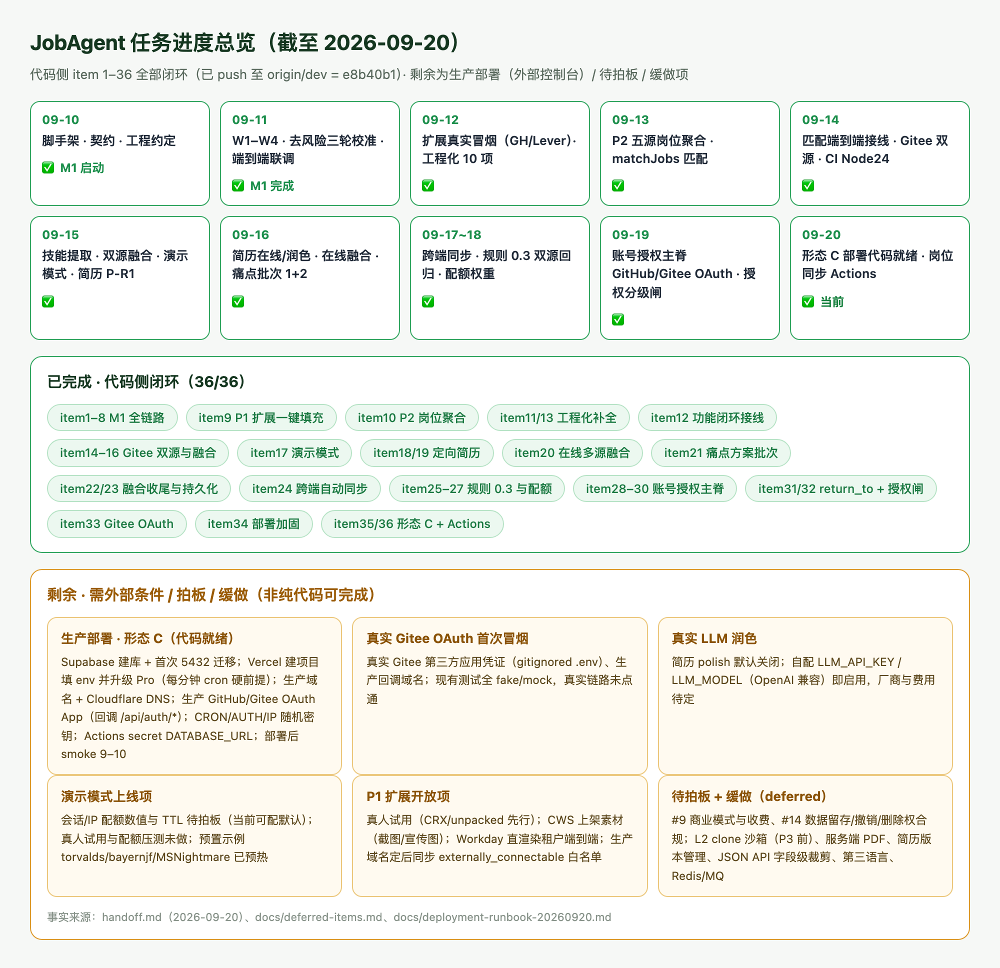

# Handoff

JobAgent 当前状态，截至 2026-09-24。

> 本文件只保留「项目当前状态 + 活跃任务 + 最近变更 + 文档索引」，是接手（人或 AI agent）的第一入口；**只写状态与结论，明细一律放进对应文档并在此给链接，不在本文件展开**。
> 设计/结论全文放 [docs/](docs/)；缓做事项放 [docs/deferred-items.md](docs/deferred-items.md)；场景化导航见 [docs/README.md](docs/README.md)。
> **归档惯例（对齐 agent-world，2026-09-18 起执行）**：①本文件只保留「项目当前状态 + 活跃任务 + 最近 5 条变更 + 文档索引」；②编号待办标 ✅ 后，详细过程（实现步骤 / commit 链 / 踩坑 / 验证数据）整块滚入 `docs/handoff-archive-YYYY-MM-DD.md`，本文件只留**一行结论 + commit hash**；③真正在推进 / 还在跑的活跃项保留详情。归档文件冻结只读、不再追加。

## Project documents

📚 **文档地图（按场景怎么读 + 状态约定）**：[docs/README.md](docs/README.md)。以下为全部文档直达（本区是完整清单的单一事实源，docs/README 只做场景导航、不重复清单）：

- [README.md](README.md) — 项目门面、技术栈、规划命令、铁律
- [AGENTS.md](AGENTS.md) — AI coding agent 工程约定单一事实源（CLAUDE.md 仅引用它）
- [CONTRIBUTING.md](CONTRIBUTING.md) — 本地开发 / 测试 / 提交 / PR 统一要求
- [MIGRATION_CONVENTION.md](MIGRATION_CONVENTION.md) — 数据库迁移命名/文件头/幂等/回滚规范
- [git-commit-message.md](git-commit-message.md) — 英文原子 Conventional Commits 规范
- [PULL_REQUEST_WORKFLOW.md](PULL_REQUEST_WORKFLOW.md) — 分支职责、PR 评审与合并流程
- [docs/产品构想-以GitHub为桥梁的招聘系统.md](docs/产品构想-以GitHub为桥梁的招聘系统.md) — 原始构想：定位、市场、B/C 双向闭环（历史）
- [docs/讨论记录-01-切入口与MVP收敛-20260910.md](docs/讨论记录-01-切入口与MVP收敛-20260910.md) — 切入口、护城河、L0–L4 分层、MVP 收敛过程（历史）
- [docs/讨论记录-02-投递功能与竞品分析-20260911.md](docs/讨论记录-02-投递功能与竞品分析-20260911.md) — 投递功能方向、Jobright 深度竞品分析、四种技术路径对比、职位聚合/Chrome 扩展可行性、3 项待拍板决策（历史）
- [docs/PRD.md](docs/PRD.md) — 产品范围、F1–F9、AbilityProfile/EvidenceItem 契约、指标、风险 ★
- [docs/技术选型-MVP-20260910.md](docs/技术选型-MVP-20260910.md) — 技术栈选型、运行架构、目录规划、M1 排期与 Spike ★
- [docs/技术栈总览-分层架构-20260916.md](docs/技术栈总览-分层架构-20260916.md) — 当前技术栈分层架构一页总览：客户端/服务/内核/采集/持久化五层、各包职责、横切事实与数据流（现行，与 AGENTS/README 同步）
- [docs/市场调研-AI求职赛道-20260910.md](docs/市场调研-AI求职赛道-20260910.md) — AI 求职赛道市场调研：市场格局、功能全景、代表性产品画像、信任风险与 P0/P1/P2 跟进建议（现行）
- [docs/市场调研-招聘市场痛点-20260916.md](docs/市场调研-招聘市场痛点-20260916.md) — 中国招聘市场双方痛点调研：企业端（寻源/筛选/造假/误聘）与求职者端（反馈缺失/定位模糊/竞争加剧）量化痛点、共同根源与对 JobAgent 的可信信号启示（现行）
- [docs/设计-痛点解决方案-20260916.md](docs/设计-痛点解决方案-20260916.md) — 12 项痛点→解决方案对位表 + 实施批次拆分：批次1 纯产品化（企业核验视图/面试准备包/落地页文案）、批次2 新接口（人才检索/筛选工作台/投递追踪）、批次3 外部条件；**批次 1 代码项 + 批次 2 已于 2026-09-16 落地（见 item21，落地页文案在独立仓未改、批次3 待外部条件）**（现行）
- [apps/extension/README.md](apps/extension/README.md) — P1 浏览器扩展试用指南：本地服务、开发者模式加载、Greenhouse/Lever 一键填充步骤与已知限制（现行）
- [docs/待拍板决策清单-20260910.md](docs/待拍板决策清单-20260910.md) — #1–#14；#1–#8 已拍板（#4 当日修订为海内外同步），#9–#13 延后，#14 已于 2026-09-21 拍板 ★
- [docs/deferred-items.md](docs/deferred-items.md) — 缓做/低优事项登记表（挂起项 + 触发条件的单一事实源）
- [docs/handoff-archive-2026-09-19.md](docs/handoff-archive-2026-09-19.md) — handoff 历史归档（2026-09-19）：item28 账号授权主脊（GitHub OAuth 登录/会话/认领）明细 + item29 报告页登录认领前端接线与 CLI `auth cleanup` 明细（归档，只读不追加）
- [docs/handoff-archive-2026-09-20.md](docs/handoff-archive-2026-09-20.md) — handoff 历史归档（2026-09-20）：item30 真实 GitHub OAuth 端到端、item31 return_to 深链、item32 授权分级闸、item33 Gitee OAuth、item34 部署加固、item35 形态 C 部署就绪、item36 岗位同步 Actions/API 文档明细 + 当时 Git 同步态（归档，只读不追加）
- [docs/handoff-archive-2026-09-21.md](docs/handoff-archive-2026-09-21.md) — handoff 历史归档（2026-09-21）：item37 已完成部分（P0-1 证据落库/P0-2 异议入口/#14 合规拍板）、item38 评审瑕疵收尾与形态 C 同域守护、item39 形态 C 部署执行包、item40 CWS 素材包与扩展四缺陷、item42 actionlint CI、item43 Windows 跨设备 Node24 全量回归（781/52/9 实测表）、item44 归档维护明细 + 当时 Git 同步态（归档，只读不追加）
- [docs/handoff-archive-2026-09-23.md](docs/handoff-archive-2026-09-23.md) — handoff 历史归档（2026-09-23）：item47 两端字段对齐/PG 测试真实验证、item48 评审 A 组本地闭环（A1–A7）、09-22 七项加固明细（归档，只读不追加）
- [docs/handoff-archive-2026-09-22.md](docs/handoff-archive-2026-09-22.md) — handoff 历史归档（2026-09-22）：item46 扩展真机验证批次（#52/#53 真实 Greenhouse 一键填充 + 跨端同步、#54 API 改走 background SW 代发、#55 公开只读 by-subject 端点与客户端、#56 电话区号/城市消歧、#57 personal website 填充、扩展 E2E 补 by-subject 链路 10/10、两端字段不对称缺口）+ 从主文件裁出的 09-21 两条流水（归档，只读不追加）
- [docs/handoff-archive-2026-09-18.md](docs/handoff-archive-2026-09-18.md) — handoff 历史归档（2026-09-18）：已完成编号待办 item 1–27 明细 + 2026-09-17 及更早最近变更 + 历史 Git 同步态（归档，只读不追加）
- [docs/design-i18n-20260910.md](docs/design-i18n-20260910.md) — i18n 设计：自研 `t()` + 中英 JSON 字典、key 对齐守护、分享链接语言固定、不翻译边界；§8 扩展落地（navigator 协商 + localStorage 覆盖 + MV3 `_locales`）（现行）
- [docs/design-tokens-20260910.md](docs/design-tokens-20260910.md) — 设计 token 设计：`--ja-*` 三层变量体系、组件禁 hex、与落地页 `--lui-*` 互不约束；§8 共享包 `packages/ui-tokens` + 扩展 Shadow DOM `:host` 接入（现行）
- [docs/design-storage-dual-dialect-20260911.md](docs/design-storage-dual-dialect-20260911.md) — 持久化层 SQLite/Postgres 双方言适配设计：统一 async 仓储接口、双 schema/双实现、对称迁移目录、createStorage 工厂（现行）
- [docs/API.md](docs/API.md) — HTTP API 接口文档：/auth/*（GitHub/Gitee OAuth 登录/会话/本人认领）、/analyze（含画像缓存）、/demo/*、/jobs、/profiles（含 exportable/job-recommendations/applications）、/candidates、/job-postings、/resumes/build、/internal/cron/*（形态 C serverless 定时端点）、/health 与错误码、形态 C `/api` 挂载前缀说明（现行）
- [docs/设计-职位聚合-Spike-20260913.md](docs/设计-职位聚合-Spike-20260913.md) — P2 职位聚合 Spike：8 数据源实测结论（RemoteOK/Remotive/GH/Lever 可用，YC/Wellfound 反爬暂缓）、最小链路设计与推荐组合、JobPosting 类型依据（现行）
- [docs/design-job-ingestion-20260913.md](docs/design-job-ingestion-20260913.md) — P2 职位聚合采集管道工程设计：job_postings 表迁移 005（双方言）、IJobPostingsRepository、packages/job-source 适配器+编排、CLI jobs sync 触发、分期 P2-A~D、测试与落代码清单（现行，可直接据此编码）
- [docs/design-match-wiring-20260914.md](docs/design-match-wiring-20260914.md) — 第一档·画像↔岗位匹配端到端接线设计：API 端点（GET /profiles/:id/job-recommendations + POST match 接受 profileId）、报告页推荐岗位 island、扩展侧栏匹配度面板、验收标准与缓做项（现行）
- [docs/design-gitee-source-spike-20260914.md](docs/design-gitee-source-spike-20260914.md) — Gitee 证据源 Spike：v5 仅 REST 无 GraphQL、匿名可读、L0 充分/L1 基本可行、与 GitHub 关键差异、未来 gitee-source 设计（现行，仅结论不实现）
- [docs/design-gitee-source-20260914.md](docs/design-gitee-source-20260914.md) — Gitee 第二证据源实现设计（G-A）：v5 REST 采集序列、→AnalyzerInput 十条映射规则、内核最小参数化、gitee-source 文件清单与测试、CLI --platform（现行，可直接据此编码；G-A CLI 闭环 + G-B 在线选源已随 item14 落地，2026-09-14~15）
- [docs/design-extension-match-ui-20260914.md](docs/design-extension-match-ui-20260914.md) — 扩展面板匹配 UI 设计：#10 可解释性后从 top1 轻量升级为 top5 完整展示，四态/匹配依据/证据外链/i18n/token（现行）
- [docs/design-extension-e2e-20260914.md](docs/design-extension-e2e-20260914.md) — 扩展浏览器级 E2E 设计：--headless=new 加载 unpacked MV3、独立 playwright.extension.config、route 拦截零网络、首批 5 用例与边界（现行）
- [docs/design-behavior-diversity-20260915.md](docs/design-behavior-diversity-20260915.md) — 方案 B 设计：双源 events 聚合源无关 BehaviorEventSummary、analyzer 保守弱信号 narrow_activity_scope（规则 0.1→0.2）、缺失降级矩阵、校准与原子提交规划（现行）
- [docs/design-skill-extraction-20260915.md](docs/design-skill-extraction-20260915.md) — B-4 技能标签精确提取：技术词典单一事实源、topics/描述/仓名/commit/PR 多信号、词边界防误匹配与别名归一、深度与置信度公式（现行）
- [docs/design-cross-source-fusion-20260915.md](docs/design-cross-source-fusion-20260915.md) — B-5 跨源镜像去重与最小双源融合：共享 commit oid 识别镜像、fuseInputs 纯函数逐字段融合规则、CLI --platform all；**§8 在线 API/Worker 多源融合（platform=all）2026-09-16 已落地（item20）；跨源 PR/issue 同帖去重、融合双源徽标（报告页/人才库）、扩展面板 all 入口 2026-09-17 已落地（item22）；FusionReport 随融合画像快照持久化 + 报告页去重统计 2026-09-17 已落地（item23）**；**all 融合作业配额权重（demo 扣 2）+ 跨源同帖去重 7 天窗锁定 2026-09-18 已落地（item27）**，Gitee OAuth 已随 item33 落地（2026-09-19，见 design-gitee-oauth）；剩余 Gitee 认证限频、跨源 L2 比对缓做（现行）
- [docs/design-demo-mode-20260915.md](docs/design-demo-mode-20260915.md) — 演示模式设计：anonymous/demo/user 三态 Principal、权限矩阵、会话+IP+Worker 三道配额闸、迁移 006–008 双方言、IDemoSessionsRepository、/demo/* 端点与 /analyze 配额改造、预置快照秒进、report/extension/cli 落地、5 项待拍板（现行，**步骤 1–9 已全部落地，见活跃待办 item17；配额 3/24h 与 TTL 24h 已于 2026-09-21 拍板（#14 同批）**）
- [docs/design-targeted-resume-20260915.md](docs/design-targeted-resume-20260915.md) — 岗位定向简历生成设计：画像范围硬约束（no-fabrication，每条挂 evidenceRefs）、新建纯函数包 packages/resume-core（rank 岗位定向排序 + buildResume 装配 + md/html 渲染）、shared ResumeDraft/LocalResumeFields 契约、P-R1 CLI→P-R2 API/报告页→P-R3 LLM 受约束润色分期、5 项待拍板（现行，**P-R1/P-R2/P-R3 可闭环子项已落地：shared 契约 + packages/resume-core（含 polish 安全层）+ packages/llm 端口/fake + CLI resume build/batch + API POST /resumes/build + 报告页 ResumeBuilder island + 扩展深链 CTA + **OpenAI 兼容 LLM client 与 API 可选 polish（默认关闭）**，见活跃待办 item18；**§10 五项 2026-09-16 已决策**：不持久化/只存本机/浏览器打印 PDF/LLM 默认关闭+OpenAI 兼容自配/语言手选；本地档案统一列 item19，版本管理入 deferred**）
- [docs/design-auth-gating-20260919.md](docs/design-auth-gating-20260919.md) — 账号收尾两刀设计：OAuth `return_to` 同源深链回跳（`sanitizeReturnTo` 白名单防开放重定向）+ 报告页授权分级闸（两档模型 / 可见性矩阵 / SSR `resolveViewer` / `GateCard` / interview-kit 401），含 JSON API 边界与落地记录（现行，handoff item31/32）
- [docs/design-gitee-oauth-20260919.md](docs/design-gitee-oauth-20260919.md) — Gitee 平台 OAuth 登录与本人画像认领设计：Gitee OAuth2 协议事实与相对 GitHub 三处差异、`GiteeAuthProvider`、平台无关 `registerOAuthFlow`、公开 `GET /auth/providers`、报告页 Gitee 登录入口与按画像主体平台的登录墙、零迁移/零 shared 契约改动、确定性测试与外部项（现行，handoff item33）
- [docs/deployment-runbook-20260920.md](docs/deployment-runbook-20260920.md) — 部署/上线 Runbook：**形态 C 已拍板并代码就绪（Cloudflare 管落地页+DNS；Vercel 单项目同域跑 Astro SSR 报告页与 `/api/*` Hono，Node runtime，region hnd1；Supabase Postgres；常驻 Worker→Vercel Cron 每分钟认领一个任务）**，含 Vercel 项目 6 步设置、Supabase 开库/5432 首次迁移、Pro 每分钟 cron 硬前提、OAuth `/api` 回调与 `API_MOUNT_PREFIX`、形态 A/B 备选、Docker、定时任务映射、10 项 smoke（现行；尚未真实部署，控制台操作待用户，handoff item35）
- [docs/评审-MVP-20260921.md](docs/评审-MVP-20260921.md) — MVP 上线就绪度评审（2026-09-21）：总结论未达可上线 MVP、3 个 P0（证据不落库/异议入口缺失/未部署）；**P0-1、P0-2 已修复并全链路验证（commits 80b8a81、3babb8f），#14 合规已拍板（同日），仅剩 P0-3 形态 C 部署待用户控制台操作**（现行）
- [docs/proposal-interview-planner-20260922.md](docs/proposal-interview-planner-20260922.md) — 面试计划表（安排面试+追踪结果）范围/数据模型/角色前提拍板提案：建议不进当前上线 MVP、作为上线后第一迭代（待拍板，item45）
- [docs/评审-MVP-20260922.md](docs/评审-MVP-20260922.md) — MVP 上线就绪度评审（2026-09-22，基于实测）：P0-1/P0-2 代码实查确认闭环，工程门禁（typecheck/check-migrations/build/报告 E2E 52/52/扩展 E2E 9/9）全绿，**唯一剩余 P0-3 形态 C 部署**；新发现本机 macOS 26 下 embedded-postgres 18.1.0-beta.15 的 PG 二进制启动 FATAL（postmaster multithreaded 检测误报，非代码缺陷，CI 不受影响）（现行）
- [docs/部署执行单-形态C-20260921.md](docs/部署执行单-形态C-20260921.md) — 形态 C 上线照勾操作序列（Runbook §4-C/§10/§11 的执行版）：A 本地前置→B Supabase（6543 函数/5432 迁移）→C 三随机密钥→D 生产 OAuth App（回调含 /api）→E Vercel（Root Directory=apps/report、hnd1、env 总表、Pro 每分钟 cron、cron token 走控制台不入 Git）→F 域名/DNS 灰云→G Actions 5432 secret→H CLI 预热三预置画像（demo seed 只读不预热）→I 落地页构建变量→J 人工 smoke；配 `tools/gen-deploy-secrets.sh`、`tools/smoke-deploy.sh`（现行，2026-09-21，item39）
- [docs/部署前就绪确认单-20260924.md](docs/部署前就绪确认单-20260924.md) — 形态 C 上线前最后一轮"代码/产物侧"门禁实测记录（A1–A7 + B1–B4）：835 单测/报告 E2E 57/扩展 11、Docker PG 11 迁移+9 行为、Vercel 产物、smoke 7/7（含 worker lazy-sources 与脚本断言两个真实修复）、audit/gitleaks 0、CWS 隐私政策/权限/素材；结论＝代码侧门禁全绿，唯一硬阻塞 P0-3 控制台人工部署（现行，2026-09-24，item51）
- [docs/privacy-policy-20260924.md](docs/privacy-policy-20260924.md) — 中英双语隐私政策权威源（10 节×2 语言：处理信息/不收集/用途/共享受托方/留存删除/国际传输/权利/未成年人/安全/变更联系），与在线页 `/[locale]/privacy` 同步，CWS 上架填 `https://<app-origin>/en/privacy`（现行，2026-09-24，item51）

## 当前状态

- 阶段：**M1 核心开发 + 工程化补全完成，P1·Chrome 扩展真实环境冒烟通过（Greenhouse + Lever），进入扩展稳定期**。M1·W1~W4、W3-6 SQLite/Postgres 双方言、#8 去风险、端到端联调、真实性三轮校准均已完成。**2026-09-12 一次性完成 10 项工程化补全**（见活跃待办 item 11）：Playwright E2E 主链路（顺带修复两个 React island 缺 `client:load` 致浏览器内无交互的真实 bug）、Dockerfile/docker-compose、embedded-postgres 真实 PG 行为测试、pre-commit 卡死修复、画像缓存、CLI markdown/html 导出、docs/API.md、report i18n 测试补齐增强、waitlist CLI 只读子命令（`4474978`）。**真实性第三轮双向校准完成**：标注账号扩到 26 个（22 正 + 4 负），真实账号 0 误报为 suspicious、可疑账号 0 漏报为 likely_authentic，analyzer-core 32 测试。**P1·Chrome 扩展第 3 步真实环境冒烟完成（2026-09-12）**：真实 Greenhouse 岗位页跑通「按钮→面板→画像→一键填充」四环，first_name 真实写入，修复 4 个真实问题；同日 **Lever 真实岗位页零改动跑通（name+github 写入）**；**Workday 实测 4 家租户受限（外链官网/反爬/不直渲染），已加 shadow DOM 定位并登记限制**；**2026-09-13 扩展 summary→自定义问题映射完成（Greenhouse question_* 与 Lever questions[*]，共享 findLabeledQuestion，17 测试）**。**P2 职位聚合 Spike 完成（2026-09-13）**：JobPosting 类型落地 shared，8 数据源实测（RemoteOK/Remotive/Greenhouse/Lever/HN 可用，YC/Wellfound 反爬暂缓），结论见 docs/设计-职位聚合-Spike-20260913.md。**P2-A/B 采集管道编码完成（2026-09-13）**：双方言迁移 005 `job_postings` + storage 岗位仓储 + 新包 `packages/job-source`（RemoteOK/Remotive/Greenhouse/Lever 四适配器 + 归一化 + 编排）+ CLI `jobs sync/search/stats`；真实四源首次入库 2044、二次 sync 全量 unchanged 幂等，全仓三件套全绿（明细见活跃待办 item 10）。全仓 typecheck/test/build 三件套全绿（明细见活跃待办 item 10）。**P2-C/D 完成（2026-09-13）**：HN「Who is hiring」月度自由文本适配器（真实 2026-09 帖 260 条评论→240 入库/20 跳过、二次 sync 全量 unchanged 幂等）+ 纯函数 matchJobs 技能匹配 + API 四个 /job-postings 端点 + CLI jobs match，本批 5 个功能原子提交均已 push。**2026-09-13 收尾 P2 两项遗留**：Lever 种子从 alluxio 1 家实测扩到 9 家（1589 真实岗位离线 ingest 验证）、HN 月度 cron 配置写入设计 §7.3（顺带补 cli `start` 脚本让文档命令可跑），明细见最近变更。**P2 采集出站代理落地（2026-09-13）**：job-source http-client 真正消费 JOB_HTTP_PROXY（undici ProxyAgent + 同实例 fetch；CLI 回退 HTTPS_PROXY/HTTP_PROXY），本机经代理实测 Lever 九家全入库 1588（含此前直连超时的 Shield AI 472/Palantir 311），3 个原子提交已 push。**2026-09-14 功能路线盘点（见活跃待办 item 12，⏳ 待拍板未启动）**：P2 岗位库 / 匹配引擎已就位但缺“画像→岗位”用户入口，首推画像↔岗位匹配端到端接线（API profileId 匹配 / 报告页推荐区块 / 扩展匹配度面板），并行候选 #12 Gitee（触发条件已到）。**第一档·画像↔岗位匹配端到端接线已完成（2026-09-14，已 push 并经 PR #23 并入 main）**：①API 接线（`e16589b`）——新增 `GET /profiles/:id/job-recommendations`（从画像快照取 skillTags 调 matchJobs 打分排序，query 过滤 remote/sources/salary_min/limit/candidate_limit）+ `POST /job-postings/match` 接受可选 profileId（优先于显式 skills），9 个新集成测试，api 共 35 测试全绿；②报告页推荐岗位 island——新增 `JobRecommendations.tsx`（loading/error/empty/list 四态，匹配分三档色，命中技能 chip，岗位链接跳 sourceUrl），插入能力标签区块后，8 个 i18n key 中英同构（report 22 测试含 key 对齐守护），全用 `--ja-*` token 无硬编码 hex；③扩展侧栏匹配度——画像加载后自动调 `POST /job-postings/match` 传 profileId，展示 top 1 匹配分/命中技能/岗位@公司/技能命中计数，四态渲染不阻塞一键填充，新增 `matchJobs()` API 客户端 helper + 3 单测，扩展共 20 测试全绿。设计文档 `docs/design-match-wiring-20260914.md`。全仓 typecheck/test/build 全绿。缓做：缺失技能精确提取、LLM 匹配理由、向量召回、当前 ATS 岗精确匹配（第一档用岗位库 top 匹配轻量版）。**#12 Gitee 第二证据源 G-A 已落地（2026-09-14）**：新增 `packages/gitee-source`（v5 REST-only）+ shared/analyzer 多平台参数化 + CLI `--platform` 命令行闭环，复用 analyzer 内核、信号规则零改动，详见活跃待办 item 14。**2026-09-15 方案 B（行为多样性）落地**：GitHub/Gitee 双源把 public events 聚合成源无关 `BehaviorEventSummary`（跨仓广度/事件类型分布）随 `AnalyzerInput` 传入，analyzer-core 新增保守弱信号 `narrow_activity_scope`（恒 warn、不升 risk；外部 merged PR、events 多仓或协作事件反向豁免），**规则版本 RULE_VERSION 0.1→0.2**（analyzerVersion=0.1-0.2，旧信号保留 r0.1 前缀、新信号 r0.2）；analyzer 41 / gitee-source 40 / github-source 24 单测全绿，全仓 typecheck+test+build+迁移校验通过，双源（GitHub 26 + Gitee 9）真实回归已完成、零误伤闭环（见 item14）。

**工程 / 分发下一步**：真实用户装扩展试用（CRX/unpacked 先行已建议）；生产部署时按设计 §7.3 挂日更 / 月度定时任务。**2026-09-14 扩展补齐 i18n 与设计 token**：报告页 W4 早已落地（22 i18n 测试、`--ja-*` token），本次补齐第二个前端 apps/extension——token 单一事实源上移新包 `packages/ui-tokens`（`:root,:host` 双选择器，report re-export、扩展 Shadow DOM 内加载），扩展面板全量 `t()` 中英双语（navigator 协商 + localStorage 覆盖 + 面板切换器）、MV3 manifest 走原生 `_locales/{en,zh_CN}`、panel.css 零颜色字面量（守护测试），扩展测试 17→42，全仓三件套全绿，明细见最近变更。
- **2026-09-14 工程化补全·组合一（4 个原子提交，已 push、CI 全绿并经 PR #24 并入 main）**：①CI 补 Playwright E2E（装 Chromium + `pnpm e2e`）与 Docker build smoke（api/report 两个 target，worker 与 api 共用 node-runtime 层）；②修 Dockerfile deps 阶段漏 COPY `packages/job-source`/`packages/ui-tokens`/`apps/extension` 的 package.json——P2、ui-tokens 抽包后镜像内 `pnpm install --frozen-lockfile` 必失败的真实隐患；③新增报告页推荐岗位 island E2E 4 用例（列表/空/错误/中文，page.route mock 接口），全量 E2E 10→14 全绿，并给 report dev server 加 `--no-toolbar`（Astro Dev Toolbar 的 island inspector 在 shadow DOM 里 pretty-print 各 island props、含全部 i18n 文案，会让全局文本定位误匹配，已实测定位）；④docs/API.md 补 `GET /profiles/:id/job-recommendations` 与 `POST /job-postings/match` 的 profileId 二选一（skills/profileId 二选一、profileId 优先，原职位聚合节顺延 §3.3）。全仓 typecheck/test/build 全绿。
- **2026-09-14 #10 匹配可解释性贯穿四层 + Gitee 证据源 Spike + CI actions 升 Node24（6 个功能原子提交，已 push、CI 全绿）**：①可解释匹配——matchJobs 拆出 title/tags/description 三项 fieldScores（权重 3/2/1、和=总分）与逐技能 skillHits（保留 matchedSkills 向后兼容），API 为 profileId 推荐挂逐技能 skillReasons（命中字段/depth/confidence）与去重 evidence 字典、每个命中可回溯画像证据，报告页增可展开「匹配依据」（分数分解+证据外链、旧响应健壮回退）与 4 个中英 key，扩展补类型/透传（面板匹配 UI 仍为第一档遗留待办）；E2E 全量 15。②Gitee Spike 仅出文档不实现（design-gitee-source-spike-20260914）：v5 REST-only、L0 充分/L1 基本可行、内核不改、实现仍缓做（deferred #12 更新触发条件）。③CI 四 action 升 node24 大版本清 Node20 deprecation，待 push 后 CI 验证。全仓 typecheck/单测/build/check-migrations/E2E 全绿。
- 仓库：https://github.com/bayernjf/job-agent （public）；长期分支 `main`、`dev`；脚手架、CI 修复（`e7730fe`）、调研文档、PRD v0.2/双市场与 M1·W1 持久化层（`73f5172`/`86f6d86`/`946c25c`/`2cb8842`）均已 push 至 `origin/dev`，本地与远端一致。
- 落地页已上线：https://job-agent.bayjf.com （仓库 `bayernjf/job-agent-landing`，Cloudflare Pages，详见其 handoff）。
- 待办：活跃待办 item 1–16 全部 ✅ 完成；**item 17 演示模式代码（步骤 1–9）已全部落地，仅剩需外部条件的拍板/部署/真人项（见 item17 与已知限制）**；**item 18 岗位定向简历 P-R1/P-R2/P-R3 可纯代码闭环子项已全部落地（2026-09-16）：含 OpenAI 兼容 LLM client + env 工厂 + API 可选 `polish`（默认关闭、失败回退），设计 §10 五项已拍板（不持久化/只存本机/浏览器打印 PDF/LLM 默认关闭+OpenAI 兼容自配/语言手选）**。**item 19 进度（已全部完成，2026-09-16）**：②报告页「AI 润色」开关 UI 已完成并 push（`a6b7487`/`c3a97ee`，中英 i18n + token 样式 + 2 E2E + 真实浏览器中英回退复验）；①**本地档案 canonical 统一已落地（本批，见 item19 ①）**——shared 单一 `LocalProfileFields` 契约 + 两投影/旧键迁移纯函数（23 单测），报告页与扩展都改用 `jobagent.localProfile`、各自本域一次性迁移旧键，报告页表单 period 拆为结构化 start/end，两套 E2E 16/16 + 真实浏览器迁移/投影复验通过。**item19 关闭**；**item20 在线多源融合画像（platform=all）已落地（2026-09-16，代码/单测/E2E 全绿，已 push）**——报告首页第三平台选项一次作业双采 GitHub+Gitee、镜像去重产出融合画像，零迁移/零契约改动，Gitee 404 正常降级、瞬时错误上抛重试，顺带修复选中态未定义 token 的真实 UI bug，详见 item20；~~仅剩跨端自动同步（需账号体系或 `chrome.storage` 通道，缓做见 deferred）~~ **跨端自动同步已落地（item24，2026-09-17，经 PR #55 并入 main）**。**item21–item25 全部落地并已入 `main`**：item21 招聘痛点批次 1+2、item22/23 跨源融合收尾与 FusionReport 持久化（PR #54，merge `188cff7`）、item24 本地档案跨端自动同步与 item25 `self_pr_ratio` 规则强化（RULE_VERSION 0.2→0.3，PR #55，merge `1ca0f7e`）。其余为外部/缓做项：真实启用 LLM 需用户自配 `LLM_*` env（厂商/费用用户定）、服务端 PDF、简历版本管理（随持久化，见 deferred）。**item26 规则 0.3 真实双源回归复核已完成（2026-09-18，见 item26 与最近变更）：holilayet 回归 mixed_signals、22 正样本 0 误报、双源 narrow 零触发，0.3 零误伤、无需微调内核，活跃待办 item1–26 全部关闭。** **item27（2026-09-18）换 Windows 设备全量复核全绿 + all 融合作业 demo 配额按权重扣 2（env DEMO_FUSION_QUOTA_COST，整单拒绝不部分扣）+ 跨源同帖去重 7 天窗锁定（CROSS_SOURCE_THREAD_WINDOW_MS，`<=` 边界测试钉契约），活跃待办 item1–27 全部关闭。** 其余待推进项均卡在外部条件或拍板（生产域名与真实部署、账号体系方向、LLM 厂商；demo 配额/TTL 与 #14 合规已分别于 2026-09-18/21 拍板），见「已知限制」与 docs/deferred-items.md。**2026-09-18 macOS 跨设备健康巡检在权威 Node 24 下全绿（666 单测 / 报告 E2E 37 / 扩展 E2E 9 / 迁移 0 warning），并复核关闭 GitHub App 额度 V1 待核实项，零代码改动（见最近变更首条）。** **item28 本人授权主脊（GitHub OAuth 登录 + accounts/auth_sessions 迁移 010/011 + 本人认领 claim，决策 #1-A/#6-A）代码/测试/文档已全部落地（2026-09-18，6 个本地英文原子提交已 push，含 `9a48761` docs(handoff)）：登录用户可触发分析且不占 demo 配额、认领本人画像，AuthMe 不外发 email；全仓 typecheck/test（含真实 embedded PG 7/7）/build、check-migrations 11 对全绿。剩余真实 OAuth 凭证（外部）与授权分级闸（下一刀，范围待讨论）见 item28 与已知限制。** **item29 账号主脊前端接线 + 认证数据运维清理已落地（2026-09-19，4 个本地英文原子提交已 push：`d88328a` db → `c6492ab` cli → `a914500` report → `e298559` docs）**：报告站点全局头部 AccountMenu（GitHub 登录/登录态/退出）+ 报告页本人 ClaimProfile 认领 CTA/已验证徽章（claimed 走 SSR 无 JS），中英 i18n + token 样式 + 6 个零网络 E2E；CLI `jobagent auth cleanup`（清过期/撤销会话与无活会话的未认领账号，默认 24h/30d）+ storage 双方言 purgeExpired/deleteUnclaimed + 确定性单测；扩展评估为不适用（content script 只读、OAuth/HttpOnly cookie 不适用，panel 已有 claimedBadge），不改扩展码。全仓 712 单测 + 报告 E2E 43/43 全绿，并经内置浏览器真实复验匿名登录入口。明细归档 item29。** **item30 真实 GitHub OAuth 登录本地端到端打通（2026-09-19，3 个代码提交已 push `24a1908`/`9191a25`/`d559735` docs）**：建本地 OAuth App（凭证入 gitignored `.env`），修服务端换 token 不走代理（新增 proxy-bootstrap 启动装 undici 全局 ProxyAgent）与本地跨端口不带会话 cookie（认证 island 改 `credentials:'include'`）两处根因；真实浏览器完成 GitHub 登录、退出、本人「认领此画像」并核验 DB 落库，api 111 测试 + account-auth E2E 6/6 全绿。生产凭证/域名、授权分级闸等仍为外部项（见 item30 与已知限制）。** **item31/32（2026-09-19）账号收尾两刀已落地（3 个代码提交已 push `ba21d04`/`4600a87`/`9d15a29` docs）**：OAuth `return_to` 同源深链回跳（白名单防开放重定向）+ 报告页授权分级闸（未登录折叠招聘方证据外链/面试题、面试包 401，登录 user 全见；结论/技能/匹配/简历/投递与匹配理由证据仍公开），JSON API 字段级裁剪缓做；设计与可见性矩阵见 [docs/design-auth-gating-20260919.md](docs/design-auth-gating-20260919.md)。

## 活跃待办（下一步）

> 启动前决策 #1–#8 已于 2026-09-10 拍板。**item 1–36 代码可闭环子项全部 ✅（2026-09-20，已随 PR #69 并入 `main`）**。**item37（2026-09-21，当前唯一活跃项）**：MVP 上线评审接力——P0-1 ✅ worker 证据落库（`80b8a81`）、P0-2 ✅ 报告页异议 mailto（`3babb8f`）、#14 ✅ 留存/删除/链接撤销拍板并把 demo 对齐为 3 次/24h（`df96c8f`/`7aa5482`/`66dc168`），仅剩 **P0-3 形态 C 真实部署（控制台操作需用户本人）**。**item38（2026-09-21，评审非阻塞瑕疵收尾 + 形态 C 同域守护测试）已 ✅，已随 PR #70 合入 main**。**item39/40（2026-09-21）亦 ✅，已随 PR #70 合入 main**：item39 形态 C 部署执行包（照勾执行单 + 密钥生成/部署后 smoke 脚本，控制台步骤仍需用户本人）；item40 CWS 上架素材包（5 截图 + 2 宣传图 + 中英 listing + 可复现脚本）并顺带修复四个真实扩展缺陷（Lever `tel`/`url` 字段收集、平铺 label 动机问题识别、样式表 WAR 放行、长面板高度约束）。**item41（2026-09-22）采集层证据 claim 模板英文化已 ✅（commit `3ddd18c`，已随 PR #72 合并）**：deferred 中该项的触发条件随 CWS 上架准备到达，按方向 A 两源五类模板统一改英文，零 schema/迁移/内核改动，旧画像快照不回改。**item42/43/44（2026-09-21 于 Windows 克隆完成、2026-09-22 在 macOS 重建）已 ✅（item43 Node24 基线随 PR #70、item42 actionlint 与 item44 09-21 归档随 PR #72 合并）**：item42 CI 固化 actionlint job、item43 Windows 跨设备 Node v24 全量验证回归（781/52/9 与 macOS 基线逐项一致）、item44 handoff 裁剪归档——三者原在 Windows 以临时编号创建后因跨设备未同步丢失，已在 macOS 按当前编号重建（明细见 09-21 归档 §5–§7）。**item50 部署前收尾批次（T1–T8）亦于 2026-09-23 晚完成：release 一键打包脚本、CWS 素材在英文画像上重截闭环、deferred 触发点与 4 处过时文档修正，jobs-sync guard/Vercel 构建/bash 3.2 兼容零改动验证通过。至此代码与离线可备项全部清空，剩余仅外部项：P0-3 控制台部署、CWS 开发者账号上架（真实生产域落地后用 release 构建重截一次）、真人试用/招聘方盲看、Workday 直渲染租户、法务意见。另 item45 面试计划表（安排面试+追踪面试结果）待拍板排期。**历史背景：item28–37 均已由用户 push（`origin/dev` 现为 `2e906e8`）。**item35（形态 C 生产部署代码就绪，已 push）**：常驻 Worker 轮询→Vercel Cron 单任务端点、报告页+API Vercel 单项目同域 `/api`、Supabase PgBouncer 连接与 `DB_AUTO_MIGRATE`、`API_MOUNT_PREFIX=/api` 修复同域 OAuth 回调、vercel.json 与生产 env 占位、Runbook 形态 C 全文。**item36（2026-09-20，岗位同步 Actions workflow + 形态 C API 文档，2 个英文原子提交已 push：`ca18b98` → `e8b40b1`）**：岗位日更/HN 月更 GitHub Actions workflow 落地（需配 Actions secret `DATABASE_URL`）、docs/API.md 补内部 cron 端点与形态 C 路径/env 说明。**代码就绪但尚未真实部署**——Supabase 建库、Vercel 项目（Pro 是每分钟 cron 硬前提）、生产域名/DNS、生产 OAuth App、随机密钥均为外部项（见 item35/36 与 Runbook §11）。item30–36 详细过程已归档至 [docs/handoff-archive-2026-09-20.md](docs/handoff-archive-2026-09-20.md)（冻结只读），item28/29 见 [docs/handoff-archive-2026-09-19.md](docs/handoff-archive-2026-09-19.md)，更早 item 1–27 见 [docs/handoff-archive-2026-09-18.md](docs/handoff-archive-2026-09-18.md)，本区只留一行结论索引：

1. ✅ **M1·W1 持久化层 + 首个迁移**（2026-09-11）
2. ✅ **M1·W2 github-source + analyzer-core + cli**（2026-09-11）
3. ✅ **#8 去风险 S1/S2 spike**（2026-09-11）
4. ✅ **修复 spike 暴露 3 个 bug + 回归**（`b77ec11`，2026-09-11）
5. ✅ **#8 重新批量验证 + 真实性三轮双向校准**（26 账号：22 正 0 误报 + 4 负 0 漏报，2026-09-11~12，`46e8157`/`13e4f5e`/`70505c5`）
6. ✅ **M1·W3 服务化**（W3-1~W3-6，四表+仓储+worker+api+双方言，2026-09-11，`07e0fd9`…`e204798`）
7. ✅ **M1·W4 报告与分享**（W4-1~W4-6，Astro 7 SSR + i18n + token + 只读分享 + 落地页接线，2026-09-11）
8. ✅ **端到端联调**（api+worker+report 三服务主链路，2026-09-11）
9. ✅ **P1·Chrome 扩展一键填充**（第 1–3 步 + Lever 零改动跑通 + Workday 受限登记；summary→自定义问题映射；i18n+设计 token，2026-09-11~14，`975e367`/`ed69003`/`d959c83`/`54b513e`/`3e74f40`/`c5f8006`/`0b342a4`）——剩余外部项（真实用户装扩展试用、分发策略 CRX 先行已采纳、Workday 直渲染租户端到端）见「已知限制」
10. ✅ **P2·职位聚合**（JobPosting 契约 + Spike + 采集管道 + 五源入库 2044/1588 + matchJobs 匹配 + 四 API 端点 + 出站代理，2026-09-13，`2a9c9b4`/`631deb0`/`ca431a9`/`52e8d7d`）
11. ✅ **工程化补全 10 项**（Playwright E2E/Docker/真实 PG/pre-commit 卡死修复/画像缓存/CLI 导出/API 文档/waitlist CLI/i18n 测试，2026-09-12，`4474978`）
12. ✅ **P2 之后功能闭环路线**（第一档画像↔岗位匹配端到端接线 PR #23；第二档 #10 可解释性 + 扩展匹配 UI + 分档统一 + Gitee G-A/B；第三档继续缓做，2026-09-14，`e16589b`）
13. ✅ **工程化补全·组合一**（Dockerfile 漏 COPY 修复 + CI 补 E2E/Docker smoke + 推荐岗位 E2E + API 文档，PR #24；Docker arm64 运行时实跑 + PG 并发首迁移修复 `141ee9a`，2026-09-14~16）
14. ✅ **#12 Gitee 第二证据源**（G-A CLI 闭环 + G-B 在线选源 + events 方案 A + 行为多样性方案 B 规则 0.1→0.2，2026-09-14~15）
15. ✅ **B-4 技能标签精确提取**（技术词典 + 多信号 + 词边界，`e1ffd81`，2026-09-15）
16. ✅ **B-5 跨源镜像去重 + 最小双源融合**（`fuseInputs` 纯函数 + CLI `--platform all`，`b69372b`/`ce6e6ae`/`894b540`，2026-09-15）
17. ✅ **演示模式 Demo Mode**（三态身份 + 三道配额闸 + 迁移 006–008 + 九步落地，2026-09-15，`e391389`…`29bb399`）——剩余外部项（配额数值/TTL、部署形态、生产 cleanup cron、真人试用）见「已知限制」
18. ✅ **岗位定向简历生成**（P-R1 规则版 + P-R2 在线消费 + P-R3 可闭环子项含 OpenAI 兼容 LLM 润色默认关闭；§10 五项已拍板，2026-09-15~16）——真实 LLM 需自配 `LLM_*`、服务端 PDF/版本管理缓做
19. ✅ **简历后续两项**（报告页 AI 润色开关 + 本地档案 canonical 统一，2026-09-16，`a6b7487`/`c3a97ee`/`760c349`/`9037c5d`/`353cfb5`）
20. ✅ **在线多源融合画像 platform=all**（Worker/API/报告首页接线 + 缓存平台隔离 + UI bug 修复，2026-09-16）
21. ✅ **招聘痛点解决方案·批次 1+2**（核验视图/面试准备包/人才检索/筛选工作台/投递追踪，9 提交顶部 `d713f65`，2026-09-16）
22. ✅ **跨源融合收尾三项**（PR/issue 同帖去重 + 扩展 all 第三键 + 双源徽标，PR #54，2026-09-17，`62a9b71`/`c223832`/`98ab90e`）
23. ✅ **FusionReport 持久化 + 报告页去重统计**（PR #54，2026-09-17，`4d13405`…`415bdde`）
24. ✅ **本地档案跨端自动同步**（chrome.storage + externally_connectable，PR #55，2026-09-17，`194a490`/`9bf1f95`/`984813a`）——生产域名未定，externally_connectable 白名单含占位
25. ✅ **self_pr_ratio 判定强化 + 规则 0.2→0.3**（PR #55，2026-09-17，`be07ab6`/`fe47f68`）
26. ✅ **规则 0.3 真实双源回归复核**（GitHub 26/26 + Gitee 9 成功零误伤，holilayet 回归 mixed，2026-09-18）
27. ✅ **换 Windows 设备全量复核 + all 融合作业 demo 配额权重扣 2 + 跨源同帖去重 7 天窗锁定**（2026-09-18，`CROSS_SOURCE_THREAD_WINDOW_MS` 导出锁定、`DEMO_FUSION_QUOTA_COST` 可配）
28. ✅ **本人授权主脊：GitHub OAuth 登录 + accounts/auth_sessions + 本人认领（决策 #1-A/#6-A）**（2026-09-18，6 提交 `53072c3` shared → `5ff8c9c` db → `0cc4fa3` storage → `5dfa0b3` api → `0f4ce17` docs(api) → `9a48761` docs(handoff)；明细归档 [handoff-archive-2026-09-19](docs/handoff-archive-2026-09-19.md) §1）
29. ✅ **账号主脊前端接线 + 认证数据运维清理（报告页 AccountMenu/ClaimProfile + CLI `auth cleanup`）**（2026-09-19，4 提交 `d88328a` db → `c6492ab` cli → `a914500` report → `e298559` docs(handoff)；明细归档 [handoff-archive-2026-09-19](docs/handoff-archive-2026-09-19.md) §2）
30. ✅ **真实 GitHub OAuth 登录本地端到端打通（出站代理 + 跨端口 cookie 两处根因修复，真实浏览器验证登录/退出/认领落库）**（2026-09-19，3 提交 `24a1908` api → `9191a25` report → `d559735` docs(handoff)；明细归档 [handoff-archive-2026-09-20](docs/handoff-archive-2026-09-20.md) §1）
31. ✅ **OAuth 登录后 `return_to` 深链回跳（`sanitizeReturnTo` 白名单防开放重定向）**（2026-09-19，`ba21d04` api + `9d15a29` docs(auth)；明细归档 09-20 §2，设计 [design-auth-gating-20260919](docs/design-auth-gating-20260919.md)）
32. ✅ **报告页授权分级闸（未登录看公开门面，登录 user 解锁证据外链/面试题/面试包，interview-kit 未登录 401）**（2026-09-19，`4600a87` report；明细归档 09-20 §3，设计 [design-auth-gating-20260919](docs/design-auth-gating-20260919.md)；JSON API 字段级裁剪缓做见 deferred）
33. ✅ **Gitee 平台 OAuth 登录与本人画像认领（对称 GitHub 主脊的第二个 AuthProvider，零迁移）**（2026-09-19，3 提交 `694d6da` api → `04b15fd` report → `9e9be65` docs(auth)；明细归档 09-20 §4，设计 [design-gitee-oauth-20260919](docs/design-gitee-oauth-20260919.md)；真实 Gitee App 凭证首次冒烟为外部项）
34. ✅ **部署加固批次（GateCard Gitee 登录墙 E2E + 部署/上线 Runbook + README/docs 导航，零产品代码改动）**（2026-09-20，`372dfa7` test(report) → `faa489d` docs(deploy) Runbook → `fda3d59` docs(handoff)；明细归档 09-20 §5，Runbook [deployment-runbook-20260920](docs/deployment-runbook-20260920.md)）
35. ✅ **形态 C 生产部署代码就绪：Vercel 单项目同域（报告页 `/` + Hono `/api/*`）+ Supabase Postgres + Vercel Cron 替代常驻 Worker**（2026-09-20，7 提交 `d34b64d`…`2dd7eb3`；明细归档 09-20 §6；**尚未真实部署**，Supabase/Vercel Pro/生产域名/OAuth App/随机密钥等控制台待办见 Runbook §11）
36. ✅ **岗位同步 GitHub Actions workflow（每日四源/每月 HN）+ 形态 C API 文档（§5 内部 cron 端点、`/api` 前缀约定）**（2026-09-20，`ca18b98` ci(deploy) → `e8b40b1` docs(api)，后者为 `bab3dd8` push 前 amend；明细归档 09-20 §7；上线前需配 Actions secret `DATABASE_URL`=5432 Session pooler 串）
37. 🔄 **MVP 上线评审接力（2026-09-21，见 [docs/评审-MVP-20260921.md](docs/评审-MVP-20260921.md)）**：P0-1 ✅ worker 成功分支补 evidence 落库（`80b8a1`）、P0-2 ✅ 报告页 mailto 异议入口（`3babb8f`），全链路验证 worker 24/24、report 33/33、E2E 52/52；**#14 合规与 demo 配额已于 2026-09-21 拍板并落地**：画像/证据长期留存+应求删除、分享链接不自动过期+应求撤销（均走异议 mailto），demo 每会话 3 次分析、会话 TTL 24h（默认值由 7 天改为 `86400000`，API 测试 150/150）；**仅剩 P0-3 形态 C 部署待用户参与（当前活跃项）**
38. ✅ **评审非阻塞小瑕疵收尾 + 形态 C 同域挂载守护测试（2026-09-21，已随 PR #70 合入 main）**：①CLI `analyze` 接通 usage 早已承诺但 parseArgs 未注册的 `--format json|markdown|html`（复用既有 `renderProfile`，非法值退出 2，+3 单测，CLI 20/20）；②报告页形态 C 同域行为补守护——新增纯函数 `stripApiPrefix`（从 `pages/api/[...slug].ts` 抽出，钉死 `/api`→`/`、`/api-docs` 不误剥等边界，4 单测）与 `resolveBrowserApiBase`（`api-base.ts` 解析逻辑抽纯函数，钉死显式 PUBLIC_API_BASE 优先 / Vercel 回落 `/api` / 本地空串，4 单测；PUBLIC_* 经 Vite 静态替换、vi.stubEnv 改不到，故测可注入纯函数），report 单测 33→41；全仓 typecheck/单测（api 150、report 41、CLI 20）/build、`ASTRO_ADAPTER=vercel` 构建、check-migrations 0 warning、报告 E2E 52/52 全绿。**至此纯代码侧可闭环项全部清空，剩余仅 P0-3 控制台部署与外部项**
39. ✅ **形态 C 部署执行包（2026-09-21，已随 PR #70 合入 main）**：把 Runbook 形态 C 落成照勾执行的 [docs/部署执行单-形态C-20260921.md](docs/部署执行单-形态C-20260921.md)（A–J 阶段 + Vercel env 总表 + 故障速查；纠正 `demo seed` 为只读就绪检查、真正预热用 `jobagent analyze <login>`，`DEMO_PRESET_LOGINS` 默认空、生产须显式配 `github:torvalds,github:bayernjf,github:MSNightmare`）+ 两个对齐 `tools/check-migrations.sh` 风格的只读脚本：`tools/gen-deploy-secrets.sh`（生成 CRON_SECRET/AUTH_STATE_SECRET/DEMO_IP_SALT，`--out` 写 chmod 600、文件存在拒绝覆盖，真实密钥不入库）、`tools/smoke-deploy.sh`（部署后验 `/api/health`、首页/`/en/`、cron 无 token→401/带 token→200、未知 job→404、presets→200，末尾打印人工 checklist）。**Supabase/Vercel Pro/域名 DNS/生产 OAuth/Actions secret/首次 5432 迁移等控制台操作仍只能用户本人执行（P0-3）**
40. ✅ **Chrome Web Store 上架素材包 + 顺带修复四个真实扩展缺陷（2026-09-21，已随 PR #70 合入 main）**：`apps/extension/store-assets/`（不打包进 dist）产出合规素材——5 张 1280×800 截图（扩展匹配面板 / 匹配依据证据 / 一键填充结果 / 英文可信画像报告 / 招聘方人才库）+ 必需 440×280 小宣传图 + 可选 1400×560 marquee（sips 核验尺寸全部精确合规）+ 可复现 `capture.mjs`（Playwright：真实本地 API 数据、仅 ATS 宿主页 mock、强制 `locale:'en-US'`）+ 高仿真 Lever `ats-job.html`、`promo.html` 与 README（官方规格出处、复现命令、中英 listing 文案；规格取自 developer.chrome.com 官方仓库 raw markdown，**现版无 920×680**，截图 1280×800 直角 full bleed）。截图过程挖出并修复四个真实缺陷：**填充覆盖**——①`collectFields` 漏收 `input[type=tel|url]`，致真实 Lever 电话 / LinkedIn / GitHub 字段填不进；②`findLabeledQuestion` 对 label 与字段平铺（无包裹 div、无 id-for）的表单误取容器首个 label，动机问题漏填，补「紧邻前兄弟 `<label>`」优先匹配；**样式呈现**——③manifest 缺 `web_accessible_resources` 致 content script 注入的 tokens/panel.css 在真实网页被拒（面板裸样式；WAR matches 用 `https://*/*`，content_scripts 式 path 通配会使扩展整体加载失败）；④长面板无 max-height 顶部溢出且与悬浮按钮重叠（加 `max-height: calc(100vh - 96px)` + 内部滚动，保留 fab 作唯一收起入口）。扩展单测 15→17、E2E 补样式回归断言且 9/9，浏览器实测一键填充由 2 字段增至 6 字段（name/email/phone/linkedin/github/why）。**待外部：CWS 开发者账号上架、生产 API 构建重截（去掉高级字段 localhost placeholder）**；~~证据 claim 采集层中文模板英文化缓做（见 deferred）~~ **已落地（item41，2026-09-22）**
41. ✅ **采集层证据 claim 模板英文化（2026-09-22，deferred 触发条件随 CWS 上架准备到达，方向 A 最小改法，commit `3ddd18c`）**：`github-source`/`gitee-source` 的 `evidence.ts` 五类 claim 模板（账号/仓库/提交兜底/PR/Issue）由写死中文统一改英文（如 `Repository owner/name (Lang): N stars / M forks, last pushed YYYY-MM-DD`、`PR "title" (owner/repo#123)`）；claim 仅存储/展示、全仓无任何代码解析其文本，故零 schema、零迁移、零内核改动；`analyzer-core` 测试夹具 `test-input.ts` 与 CLI 测试夹具同步改英文。验证（Node v24.0.0，fnm）：全仓 typecheck 全 Done、`pnpm -r test` 全绿（api 150、report 41、CLI 20 等）、`pnpm -r build` 全 Done、check-migrations 0 warning、`git diff --check` 干净。**注意**：历史画像快照里的旧中文 claim 不回改（快照不可变），仅新分析生效；若未来要按 locale 分别渲染中英文（方向 B `claimEn` 字段 / C claim 结构化），按 deferred 该行备注作为新事项登记。
42. ✅ **CI 补 actionlint job（2026-09-21 于 Windows 克隆首建、2026-09-22 在 macOS 重建，`a2d949a` ci，已随 PR #72 合并）**：ci.yml 新增独立 actionlint job（checkout 后 `docker run rhysd/actionlint:1.7.12 -color`，镜像 tag 钉死 1.7.12），push/PR 自动静态校验全部 workflow（ci.yml、jobs-sync.yml）；落地前用 actionlint 1.7.12 验证——Windows 二进制与 macOS Docker 同一镜像全量扫均 exit 0；明细归档 09-21 §5
43. ✅ **Windows 跨设备 Node v24 全量验证回归（2026-09-21 实跑、2026-09-22 重建记录 `1eec48a`，已随 PR #70 合并）**：Windows 11 全新 clone（fnm Node v24.0.0＋`.nvmrc`、pnpm 10.12.1、frozen-lockfile 523 包、better-sqlite3 本机编译 abi 137）复跑全部门禁——build/typecheck 通过、串行单测 **13 套 781/781**（storage 14 文件 115/115，含 **Windows 真实 embedded PG 7/7**，冷启动 47.5s 在 120s hook 内）、check-migrations 11 对 0 warning、报告 Playwright E2E **52/52（2.2m）**、扩展 E2E **9/9（30.5s）**，与 macOS 基线逐项一致、**零代码改动**；两个环境假象已实证（pnpm 引擎警告误报 / 后台假 exit 1）；明细归档 09-21 §6
44. ✅ **handoff 最近变更裁剪归档（2026-09-22，`b0ade28`，已随 PR #72 合并）**：item37 已完成部分与 item38–40、item42–43 明细滚入 [handoff-archive-2026-09-21](docs/handoff-archive-2026-09-21.md)，主文件恢复「当前状态 + 活跃任务 + 最近 5 条变更 + 文档索引」；明细归档 09-21 §7
45. ⬜ **面试计划表：安排面试并追踪面试结果（2026-09-22 登记，提案已备待拍板，尚未启动）**：面向招聘方的面试调度与结果追踪。范围/MVP 裁剪、`interviews` 数据模型草案、登录与"招聘方角色"前提、5 个待拍板问题（含是否进当前 MVP——**提案建议不进、作为上线后第一迭代**）见 [docs/proposal-interview-planner-20260922.md](docs/proposal-interview-planner-20260922.md)；拍板后按提案 §6 顺序实施。
46. ✅ **扩展真机验证批次（2026-09-22，任务 #52–#57，4 个代码原子提交 `acd27bd`/`69d8bc8`/`b32a588`/`18f7d8e`，已随 PR #72 合并）**：真实 Greenhouse（Discord 岗）一键填充 + 报告页↔扩展跨端同步真机通过；真机暴露并修复四个真实缺陷——#54 content script 在 HTTPS ATS 页直连 API 被 CORS/混合内容/PNA 拦截（status 0），改走 background service worker 代发；#55 画像快照过 24h TTL 后匿名扩展 403 DEMO_REQUIRED，新增公开只读 `GET /profiles/by-subject/:platform/:login`（只回 profileId 指针、无 TTL/不扣配额/不触发），扩展单源先 by-subject、404 才回退 /analyze；#56 Greenhouse 城市被误填进电话区号框（findFields 加 exclude 消歧）；#57 Website/personalSite 未填（shared 加 personalWebsite 槽 + 双向投影，Greenhouse/Lever 填 Website 且排除 LinkedIn/GitHub）。真机 Fill 7 字段逐项核对通过、未点 Submit。扩展浏览器 E2E 补 by-subject 链路后 **10/10**，静态门禁全绿（api 157、typecheck/build/check-migrations）。明细见 [handoff-archive-2026-09-22](docs/handoff-archive-2026-09-22.md) §1–§8。**遗留待拍板**：~~报告页表单缺 LinkedIn、扩展面板缺 personalSite 的两端字段不对称（归档 §7）~~ **已由 item47 闭环**；manifest 生产占位域待形态 C 定域后重建
47. ✅ **两端本地档案字段对齐（T1）+ PG 测试真实验证（T2）+ 文档基线（T3）+ deferred 复核（T4）**（2026-09-22，7 提交 `6e7b478`…`e1a155f`；明细归档 [handoff-archive-2026-09-23](docs/handoff-archive-2026-09-23.md) §1）
48. ✅ **09-22 上线就绪评审 A 组本地闭环（A1–A7 全部完成）**（2026-09-22，6 提交 `e546d06`…`9ad1fbe`；明细归档 [handoff-archive-2026-09-23](docs/handoff-archive-2026-09-23.md) §2）
49. ✅ **部署前测试基建加固 + 全量回归基线（2026-09-23，#113–116 全部完成）**：#113 扩展 E2E flaky 加固（统一 30s 结果等待 + SW 二段 warmup + 单测超时 60s→120s，连跑 2 轮 11/11）、#114 跨端口 cookie 回归自动化（全部组件 fetch 带 `credentials:'include'` + 源码扫描守护测试 11 例）、#115 批次归档与 handoff 瘦身（[09-23 归档](docs/handoff-archive-2026-09-23.md)）、#116 Node v24 部署前全量回归基线（typecheck/test/build 全 Done、报告 E2E 53/53、扩展 E2E 11/11、check-migrations 11 对 0 warning）。
50. ✅ **部署前收尾批次 T1–T8（2026-09-23 晚，4 个代码/素材原子提交 + docs(handoff)，已随 PR #77 合并：`174e878` build(extension) → `e37401a` docs(deferred) → `14f5023` docs → `2883207` fix(extension) → `0fc2bf2` docs(handoff)）**：①**T4 release 一键打包**——新增 `apps/extension/scripts/release.mjs`（`pnpm --filter @jobagent/extension release`：强制 `EXTENSION_API_BASE` 为 https、注入 `EXTENSION_RELEASE=1` 构建、二次断言 dist manifest 无 localhost、manifest.json 位于 zip 根、macOS/Linux 系统 zip + Windows PowerShell Compress-Archive、已存在拒绝覆盖需 `--force`），占位生产域实测打包成功（13 files/422KB/grants 改写），验证包留在 gitignored `apps/extension/release/`；②**T6 CWS 截图重截闭环（A1 遗留）**——在规则 0.3 英文画像 `32d41707`（bayernjf，2026-09-22 生成）上重跑 capture，挖出并修复 capture.mjs 三个真实问题：扩展先调 `by-subject` 而脚本未路由致匹配列表超时（补路由转发）、高级字段 localhost 是 **placeholder 而非 value**（清值无效，改为截图时替换 placeholder 为生产占位域并去焦）、Astro 7.3.2 无关闭 dev toolbar 的 CLI 开关（路由拦截 `/dev-toolbar/**` 脚本返回 204），7 张素材全部重新生成并逐张目检（无 localhost、无 toolbar、英文 claim、真实匹配/证据/填充）；③**T5** deferred-items 形态 C 触发点更新（认证清理 cron＝执行单阶段 E 的 Vercel Cron、扩展白名单＝阶段 F 用 release 脚本重打）并新增"上架前用生产 API release 构建重截"行；④**T7** 文档过时扫描修正 4 处（README workspace 13→14 并补 release 命令、CONTRIBUTING 布局更新为 9+5、扩展 README 图标/分发/cover_letter 状态、store-assets README 一键打包段）；⑤**T1** handoff Git 状态段滞后修正；⑥**T2/T3/T8 零改动验证通过**：jobs-sync secret guard 早已在（actionlint 1.7.12 exit 0）、`ASTRO_ADAPTER=vercel` report 构建 exit 0（item49 credentials 修复后 Vercel 不挂）、三个 tools 脚本在 macOS GNU bash 3.2 下 `bash -n` 与实跑行为正确。**剩余外部项不变**：P0-3 形态 C 控制台部署、CWS 开发者账号与真实生产域重截、item45 待拍板。
51. ✅ **部署前最后一公里验证 + CWS 上架前准备（2026-09-24，macOS，本地原子提交未 push）**：A 组门禁——A2 Node v24 全量基线（typecheck/check-migrations 11 对 0 warning/单测 **835** 全绿/build exit 0）、A3 Docker `postgres:16-alpine`（宿主 5434）生产方言回归（**11 对迁移幂等 + storage pg 行为 9/9**，含 advisory lock）、A4 `ASTRO_ADAPTER=vercel` 产物预检（config v3、`_render.func` nodejs24/maxDuration300、同域 `/api` 路由）、A5 node standalone 生产等价配置跑 `tools/smoke-deploy.sh` **自动项 7/7**、A6 `pnpm audit` 0 漏洞 + gitleaks v8.30.1 扫约 433 commits **0 泄露**；B 组 CWS——B1 中英双语隐私政策（权威源 `docs/privacy-policy-20260924.md` + 在线页 `/[locale]/privacy` content-as-data/全 token/`index,follow` + i18n 各 3 key（245→248）+ footer 入口 + E2E 4/4，报告 E2E 53→**57**）、B2 store-assets 权限说明（Permission justifications 中英，明确无 tabs/history/cookies/scripting/webNavigation）、B3 listing 复核（补 Workday、Name 17/摘要 84/45、Node22→24 等过时注记）、B4 7 张素材 sips 校验全合规；A7 产出 [部署前就绪确认单](docs/部署前就绪确认单-20260924.md)。**smoke 预演挖出并修复两个真实问题**：①`claimAndProcessOne` 在认领任务前就构造 source/校验 `GITHUB_TOKEN`，致空队列 cron 空窗期缺 token 返回 500 而非 idle——改为认领到任务（且非 demo 超闸退回）后才 lazy 构造，常驻 `runWorker` 仍启动 fail-fast，新增"空队列无 token→idle"守护单测（worker 27→28）；②smoke 脚本根 `/` 误期望 200（设计是无条件 302 locale 协商），改为断言 302 + Location 指向 `/en|zh-CN/`。另确认迁移目录 bundle 错位仅影响"自动迁移"，形态 C 以 `DB_AUTO_MIGRATE=false` + 5432 预迁移规避（runbook 已规定），并实测该生产路径通过。**结论：代码/产物侧上线门禁全部通过，唯一硬阻塞仍是 P0-3 形态 C 控制台人工部署；CWS 上架待生产域落地后 release 重打 + 填隐私政策 URL。**

> **决策 #4 修订为"海内外同步"**：双语、双区域部署、合规双线与 Gitee 节奏的影响见 [待拍板决策清单 #4](docs/待拍板决策清单-20260910.md) 与 [PRD NFR-8](docs/PRD.md)。

> 剩余推进项均卡外部条件 / 拍板（部署形态与生产域名、demo 配额数值与 TTL、账号体系方向、LLM 厂商、#14 合规、Workday 直渲染租户、扩展真人试用），详见「已知限制 / 待核实」与 [docs/deferred-items.md](docs/deferred-items.md)。

## 最近变更
- 2026-09-24：**部署前最后一公里验证 + CWS 上架前准备（item51，本地原子提交未 push）**——A 组门禁全绿：Node v24 全量基线（typecheck/check-migrations 11 对 0 warning/单测 **835**/build）、Docker postgres:16-alpine 生产方言回归（11 对迁移幂等 + pg 行为 9/9）、`ASTRO_ADAPTER=vercel` 产物预检（config v3、同域 `/api`）、node standalone 生产等价配置 smoke **7/7**、`pnpm audit` 0 漏洞 + gitleaks 0 泄露；B 组：中英双语隐私政策（权威源 + 在线 `/[locale]/privacy` 页 + i18n 3 key + footer + E2E 4/4，报告 E2E 53→**57**）、CWS 权限说明/listing 复核/7 素材 sips 校验；产出 [部署前就绪确认单](docs/部署前就绪确认单-20260924.md)。smoke 挖出并修复两个真实问题：worker cron 空队列缺 token 误 500（lazy sources + 守护测试，worker 27→28）、smoke 根路径断言应为 302 locale 协商；迁移目录 bundle 错位由形态 C `DB_AUTO_MIGRATE=false` 规避（runbook 已规定并实测）。**结论：代码侧上线门禁全绿，唯一硬阻塞 P0-3 控制台人工部署。**
- 2026-09-23（晚）：**部署前收尾批次 T1–T8（item50，4 个代码/素材原子提交 + docs(handoff)，本地未 push）**——`174e878` 扩展 release 一键 zip 打包脚本（https 守卫、manifest 归档根、跨平台、--force）；`2883207` 修复 CWS capture（补 by-subject 路由转发、localhost placeholder 替换为生产占位域、路由拦截 Astro dev toolbar 脚本、去焦）并在规则 0.3 英文画像上重截全部 7 张素材逐张目检；`e37401a` deferred 形态 C 触发点与生产重投行；`14f5023` 修正 README/CONTRIBUTING/扩展 README/store-assets README 共 4 处过时描述。T2 jobs-sync secret 守卫、T3 Vercel adapter 构建、T8 macOS bash 3.2 脚本兼容性均为零改动验证通过。
- 2026-09-23：**部署前测试基建加固 + 全量回归基线（item49，#113–116 全部完成）**——①扩展 E2E flaky 加固：4 处 `.ja-result` 等待统一为 30s 共享常量（`EXT_RESULT_TIMEOUT_MS` 可覆盖），fixture 增加二段 SW warmup（fab 出现后从 SW 上下文实跑一次只读 exportable 往返），单测超时 60s→120s，加固后连跑 2 轮 **11/11**；②跨端口 cookie 回归自动化：report 全部组件 fetch（含 candidates/applications/job-recommendations/resumes 共 8 处）补齐 `credentials:'include'`，新增源码扫描守护测试（平衡括号提取逐个断言 + 扫描覆盖 sanity，11 例）；③item47/48 与七项加固明细归档至 [handoff-archive-2026-09-23](docs/handoff-archive-2026-09-23.md)，主文件瘦身；④#116 Node v24 全量基线：typecheck/test/build 全 Done、报告 E2E **53/53**、check-migrations 11 对 0 warning。
- 2026-09-22：**自主推进七项加固全部完成（8 个英文原子提交未 push：`9aa377e` style(resume) 打印 PDF → `5100a18` test(storage) 并发配额 → `f99d55a` test(worker) 故障降级 → `566a677` feat(extension) 无障碍 → `01566ef` test(analyzer) 对抗样本 → `e1610d9` feat(report) 爬虫管控 → `e273cda` docs(api) + `fa3874f` test(api) 文档一致性）**——①简历打印样式补 @page/A4/断页/print-color-adjust；②storage 钉死并发配额零超发（SQLite + 真实 PG，加权 cost-2 零部分扣减）与 IP 滑窗严格边界；③worker 故障注入三测（budget 重试、partial→insufficient_data、L0-only 证据保留）；④扩展面板 ARIA（dialog/aria-pressed/alert/live/FAB aria-expanded）；⑤analyzer 对抗负样本（纯 fork、空时间线、2000 star 与 50:1 边界）；⑥recruit 页 noindex,nofollow + robots.txt 拦截 /api/ 与 recruit 路径 E2E；⑦API 文档↔注册路由双向一致性测试，顺带补文档 by-subject 端点。验证：报告 E2E **53/53**、api **159**、扩展 E2E **11/11**。
- 2026-09-22：**09-22 上线就绪评审 A 组本地闭环（item48，4 个本地英文原子提交未 push：`e546d06` feat(observability) → `40d836b` docs 审计 → `21f1c9e` feat(extension) release 构建 → `975c6d6` fix(report) 跨端口 cookie）**——A7 worker 分段计时/budget/missing 日志 + API /analyze 各出口 key=value 结果日志；A3 PRD/技术选型/README 过时描述审计（形态 C 关闭 V5、P1 已落地项加实现状态注记）；A6 扩展 `EXTENSION_RELEASE=1` manifest 变换（剥离 localhost、改写站点 origin、localhost 守卫）+ store-assets README 8 条 CWS pre-submit checklist；A5 demo 内置浏览器端到端复验（预置秒进/403 自动建会话/配额 3→2/banner/退出演示全通过），顺带修复跨端口 `credentials:'same-origin'` 致会话 cookie 不落盘的真实 dev bug（demo-flow E2E 5/5）。**A1 截图重截阻塞于 GITHUB_TOKEN**（GraphQL 匿名额度 0，截图 02 仍是旧中文 claim）。A2/A4 前序会话已完成（E2E 52/52、11/11、Vercel 构建路由映射确认）。
## 已知限制 / 待核实

- 启动前决策 #1–#8 已于 2026-09-10 拍板；#9–#13 保持延后、#14 已于 2026-09-21 拍板（见待拍板决策清单），不得把"助手建议"当作"已决策"实现。
- **生产部署：形态 C 已拍板、代码就绪、尚未真实部署（item35，2026-09-20）**：Cloudflare 管落地页（独立仓 Pages，已上线 https://job-agent.bayjf.com）+ DNS；Vercel 单项目同域跑报告页与 `/api/*`（Node runtime、hnd1）；Supabase Postgres（函数走 6543 事务池化 + `DB_AUTO_MIGRATE=false`，迁移走本地 5432）；常驻 Worker 由 Vercel Cron 每分钟调 `/api/internal/cron/process-job` 替代（**每分钟 cron 是 Vercel Pro 硬前提，Hobby 仅每日**），cleanup 每日；岗位日更/HN 月更由 GitHub Actions workflow `.github/workflows/jobs-sync.yml` 承载（item36 已落地：每日/每月定时 + 手动触发，需配 Actions secret `DATABASE_URL`=5432 Session pooler 串）。**待用户在控制台完成（Runbook §4-C/§11 有逐步清单）**：Supabase 建库+首次迁移、Vercel 建项目填 env（含 `API_MOUNT_PREFIX=/api`）与升级 Pro、生产域名（占位 `app.job-agent.bayjf.com`）与 Cloudflare DNS（建议 DNS-only）、生产 GitHub/Gitee OAuth App（回调 `/api/auth/*`）、`CRON_SECRET`/`AUTH_STATE_SECRET`/`DEMO_IP_SALT` 随机值、Actions secret `DATABASE_URL` 并手动跑一次 daily、部署后跑 smoke 9–10。**Docker 备选仍可用**：三 target 双栈已实跑验证（2026-09-14 amd64 / 2026-09-16 arm64，含 advisory lock 并发首迁移修复 `141ee9a`），compose 按本地/staging 写、镜像未推 registry。
- **真实性算法已知边界**：wycats/sindresorhus/bayernjf/kentcdodds 这类"组织核心维护者/高 star 自建库、个人外部 PR 少"的账号会保守落 mixed_signals（而非 suspicious），要进一步降到 likely_authentic 需 L2 组织成员关系数据（MVP 不做）；买粉丝 / followers 增长曲线检测留 L2/P2。**规则 0.3（item25，2026-09-17）已经真实双源回归验证（2026-09-18，item26）**——`self_pr_ratio` 单独触发即判 mixed 的收紧改动零误伤：holilayet 回归 mixed、其余 25 个 GitHub 账号判定稳定，Gitee 9 成功账号 narrow 零触发；详见最近变更 2026-09-18。CI 已于 2026-09-14 补齐 Playwright E2E 与 Docker build smoke，并已在 GitHub Actions 的 ubuntu runner 上首次实跑全绿（E2E 14 + Docker build smoke，run 34800965598；report typecheck 本就由 `pnpm -r typecheck` 覆盖）。**CI actions 已升 Node24（2026-09-14，`66fc398`）并经 CI 确认 Node20 deprecation annotation 清零（run 34805609743 annotations=0）**；扩展浏览器级 E2E 已纳入 CI 并在 ubuntu 首次实跑通过（run 34820116589：report E2E 20 + Extension E2E 5）。
- **P1 扩展开放项**：**2026-09-22 真机验证闭环（item46，#52–#57）**——真实 Greenhouse（Discord 岗）一键填充 + 报告页↔扩展跨端同步在用户日常 Chrome 通过：API 改经 background service worker 代发（#54，解决 HTTPS ATS 页 content script 直连 status=0）、超 24h TTL 旧画像走新增公开只读 `GET /profiles/by-subject/:platform/:login` 匿名加载（#55，不扣配额/不触发分析）、电话区号与城市字段消歧（#56）、Website/personalSite 填充（#57），真机一次 Fill 7 字段正确、EEO/薪资/授权刻意留空、未点 Submit，扩展浏览器 E2E 10/10（明细见 [09-22 归档](docs/handoff-archive-2026-09-22.md)）；**两端本地档案字段不对称已闭环（item47，2026-09-22）**——报告页 ResumeBuilder 补 LinkedIn 输入、扩展面板 Local details 补 personalSite 输入，shared 两字段独立透传、简历 contact 行独立渲染 LinkedIn（填了才显示、中英都显示），扩展 E2E 增至 11/11。分发策略已建议 **CRX/unpacked 手动加载先行**（用户"好的"采纳）；正式扩展图标已于 2026-09-18 替换占位（品牌绿渐变底 + 白色代码符号 + 验证徽章，16/48/128 三尺寸），**CWS 上架素材包已备齐并于 2026-09-23 重截（item40 + item50/T6，`apps/extension/store-assets/`：5 张 1280×800 截图 + 440×280 必需图 + 1400×560 marquee + 中英 listing 文案；现版素材基于规则 0.3 英文画像、无 localhost、无 dev toolbar；待 CWS 开发者账号上架，真实生产域落地后需用 `pnpm release` 构建按 deferred 登记行再重截一次）**；同日修复 Lever 真实表单填充覆盖（`tel`/`url` 输入收集、平铺 label 动机问题识别）与面板样式（WAR 放行样式表、长面板高度约束），一键填充实测覆盖 name/email/phone/linkedin/github/why 六字段；**Workday 端到端待验证**——实测 4 家真实租户（NVIDIA 302 官网、GM 维护页、Walmart/FMC 只渲染导航壳且 cxs API 反爬 403）无法取得可填表单，适配器已具备 shadow DOM 定位 + first/last 拆分，待找到直渲染表单的真实 Workday 租户页再端到端验证（触发条件：某 Workday 客户岗位页直接渲染 `data-automation-id` 表单且 API 可访问）；Greenhouse/Lever 的 summary→question_* 自定义问题映射已落地（`findLabeledQuestion` + `SUMMARY_HINTS`，2026-09-18 关键词扩充至 17 个并加防误伤反例测试；cover_letter 为 file input 时自动跳过、改走问题字段；薪资/引流/链接/授权/年限类问题刻意不写），真实公司问题措辞不在词表内仍是预期边界；填充字段命中依赖用户本地补填（email/phone/linkedin/location，仅存本机 localStorage）。
- **扩展本地档案跨端同步（item24，2026-09-17）的未闭环项**：①**真实跨域往返已于 2026-09-22 真机验证通过（item46 / #53）**——用户日常 Chrome 加载 unpacked 扩展 + 真实 Greenhouse HTTPS 岗位页，报告页 ResumeBuilder 推送的 Email/Phone/Location 正确出现在 content script 面板 Local details；同期修复 content script 在 HTTPS ATS 页直连 API 被拦截的问题（#54 改走 background service worker 代发）。手动复验步骤仍见 [apps/extension/INSTALL.md](apps/extension/INSTALL.md)；②`externally_connectable` 白名单仍含**生产占位** `https://job-agent.bayjf.com`，生产报告页域名确定后必须同步更新 manifest，否则线上报告页连不上扩展（已登记 [docs/deferred-items.md](docs/deferred-items.md)「生产报告页域名与扩展白名单」）；③manifest `key` 把扩展 ID 固定为 `dgbnkdljapgglpdcmncbleioocbjfmmc`，**此前加载过无 `key` 旧构建的用户需先移除旧版再重新 Load unpacked**，否则 ID 不同、报告页无法连通；④多端并发只做 last-write-wins，不解决冲突。
- ~~GitHub API 限额开工前需复核非企业 GitHub App 精确额度~~ **已于 2026-09-18 复核关闭（技术选型 V1）**：非企业 installation token 起步 **5,000**（REST 为次/小时、GraphQL 为点/小时），>20 仓库每仓 +50/小时、组织 >20 成员每人 +50/小时，上限均为 **12,500/小时**；GHEC 组织为 REST 15,000/小时、GraphQL 10,000 点/小时。已写回技术选型 6.7 表格、第 12 章 V1 与信心说明（来源：docs.github.com 当期 REST/GraphQL rate limit 页）。
- 托管价格、LLM 厂商/单价待当期 spike；本机访问 GitHub 直连不稳定（全局代理 127.0.0.1:7897 常未开启，需临时直连重试，勿改全局配置）。
- **演示模式上线前外部项（代码已闭环，见 item17 / 设计 §16）**：`platform=all` 融合作业扣减权重已于 2026-09-18 拍板（扣 2、env 可配，见 item27）；其余会话次数/IP 窗配额与 TTL 数值仍待拍板（当前为可配建议默认）；**部署形态已拍板为 C（Vercel 同域，见 item35）——同域下无 CORS/Cookie 跨域问题，Vercel 在反代后必须设 `TRUST_PROXY=true`，形态 A/B 备选仍需 CORS_ALLOW_ORIGINS**；3 个预置示例账号已选定并真实预热（torvalds/bayernjf/MSNightmare，`demo seed` 3 ready，建议配置 DEMO_PRESET_LOGINS）；demo/auth cleanup 已由 Vercel Cron `/api/internal/cron/cleanup?task=all` 每日承载（形态 C），自托管形态仍挂 `jobagent demo cleanup`/`auth cleanup`；真人试用与配额压测未做。
- **账号授权主脊（item28 后端 2026-09-18 / item29 前端 + 清理 2026-09-19 / item30 真实 OAuth 本地打通 2026-09-19）的未闭环项**：①**本地真实 GitHub OAuth 已端到端打通并验证（item30）**——已建本地 OAuth App（App id 3868123，仅 localhost 回调），凭证只在 gitignored `.env`；登录、退出、本人认领均在真实浏览器验证、DB 落库。两个环境要点：服务端换 token 走 `JOB_HTTP_PROXY`（Node fetch 不读代理 env，见 proxy-bootstrap.ts）、本地跨端口前端用 `credentials:'include'`。**仍待外部**：生产 OAuth App 凭证 + 生产域名/回调（本地 App 未注册生产域）、生产固定 `AUTH_STATE_SECRET`、按域名设 `AUTH_CALLBACK_BASE_URL`/`CORS_ALLOW_ORIGINS`/`TRUST_PROXY`；②**授权分级闸已落地（item32，2026-09-19，`4600a87`）**：报告页两档模型——未登录（anonymous/demo）看公开门面，登录 user 解锁招聘方三视图原始证据外链、面试题、面试准备包（端点未登录 401），结论/技能/匹配/简历/投递与匹配理由证据保持公开；JSON API（`/profiles/:id`、`exportable`）字段级裁剪缓做（exportable 无证据/面试题、扩展依赖其公开，触发条件＝公开分享后 API 被抓取滥用，已记 deferred），见 [design-auth-gating](docs/design-auth-gating-20260919.md)；③~~Gitee 平台登录（Gitee OAuth）~~ **Gitee OAuth 登录与本人认领已落地（item33，2026-09-19，`694d6da`/`04b15fd`，零迁移）**，与 GitHub 对称（双源采集 Gitee 早已支持，accounts.platform 本就预留 gitee）；仅剩真实 Gitee OAuth App 凭证配置（gitignored `.env`）与首次真实冒烟属外部项（见 [design-gitee-oauth §9](docs/design-gitee-oauth-20260919.md)）；④过期/已撤销 `auth_sessions` 与未认领 accounts 的**清理本体 `jobagent auth cleanup` 已落地（item29，默认会话留 24h、未认领账号留 30d）**，生产 cron 调度仍随部署补（与 demo cleanup 同批，已记 deferred）；⑤报告站点登录/退出/认领前端入口已落地（item29：全局 AccountMenu + 报告页 ClaimProfile，claimed 走 SSR）；**扩展不加该入口**（content script 注入第三方 ATS 域、OAuth/HttpOnly cookie 不适用，panel 仅显示认领徽章）；⑥**OAuth 登录后 `return_to` 深链回跳已落地（item31，2026-09-19，`ba21d04`）**：纯函数 `sanitizeReturnTo` 同源相对路径白名单（拦协议相对/绝对 URL/scheme/控制字符/超长/回 `/auth/`，防开放重定向）+ 短期 HttpOnly Cookie 流转、回调二次校验、用完即删，报告页登录墙与 AccountMenu 均带当前页深链，见 [design-auth-gating](docs/design-auth-gating-20260919.md)。

## Git 状态

- 当前工作分支：`dev`（track `origin/dev`）；分支策略：日常改动直接在 `dev` 提交，`main` 仍需 PR（细节见 [PULL_REQUEST_WORKFLOW.md](PULL_REQUEST_WORKFLOW.md)）。

- **当前同步态（2026-09-24 实查：`origin/dev` = `e823516`、`origin/main` = `50421c7`＝Merge PR #77；本地 `dev` 起于 `e823516`，其上有 item51 批次若干英文原子提交「未 push」，工作区随该批提交落地）**：item41–item50 各批次提交**均已 push 并随 PR #72–#77 并入 `main`**——#72 扩展真机四缺陷修复 + by-subject + 简历字段对齐（item46/47）、#73 观测日志 / CWS checklist / demo cookie 修复（item48）、#74 扩展 API base 空值回退内置地址、#75 七项加固、#76 扩展 E2E flaky 加固 + 跨端口 credentials（item49）、#77 release 一键打包 + CWS 素材重截（item50）；`e823516` 之前 `origin/dev` 已是 `origin/main` 的祖先。**item51（部署前最后一公里 + CWS 准备）为本地提交、尚未 push、无 open PR**，含隐私政策页/权威源、worker lazy-sources 修复、smoke 脚本断言修正、store-assets 文案、就绪确认单与 handoff 登记。最新全量回归基线（item51，Node v24.0.0 `.nvmrc`/fnm）：typecheck/test/build 全 Done、单测 **835**、报告 E2E **57/57**、扩展 E2E **11/11**、check-migrations 11 对 0 warning、Docker PG 11 迁移幂等 + pg 行为 9/9、smoke 自动项 7/7、audit/gitleaks 0；本机默认 shell Node 版本不固定（默认 v22），跑 native addon / standalone 必须先 `fnm use 24.0.0`，必要时 `pnpm rebuild -r better-sqlite3`。真实 OAuth/token 凭证只在 gitignored `.env`，`data/`、`.vercel/`、`dist/`、`test-results/`、`apps/extension/release/` 未跟踪，均不入库。

- **历史同步态**（各批次 commit 链与 PR 并入路径）已归档：item30–36 与 2026-09-20 同步态见 [docs/handoff-archive-2026-09-20.md](docs/handoff-archive-2026-09-20.md)；item28/29（后端 6 提交 + 前端/清理 4 提交）见 [docs/handoff-archive-2026-09-19.md](docs/handoff-archive-2026-09-19.md)；2026-09-14 ~ 2026-09-18 见 [docs/handoff-archive-2026-09-18.md](docs/handoff-archive-2026-09-18.md)。

