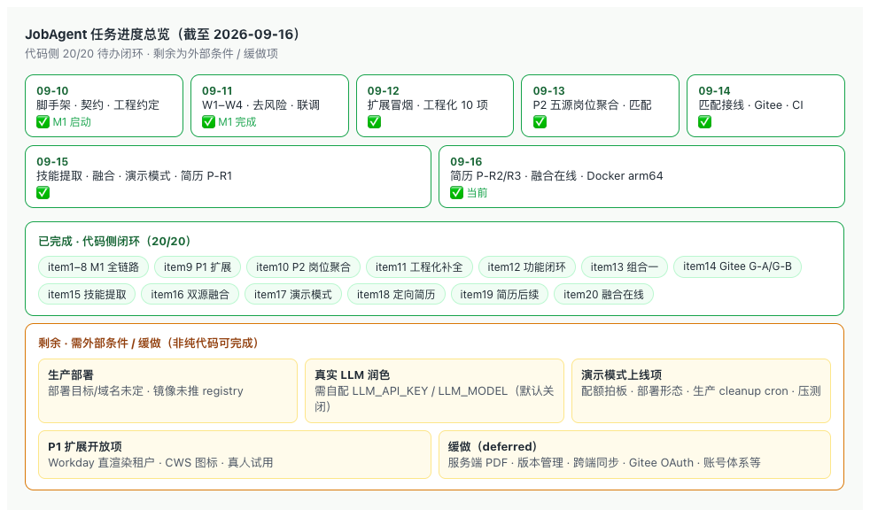

# Handoff

JobAgent 当前状态，截至 2026-09-20。

> 本文件只保留「项目当前状态 + 活跃任务 + 最近变更 + 文档索引」，是接手（人或 AI agent）的第一入口；**只写状态与结论，明细一律放进对应文档并在此给链接，不在本文件展开**。
> 设计/结论全文放 [docs/](docs/)；缓做事项放 [docs/deferred-items.md](docs/deferred-items.md)；场景化导航见 [docs/README.md](docs/README.md)。
> **归档惯例（对齐 agent-world，2026-09-18 起执行）**：①本文件只保留「项目当前状态 + 活跃任务 + 最近 5 条变更 + 文档索引」；②编号待办标 ✅ 后，详细过程（实现步骤 / commit 链 / 踩坑 / 验证数据）整块滚入 `docs/handoff-archive-YYYY-MM-DD.md`，本文件只留**一行结论 + commit hash**；③真正在推进 / 还在跑的活跃项保留详情。归档文件冻结只读、不再追加。

## Project documents

📚 **文档地图（按场景怎么读 + 状态约定）**：[docs/README.md](docs/README.md)。以下为全部文档直达（本区是完整清单的单一事实源，docs/README 只做场景导航、不重复清单）：

- [README.md](README.md) — 项目门面、技术栈、规划命令、铁律
- [AGENTS.md](AGENTS.md) — AI coding agent 工程约定单一事实源（CLAUDE.md 仅引用它）
- [CONTRIBUTING.md](CONTRIBUTING.md) — 本地开发 / 测试 / 提交 / PR 统一要求
- [MIGRATION_CONVENTION.md](MIGRATION_CONVENTION.md) — 数据库迁移命名/文件头/幂等/回滚规范
- [git-commit-message.md](git-commit-message.md) — 英文原子 Conventional Commits 规范
- [PULL_REQUEST_WORKFLOW.md](PULL_REQUEST_WORKFLOW.md) — 分支职责、PR 评审与合并流程
- [docs/产品构想-以GitHub为桥梁的招聘系统.md](docs/产品构想-以GitHub为桥梁的招聘系统.md) — 原始构想：定位、市场、B/C 双向闭环（历史）
- [docs/讨论记录-01-切入口与MVP收敛-20260910.md](docs/讨论记录-01-切入口与MVP收敛-20260910.md) — 切入口、护城河、L0–L4 分层、MVP 收敛过程（历史）
- [docs/讨论记录-02-投递功能与竞品分析-20260911.md](docs/讨论记录-02-投递功能与竞品分析-20260911.md) — 投递功能方向、Jobright 深度竞品分析、四种技术路径对比、职位聚合/Chrome 扩展可行性、3 项待拍板决策（历史）
- [docs/PRD.md](docs/PRD.md) — 产品范围、F1–F9、AbilityProfile/EvidenceItem 契约、指标、风险 ★
- [docs/技术选型-MVP-20260910.md](docs/技术选型-MVP-20260910.md) — 技术栈选型、运行架构、目录规划、M1 排期与 Spike ★
- [docs/技术栈总览-分层架构-20260916.md](docs/技术栈总览-分层架构-20260916.md) — 当前技术栈分层架构一页总览：客户端/服务/内核/采集/持久化五层、各包职责、横切事实与数据流（现行，与 AGENTS/README 同步）
- [docs/市场调研-AI求职赛道-20260910.md](docs/市场调研-AI求职赛道-20260910.md) — AI 求职赛道市场调研：市场格局、功能全景、代表性产品画像、信任风险与 P0/P1/P2 跟进建议（现行）
- [docs/市场调研-招聘市场痛点-20260916.md](docs/市场调研-招聘市场痛点-20260916.md) — 中国招聘市场双方痛点调研：企业端（寻源/筛选/造假/误聘）与求职者端（反馈缺失/定位模糊/竞争加剧）量化痛点、共同根源与对 JobAgent 的可信信号启示（现行）
- [docs/设计-痛点解决方案-20260916.md](docs/设计-痛点解决方案-20260916.md) — 12 项痛点→解决方案对位表 + 实施批次拆分：批次1 纯产品化（企业核验视图/面试准备包/落地页文案）、批次2 新接口（人才检索/筛选工作台/投递追踪）、批次3 外部条件；**批次 1 代码项 + 批次 2 已于 2026-09-16 落地（见 item21，落地页文案在独立仓未改、批次3 待外部条件）**（现行）
- [apps/extension/README.md](apps/extension/README.md) — P1 浏览器扩展试用指南：本地服务、开发者模式加载、Greenhouse/Lever 一键填充步骤与已知限制（现行）
- [docs/待拍板决策清单-20260910.md](docs/待拍板决策清单-20260910.md) — #1–#14；#1–#8 已拍板（#4 当日修订为海内外同步），#9–#14 延后 ★
- [docs/deferred-items.md](docs/deferred-items.md) — 缓做/低优事项登记表（挂起项 + 触发条件的单一事实源）
- [docs/handoff-archive-2026-09-19.md](docs/handoff-archive-2026-09-19.md) — handoff 历史归档（2026-09-19）：item28 账号授权主脊（GitHub OAuth 登录/会话/认领）明细 + item29 报告页登录认领前端接线与 CLI `auth cleanup` 明细（归档，只读不追加）
- [docs/handoff-archive-2026-09-18.md](docs/handoff-archive-2026-09-18.md) — handoff 历史归档（2026-09-18）：已完成编号待办 item 1–27 明细 + 2026-09-17 及更早最近变更 + 历史 Git 同步态（归档，只读不追加）
- [docs/design-i18n-20260910.md](docs/design-i18n-20260910.md) — i18n 设计：自研 `t()` + 中英 JSON 字典、key 对齐守护、分享链接语言固定、不翻译边界；§8 扩展落地（navigator 协商 + localStorage 覆盖 + MV3 `_locales`）（现行）
- [docs/design-tokens-20260910.md](docs/design-tokens-20260910.md) — 设计 token 设计：`--ja-*` 三层变量体系、组件禁 hex、与落地页 `--lui-*` 互不约束；§8 共享包 `packages/ui-tokens` + 扩展 Shadow DOM `:host` 接入（现行）
- [docs/design-storage-dual-dialect-20260911.md](docs/design-storage-dual-dialect-20260911.md) — 持久化层 SQLite/Postgres 双方言适配设计：统一 async 仓储接口、双 schema/双实现、对称迁移目录、createStorage 工厂（现行）
- [docs/API.md](docs/API.md) — HTTP API 接口文档：/auth/*（GitHub/Gitee OAuth 登录/会话/本人认领）、/analyze（含画像缓存）、/demo/*、/jobs、/profiles（含 exportable/job-recommendations/applications）、/candidates、/job-postings、/resumes/build、/internal/cron/*（形态 C serverless 定时端点）、/health 与错误码、形态 C `/api` 挂载前缀说明（现行）
- [docs/设计-职位聚合-Spike-20260913.md](docs/设计-职位聚合-Spike-20260913.md) — P2 职位聚合 Spike：8 数据源实测结论（RemoteOK/Remotive/GH/Lever 可用，YC/Wellfound 反爬暂缓）、最小链路设计与推荐组合、JobPosting 类型依据（现行）
- [docs/design-job-ingestion-20260913.md](docs/design-job-ingestion-20260913.md) — P2 职位聚合采集管道工程设计：job_postings 表迁移 005（双方言）、IJobPostingsRepository、packages/job-source 适配器+编排、CLI jobs sync 触发、分期 P2-A~D、测试与落代码清单（现行，可直接据此编码）
- [docs/design-match-wiring-20260914.md](docs/design-match-wiring-20260914.md) — 第一档·画像↔岗位匹配端到端接线设计：API 端点（GET /profiles/:id/job-recommendations + POST match 接受 profileId）、报告页推荐岗位 island、扩展侧栏匹配度面板、验收标准与缓做项（现行）
- [docs/design-gitee-source-spike-20260914.md](docs/design-gitee-source-spike-20260914.md) — Gitee 证据源 Spike：v5 仅 REST 无 GraphQL、匿名可读、L0 充分/L1 基本可行、与 GitHub 关键差异、未来 gitee-source 设计（现行，仅结论不实现）
- [docs/design-gitee-source-20260914.md](docs/design-gitee-source-20260914.md) — Gitee 第二证据源实现设计（G-A）：v5 REST 采集序列、→AnalyzerInput 十条映射规则、内核最小参数化、gitee-source 文件清单与测试、CLI --platform（现行，可直接据此编码；G-A CLI 闭环 + G-B 在线选源已随 item14 落地，2026-09-14~15）
- [docs/design-extension-match-ui-20260914.md](docs/design-extension-match-ui-20260914.md) — 扩展面板匹配 UI 设计：#10 可解释性后从 top1 轻量升级为 top5 完整展示，四态/匹配依据/证据外链/i18n/token（现行）
- [docs/design-extension-e2e-20260914.md](docs/design-extension-e2e-20260914.md) — 扩展浏览器级 E2E 设计：--headless=new 加载 unpacked MV3、独立 playwright.extension.config、route 拦截零网络、首批 5 用例与边界（现行）
- [docs/design-behavior-diversity-20260915.md](docs/design-behavior-diversity-20260915.md) — 方案 B 设计：双源 events 聚合源无关 BehaviorEventSummary、analyzer 保守弱信号 narrow_activity_scope（规则 0.1→0.2）、缺失降级矩阵、校准与原子提交规划（现行）
- [docs/design-skill-extraction-20260915.md](docs/design-skill-extraction-20260915.md) — B-4 技能标签精确提取：技术词典单一事实源、topics/描述/仓名/commit/PR 多信号、词边界防误匹配与别名归一、深度与置信度公式（现行）
- [docs/design-cross-source-fusion-20260915.md](docs/design-cross-source-fusion-20260915.md) — B-5 跨源镜像去重与最小双源融合：共享 commit oid 识别镜像、fuseInputs 纯函数逐字段融合规则、CLI --platform all；**§8 在线 API/Worker 多源融合（platform=all）2026-09-16 已落地（item20）；跨源 PR/issue 同帖去重、融合双源徽标（报告页/人才库）、扩展面板 all 入口 2026-09-17 已落地（item22）；FusionReport 随融合画像快照持久化 + 报告页去重统计 2026-09-17 已落地（item23）**；**all 融合作业配额权重（demo 扣 2）+ 跨源同帖去重 7 天窗锁定 2026-09-18 已落地（item27）**，Gitee OAuth 已随 item33 落地（2026-09-19，见 design-gitee-oauth）；剩余 Gitee 认证限频、跨源 L2 比对缓做（现行）
- [docs/design-demo-mode-20260915.md](docs/design-demo-mode-20260915.md) — 演示模式设计：anonymous/demo/user 三态 Principal、权限矩阵、会话+IP+Worker 三道配额闸、迁移 006–008 双方言、IDemoSessionsRepository、/demo/* 端点与 /analyze 配额改造、预置快照秒进、report/extension/cli 落地、5 项待拍板（现行，**步骤 1–9 已全部落地，见活跃待办 item17**）
- [docs/design-targeted-resume-20260915.md](docs/design-targeted-resume-20260915.md) — 岗位定向简历生成设计：画像范围硬约束（no-fabrication，每条挂 evidenceRefs）、新建纯函数包 packages/resume-core（rank 岗位定向排序 + buildResume 装配 + md/html 渲染）、shared ResumeDraft/LocalResumeFields 契约、P-R1 CLI→P-R2 API/报告页→P-R3 LLM 受约束润色分期、5 项待拍板（现行，**P-R1/P-R2/P-R3 可闭环子项已落地：shared 契约 + packages/resume-core（含 polish 安全层）+ packages/llm 端口/fake + CLI resume build/batch + API POST /resumes/build + 报告页 ResumeBuilder island + 扩展深链 CTA + **OpenAI 兼容 LLM client 与 API 可选 polish（默认关闭）**，见活跃待办 item18；**§10 五项 2026-09-16 已决策**：不持久化/只存本机/浏览器打印 PDF/LLM 默认关闭+OpenAI 兼容自配/语言手选；本地档案统一列 item19，版本管理入 deferred**）
- [docs/design-auth-gating-20260919.md](docs/design-auth-gating-20260919.md) — 账号收尾两刀设计：OAuth `return_to` 同源深链回跳（`sanitizeReturnTo` 白名单防开放重定向）+ 报告页授权分级闸（两档模型 / 可见性矩阵 / SSR `resolveViewer` / `GateCard` / interview-kit 401），含 JSON API 边界与落地记录（现行，handoff item31/32）
- [docs/design-gitee-oauth-20260919.md](docs/design-gitee-oauth-20260919.md) — Gitee 平台 OAuth 登录与本人画像认领设计：Gitee OAuth2 协议事实与相对 GitHub 三处差异、`GiteeAuthProvider`、平台无关 `registerOAuthFlow`、公开 `GET /auth/providers`、报告页 Gitee 登录入口与按画像主体平台的登录墙、零迁移/零 shared 契约改动、确定性测试与外部项（现行，handoff item33）
- [docs/deployment-runbook-20260920.md](docs/deployment-runbook-20260920.md) — 部署/上线 Runbook：**形态 C 已拍板并代码就绪（Cloudflare 管落地页+DNS；Vercel 单项目同域跑 Astro SSR 报告页与 `/api/*` Hono，Node runtime，region hnd1；Supabase Postgres；常驻 Worker→Vercel Cron 每分钟认领一个任务）**，含 Vercel 项目 6 步设置、Supabase 开库/5432 首次迁移、Pro 每分钟 cron 硬前提、OAuth `/api` 回调与 `API_MOUNT_PREFIX`、形态 A/B 备选、Docker、定时任务映射、10 项 smoke（现行；尚未真实部署，控制台操作待用户，handoff item35）

## 当前状态

- 阶段：**M1 核心开发 + 工程化补全完成，P1·Chrome 扩展真实环境冒烟通过（Greenhouse + Lever），进入扩展稳定期**。M1·W1~W4、W3-6 SQLite/Postgres 双方言、#8 去风险、端到端联调、真实性三轮校准均已完成。**2026-09-12 一次性完成 10 项工程化补全**（见活跃待办 item 11）：Playwright E2E 主链路（顺带修复两个 React island 缺 `client:load` 致浏览器内无交互的真实 bug）、Dockerfile/docker-compose、embedded-postgres 真实 PG 行为测试、pre-commit 卡死修复、画像缓存、CLI markdown/html 导出、docs/API.md、report i18n 测试补齐增强、waitlist CLI 只读子命令（`4474978`）。**真实性第三轮双向校准完成**：标注账号扩到 26 个（22 正 + 4 负），真实账号 0 误报为 suspicious、可疑账号 0 漏报为 likely_authentic，analyzer-core 32 测试。**P1·Chrome 扩展第 3 步真实环境冒烟完成（2026-09-12）**：真实 Greenhouse 岗位页跑通「按钮→面板→画像→一键填充」四环，first_name 真实写入，修复 4 个真实问题；同日 **Lever 真实岗位页零改动跑通（name+github 写入）**；**Workday 实测 4 家租户受限（外链官网/反爬/不直渲染），已加 shadow DOM 定位并登记限制**；**2026-09-13 扩展 summary→自定义问题映射完成（Greenhouse question_* 与 Lever questions[*]，共享 findLabeledQuestion，17 测试）**。**P2 职位聚合 Spike 完成（2026-09-13）**：JobPosting 类型落地 shared，8 数据源实测（RemoteOK/Remotive/Greenhouse/Lever/HN 可用，YC/Wellfound 反爬暂缓），结论见 docs/设计-职位聚合-Spike-20260913.md。**P2-A/B 采集管道编码完成（2026-09-13）**：双方言迁移 005 `job_postings` + storage 岗位仓储 + 新包 `packages/job-source`（RemoteOK/Remotive/Greenhouse/Lever 四适配器 + 归一化 + 编排）+ CLI `jobs sync/search/stats`；真实四源首次入库 2044、二次 sync 全量 unchanged 幂等，全仓三件套全绿（明细见活跃待办 item 10）。全仓 typecheck/test/build 三件套全绿（明细见活跃待办 item 10）。**P2-C/D 完成（2026-09-13）**：HN「Who is hiring」月度自由文本适配器（真实 2026-09 帖 260 条评论→240 入库/20 跳过、二次 sync 全量 unchanged 幂等）+ 纯函数 matchJobs 技能匹配 + API 四个 /job-postings 端点 + CLI jobs match，本批 5 个功能原子提交均已 push。**2026-09-13 收尾 P2 两项遗留**：Lever 种子从 alluxio 1 家实测扩到 9 家（1589 真实岗位离线 ingest 验证）、HN 月度 cron 配置写入设计 §7.3（顺带补 cli `start` 脚本让文档命令可跑），明细见最近变更。**P2 采集出站代理落地（2026-09-13）**：job-source http-client 真正消费 JOB_HTTP_PROXY（undici ProxyAgent + 同实例 fetch；CLI 回退 HTTPS_PROXY/HTTP_PROXY），本机经代理实测 Lever 九家全入库 1588（含此前直连超时的 Shield AI 472/Palantir 311），3 个原子提交已 push。**2026-09-14 功能路线盘点（见活跃待办 item 12，⏳ 待拍板未启动）**：P2 岗位库 / 匹配引擎已就位但缺“画像→岗位”用户入口，首推画像↔岗位匹配端到端接线（API profileId 匹配 / 报告页推荐区块 / 扩展匹配度面板），并行候选 #12 Gitee（触发条件已到）。**第一档·画像↔岗位匹配端到端接线已完成（2026-09-14，已 push 并经 PR #23 并入 main）**：①API 接线（`e16589b`）——新增 `GET /profiles/:id/job-recommendations`（从画像快照取 skillTags 调 matchJobs 打分排序，query 过滤 remote/sources/salary_min/limit/candidate_limit）+ `POST /job-postings/match` 接受可选 profileId（优先于显式 skills），9 个新集成测试，api 共 35 测试全绿；②报告页推荐岗位 island——新增 `JobRecommendations.tsx`（loading/error/empty/list 四态，匹配分三档色，命中技能 chip，岗位链接跳 sourceUrl），插入能力标签区块后，8 个 i18n key 中英同构（report 22 测试含 key 对齐守护），全用 `--ja-*` token 无硬编码 hex；③扩展侧栏匹配度——画像加载后自动调 `POST /job-postings/match` 传 profileId，展示 top 1 匹配分/命中技能/岗位@公司/技能命中计数，四态渲染不阻塞一键填充，新增 `matchJobs()` API 客户端 helper + 3 单测，扩展共 20 测试全绿。设计文档 `docs/design-match-wiring-20260914.md`。全仓 typecheck/test/build 全绿。缓做：缺失技能精确提取、LLM 匹配理由、向量召回、当前 ATS 岗精确匹配（第一档用岗位库 top 匹配轻量版）。**#12 Gitee 第二证据源 G-A 已落地（2026-09-14）**：新增 `packages/gitee-source`（v5 REST-only）+ shared/analyzer 多平台参数化 + CLI `--platform` 命令行闭环，复用 analyzer 内核、信号规则零改动，详见活跃待办 item 14。**2026-09-15 方案 B（行为多样性）落地**：GitHub/Gitee 双源把 public events 聚合成源无关 `BehaviorEventSummary`（跨仓广度/事件类型分布）随 `AnalyzerInput` 传入，analyzer-core 新增保守弱信号 `narrow_activity_scope`（恒 warn、不升 risk；外部 merged PR、events 多仓或协作事件反向豁免），**规则版本 RULE_VERSION 0.1→0.2**（analyzerVersion=0.1-0.2，旧信号保留 r0.1 前缀、新信号 r0.2）；analyzer 41 / gitee-source 40 / github-source 24 单测全绿，全仓 typecheck+test+build+迁移校验通过，双源（GitHub 26 + Gitee 9）真实回归已完成、零误伤闭环（见 item14）。

**工程 / 分发下一步**：真实用户装扩展试用（CRX/unpacked 先行已建议）；生产部署时按设计 §7.3 挂日更 / 月度定时任务。**2026-09-14 扩展补齐 i18n 与设计 token**：报告页 W4 早已落地（22 i18n 测试、`--ja-*` token），本次补齐第二个前端 apps/extension——token 单一事实源上移新包 `packages/ui-tokens`（`:root,:host` 双选择器，report re-export、扩展 Shadow DOM 内加载），扩展面板全量 `t()` 中英双语（navigator 协商 + localStorage 覆盖 + 面板切换器）、MV3 manifest 走原生 `_locales/{en,zh_CN}`、panel.css 零颜色字面量（守护测试），扩展测试 17→42，全仓三件套全绿，明细见最近变更。
- **2026-09-14 工程化补全·组合一（4 个原子提交，已 push、CI 全绿并经 PR #24 并入 main）**：①CI 补 Playwright E2E（装 Chromium + `pnpm e2e`）与 Docker build smoke（api/report 两个 target，worker 与 api 共用 node-runtime 层）；②修 Dockerfile deps 阶段漏 COPY `packages/job-source`/`packages/ui-tokens`/`apps/extension` 的 package.json——P2、ui-tokens 抽包后镜像内 `pnpm install --frozen-lockfile` 必失败的真实隐患；③新增报告页推荐岗位 island E2E 4 用例（列表/空/错误/中文，page.route mock 接口），全量 E2E 10→14 全绿，并给 report dev server 加 `--no-toolbar`（Astro Dev Toolbar 的 island inspector 在 shadow DOM 里 pretty-print 各 island props、含全部 i18n 文案，会让全局文本定位误匹配，已实测定位）；④docs/API.md 补 `GET /profiles/:id/job-recommendations` 与 `POST /job-postings/match` 的 profileId 二选一（skills/profileId 二选一、profileId 优先，原职位聚合节顺延 §3.3）。全仓 typecheck/test/build 全绿。
- **2026-09-14 #10 匹配可解释性贯穿四层 + Gitee 证据源 Spike + CI actions 升 Node24（6 个功能原子提交，已 push、CI 全绿）**：①可解释匹配——matchJobs 拆出 title/tags/description 三项 fieldScores（权重 3/2/1、和=总分）与逐技能 skillHits（保留 matchedSkills 向后兼容），API 为 profileId 推荐挂逐技能 skillReasons（命中字段/depth/confidence）与去重 evidence 字典、每个命中可回溯画像证据，报告页增可展开「匹配依据」（分数分解+证据外链、旧响应健壮回退）与 4 个中英 key，扩展补类型/透传（面板匹配 UI 仍为第一档遗留待办）；E2E 全量 15。②Gitee Spike 仅出文档不实现（design-gitee-source-spike-20260914）：v5 REST-only、L0 充分/L1 基本可行、内核不改、实现仍缓做（deferred #12 更新触发条件）。③CI 四 action 升 node24 大版本清 Node20 deprecation，待 push 后 CI 验证。全仓 typecheck/单测/build/check-migrations/E2E 全绿。
- 仓库：https://github.com/bayernjf/job-agent （public）；长期分支 `main`、`dev`；脚手架、CI 修复（`e7730fe`）、调研文档、PRD v0.2/双市场与 M1·W1 持久化层（`73f5172`/`86f6d86`/`946c25c`/`2cb8842`）均已 push 至 `origin/dev`，本地与远端一致。
- 落地页已上线：https://job-agent.bayjf.com （仓库 `bayernjf/job-agent-landing`，Cloudflare Pages，详见其 handoff）。
- 待办：活跃待办 item 1–16 全部 ✅ 完成；**item 17 演示模式代码（步骤 1–9）已全部落地，仅剩需外部条件的拍板/部署/真人项（见 item17 与已知限制）**；**item 18 岗位定向简历 P-R1/P-R2/P-R3 可纯代码闭环子项已全部落地（2026-09-16）：含 OpenAI 兼容 LLM client + env 工厂 + API 可选 `polish`（默认关闭、失败回退），设计 §10 五项已拍板（不持久化/只存本机/浏览器打印 PDF/LLM 默认关闭+OpenAI 兼容自配/语言手选）**。**item 19 进度（已全部完成，2026-09-16）**：②报告页「AI 润色」开关 UI 已完成并 push（`a6b7487`/`c3a97ee`，中英 i18n + token 样式 + 2 E2E + 真实浏览器中英回退复验）；①**本地档案 canonical 统一已落地（本批，见 item19 ①）**——shared 单一 `LocalProfileFields` 契约 + 两投影/旧键迁移纯函数（23 单测），报告页与扩展都改用 `jobagent.localProfile`、各自本域一次性迁移旧键，报告页表单 period 拆为结构化 start/end，两套 E2E 16/16 + 真实浏览器迁移/投影复验通过。**item19 关闭**；**item20 在线多源融合画像（platform=all）已落地（2026-09-16，代码/单测/E2E 全绿，已 push）**——报告首页第三平台选项一次作业双采 GitHub+Gitee、镜像去重产出融合画像，零迁移/零契约改动，Gitee 404 正常降级、瞬时错误上抛重试，顺带修复选中态未定义 token 的真实 UI bug，详见 item20；~~仅剩跨端自动同步（需账号体系或 `chrome.storage` 通道，缓做见 deferred）~~ **跨端自动同步已落地（item24，2026-09-17，经 PR #55 并入 main）**。**item21–item25 全部落地并已入 `main`**：item21 招聘痛点批次 1+2、item22/23 跨源融合收尾与 FusionReport 持久化（PR #54，merge `188cff7`）、item24 本地档案跨端自动同步与 item25 `self_pr_ratio` 规则强化（RULE_VERSION 0.2→0.3，PR #55，merge `1ca0f7e`）。其余为外部/缓做项：真实启用 LLM 需用户自配 `LLM_*` env（厂商/费用用户定）、服务端 PDF、简历版本管理（随持久化，见 deferred）。**item26 规则 0.3 真实双源回归复核已完成（2026-09-18，见 item26 与最近变更）：holilayet 回归 mixed_signals、22 正样本 0 误报、双源 narrow 零触发，0.3 零误伤、无需微调内核，活跃待办 item1–26 全部关闭。** **item27（2026-09-18）换 Windows 设备全量复核全绿 + all 融合作业 demo 配额按权重扣 2（env DEMO_FUSION_QUOTA_COST，整单拒绝不部分扣）+ 跨源同帖去重 7 天窗锁定（CROSS_SOURCE_THREAD_WINDOW_MS，`<=` 边界测试钉契约），活跃待办 item1–27 全部关闭。** 其余待推进项均卡在外部条件或拍板（部署形态/生产域名、demo 其余配额数值与 TTL、账号体系方向、LLM 厂商、#14 合规），见「已知限制」与 docs/deferred-items.md。**2026-09-18 macOS 跨设备健康巡检在权威 Node 24 下全绿（666 单测 / 报告 E2E 37 / 扩展 E2E 9 / 迁移 0 warning），并复核关闭 GitHub App 额度 V1 待核实项，零代码改动（见最近变更首条）。** **item28 本人授权主脊（GitHub OAuth 登录 + accounts/auth_sessions 迁移 010/011 + 本人认领 claim，决策 #1-A/#6-A）代码/测试/文档已全部落地（2026-09-18，6 个本地英文原子提交已 push，含 `9a48761` docs(handoff)）：登录用户可触发分析且不占 demo 配额、认领本人画像，AuthMe 不外发 email；全仓 typecheck/test（含真实 embedded PG 7/7）/build、check-migrations 11 对全绿。剩余真实 OAuth 凭证（外部）与授权分级闸（下一刀，范围待讨论）见 item28 与已知限制。** **item29 账号主脊前端接线 + 认证数据运维清理已落地（2026-09-19，4 个本地英文原子提交已 push：`d88328a` db → `c6492ab` cli → `a914500` report → `e298559` docs）**：报告站点全局头部 AccountMenu（GitHub 登录/登录态/退出）+ 报告页本人 ClaimProfile 认领 CTA/已验证徽章（claimed 走 SSR 无 JS），中英 i18n + token 样式 + 6 个零网络 E2E；CLI `jobagent auth cleanup`（清过期/撤销会话与无活会话的未认领账号，默认 24h/30d）+ storage 双方言 purgeExpired/deleteUnclaimed + 确定性单测；扩展评估为不适用（content script 只读、OAuth/HttpOnly cookie 不适用，panel 已有 claimedBadge），不改扩展码。全仓 712 单测 + 报告 E2E 43/43 全绿，并经内置浏览器真实复验匿名登录入口。明细归档 item29。** **item30 真实 GitHub OAuth 登录本地端到端打通（2026-09-19，3 个代码提交已 push `24a1908`/`9191a25`/`d559735` docs）**：建本地 OAuth App（凭证入 gitignored `.env`），修服务端换 token 不走代理（新增 proxy-bootstrap 启动装 undici 全局 ProxyAgent）与本地跨端口不带会话 cookie（认证 island 改 `credentials:'include'`）两处根因；真实浏览器完成 GitHub 登录、退出、本人「认领此画像」并核验 DB 落库，api 111 测试 + account-auth E2E 6/6 全绿。生产凭证/域名、授权分级闸等仍为外部项（见 item30 与已知限制）。** **item31/32（2026-09-19）账号收尾两刀已落地（3 个代码提交已 push `ba21d04`/`4600a87`/`9d15a29` docs）**：OAuth `return_to` 同源深链回跳（白名单防开放重定向）+ 报告页授权分级闸（未登录折叠招聘方证据外链/面试题、面试包 401，登录 user 全见；结论/技能/匹配/简历/投递与匹配理由证据仍公开），JSON API 字段级裁剪缓做；设计与可见性矩阵见 [docs/design-auth-gating-20260919.md](docs/design-auth-gating-20260919.md)。

## 活跃待办（下一步）

> 启动前决策 #1–#8 已于 2026-09-10 拍板。**item 1–36 代码可闭环子项全部 ✅（2026-09-20）**。item28–36 均已由用户 push（`origin/dev` = `e8b40b1`，含 item35 形态 C 全部与 item36）。**item35（形态 C 生产部署代码就绪，已 push）**：常驻 Worker 轮询→Vercel Cron 单任务端点、报告页+API Vercel 单项目同域 `/api`、Supabase PgBouncer 连接与 `DB_AUTO_MIGRATE`、`API_MOUNT_PREFIX=/api` 修复同域 OAuth 回调、vercel.json 与生产 env 占位、Runbook 形态 C 全文。**item36（2026-09-20，岗位同步 Actions workflow + 形态 C API 文档，2 个英文原子提交已 push：`ca18b98` → `e8b40b1`）**：岗位日更/HN 月更 GitHub Actions workflow 落地（需配 Actions secret `DATABASE_URL`）、docs/API.md 补内部 cron 端点与形态 C 路径/env 说明。**代码就绪但尚未真实部署**——Supabase 建库、Vercel 项目（Pro 是每分钟 cron 硬前提）、生产域名/DNS、生产 OAuth App、随机密钥均为外部项（见 item35/36 与 Runbook §11）。item28/item29 详细过程已归档至 [docs/handoff-archive-2026-09-19.md](docs/handoff-archive-2026-09-19.md)（冻结只读），更早 item 1–27 见 [docs/handoff-archive-2026-09-18.md](docs/handoff-archive-2026-09-18.md)，本区只留一行结论索引：

1. ✅ **M1·W1 持久化层 + 首个迁移**（2026-09-11）
2. ✅ **M1·W2 github-source + analyzer-core + cli**（2026-09-11）
3. ✅ **#8 去风险 S1/S2 spike**（2026-09-11）
4. ✅ **修复 spike 暴露 3 个 bug + 回归**（`b77ec11`，2026-09-11）
5. ✅ **#8 重新批量验证 + 真实性三轮双向校准**（26 账号：22 正 0 误报 + 4 负 0 漏报，2026-09-11~12，`46e8157`/`13e4f5e`/`70505c5`）
6. ✅ **M1·W3 服务化**（W3-1~W3-6，四表+仓储+worker+api+双方言，2026-09-11，`07e0fd9`…`e204798`）
7. ✅ **M1·W4 报告与分享**（W4-1~W4-6，Astro 7 SSR + i18n + token + 只读分享 + 落地页接线，2026-09-11）
8. ✅ **端到端联调**（api+worker+report 三服务主链路，2026-09-11）
9. ✅ **P1·Chrome 扩展一键填充**（第 1–3 步 + Lever 零改动跑通 + Workday 受限登记；summary→自定义问题映射；i18n+设计 token，2026-09-11~14，`975e367`/`ed69003`/`d959c83`/`54b513e`/`3e74f40`/`c5f8006`/`0b342a4`）——剩余外部项（真实用户装扩展试用、分发策略 CRX 先行已采纳、Workday 直渲染租户端到端）见「已知限制」
10. ✅ **P2·职位聚合**（JobPosting 契约 + Spike + 采集管道 + 五源入库 2044/1588 + matchJobs 匹配 + 四 API 端点 + 出站代理，2026-09-13，`2a9c9b4`/`631deb0`/`ca431a9`/`52e8d7d`）
11. ✅ **工程化补全 10 项**（Playwright E2E/Docker/真实 PG/pre-commit 卡死修复/画像缓存/CLI 导出/API 文档/waitlist CLI/i18n 测试，2026-09-12，`4474978`）
12. ✅ **P2 之后功能闭环路线**（第一档画像↔岗位匹配端到端接线 PR #23；第二档 #10 可解释性 + 扩展匹配 UI + 分档统一 + Gitee G-A/B；第三档继续缓做，2026-09-14，`e16589b`）
13. ✅ **工程化补全·组合一**（Dockerfile 漏 COPY 修复 + CI 补 E2E/Docker smoke + 推荐岗位 E2E + API 文档，PR #24；Docker arm64 运行时实跑 + PG 并发首迁移修复 `141ee9a`，2026-09-14~16）
14. ✅ **#12 Gitee 第二证据源**（G-A CLI 闭环 + G-B 在线选源 + events 方案 A + 行为多样性方案 B 规则 0.1→0.2，2026-09-14~15）
15. ✅ **B-4 技能标签精确提取**（技术词典 + 多信号 + 词边界，`e1ffd81`，2026-09-15）
16. ✅ **B-5 跨源镜像去重 + 最小双源融合**（`fuseInputs` 纯函数 + CLI `--platform all`，`b69372b`/`ce6e6ae`/`894b540`，2026-09-15）
17. ✅ **演示模式 Demo Mode**（三态身份 + 三道配额闸 + 迁移 006–008 + 九步落地，2026-09-15，`e391389`…`29bb399`）——剩余外部项（配额数值/TTL、部署形态、生产 cleanup cron、真人试用）见「已知限制」
18. ✅ **岗位定向简历生成**（P-R1 规则版 + P-R2 在线消费 + P-R3 可闭环子项含 OpenAI 兼容 LLM 润色默认关闭；§10 五项已拍板，2026-09-15~16）——真实 LLM 需自配 `LLM_*`、服务端 PDF/版本管理缓做
19. ✅ **简历后续两项**（报告页 AI 润色开关 + 本地档案 canonical 统一，2026-09-16，`a6b7487`/`c3a97ee`/`760c349`/`9037c5d`/`353cfb5`）
20. ✅ **在线多源融合画像 platform=all**（Worker/API/报告首页接线 + 缓存平台隔离 + UI bug 修复，2026-09-16）
21. ✅ **招聘痛点解决方案·批次 1+2**（核验视图/面试准备包/人才检索/筛选工作台/投递追踪，9 提交顶部 `d713f65`，2026-09-16）
22. ✅ **跨源融合收尾三项**（PR/issue 同帖去重 + 扩展 all 第三键 + 双源徽标，PR #54，2026-09-17，`62a9b71`/`c223832`/`98ab90e`）
23. ✅ **FusionReport 持久化 + 报告页去重统计**（PR #54，2026-09-17，`4d13405`…`415bdde`）
24. ✅ **本地档案跨端自动同步**（chrome.storage + externally_connectable，PR #55，2026-09-17，`194a490`/`9bf1f95`/`984813a`）——生产域名未定，externally_connectable 白名单含占位
25. ✅ **self_pr_ratio 判定强化 + 规则 0.2→0.3**（PR #55，2026-09-17，`be07ab6`/`fe47f68`）
26. ✅ **规则 0.3 真实双源回归复核**（GitHub 26/26 + Gitee 9 成功零误伤，holilayet 回归 mixed，2026-09-18）
27. ✅ **换 Windows 设备全量复核 + all 融合作业 demo 配额权重扣 2 + 跨源同帖去重 7 天窗锁定**（2026-09-18，`CROSS_SOURCE_THREAD_WINDOW_MS` 导出锁定、`DEMO_FUSION_QUOTA_COST` 可配）
28. ✅ **本人授权主脊：GitHub OAuth 登录 + accounts/auth_sessions + 本人认领（决策 #1-A/#6-A，2026-09-18，6 个本地原子提交已 push：`53072c3` shared → `5ff8c9c` db 010/011 → `0cc4fa3` storage → `5dfa0b3` api → `0f4ce17` env/API 文档 → `9a48761` docs(handoff)）**——shared 扩 user Principal（accountId/sessionId/platform/login/expiresAt）+ AuthMe/ClaimResult 契约 + AUTH 错误码；双方言迁移 010 accounts、011 auth_sessions（check-migrations 11 对 0 warning）；storage 两实体/两仓储（upsertFromProvider/getByProvider/setClaimedProfile、create/getActive/touch/revoke）+ profiles `markClaimed`，双方言装配；api 新增 auth-config/auth-provider 端口/github-auth（web flow + HMAC state）/fake-auth + `resolveAuthPrincipal`（user 优先于 demo/匿名），5 端点 `GET /auth/github/login`·`GET /auth/github/callback`·`POST /auth/logout`·`GET /auth/me`·`POST /profiles/:id/claim`，登录用户 `/analyze` 直接建 `requesterKind=user` 任务、不占 demo 配额（worker 仅闸 demo、user 走 formal 优先，已复核无需改 worker）；AuthMe 刻意不返回 email/providerAccountId。测试：shared auth-account 9、storage accounts-auth-sessions 9（+parity/migrations/PG-behavior 同步，PG 真实 embedded 7/7）、api auth 9 + auth-flow 8（api 106 全绿）；全仓 typecheck/test/build 全绿。**剩余（外部/下一刀，代码无法自决）**：①真实 GitHub OAuth App `GITHUB_OAUTH_CLIENT_ID/SECRET`、生产 `AUTH_STATE_SECRET`、`AUTH_CALLBACK_BASE_URL`/域名（测试用 FakeAuthProvider 不阻塞，真实联调再填 .env）；②**授权分级闸**——未授权浏览他人画像折叠哪些重模块，范围需与用户讨论后做下一刀；③Gitee 登录（OAuth）随双源节奏后续；④~~会话清理 cron 的可执行本体~~ **CLI `auth cleanup` 本体已于 item29 落地**，生产 cron 调度仍随部署；⑤~~登录/认领前端入口~~ **报告站点登录/认领前端已于 item29 落地**（扩展不加该入口，理由见 item29）。
29. ✅ **账号主脊前端接线 + 认证数据运维清理（2026-09-19，4 个本地英文原子提交已 push：`d88328a` feat(db) → `c6492ab` feat(cli) → `a914500` feat(report) → `e298559` docs(handoff)；明细归档 [handoff-archive-2026-09-19](docs/handoff-archive-2026-09-19.md) §2）**——①报告站点全局头部 `AccountMenu` island（匿名/演示显「用 GitHub 登录」整页跳 `/auth/github/login`、user 显头像+登录名+退出 POST /auth/logout、拉取失败 fail-closed 不渲染）；②报告页 `ClaimProfile` island（仅登录且 platform+login 与画像主体一致显「认领此画像」→ POST claim → 本地切「本人已验证」徽章；claimedProfileId 命中也显徽章；claimed=true 走 SSR 徽章无 JS；匿名/非本人/401/403 不渲染，**不做授权分级折叠**）；③中英 i18n 各 8 key + `--ja-*` token 样式；④CLI `jobagent auth cleanup [--retain-hours 24] [--account-retain-hours 720]` + storage 双方言 `authSessions.purgeExpired` / `accounts.deleteUnclaimed`（NOT EXISTS 活会话保护，sqlite changes / pg returning 计数），默认会话留 24h、未认领账号留 30d，cron 调度随部署；⑤扩展评估=不适用不改码（content script 只读第三方 ATS 域、OAuth/HttpOnly cookie 不适用，panel 已有 claimedBadge）。验证：全仓 typecheck/test（**712 单测**）/build 全 Done、check-migrations 11 对 0 warning、报告 E2E **43/43**（新增 account-auth 6）、内置浏览器真实复验匿名登录入口。**剩余外部/下一刀**：真实 OAuth 凭证与回调域名、授权分级闸范围、OAuth return_to 深链回跳（均记 deferred）、Gitee OAuth、生产 cleanup cron。
30. ✅ **真实 GitHub OAuth 登录本地端到端打通（2026-09-19，3 个代码原子提交已 push：`24a1908` feat(api) 出站代理 → `9191a25` fix(report) 跨端口 cookie → `d559735` docs(handoff)；凭证只在 gitignored `.env`）**——把 item28/29 的认证从「FakeAuthProvider、`/auth/github/login` 返回 501」变为本地真实可用。①在用户 GitHub 账号下建 OAuth App「JobAgent (local dev)」（App id 3868123，仅注册 localhost 回调 `http://localhost:3000/auth/github/callback`，scope `user:email`），client id/secret/state secret/callback/CORS 写入 gitignored `.env`（**不入 Git、不回显 secret**）。②修两个真实根因：**服务端代理**——Node 全局 fetch（undici）默认不读 `HTTP(S)_PROXY` env，本机直连 github.com 不通致回调 `502 AUTH_EXCHANGE_FAILED`；新增 `apps/api/src/proxy-bootstrap.ts`（启动时按 `JOB_HTTP_PROXY→HTTPS_PROXY→HTTP_PROXY`（含小写）安装全局 `ProxyAgent`，trim/空白视为未设、未设则直连行为不变）+ 5 单测，接线进 `index.ts main()`（有代理打印 `[api] outbound proxy enabled`），apps/api 显式依赖 `undici`，`.env.example` 补 OAuth 也走该代理的说明。**跨端口 cookie**——本地 report(4321)→API(3000)，`credentials:'same-origin'` 不携带 HttpOnly `jobagent_session`，致 /auth/me 与 claim 恒匿名；`AccountMenu.tsx`/`ClaimProfile.tsx` 改 `credentials:'include'`（同源部署等价 same-origin，API 已对命中 Origin 回 `credentials`）。③真实链路（内置浏览器）：走 `/auth/github/login` 授权回调成功、头部显「bay / 退出登录」；用户真人点「认领此画像」claim 返回 ok、显「本人已验证」徽章，SQLite 只读核验 accounts（github/bayernjf，claimed_profile_id 指向本人画像）、profiles.subject_claimed=1、auth_sessions 1 行均落库。验证（Node v24.0.0）：全仓 typecheck 全 Done、apps/api **111** 测试全过（新增 proxy-bootstrap 5）、check-migrations 11 对 0 warning、report build 通过、account-auth Playwright E2E **6/6**。**剩余外部/下一刀（代码无法自决）**：生产 OAuth 凭证 + 生产域名/回调、生产固定 `AUTH_STATE_SECRET`、部署形态（定后配 `CORS_ALLOW_ORIGINS`/`TRUST_PROXY`/`AUTH_CALLBACK_BASE_URL`/扩展白名单）、授权分级闸折叠范围、OAuth 登录后 `return_to` 深链回跳（同源 allow-list）、Gitee OAuth、auth/demo cleanup 生产 cron、真实 LLM key。
31. ✅ **OAuth 登录后 `return_to` 深链回跳（2026-09-19，`ba21d04` feat(api) → `9d15a29` docs(auth)，已 push）**——纯函数 `sanitizeReturnTo` 同源相对路径白名单（单 `/` 开头、拦协议相对 `//`/`/\`、绝对 URL/scheme、控制字符、超长 2048、回 `/auth/`，防开放重定向），经短期 HttpOnly Cookie `jobagent_oauth_return` 流转（不进 GitHub state、不落日志），callback 二次校验后 302 回深链、用完即删，非法/缺失回退 `AUTH_AFTER_LOGIN_URL`；8 纯函数 + 3 端点测试。设计见 [design-auth-gating](docs/design-auth-gating-20260919.md)。
32. ✅ **报告页授权分级闸（2026-09-19，`4600a87` feat(report)，已 push）**——两档模型：未登录（anonymous/demo）看公开门面（结论/技能/匹配/简历/投递/匹配理由证据公开），登录 user（含招聘方）解锁招聘方三视图原始证据外链、面试题、面试准备包；SSR `resolveViewer`（只读 storage、坏/过期会话降级匿名、只读不 touch）+ 纯 SSR `GateCard` 登录墙（证据墙/面试题墙带 `{count}` 与 return_to）+ `interview-kit.md` 端点未登录 401 + AccountMenu 登录链接带当前页深链，5 组中英 i18n key（236/236 对齐）；新增 report auth 5 单测 + `gated-content.spec.ts` E2E 6 例，并把 recruiter-features/account-auth/report-render 三处受影响断言改为登录态/登录墙。**JSON API（`/profiles/:id`、`exportable`）字段级裁剪明确缓做**（exportable 无证据 URL/面试题、扩展一键填充依赖其公开；触发条件＝公开分享后 API 被批量抓取/搬运滥用，已记 deferred）。设计与可见性矩阵见 [design-auth-gating](docs/design-auth-gating-20260919.md)。
33. ✅ **Gitee 平台 OAuth 登录与本人画像认领（决策 #4 海内外同步，2026-09-19，3 个英文原子提交已 push：`694d6da` feat(api) → `04b15fd` feat(report) → `9e9be65` docs(auth)；明细见 [design-gitee-oauth-20260919](docs/design-gitee-oauth-20260919.md)）**——对称复用 GitHub OAuth 主脊新增第二个 `AuthProvider`，让纯 Gitee 用户能登录并认领本人 Gitee 画像。①api（`694d6da`）：新增 `GiteeAuthProvider`（gitee.com 授权码流程，三处协议差异——授权页必带 `response_type=code`、换 token 表单必带 `grant_type=authorization_code`、取用户走 `?access_token=` query 而非 `Authorization: Bearer`）；抽平台无关 HMAC state 到 `oauth-state.ts`、login/callback 抽成 `registerOAuthFlow` 闭包对 github/gitee 各注册一次，临时 state/return Cookie `Path` 由 `/auth/github` 泛化为 `/auth`（否则 Gitee 回调读不到 state）；新增公开只读 `GET /auth/providers`（只回 configured 布尔、不泄凭证）；`auth-config` 读 `GITEE_OAUTH_CLIENT_ID/SECRET`（未配则该平台 501）；`FakeAuthProvider` 第三参注入平台；`.env.example` 加 Gitee 段。②report（`04b15fd`）：AccountMenu 并行拉 `/auth/me`+`/auth/providers` 按配置动态渲染 GitHub/Gitee 入口（拉取失败保守回退仅 GitHub），登录墙 GateCard 按画像 `subject.platform` 选登录目标与文案，中英各加 4 个 i18n key；account-auth E2E 加双配置/仅 Gitee 两用例并修正一处既有失配断言（`.account-menu__identity`）。**零迁移、零 shared 契约改动**（PlatformSchema/accounts.platform 本就预留 gitee，claim 已按 platform+login 比对、跨平台认领 403）。验证（Node v24.0.0）：api **138** 测试（gitee-auth 8、auth-flow 18 含 Gitee 登录/本人认领/跨平台 403、providers 三态、auth 10）、report **33**、全仓 typecheck/build 全 Done、check-migrations 11 对 0 warning、account-auth+gated-content E2E **14/14**、`git diff --check` 干净。**剩余外部项**：真实 Gitee OAuth App（Gitee→设置→第三方应用，回调 `/auth/gitee/callback`、scope `user_info`）凭证只入 gitignored `.env`，生产域名/`AUTH_STATE_SECRET`/CORS 与 GitHub 共用，真实 Gitee 首次冒烟（现有测试全 fake/mock）；~~GateCard 的 Gitee SSR 分支无独立 E2E（平台比对由后端集成测试覆盖，边界见设计 §8）~~ **该 Gitee SSR 登录墙分支已于 item34 补齐独立 E2E（2026-09-20）**。
34. ✅ **部署加固批次（2026-09-20，本地英文原子提交已 push）**——主线 item1–33 已全部 push（`origin/dev`=`9e9be65`），本批清掉三个"文档滞后 / 自报覆盖边界 / 上线准备"项，**零迁移、零产品代码改动（仅 E2E + 文档）**：①**GateCard Gitee SSR 登录墙补 E2E**（`test(report)`）——e2e fixture 新增 Gitee 主体画像（`subject.platform='gitee'`、新 id/login，global-setup 以 `subjectPlatform:'gitee'` seed），`gated-content.spec.ts` 新增用例断言 Gitee 画像匿名访问时 interview-gate 登录按钮指向 `/auth/gitee/login?return_to=`、文案含 Gitee、题目折叠（gated-content 6→7）；新增 Gitee fixture 同时让人才库 SSR 候选人卡 2→3，`recruiter-features.spec.ts` 候选人页用例同步改为断言 3 张卡并核验纯 Gitee 卡（裸显平台 gitee、核验链接指向 Gitee profileId）；全量报告 E2E **52/52 全绿**，关闭 design-gitee-oauth §8 自报覆盖边界。②**部署/上线 Runbook**（新增 [docs/deployment-runbook-20260920.md](docs/deployment-runbook-20260920.md)）——组件与自动迁移事实（非只读启动 autoMigrate、PG advisory lock）、上线前 12 项准备/拍板清单、生产 env 表（权威仍为 `.env.example`）、形态 A 同域反代（推荐）/B 跨子域（**显式标注 report SSR 服务端取数基址与浏览器同源基址冲突、列为 staging 必验，不写成既定配方**）、Docker 步骤 + prod override 样例片段、jobs/demo/auth 四类 cron（容器内 `node apps/cli/dist/index.js`）、OAuth 生产配置、安全、8 项上线 smoke；已验证（docker 双栈 arm64/amd64）/未验证（生产反代拓扑）边界写在文首。③**README/docs 导航**——README「开发」加"本地配置与登录（可选）"（采集 token、GitHub/Gitee OAuth 回调与 scope、跨端口 `credentials:'include'`、`JOB_HTTP_PROXY`、指引链接）+ 文档导航行；docs/README 加部署场景入口。**剩余外部项不变**：真实 Gitee OAuth 应用与首次冒烟、生产域名/形态/凭证、report SSR 反代基址 staging 实测、demo 配额数值、LLM 厂商、cleanup cron 上线调度、#14 合规。
35. ✅ **形态 C 生产部署代码就绪：Vercel 单项目同域 + Supabase + Vercel Cron（2026-09-20，已由用户 push 至 `origin/dev`=`2dd7eb3`；提交链：`f45315b` refactor(worker) → `a280ac4` feat(storage) → `2fd2373` feat(api) → `2a0c298` feat(report) → `709b2ca` chore(deploy) → `2dd7eb3` docs(deploy) Runbook/handoff）**——部署形态已拍板为 **C**：Cloudflare 继续管落地页（独立仓 Pages）+ DNS；Vercel 单项目同域跑 Astro SSR 报告页（`/`）与 Hono API（`/api/*`，Node runtime，region hnd1 东京，海外直连 GitHub 免代理）；Supabase 提供生产 Postgres；常驻 Worker 轮询改 Vercel Cron。①**worker（`f45315b`）**：抽出 `claimAndProcessOne(deps)`（判别联合 idle/deferred/processed/failed，5min 僵尸回收、demo 超闸 defer 不烧 attempts、not_found 永久失败），`runWorker` 主循环复用，+5 cron 用例（worker 24 测试）。②**storage（`a280ac4`）**：postgres 连接工厂识别 `?pgbouncer=true`/6543 → `prepare:false`、按 `sslmode` 显式 TLS（Supabase 事务池化串）；新增 `DB_AUTO_MIGRATE` env（仅接受 true/false），Vercel 设 false 关掉冷启动在池化串上跑 DDL，迁移只走本地 5432 `pnpm migrate:pg:up`；+2 单测。③**api（`2fd2373`）**：新增 `cron-jobs.ts`（`runProcessJobOnce` workerId='vercel-cron'、`runMaintenance` demo 24h/auth 会话 24h+未认领账号 30d）与两条 `GET /internal/cron/process-job|cleanup`，鉴权 `CRON_SECRET`+`?token=` timingSafeEqual、未配则认 `x-vercel-cron:1`（cron.test.ts 9 例）；**修复一个形态 C 真实缺陷**——API 同域挂 `/api` 后 OAuth redirect_uri 与 state/return Cookie Path 缺前缀会导致回调 404，新增 `API_MOUNT_PREFIX`（默认空、形态 C 设 `/api`；Hono 内部路由不变，转发层剥前缀），auth/auth-flow +3 用例；api 共 **150** 测试。④**report（`2a0c298`）**：装 `@astrojs/vercel`，`astro.config.mjs` 按 `VERCEL`/`ASTRO_ADAPTER=vercel` 切适配器（maxDuration 300），新增 `pages/api/[...slug].ts`（懒加载 Hono 单例、剥 `/api`、保留 method/headers/body）与 `lib/api-base.ts`（显式 PUBLIC_API_BASE 优先→Vercel 回退同源 `/api`→本地空），4 个 .astro/Layout 接入。⑤**部署配置（`709b2ca`）**：`apps/report/vercel.json`（Root Directory=apps/report、hnd1、process-job 每分钟/cleanup 每天 03:17，token 占位）、`.gitignore` 加 `.vercel/`、`.env.example` 形态 C 段（CRON_SECRET、Supabase 双串、API_MOUNT_PREFIX、DB_AUTO_MIGRATE、Vercel env 清单、`/api` OAuth 回调）。Runbook 形态 C 全文（拓扑、Vercel 6 步、Supabase 首次迁移、cron 映射、OAuth 注意、smoke 9–10、§11 控制台待办）。验证（Node v24.0.0）：全仓 typecheck/test（api 150/worker 24/storage 新增 2）/build 全绿，`ASTRO_ADAPTER=vercel` 报告页 Vercel 构建成功（单一 `_render.func`、postgres/drizzle/better-sqlite3 被 trace），check-migrations 0 warning，`git diff --check` 干净，零迁移。**外部项（代码无法自决，Runbook §11 有操作清单）**：Supabase 项目区域/双连接串与首次 5432 迁移；Vercel **Pro（每分钟 cron 硬前提，Hobby 仅每日）**；生产域名最终值（占位 `app.job-agent.bayjf.com`）与 Cloudflare DNS（建议 DNS-only）；生产 GitHub/Gitee OAuth App（回调 `/api/auth/*`）；CRON_SECRET/AUTH_STATE_SECRET/DEMO_IP_SALT 随机值；真实部署后跑 smoke 9–10；岗位日更/HN 月更由 GitHub Actions 承载（item36 已落地 workflow）。
36. ✅ **岗位同步 GitHub Actions workflow + 形态 C API 文档补齐（2026-09-20，2 个英文原子提交已 push：`ca18b98` ci(deploy) → `e8b40b1` docs(api)；后者为 `bab3dd8` push 前 amend）**——①新增 `.github/workflows/jobs-sync.yml`（`ci(deploy)`）：岗位采集不进 serverless，由 Actions 定时跑 CLI——UTC 每日 18:17 跑四源 `jobs sync`（stale 7d）、每月 1 日 18:42 跑 `jobs sync --source hn_whoishiring --stale-days 35`，支持 workflow_dispatch 手动选 daily/hn-monthly，concurrency 组防重叠，固定 `DB_DRIVER=postgres`/`DB_AUTO_MIGRATE=false`，需仓库 Actions secret `DATABASE_URL`（**5432 Session pooler 串**，非 6543）与可选 `JOB_HTTP_PROXY`；YAML 经 js-yaml 解析校验（cron 表达式/步骤结构）。②docs/API.md（`docs(api)`）：新增「§5 内部定时端点」（`/internal/cron/process-job|cleanup`、CRON_SECRET `?token=` 与 `x-vercel-cron` 双鉴权、outcome idle/deferred/processed/failed 四态、清理保留窗口 24h/30d）、文首路径前缀约定（Hono 内部路由不带 `/api`，形态 C 转发层剥前缀 + `API_MOUNT_PREFIX`）、环境变量表补 `DB_AUTO_MIGRATE`/`API_MOUNT_PREFIX`/`CRON_SECRET`/PgBouncer 串说明；Runbook 三处"workflow 待补"改为已落地并写明 Actions secret 配置。纯 YAML/文档改动，零代码零迁移。**外部项**：上线前在仓库 Settings→Actions secrets 配生产 `DATABASE_URL`（5432）并手动跑一次 daily 验证。

> **决策 #4 修订为"海内外同步"**：双语、双区域部署、合规双线与 Gitee 节奏的影响见 [待拍板决策清单 #4](docs/待拍板决策清单-20260910.md) 与 [PRD NFR-8](docs/PRD.md)。

> 剩余推进项均卡外部条件 / 拍板（部署形态与生产域名、demo 配额数值与 TTL、账号体系方向、LLM 厂商、#14 合规、Workday 直渲染租户、扩展真人试用），详见「已知限制 / 待核实」与 [docs/deferred-items.md](docs/deferred-items.md)。

## 最近变更

- 2026-09-20：**岗位同步 Actions workflow + 形态 C API 文档（item36，2 个英文原子提交已 push：`ca18b98` → `e8b40b1`）**——①新增 `.github/workflows/jobs-sync.yml`：岗位采集不进 serverless，Actions 每日 18:17 UTC 跑四源 `jobs sync`、每月 1 日 18:42 跑 HN（`--stale-days 35`），可手动触发（daily/hn-monthly），concurrency 防重叠，固定 `DB_DRIVER=postgres`/`DB_AUTO_MIGRATE=false`，需 Actions secret `DATABASE_URL`（5432 Session pooler 串）；②docs/API.md 新增 §5 内部定时端点（双鉴权、outcome 四态、清理窗口）、文首 `/api` 路径前缀约定与 `API_MOUNT_PREFIX`/`CRON_SECRET`/`DB_AUTO_MIGRATE` env 行；Runbook 三处 workflow 待补改为已落地。纯 YAML/文档，零代码零迁移。
- 2026-09-20：**形态 C 生产部署代码就绪（item35，已由用户 push，`origin/dev`=`2dd7eb3`；提交链 `f45315b` worker → `a280ac4` storage → `2fd2373` api → `2a0c298` report → `709b2ca` deploy 配置 → `2dd7eb3` Runbook/handoff）**——部署形态拍板为 **Cloudflare（落地页+DNS）+ Vercel 单项目同域（报告页 `/`、Hono API `/api/*`，Node runtime，hnd1）+ Supabase Postgres + Vercel Cron 替代常驻 Worker**。worker 抽 `claimAndProcessOne`（每次 cron 认领处理一个任务，含僵尸回收/demo 退避，24 测试）；api 新增两条 `/internal/cron/*`（CRON_SECRET token 或 x-vercel-cron 头鉴权，9 测试）与维护任务（demo 24h、auth 会话 24h/未认领账号 30d）；**修复同域挂载真实缺陷**：新增 `API_MOUNT_PREFIX=/api` 让 OAuth redirect_uri 与 state Cookie Path 带前缀（3 新测试）；storage 支持 PgBouncer 6543（prepare:false）/sslmode 与 `DB_AUTO_MIGRATE=false` 冷启动不跑 DDL（2 新测试）；report 接 @astrojs/vercel（maxDuration 300）+ `pages/api/[...slug].ts` 同域转发 + `api-base.ts`（Vercel 自动同源 `/api`）；vercel.json（每分钟 process-job＝**Pro 硬前提**、每日 cleanup，token 占位）、`.env.example` 形态 C 段、`.gitignore .vercel/`；Runbook 形态 C 全文 + smoke 9–10 + §11 控制台待办。验证：全仓 typecheck/单测（**api 150**、worker 24）/build 全绿，`ASTRO_ADAPTER=vercel` 构建成功，check-migrations 0 warning，`git diff --check` 干净，零迁移。外部项：Supabase 建库与首次 5432 迁移、Vercel Pro/项目 env、生产域名与 Cloudflare DNS、生产 OAuth App（`/api` 回调）、随机密钥、真实部署 smoke（岗位日更 Actions workflow 已由 item36 落地，待配 Actions secret）。
- 2026-09-20：**部署加固批次（item34，本地英文原子提交已 push）**——主线 item1–33 已全部 push（`origin/dev`=`9e9be65`），本批零产品代码改动：① `test(report)` 补 GateCard **Gitee SSR 登录墙 E2E**（fixture 新增 Gitee 主体画像并 seed，gated-content 新增 1 例断言登录按钮指向 `/auth/gitee/login?return_to=`、文案含 Gitee、题目折叠；gated-content 6→7 全绿），关闭 design-gitee-oauth §8 自报覆盖边界；② `docs(deploy)` 新增 [部署/上线 Runbook](docs/deployment-runbook-20260920.md)（组件/自动迁移、上线前 12 项清单、生产 env、形态 A 同域反代推荐 / B 跨子域、Docker 与 prod override 样例、jobs/demo/auth cron、OAuth 生产配置、8 项 smoke；明确 report SSR 取数基址与浏览器同源基址冲突待 staging 实测、不替拍板，已验证 docker 双栈 / 未验证生产反代）；③ README 补"本地配置与登录（可选）"段 + 文档导航行，docs/README 加部署场景入口。验证（Node v24.0.0，fnm）：全仓 typecheck/build 全 Done、全量单测全过（api 138/worker 19/cli 57 等）、check-migrations 11 对 0 warning、**全量报告 E2E 52/52（含新增 Gitee 登录墙与 Gitee 候选人卡）**、`git diff --check` 干净。外部项（真实 Gitee OAuth 冒烟、生产域名/形态/凭证、demo 配额、LLM、cleanup cron、#14 合规）不变。
- 2026-09-19：**Gitee 平台 OAuth 登录与本人画像认领落地（item33，决策 #4 海内外同步；3 个英文原子提交已 push：`694d6da` feat(api) → `04b15fd` feat(report) → `9e9be65` docs(auth)）**——对称 GitHub OAuth 主脊新增第二个 `AuthProvider`，纯 Gitee 用户可登录并认领本人 Gitee 画像。后端：`GiteeAuthProvider`（授权页 `response_type=code`、换 token 带 `grant_type=authorization_code`、取用户用 `?access_token=` query 三处差异），state 抽到平台无关 `oauth-state.ts`、login/callback 抽成 `registerOAuthFlow` 双平台注册，临时 Cookie `Path` 泛化 `/auth`，新增公开 `GET /auth/providers`，读 `GITEE_OAUTH_CLIENT_ID/SECRET`（未配 501），`FakeAuthProvider` 可注入平台；前端：AccountMenu 按 providers 动态渲染 GitHub/Gitee 入口（失败回退仅 GitHub）、GateCard 按画像 `subject.platform` 选登录目标、中英各 4 key，E2E 加双配置/仅 Gitee 两用例并修一处既有失配断言。**零迁移、零 shared 契约改动**。验证（Node v24）：api 138、report 33 单测，全仓 typecheck/build 全 Done，check-migrations 11 对 0 warning，account-auth+gated-content E2E 14/14。外部项：真实 Gitee OAuth App 凭证（gitignored `.env`）、生产域名/STATE_SECRET/CORS（与 GitHub 共用）、真实 Gitee 首次冒烟。设计见 [design-gitee-oauth-20260919](docs/design-gitee-oauth-20260919.md)。
- 2026-09-19：**账号收尾两刀落地（item31/32，已 push：`ba21d04`/`4600a87`/`9d15a29`）**——① OAuth 登录后 `return_to` 同源深链回跳（`ba21d04`：纯函数 `sanitizeReturnTo` 白名单防开放重定向 + 短期 HttpOnly Cookie 流转、回调二次校验、用完即删）；② 报告页授权分级闸（`4600a87`：未登录折叠招聘方三视图证据外链/面试题、面试包端点 401，登录 user 全见；SSR `resolveViewer` + `GateCard` + 5 组中英 key + gated-content E2E 6 例并修正 3 处既有断言）。设计/可见性矩阵/API 边界见 [design-auth-gating](docs/design-auth-gating-20260919.md)；JSON API 字段级裁剪缓做（deferred）。验证：api 122、report 33 单测全过，受影响 4 个 E2E spec 22/22，全仓 typecheck/test exit 0。
- 2026-09-19：**真实 GitHub OAuth 登录本地端到端打通（item30，3 个代码原子提交已 push：`24a1908` feat(api) → `9191a25` fix(report) → `d559735` docs(handoff)；凭证仅在 gitignored `.env`）**——item28/29 认证代码此前用 FakeAuthProvider、真实 `/auth/github/login` 返回 501，本次在本地产品里点通真实登录与本人认领。建本地 OAuth App（App id 3868123、仅 localhost 回调）后修两处真实根因：①**服务端出站代理**——Node 全局 fetch（undici）不读代理 env，本机直连 github.com 不通、回调 502；新增 `apps/api/src/proxy-bootstrap.ts`（`JOB_HTTP_PROXY→HTTPS_PROXY→HTTP_PROXY` 优先级，启动装全局 ProxyAgent，未设直连不变）+5 单测，apps/api 显式依赖 undici，`.env.example` 补说明。②**跨端口 cookie**——report:4321→API:3000 下 same-origin 不带 HttpOnly 会话 cookie，AccountMenu/ClaimProfile 改 `credentials:'include'`。真实浏览器复验：GitHub 授权回调成功、头部显登录身份与退出；真人点「认领此画像」后显「本人已验证」徽章，DB 核验 accounts/profiles.claimed/auth_sessions 落库。验证：全仓 typecheck 全 Done、apps/api 111 测试全过、check-migrations 11 对 0 warning、report build 通过、account-auth E2E 6/6。生产 OAuth 凭证/域名、授权分级闸、return_to、Gitee OAuth、生产 cleanup cron 仍为外部/下一刀。
- 2026-09-19：**账号主脊前端接线 + 认证数据运维清理（item29，4 个英文原子提交已 push：`d88328a` feat(db) → `c6492ab` feat(cli) → `a914500` feat(report) → `e298559` docs(handoff)）**——把 item28 的认证后端接到报告站点，并补齐会话/账号清理本体。①storage（`d88328a`）双方言新增 `authSessions.purgeExpired(now,retainMs)`（删过期或已撤销过保留窗的会话）与 `accounts.deleteUnclaimed(now,retainMs)`（仅删未认领、超期未更新、且 NOT EXISTS 未过期会话的账号；再登录按 (platform,provider_account_id) 重 upsert 不丢数据），sqlite 用 `.run().changes`、pg 用 `.returning().length`，accounts-auth-sessions 测试 11 全绿。②CLI（`c6492ab`）新增 `jobagent auth cleanup [--retain-hours 24] [--account-retain-hours 720]`，先清会话再清账号、默认 24h/30d，退出码 0/2/1，5 个确定性测试；cron 调度随部署。③report（`a914500`）新增全局 `AccountMenu` island（匿名显 GitHub 登录、user 显身份+退出、失败 fail-closed）与报告页 `ClaimProfile` island（仅本人显认领 CTA、成功/已认领显「本人已验证」徽章、claimed 走 SSR 无 JS、匿名/非本人不渲染、不做分级折叠），中英各 8 key、全 `--ja-*` token，新增零网络 E2E `account-auth.spec.ts` 6 用例。扩展评估为不适用（content script 只读第三方 ATS 域、OAuth/HttpOnly cookie 不适用、panel 已有 claimedBadge），不改扩展码。验证（Node v24.0.0）：全仓 typecheck/test（**712 单测**）/build 全 Done、check-migrations 11 对 0 warning、报告 E2E **43/43（41.5s）**、`git diff --check` 干净；内置浏览器起本地 API+report 真实复验：首页/报告页头部均显「用 GitHub 登录」、匿名未认领画像不显认领按钮、无控制台报错、未配 OAuth 时 login 返回 501。明细归档 [handoff-archive-2026-09-19](docs/handoff-archive-2026-09-19.md)；deferred 新增授权分级闸、OAuth return_to 深链、清理 cron 调度三条。
> 更早的最近变更流水（2026-09-10 ~ 2026-09-18，含规则 0.3 双源回归 item26、PR #55 并入 main 与 gitleaks 修复）已归档至 [docs/handoff-archive-2026-09-18.md](docs/handoff-archive-2026-09-18.md) 与 [docs/handoff-archive-2026-09-19.md](docs/handoff-archive-2026-09-19.md)。

## 已知限制 / 待核实

- 启动前决策 #1–#8 已于 2026-09-10 拍板；#9–#14 保持延后（见待拍板决策清单），不得把"助手建议"当作"已决策"实现。
- **生产部署：形态 C 已拍板、代码就绪、尚未真实部署（item35，2026-09-20）**：Cloudflare 管落地页（独立仓 Pages，已上线 https://job-agent.bayjf.com）+ DNS；Vercel 单项目同域跑报告页与 `/api/*`（Node runtime、hnd1）；Supabase Postgres（函数走 6543 事务池化 + `DB_AUTO_MIGRATE=false`，迁移走本地 5432）；常驻 Worker 由 Vercel Cron 每分钟调 `/api/internal/cron/process-job` 替代（**每分钟 cron 是 Vercel Pro 硬前提，Hobby 仅每日**），cleanup 每日；岗位日更/HN 月更由 GitHub Actions workflow `.github/workflows/jobs-sync.yml` 承载（item36 已落地：每日/每月定时 + 手动触发，需配 Actions secret `DATABASE_URL`=5432 Session pooler 串）。**待用户在控制台完成（Runbook §4-C/§11 有逐步清单）**：Supabase 建库+首次迁移、Vercel 建项目填 env（含 `API_MOUNT_PREFIX=/api`）与升级 Pro、生产域名（占位 `app.job-agent.bayjf.com`）与 Cloudflare DNS（建议 DNS-only）、生产 GitHub/Gitee OAuth App（回调 `/api/auth/*`）、`CRON_SECRET`/`AUTH_STATE_SECRET`/`DEMO_IP_SALT` 随机值、Actions secret `DATABASE_URL` 并手动跑一次 daily、部署后跑 smoke 9–10。**Docker 备选仍可用**：三 target 双栈已实跑验证（2026-09-14 amd64 / 2026-09-16 arm64，含 advisory lock 并发首迁移修复 `141ee9a`），compose 按本地/staging 写、镜像未推 registry。
- **真实性算法已知边界**：wycats/sindresorhus/bayernjf/kentcdodds 这类"组织核心维护者/高 star 自建库、个人外部 PR 少"的账号会保守落 mixed_signals（而非 suspicious），要进一步降到 likely_authentic 需 L2 组织成员关系数据（MVP 不做）；买粉丝 / followers 增长曲线检测留 L2/P2。**规则 0.3（item25，2026-09-17）已经真实双源回归验证（2026-09-18，item26）**——`self_pr_ratio` 单独触发即判 mixed 的收紧改动零误伤：holilayet 回归 mixed、其余 25 个 GitHub 账号判定稳定，Gitee 9 成功账号 narrow 零触发；详见最近变更 2026-09-18。CI 已于 2026-09-14 补齐 Playwright E2E 与 Docker build smoke，并已在 GitHub Actions 的 ubuntu runner 上首次实跑全绿（E2E 14 + Docker build smoke，run 34800965598；report typecheck 本就由 `pnpm -r typecheck` 覆盖）。**CI actions 已升 Node24（2026-09-14，`66fc398`）并经 CI 确认 Node20 deprecation annotation 清零（run 34805609743 annotations=0）**；扩展浏览器级 E2E 已纳入 CI 并在 ubuntu 首次实跑通过（run 34820116589：report E2E 20 + Extension E2E 5）。
- **P1 扩展开放项**：分发策略已建议 **CRX/unpacked 手动加载先行**（用户"好的"采纳）；正式扩展图标已于 2026-09-18 替换占位（品牌绿渐变底 + 白色代码符号 + 验证徽章，16/48/128 三尺寸），CWS 上架商店素材（截图/宣传图）仍待上架；**Workday 端到端待验证**——实测 4 家真实租户（NVIDIA 302 官网、GM 维护页、Walmart/FMC 只渲染导航壳且 cxs API 反爬 403）无法取得可填表单，适配器已具备 shadow DOM 定位 + first/last 拆分，待找到直渲染表单的真实 Workday 租户页再端到端验证（触发条件：某 Workday 客户岗位页直接渲染 `data-automation-id` 表单且 API 可访问）；Greenhouse/Lever 的 summary→question_* 自定义问题映射已落地（`findLabeledQuestion` + `SUMMARY_HINTS`，2026-09-18 关键词扩充至 17 个并加防误伤反例测试；cover_letter 为 file input 时自动跳过、改走问题字段；薪资/引流/链接/授权/年限类问题刻意不写），真实公司问题措辞不在词表内仍是预期边界；填充字段命中依赖用户本地补填（email/phone/linkedin/location，仅存本机 localStorage）。
- **扩展本地档案跨端同步（item24，2026-09-17）的未闭环项**：①**真实跨域往返尚未在浏览器验证**——两侧均有单测（extension 64 / report 28），但跨扩展消息依赖真实扩展上下文、Playwright 不覆盖，需手动「Chrome 加载 unpacked 扩展 + 本地 `report:4321`」，步骤见 [apps/extension/INSTALL.md](apps/extension/INSTALL.md)；②`externally_connectable` 白名单仍含**生产占位** `https://job-agent.bayjf.com`，生产报告页域名确定后必须同步更新 manifest，否则线上报告页连不上扩展（已登记 [docs/deferred-items.md](docs/deferred-items.md)「生产报告页域名与扩展白名单」）；③manifest `key` 把扩展 ID 固定为 `dgbnkdljapgglpdcmncbleioocbjfmmc`，**此前加载过无 `key` 旧构建的用户需先移除旧版再重新 Load unpacked**，否则 ID 不同、报告页无法连通；④多端并发只做 last-write-wins，不解决冲突。
- ~~GitHub API 限额开工前需复核非企业 GitHub App 精确额度~~ **已于 2026-09-18 复核关闭（技术选型 V1）**：非企业 installation token 起步 **5,000**（REST 为次/小时、GraphQL 为点/小时），>20 仓库每仓 +50/小时、组织 >20 成员每人 +50/小时，上限均为 **12,500/小时**；GHEC 组织为 REST 15,000/小时、GraphQL 10,000 点/小时。已写回技术选型 6.7 表格、第 12 章 V1 与信心说明（来源：docs.github.com 当期 REST/GraphQL rate limit 页）。
- 托管价格、LLM 厂商/单价待当期 spike；本机访问 GitHub 直连不稳定（全局代理 127.0.0.1:7897 常未开启，需临时直连重试，勿改全局配置）。
- **演示模式上线前外部项（代码已闭环，见 item17 / 设计 §16）**：`platform=all` 融合作业扣减权重已于 2026-09-18 拍板（扣 2、env 可配，见 item27）；其余会话次数/IP 窗配额与 TTL 数值仍待拍板（当前为可配建议默认）；**部署形态已拍板为 C（Vercel 同域，见 item35）——同域下无 CORS/Cookie 跨域问题，Vercel 在反代后必须设 `TRUST_PROXY=true`，形态 A/B 备选仍需 CORS_ALLOW_ORIGINS**；3 个预置示例账号已选定并真实预热（torvalds/bayernjf/MSNightmare，`demo seed` 3 ready，建议配置 DEMO_PRESET_LOGINS）；demo/auth cleanup 已由 Vercel Cron `/api/internal/cron/cleanup?task=all` 每日承载（形态 C），自托管形态仍挂 `jobagent demo cleanup`/`auth cleanup`；真人试用与配额压测未做。
- **账号授权主脊（item28 后端 2026-09-18 / item29 前端 + 清理 2026-09-19 / item30 真实 OAuth 本地打通 2026-09-19）的未闭环项**：①**本地真实 GitHub OAuth 已端到端打通并验证（item30）**——已建本地 OAuth App（App id 3868123，仅 localhost 回调），凭证只在 gitignored `.env`；登录、退出、本人认领均在真实浏览器验证、DB 落库。两个环境要点：服务端换 token 走 `JOB_HTTP_PROXY`（Node fetch 不读代理 env，见 proxy-bootstrap.ts）、本地跨端口前端用 `credentials:'include'`。**仍待外部**：生产 OAuth App 凭证 + 生产域名/回调（本地 App 未注册生产域）、生产固定 `AUTH_STATE_SECRET`、按域名设 `AUTH_CALLBACK_BASE_URL`/`CORS_ALLOW_ORIGINS`/`TRUST_PROXY`；②**授权分级闸已落地（item32，2026-09-19，`4600a87`）**：报告页两档模型——未登录（anonymous/demo）看公开门面，登录 user 解锁招聘方三视图原始证据外链、面试题、面试准备包（端点未登录 401），结论/技能/匹配/简历/投递与匹配理由证据保持公开；JSON API（`/profiles/:id`、`exportable`）字段级裁剪缓做（exportable 无证据/面试题、扩展依赖其公开，触发条件＝公开分享后 API 被抓取滥用，已记 deferred），见 [design-auth-gating](docs/design-auth-gating-20260919.md)；③~~Gitee 平台登录（Gitee OAuth）~~ **Gitee OAuth 登录与本人认领已落地（item33，2026-09-19，`694d6da`/`04b15fd`，零迁移）**，与 GitHub 对称（双源采集 Gitee 早已支持，accounts.platform 本就预留 gitee）；仅剩真实 Gitee OAuth App 凭证配置（gitignored `.env`）与首次真实冒烟属外部项（见 [design-gitee-oauth §9](docs/design-gitee-oauth-20260919.md)）；④过期/已撤销 `auth_sessions` 与未认领 accounts 的**清理本体 `jobagent auth cleanup` 已落地（item29，默认会话留 24h、未认领账号留 30d）**，生产 cron 调度仍随部署补（与 demo cleanup 同批，已记 deferred）；⑤报告站点登录/退出/认领前端入口已落地（item29：全局 AccountMenu + 报告页 ClaimProfile，claimed 走 SSR）；**扩展不加该入口**（content script 注入第三方 ATS 域、OAuth/HttpOnly cookie 不适用，panel 仅显示认领徽章）；⑥**OAuth 登录后 `return_to` 深链回跳已落地（item31，2026-09-19，`ba21d04`）**：纯函数 `sanitizeReturnTo` 同源相对路径白名单（拦协议相对/绝对 URL/scheme/控制字符/超长/回 `/auth/`，防开放重定向）+ 短期 HttpOnly Cookie 流转、回调二次校验、用完即删，报告页登录墙与 AccountMenu 均带当前页深链，见 [design-auth-gating](docs/design-auth-gating-20260919.md)。

## Git 状态

- 当前工作分支：`dev`（track `origin/dev`）；分支策略：日常改动直接在 `dev` 提交，`main` 仍需 PR（细节见 [PULL_REQUEST_WORKFLOW.md](PULL_REQUEST_WORKFLOW.md)）。

- **当前同步态（2026-09-20，item35/36 已全部 push；`origin/dev` = `e8b40b1`，本地 dev 与远端完全同步、0 领先 0 落后）**：item35 批次（`d34b64d`…`2dd7eb3` 共 7 个提交）与 item36 两个提交均已由用户 push；item36 实际推送链为 **`ca18b98`** `ci(deploy)` jobs-sync workflow → **`e8b40b1`** `docs(api)` API 文档/Runbook/handoff（此前记录的 `bab3dd8` 在 push 前被 amend 为 `e8b40b1`，内容以远端为准）。真实 OAuth 凭证只在 gitignored `.env`，`data/`、`.vercel/`、`dist/` 未跟踪，均不入库。验证（Node v24.0.0，fnm）：item35 全仓 typecheck/单测（apps/api **150**、worker **24**）/build 与 `ASTRO_ADAPTER=vercel` 构建全绿；item36 为纯 YAML/文档改动，workflow 经 js-yaml 解析校验，`git diff --check` 干净、零迁移。dev→main PR 由用户执行。

- **历史同步态**（2026-09-14 ~ 2026-09-18 各批次 commit 链与 PR 并入路径，含 item28 后端 5 提交）已归档至 [docs/handoff-archive-2026-09-18.md](docs/handoff-archive-2026-09-18.md) 与 [docs/handoff-archive-2026-09-19.md](docs/handoff-archive-2026-09-19.md)。
