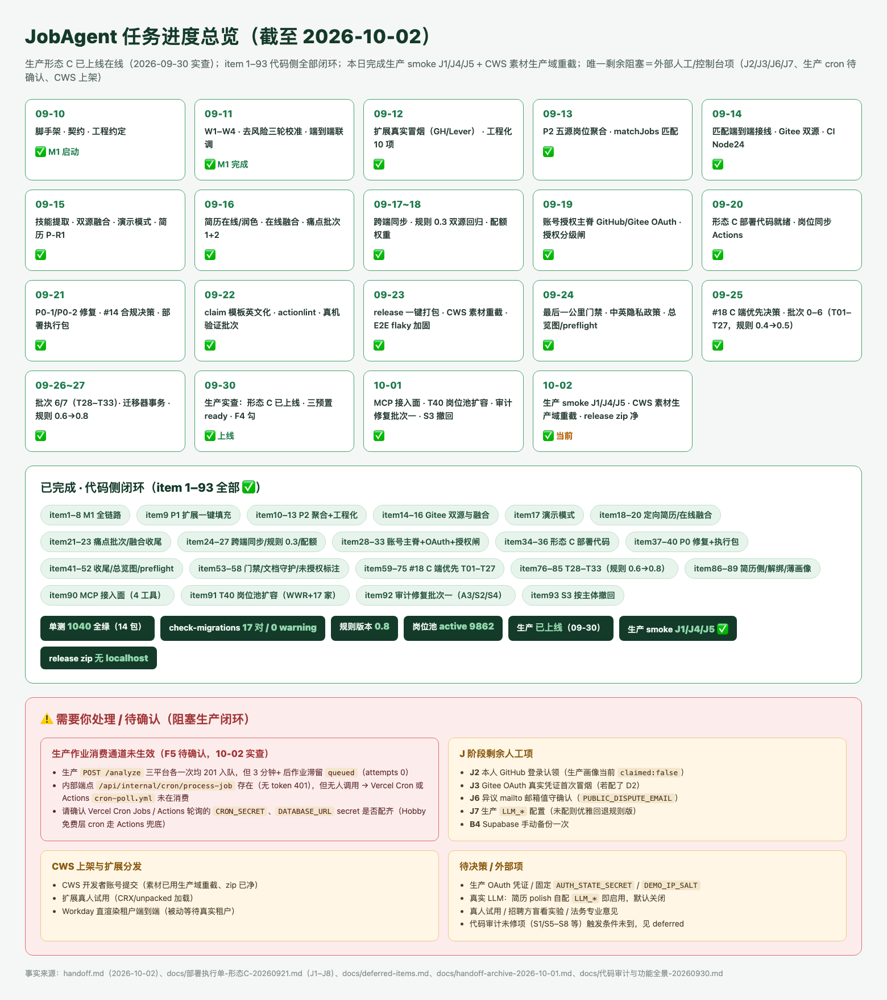

# Handoff

JobAgent 当前状态，截至 2026-10-05。

> 本文件只保留「项目当前状态 + 活跃任务 + 最近变更 + 文档索引」，是接手（人或 AI agent）的第一入口；**只写状态与结论，明细一律放进对应文档并在此给链接，不在本文件展开**。
> 设计/结论全文放 [docs/](docs/)；缓做事项放 [docs/deferred-items.md](docs/deferred-items.md)；场景化导航见 [docs/README.md](docs/README.md)。
> **归档惯例（对齐 agent-world，2026-09-18 起执行）**：①本文件只保留「项目当前状态 + 活跃任务 + 最近 5 条变更 + 文档索引」；②编号待办标 ✅ 后，详细过程（实现步骤 / commit 链 / 踩坑 / 验证数据）整块滚入 `docs/handoff-archive-YYYY-MM-DD.md`，本文件只留**一行结论 + commit hash**；③真正在推进 / 还在跑的活跃项保留详情。归档文件冻结只读、不再追加。

## Project documents

📚 **文档地图（按场景怎么读 + 状态约定）**：[docs/README.md](docs/README.md)。以下为全部文档直达（本区是完整清单的单一事实源，docs/README 只做场景导航、不重复清单）：

- [README.md](README.md) — 项目门面、技术栈、规划命令、铁律
- [AGENTS.md](AGENTS.md) — AI coding agent 工程约定单一事实源（CLAUDE.md 仅引用它）
- [CONTRIBUTING.md](CONTRIBUTING.md) — 本地开发 / 测试 / 提交 / PR 统一要求
- [MIGRATION_CONVENTION.md](MIGRATION_CONVENTION.md) — 数据库迁移命名/文件头/幂等/回滚规范
- [git-commit-message.md](git-commit-message.md) — 英文原子 Conventional Commits 规范
- [PULL_REQUEST_WORKFLOW.md](PULL_REQUEST_WORKFLOW.md) — 分支职责、PR 评审与合并流程
- [docs/产品构想-以GitHub为桥梁的招聘系统.md](docs/产品构想-以GitHub为桥梁的招聘系统.md) — 原始构想：定位、市场、B/C 双向闭环（历史）
- [docs/讨论记录-01-切入口与MVP收敛-20260910.md](docs/讨论记录-01-切入口与MVP收敛-20260910.md) — 切入口、护城河、L0–L4 分层、MVP 收敛过程（历史）
- [docs/讨论记录-02-投递功能与竞品分析-20260911.md](docs/讨论记录-02-投递功能与竞品分析-20260911.md) — 投递功能方向、Jobright 深度竞品分析、四种技术路径对比、职位聚合/Chrome 扩展可行性、3 项待决策（历史）
- [docs/PRD.md](docs/PRD.md) — 产品范围、F1–F9、AbilityProfile/EvidenceItem 契约、指标、风险 ★
- [docs/技术选型-MVP-20260910.md](docs/技术选型-MVP-20260910.md) — 技术栈选型、运行架构、目录规划、M1 排期与 Spike ★
- [docs/技术栈总览-分层架构-20260916.md](docs/技术栈总览-分层架构-20260916.md) — 当前技术栈分层架构一页总览：客户端/服务/内核/采集/持久化五层、各包职责、横切事实与数据流（现行，与 AGENTS/README 同步）
- [docs/市场调研-AI求职赛道-20260910.md](docs/市场调研-AI求职赛道-20260910.md) — AI 求职赛道市场调研：市场格局、功能全景、代表性产品画像、信任风险与 P0/P1/P2 跟进建议（现行）
- [docs/市场与竞品更新-20261003.md](docs/市场与竞品更新-20261003.md) — 赛道月度更新（2026-10）：融资加速（HiringCafe/Jack&Jill/Spott/Juicebox 等）、巨头入场（LinkedIn Hiring Assistant 2 / OpenAI Jobs Platform 传闻 / GitHub Skills 徽章）、「GitHub 行为证据」新玩家（GotSkillz/Checkmarked/SkillMD）与对 JobAgent 迭代方向的机会/威胁/跟进建议（现行，item98）
- [docs/市场调研-招聘市场痛点-20260916.md](docs/市场调研-招聘市场痛点-20260916.md) — 中国招聘市场双方痛点调研：企业端（寻源/筛选/造假/误聘）与求职者端（反馈缺失/定位模糊/竞争加剧）量化痛点、共同根源与对 JobAgent 的可信信号启示（现行）
- [docs/设计-痛点解决方案-20260916.md](docs/设计-痛点解决方案-20260916.md) — 12 项痛点→解决方案对位表 + 实施批次拆分：批次1 纯产品化（企业核验视图/面试准备包/落地页文案）、批次2 新接口（人才检索/筛选工作台/投递追踪）、批次3 外部条件；**批次 1 代码项 + 批次 2 已于 2026-09-16 落地（见 item21，落地页文案在独立仓未改、批次3 待外部条件）**（现行）
- [apps/extension/README.md](apps/extension/README.md) — P1 浏览器扩展试用指南：本地服务、开发者模式加载、Greenhouse/Lever 一键填充步骤与已知限制（现行）
- [docs/待拍板决策清单-20260910.md](docs/待拍板决策清单-20260910.md) — #1–#21；#1–#8 已决策（#4 当日修订为海内外同步），#9–#13 延后，#14 已于 2026-09-21 决策，#15/#16 已定（扩展 P1、职位聚合 P2），#17/#18 已于 2026-09-25 决策（#17 分期、#18 四期 C-A→C-D），**#19 MCP 接入面已于 2026-10-01 决策并落地**（三子问按建议：引 SDK 仅装 `apps/mcp`·stdio、fail-closed、v0 不给证据外链；见 item90 与 `apps/mcp`），**#20 求职 Agent 阶段 2/3 边界已于 2026-10-03 决策**（四条全采纳建议：填完等用户点提交 / 快照暂不落库 / 复盘 ≥20 条带结果才生效 / 披露 AI 辅助投递标识；见 item95），**#21 LLM 模型供给已于 2026-10-03 拍板并 P0 落地**（内置 Admin UI + BYOK 服务端加密、凭证 env only；见 item102–105 与 `docs/design-llm-model-provisioning-20261003.md`）
- [docs/deferred-items.md](docs/deferred-items.md) — 缓做/低优事项登记表（挂起项 + 触发条件的单一事实源）
- [docs/handoff-archive-2026-09-19.md](docs/handoff-archive-2026-09-19.md) — handoff 历史归档（2026-09-19）：item28 账号授权主脊（GitHub OAuth 登录/会话/认领）明细 + item29 报告页登录认领前端接线与 CLI `auth cleanup` 明细（归档，只读不追加）
- [docs/handoff-archive-2026-09-20.md](docs/handoff-archive-2026-09-20.md) — handoff 历史归档（2026-09-20）：item30 真实 GitHub OAuth 端到端、item31 return_to 深链、item32 授权分级闸、item33 Gitee OAuth、item34 部署加固、item35 形态 C 部署就绪、item36 岗位同步 Actions/API 文档明细 + 当时 Git 同步态（归档，只读不追加）
- [docs/handoff-archive-2026-09-21.md](docs/handoff-archive-2026-09-21.md) — handoff 历史归档（2026-09-21）：item37 已完成部分（P0-1 证据落库/P0-2 异议入口/#14 合规决策）、item38 评审瑕疵收尾与形态 C 同域守护、item39 形态 C 部署执行包、item40 CWS 素材包与扩展四缺陷、item42 actionlint CI、item43 Windows 跨设备 Node24 全量回归（781/52/9 实测表）、item44 归档维护明细 + 当时 Git 同步态（归档，只读不追加）
- [docs/handoff-archive-2026-09-24.md](docs/handoff-archive-2026-09-24.md) — handoff 历史归档（2026-09-24）：item50 部署前收尾 T1–T8（release 打包/CWS 重截/文档修正）、item51 部署前最后一公里验证 + CWS 准备（835 单测/57 E2E/隐私政策/两个 smoke 修复/就绪确认单）、item45 面试计划表 Interviews（双方言迁移 012/登录闸三端点/报告页 island/862 单测/60 E2E）明细（归档，跨天只读）
- [docs/handoff-archive-2026-09-26.md](docs/handoff-archive-2026-09-26.md) — handoff 历史归档（2026-09-26）：item83–85 T30 岗位池口径对齐 / T29 批次 6 三表面浏览器级验证（含 E2E 两个真问题定位修复）/ T33 内核散文收尾（规则 0.6→0.7）明细 + 踩坑与验证数据（归档，只读不追加）
- [docs/handoff-archive-2026-09-27.md](docs/handoff-archive-2026-09-27.md) — handoff 历史归档（2026-09-27）：item86 补录（T13/T14/T16）+ item87（T15/T22/T19/T18/T20）+ item88（B2 自助解绑四层明细）+ item89（CI 补迁移校验与 E2E 产物上传 + T14 遗留的 framework 排序修正）明细与 commit 链（归档，只读不追加）
- [docs/handoff-archive-2026-09-25.md](docs/handoff-archive-2026-09-25.md) — handoff 历史归档（2026-09-25）：item68–74 第三次评审批次 6 全部落地（T24 岗位池写入/自选岗位入口、T25 失败显式化、T26 删除解绑、T27 fail-open 收口、T17 我的页、T09 improvementSuggestions）明细 + commit 链 + 验证数据与踩坑（归档，只读不追加）
- [docs/handoff-archive-2026-09-23.md](docs/handoff-archive-2026-09-23.md) — handoff 历史归档（2026-09-23）：item47 两端字段对齐/PG 测试真实验证、item48 评审 A 组本地闭环（A1–A7）、09-22 七项加固明细（归档，只读不追加）
- [docs/handoff-archive-2026-09-22.md](docs/handoff-archive-2026-09-22.md) — handoff 历史归档（2026-09-22）：item46 扩展真机验证批次（#52/#53 真实 Greenhouse 一键填充 + 跨端同步、#54 API 改走 background SW 代发、#55 公开只读 by-subject 端点与客户端、#56 电话区号/城市消歧、#57 personal website 填充、扩展 E2E 补 by-subject 链路 10/10、两端字段不对称缺口）+ 从主文件裁出的 09-21 两条流水（归档，只读不追加）
- [docs/handoff-archive-2026-09-18.md](docs/handoff-archive-2026-09-18.md) — handoff 历史归档（2026-09-18）：已完成编号待办 item 1–27 明细 + 2026-09-17 及更早最近变更 + 历史 Git 同步态（归档，只读不追加）
- [docs/handoff-archive-2026-10-01.md](docs/handoff-archive-2026-10-01.md) — handoff 历史归档（2026-10-01）：item 37–91 明细 + 2026-09-27 及更早最近变更 + 当前状态/已知限制历史段落（归档，只读不追加）
- [docs/design-i18n-20260910.md](docs/design-i18n-20260910.md) — i18n 设计：自研 `t()` + 中英 JSON 字典、key 对齐守护、分享链接语言固定、不翻译边界；§8 扩展落地（navigator 协商 + localStorage 覆盖 + MV3 `_locales`）（现行）
- [docs/design-tokens-20260910.md](docs/design-tokens-20260910.md) — 设计 token 设计：`--ja-*` 三层变量体系、组件禁 hex、与落地页 `--lui-*` 互不约束；§8 共享包 `packages/ui-tokens` + 扩展 Shadow DOM `:host` 接入（现行）
- [docs/design-storage-dual-dialect-20260911.md](docs/design-storage-dual-dialect-20260911.md) — 持久化层 SQLite/Postgres 双方言适配设计：统一 async 仓储接口、双 schema/双实现、对称迁移目录、createStorage 工厂（现行）
- [docs/API.md](docs/API.md) — HTTP API 接口文档：/auth/*（GitHub/Gitee OAuth 登录/会话/本人认领）、/analyze（含画像缓存）、/demo/*、/jobs、/profiles（含 exportable/job-recommendations/applications）、/candidates、/job-postings、/resumes/build、/internal/cron/*（形态 C serverless 定时端点）、/health 与错误码、形态 C `/api` 挂载前缀说明（现行）
- [docs/设计-职位聚合-Spike-20260913.md](docs/设计-职位聚合-Spike-20260913.md) — P2 职位聚合 Spike：8 数据源实测结论（RemoteOK/Remotive/GH/Lever 可用，YC/Wellfound 反爬暂缓）、最小链路设计与推荐组合、JobPosting 类型依据（现行）
- [docs/design-job-ingestion-20260913.md](docs/design-job-ingestion-20260913.md) — P2 职位聚合采集管道工程设计：job_postings 表迁移 005（双方言）、IJobPostingsRepository、packages/job-source 适配器+编排、CLI jobs sync 触发、分期 P2-A~D、测试与落代码清单（现行，可直接据此编码）
- [docs/design-match-wiring-20260914.md](docs/design-match-wiring-20260914.md) — 第一档·画像↔岗位匹配端到端接线设计：API 端点（GET /profiles/:id/job-recommendations + POST match 接受 profileId）、报告页推荐岗位 island、扩展侧栏匹配度面板、验收标准与缓做项（现行）
- [docs/design-gitee-source-spike-20260914.md](docs/design-gitee-source-spike-20260914.md) — Gitee 证据源 Spike：v5 仅 REST 无 GraphQL、匿名可读、L0 充分/L1 基本可行、与 GitHub 关键差异、未来 gitee-source 设计（现行，仅结论不实现）
- [docs/design-gitee-source-20260914.md](docs/design-gitee-source-20260914.md) — Gitee 第二证据源实现设计（G-A）：v5 REST 采集序列、→AnalyzerInput 十条映射规则、内核最小参数化、gitee-source 文件清单与测试、CLI --platform（现行，可直接据此编码；G-A CLI 闭环 + G-B 在线选源已随 item14 落地，2026-09-14~15）
- [docs/design-extension-match-ui-20260914.md](docs/design-extension-match-ui-20260914.md) — 扩展面板匹配 UI 设计：#10 可解释性后从 top1 轻量升级为 top5 完整展示，四态/匹配依据/证据外链/i18n/token（现行）
- [docs/design-extension-e2e-20260914.md](docs/design-extension-e2e-20260914.md) — 扩展浏览器级 E2E 设计：--headless=new 加载 unpacked MV3、独立 playwright.extension.config、route 拦截零网络、首批 5 用例与边界（现行）
- [docs/design-behavior-diversity-20260915.md](docs/design-behavior-diversity-20260915.md) — 方案 B 设计：双源 events 聚合源无关 BehaviorEventSummary、analyzer 保守弱信号 narrow_activity_scope（规则 0.1→0.2）、缺失降级矩阵、校准与原子提交规划（现行）
- [docs/design-skill-extraction-20260915.md](docs/design-skill-extraction-20260915.md) — B-4 技能标签精确提取：技术词典单一事实源、topics/描述/仓名/commit/PR 多信号、词边界防误匹配与别名归一、深度与置信度公式（现行）
- [docs/design-cross-source-fusion-20260915.md](docs/design-cross-source-fusion-20260915.md) — B-5 跨源镜像去重与最小双源融合：共享 commit oid 识别镜像、fuseInputs 纯函数逐字段融合规则、CLI --platform all；**§8 在线 API/Worker 多源融合（platform=all）2026-09-16 已落地（item20）；跨源 PR/issue 同帖去重、融合双源徽标（报告页/人才库）、扩展面板 all 入口 2026-09-17 已落地（item22）；FusionReport 随融合画像快照持久化 + 报告页去重统计 2026-09-17 已落地（item23）**；**all 融合作业配额权重（demo 扣 2）+ 跨源同帖去重 7 天窗锁定 2026-09-18 已落地（item27）**，Gitee OAuth 已随 item33 落地（2026-09-19，见 design-gitee-oauth）；剩余 Gitee 认证限频、跨源 L2 比对缓做（现行）
- [docs/design-demo-mode-20260915.md](docs/design-demo-mode-20260915.md) — 演示模式设计：anonymous/demo/user 三态 Principal、权限矩阵、会话+IP+Worker 三道配额闸、迁移 006–008 双方言、IDemoSessionsRepository、/demo/* 端点与 /analyze 配额改造、预置快照秒进、report/extension/cli 落地、5 项待决策（现行，**步骤 1–9 已全部落地，见活跃待办 item17；配额 3/24h 与 TTL 24h 已于 2026-09-21 决策（#14 同批）**）
- [docs/design-targeted-resume-20260915.md](docs/design-targeted-resume-20260915.md) — 岗位定向简历生成设计：画像范围硬约束（no-fabrication，每条挂 evidenceRefs）、新建纯函数包 packages/resume-core（rank 岗位定向排序 + buildResume 装配 + md/html 渲染）、shared ResumeDraft/LocalResumeFields 契约、P-R1 CLI→P-R2 API/报告页→P-R3 LLM 受约束润色分期、5 项待决策（现行，**P-R1/P-R2/P-R3 可闭环子项已落地：shared 契约 + packages/resume-core（含 polish 安全层）+ packages/llm 端口/fake + CLI resume build/batch + API POST /resumes/build + 报告页 ResumeBuilder island + 扩展深链 CTA + **OpenAI 兼容 LLM client 与 API 可选 polish（默认关闭）**，见活跃待办 item18；**§10 五项 2026-09-16 已决策**：不持久化/只存本机/浏览器打印 PDF/LLM 默认关闭+OpenAI 兼容自配/语言手选；本地档案统一列 item19，版本管理入 deferred**）
- [docs/design-auth-gating-20260919.md](docs/design-auth-gating-20260919.md) — 账号收尾两刀设计：OAuth `return_to` 同源深链回跳（`sanitizeReturnTo` 白名单防开放重定向）+ 报告页授权分级闸（两档模型 / 可见性矩阵 / SSR `resolveViewer` / `GateCard` / interview-kit 401），含 JSON API 边界与落地记录（现行，handoff item31/32）
- [docs/design-c-side-first-20260925.md](docs/design-c-side-first-20260925.md) — **C 端优先重排方案（#18 已决策 2026-09-25；T01–T08 批次 0–1 与批次 6（T24–T28/T17/T09）、T10、T12/T23、T29/T30/T33、T13/T14/T16、T15/T18/T19/T20/T22 均已落地＝item61–87，§9 剩余仅 T21 形态 C 部署＝外部条件）**：按"能不能替一个真实求职者走完一轮求职"给六步判据 + 逐条实查断点（技能目录 62 条零 AI/Agent 词且无自由文本逃逸口、`improvementSuggestions` 契约有生产者零、简历 md 下载丢 `local`、内部批注印进交付物、投递数据匿名可读写、面试表挂 /recruit 且候选人只取前 100、岗位库 ~3.4k/17 家自选且日更 cron gated 在未配的 secret）+ C-A~C-D 四期（每期带用户视角完成定义）+ 与 #17 的改序关系（F11 提前、F10 留后）+ 三条待勾问题
- [docs/design-mcp-surface-20260928.md](docs/design-mcp-surface-20260928.md) — **MCP 接入面设计（决策 #19，✅ 已落地 2026-10-01）**：三条硬原则（薄壳不直读 storage / 服务账号不是人所以给密钥也不解锁证据与面试题 / 只读且绝不触发分析）+ 4 个只读工具（`search_jobs` 公开，其余三个需 `MCP_API_KEY`）+ fail-closed 与固定窗限流；实现见 `apps/mcp`（stdio，24 测试，提交 `cc581b9`→`8f61ce1`），配置/试用见 `apps/mcp/README.md`
- [docs/design-profile-removal-request-20261001.md](docs/design-profile-removal-request-20261001.md) — **S3 按主体撤回设计（✅ 已落地 2026-10-01，item93）**：未认领画像分享链自助撤回的"公开申请 + 人工复核"机制——公开端点 `POST /profiles/:id/removal-request`（IP 滑窗防刷）+ 软挂起（`removal_requested_at`）+ CLI `removal` 命令组（list/approve 级联/reject），零新增实体（双方言迁移 016 建表 `profile_removal_requests` + 017 给 `profiles` 加 `removal_requested_at` 软挂起标志）；报告页 `RemovalRequest` 入口；与 #14 应求撤销通道的关系
- [docs/设计-求职Agent-20261002.md](docs/设计-求职Agent-20261002.md) — **求职 Agent 构想设计（2026-10-02，现行）**：从分析工具升级为求职 Copilot Agent——找→评→改→投→跟→复盘六步闭环、人机确认闸（投递永远保留用户确认）、`JobRun` 状态机设计（created→configured→watching→recommending→awaiting_approval→submitting→submitted→tracking→archived，含事件/守卫/失败策略）、数据模型与 API 增量草案（job_preferences/job_runs/submit_intents，迁移 018+）、三阶段落地路径（工作台→半自动→全自动）、6 个开放问题；**阶段 1「求职工作台」已于 2026-10-03 实施，§10 记实施差异（未建 apps/agent、简历不落库、阶段 1 不接 LLM 等）与阶段 2 接续点；§10.4 阶段 2「半自动投递」A–F 六组已**全部落地（item112，2026-10-04）**：A2 扩展 ATS 一键填充（填完停手）、C2 求职信 LLM 润色 fail-closed、D1 outcome 回写（迁移 028）、E1 求职信固定 AI 辅助披露、F1 限频/质量闸、F2 真全栈 E2E、F3 文档；阶段 3 全自动点提交明确不做**
- [docs/design-recruiter-roles-20260925.md](docs/design-recruiter-roles-20260925.md) — **B 端角色与组织设计（#17 已决策 2026-09-25，未实施）**：两侧"共用账号、无角色"的现状实查表 + 三个今日可复现的洞（`/candidates` 匿名可遍历、投递记录无归属、招聘动作无身份）、立场=声明式角色（`accounts.recruiter_declared_at` 一列）而非 RBAC、迁移 013 草案、A/D/U/R 四态权限矩阵、`PUT`/`DELETE /auth/recruiter` 契约、三条非显然后果（`auth cleanup` 会物理删除招聘方账号 / 收紧后 `/recruit` 近乎空 / 声明不可由访问推导）、落地顺序与文档联动、5 个待决策子问题＝决策 #17（现行，handoff item59）
- [docs/design-gitee-oauth-20260919.md](docs/design-gitee-oauth-20260919.md) — Gitee 平台 OAuth 登录与本人画像认领设计：Gitee OAuth2 协议事实与相对 GitHub 三处差异、`GiteeAuthProvider`、平台无关 `registerOAuthFlow`、公开 `GET /auth/providers`、报告页 Gitee 登录入口与按画像主体平台的登录墙、零迁移/零 shared 契约改动、确定性测试与外部项（现行，handoff item33）
- [docs/deployment-runbook-20260920.md](docs/deployment-runbook-20260920.md) — 部署/上线 Runbook：**形态 C 已决策并上线（2026-09-30；Cloudflare 管落地页+DNS；Vercel 单项目同域跑 Astro SSR 报告页与 `/api/*` Hono，Node runtime，region hnd1；Supabase Postgres；常驻 Worker→Vercel Cron 每分钟认领一个任务）**，含 Vercel 项目 6 步设置、Supabase 开库/5432 首次迁移、Pro 每分钟 cron 硬前提、OAuth `/api` 回调与 `API_MOUNT_PREFIX`、形态 A/B 备选、Docker、定时任务映射、10 项 smoke（现行；**生产已上线，剩 J2/J3/J6/J7 人工 smoke；cron/轮询已于 2026-10-02 实查确认生效（弱点是 schedule 稀疏），见当前状态与部署执行单 J 阶段**，handoff item35）
- [docs/评审-MVP-20260921.md](docs/评审-MVP-20260921.md) — MVP 上线就绪度评审（2026-09-21）：总结论未达可上线 MVP、3 个 P0（证据不落库/异议入口缺失/未部署）；**P0-1、P0-2 已修复并全链路验证（commits df95506、9d2c75d），#14 合规已决策（同日），仅剩 P0-3 形态 C 部署待用户控制台操作**（现行）
- [docs/proposal-interview-planner-20260922.md](docs/proposal-interview-planner-20260922.md) — 面试计划表（安排面试+追踪结果）范围/数据模型/角色前提决策提案：建议不进当前上线 MVP、作为上线后第一迭代（**已于 2026-09-24 决策并落地，item45，见提案 §7**）
- [docs/评审-MVP-20260922.md](docs/评审-MVP-20260922.md) — MVP 上线就绪度评审（2026-09-22，基于实测）：P0-1/P0-2 代码实查确认闭环，工程门禁（typecheck/check-migrations/build/报告 E2E 52/52/扩展 E2E 9/9）全绿，**唯一剩余 P0-3 形态 C 部署**；新发现本机 macOS 26 下 embedded-postgres 18.1.0-beta.15 的 PG 二进制启动 FATAL（postmaster multithreaded 检测误报，非代码缺陷，CI 不受影响）（现行）
- [docs/评审-MVP-20260925.md](docs/评审-MVP-20260925.md) — 第三次 MVP 上线就绪评审（2026-09-25，全条实测+逐条 file:line 复验）：判据改为"C 端六步链能否在一次部署内连续走完"，**结论＝未达核心完全可用 MVP**，代码侧新暴露 4 条 P0（岗位池生产无写入者并连带断掉简历入口 / `partial` 与 `?notfound` 让失败不显式 / 无"我的"页回访即失联 / 删除与解绑只有口头承诺），工程门禁与 0.4 校准全绿（现行）
- [docs/评审-MVP-20260927.md](docs/评审-MVP-20260927.md) — 第四次 MVP 上线就绪评审（2026-09-27，全部实测+file:line 复验）：**结论＝仍未达核心完全可用 MVP，但阻断集收敛到 2 项**——B1 T21 形态 C 部署（外部条件，唯一剩余）＋B2 自助解绑（**已于当日落地，item88**，PRD:230 可解绑验收闭环）；六步链代码侧 6/6 环可达（含 T15/T18/T19/T20/T22 新落地），门禁 968 单测/77 报告 E2E/11 扩展 E2E 四连升无回退，真进程简历 smoke 通过；信心 **78→84/100**（现行）
- [docs/评审-MVP-20260927b.md](docs/评审-MVP-20260927b.md) — 第五次 MVP 上线就绪再评审（2026-09-27 同日，全部实测）：**结论＝仍未达核心完全可用 MVP，但代码侧阻断已全部清零，唯一剩余阻断＝外部平台条件 F3（Vercel 自定义域名边缘路由分发）**——B2 自助解绑闭环（判据 3 三条全满足），B1 部署从"38 项全未做"推进到"只差 F3 激活 + F4–J 收尾"（Supabase 14 迁移/Vercel 14 env + 部署 Ready/D1 OAuth/F1/F2 域名/G1 secret 全落地，F3 对照实验坐实部署本体正常）；门禁 **983 单测**全绿（记录并行全仓跑 vitest fork 超时假失败的环境现象与串行复跑结论）；信心 **84→89/100**（现行）
- [docs/部署执行单-形态C-20260921.md](docs/部署执行单-形态C-20260921.md) — 形态 C 上线照勾操作序列（Runbook §4-C/§10/§11 的执行版）：A 本地前置→B Supabase（6543 函数/5432 迁移）→C 三随机密钥→D 生产 OAuth App（回调含 /api）→E Vercel（Root Directory=apps/report、hnd1、env 总表、Pro 每分钟 cron、cron token 走控制台不入 Git）→F 域名/DNS 灰云→G Actions 5432 secret→H CLI 预热三预置画像（demo seed 只读不预热）→I 落地页构建变量→J 人工 smoke；配 `tools/gen-deploy-secrets.sh`、`tools/smoke-deploy.sh`（现行，2026-09-21，item39）
- [docs/部署前就绪确认单-20260924.md](docs/部署前就绪确认单-20260924.md) — 形态 C 上线前最后一轮"代码/产物侧"门禁实测记录（A1–A7 + B1–B4）：835 单测/报告 E2E 57/扩展 11、Docker PG 11 迁移+9 行为、Vercel 产物、smoke 7/7（含 worker lazy-sources 与脚本断言两个真实修复）、audit/gitleaks 0、CWS 隐私政策/权限/素材；结论＝代码侧门禁全绿，唯一硬阻塞 P0-3 控制台人工部署（**生产已于 2026-09-30 上线，此单转为历史门禁基线**；现行，2026-09-24，item51）
- [docs/privacy-policy-20260924.md](docs/privacy-policy-20260924.md) — 中英双语隐私政策权威源（10 节×2 语言：处理信息/不收集/用途/共享受托方/留存删除/国际传输/权利/未成年人/安全/变更联系），与在线页 `/[locale]/privacy` 同步，CWS 上架填 `https://<app-origin>/en/privacy`（现行，2026-09-24，item51）
- [docs/代码审计与功能全景-20260930.md](docs/代码审计与功能全景-20260930.md) — **项目级深度代码审计 + 产品功能点全量梳理（2026-09-30，只读审计、未改产品代码）**：审计范围/方法与版本基线（规则 0.8、991 单测、17 对迁移、34 路由）+ 分层架构核查（主干成立、三处方向问题）+ **8 条架构违规**（report 直连 DB 绕过服务层最严重／api 用双重断言丢弃 `close()`／`DemoRateKind` 双定义冲突／采集层反向依赖内核等）+ **安全与隐私 6 条已确认**（`POST /interviews` 未传 owner 可改写他人投递、未认领画像分享链不可撤销、招聘方闸为自声明、扩展 host_permissions 过宽等）与 5 条疑似，并逐项给出「未发现问题」清单（密钥/注入/XSS/开放重定向/鉴权矩阵）+ 测试与工程化实测（含并行 vitest 假红现象）+ **产品功能全景 12 个能力域** + 风险登记 P0–P3 与建议（现行，2026-09-30）。**§7 为 2026-10-04 对基线 `e9df14f` 的逐条复验：24 条发现里 7 条架构债原样未动、安全侧 7 条已闭环、基线刷新为 1352 单测/28 对迁移/65 路由，并补录 09-30 之后的六个能力域（求职 Agent 工作台、求职信、LLM 供给、扩展登录态、MCP 面、隐私自助通道）；新增发现 A9「文档锚点会静默腐烂」已修并加第五条守护 `doc-anchors`（item117）**
- [docs/design-cover-letter-20261003.md](docs/design-cover-letter-20261003.md) — 岗位定向求职信设计（A 档已落地 2026-10-03，item101）：llm 受约束生成器（防臆造三层）+ `POST /resumes/cover-letter`（仅登录 user）+ 报告页 ResumeBuilder 入口 + i18n（现行）
- [docs/design-claim-verification-20261005.md](docs/design-claim-verification-20261005.md) — **简历声明逐条核验设计（✅ 决策 #23 已于 2026-10-05 拍板；批次 1（内核与持久化）与批次 2（三端点 + 招聘方/本人两端表面 + /recruit 计数）均已落地，明细见 item128）**：**端点已由设计原案的 `/profiles/:id/claims` 改名为 `/claim-verifications`**（与既有「认领画像」的 `/profiles/:id/claim` 只差一个 s，易误用）。反向核验"用户带来的简历逐条话，GitHub 痕迹支撑得起吗"；三条路线取舍（推荐只做 B＝结构化声明输入，PDF 抽取降级为预填导入器、永不进入判定）、`claim_verifications` 数据模型草案与迁移 029–030、独立 `CLAIM_RULE_VERSION` 与 `packages/claim-core`（判定不回写快照、不升 `RULE_VERSION`）、三态判定 `supportable/partial/no_trace/insufficient_data` 与"抽不出可核验 token 绝不判 no_trace"的规则、端点与鉴权矩阵（不进 `/exportable`、不进 MCP）、B/C 两端表面、五条验收（含"摘掉证据查询必红"的反证与快照逐字节不变）、五个待拍板子问与明确不做清单
- [docs/design-llm-model-provisioning-20261003.md](docs/design-llm-model-provisioning-20261003.md) — LLM 模型供给设计（决策 #21 已拍板 2026-10-03，**P0 已落地 item105**）：内置模型＝Admin UI 管理（凭证 env only）+ BYOK＝用户自由设置（AES-256-GCM 加密列）、迁移 023–025、请求路由 BYOK 优先→内置回落（现行）
- [docs/design-扩展登录态-20261004.md](docs/design-扩展登录态-20261004.md) — **扩展登录态设计（决策 #22 已拍板 2026-10-04，全链已落地 item111）**：「工作台签发一次性授权码 → 扩展兑换长期 Bearer API Token」方案——避免重做双向 OAuth 与第三方 Cookie 被拦；迁移 026/027、code 5 分钟单次消费、token 90 天滑动续期可撤销、服务端只存 SHA-256 哈希、扩展 `chrome.storage.local` 存明文（现行）
- [docs/design-cron-scheduler-20261006.md](docs/design-cron-scheduler-20261006.md) — **分析任务消费的定时器选型（2026-10-06，待拍板）**：实测 GitHub Actions `schedule` 会连续数小时不触发（`*/15` 档改后 3 小时零 run，而工作流 active、表达式无误、secret 齐备），故比较三条路——维持现状 / 升 Vercel Pro / **用已在用的 Cloudflare 账号跑 Worker Cron（推荐：免费档 288 次/天 vs 上限 10 万，档位可到 1 分钟）**；含并发安全论证（`claimNext` 原子认领 ⇒ 两调度器并存无害，可先交叉验证再撤 GitHub 轮询）、官方文档核实的免费额度核算、五条验收与四个待拍板项；**未写代码、未改配置**（现行，待拍板）

## 当前状态

- 阶段：**M1 核心开发 + 工程化补全完成；P1·Chrome 扩展（Greenhouse/Lever 真实环境冒烟通过，Workday 受限登记）；P2 职位聚合 + 画像↔岗位匹配 + 岗位定向简历；P3 演示模式 / 账号授权主脊 / C 端优先批次（#18）均已落地；求职 Agent 阶段 1「求职工作台」代码已落地（2026-10-03，见 item94，未部署）；**求职 Agent 阶段 2「半自动投递」全链路已于 2026-10-04 落地（item112，A1–A4/C2/D1/E1/F1–F3 全绿，硬边界＝扩展填完停手、绝不自动点提交）**；**2026-10-03 工程债批次（item96）＝T1/T3/T4 测试守护补强 + Q1 拆分 API `index.ts`（2691 行→`routes/` 域模块）+ Q2 拆分报告页（数据装配入 `lib/report-page.ts`、样式入 `styles/report-page.css`）+ 报告 E2E 偶发超时加固（globalSetup 预热路由、webServer 超时 120→180s）**。当前规则版本 `RULE_VERSION` 0.8、迁移 **29 对**（018–022 阶段 1、023–025 LLM 供给、026/027 扩展登录态、028 outcome_feedback、**029 claim_verifications**）；**决策 #23「逐条声明核验」已于 2026-10-05 拍板，批次 1（内核+持久化）与批次 2（三端点+招聘方/本人两端表面+`/recruit` 计数）均已落地**（`packages/claim-core` + shared 技能词典 + 迁移 029 + 双方言仓储 + `ClaimVerifier` island，明细见活跃待办 item128）；**单测基线已刷新（2026-10-06 实跑 `pnpm -r test`，全绿合计 1421，16 个包 exit 0，storage 另 15 个 PG 行为测试无 DATABASE_TEST_URL 按 skip；本行取代 1405）**：shared 108 / storage 225(+15 skip) / analyzer-core 89 / claim-core 10 / agent-core 33 / resume-core 56 / llm 42 / job-source 87 / github-source 27 / gitee-source 40 / api 290 / worker 32 / cli 74 / mcp 24 / report 173 / extension 111；真全栈 agent E2E 9 条用例（匿名门 + stage-1 + stage-2 + 追踪回标 + claim 核验 4 条）全过，每用例前幂等重灌夹具隔离。历史阶段流水见 [docs/handoff-archive-2026-10-01.md](docs/handoff-archive-2026-10-01.md) §3。
- **生产形态 C 已上线并在线（2026-09-30 实查）**：域名 `https://app.job-agent.bayjf.com`（Vercel 单项目同域 + Supabase 东京 ref `lianzrtiddyxtoalpiby` + Cloudflare 灰云 CNAME，Root Directory `apps/report`）；`/api/health` 200、三个 demo 预置（torvalds/bayernjf/MSNightmare）`ready:true`、生产画像 `bayernjf`（profileId `f57fac8d-84d0-4f32-88b3-7fb4090bd84a`，规则 0.1-0.8，2026-10-02 presets 实查）报告页 200、岗位池 `active:13140`（2026-10-05 复测 `GET /api/job-postings/stats`，此前记 9862）；落地页 `https://job-agent.bayjf.com` 已接生产 API。**J1（未登录分级）/J4（demo 三道配额闸）/J5（三平台入队 + 分享链接）已于 2026-10-02 实测通过**，**J2 本人 GitHub 登录认领与 J3 Gitee OAuth 冒烟同日完成**（本行此前漏改，与「最近变更 2026-10-02 "J2/J3 完成"」条目矛盾；2026-10-05 复测生产画像行 `subject_claimed=true` 佐证 J2）；剩余＝J6 异议 mailto 值守、J7 生产 Vercel 配 `LLM_*` + B4 Supabase 手动备份。**作业消费通道已于 2026-10-02 实查确认生效**（早先"未生效"是误判：J5 的三个作业由 cron-poll 定时 run 36915737929 在入队数分钟后 drain 完，当时只看 3 分钟窗口；三个 Actions secret 齐备、09-29 起 12 次 schedule 全绿）；**真实弱点是 GitHub schedule 稀疏（实测间隔 4–7.5h、约 3–4 次/天，非每小时），排队分析最坏等数小时——2026-10-06 已根治（决策 #24）：定时器切到 Cloudflare Worker Cron（`apps/cron-worker`，`*/5` 档生产部署并经真实档位 tail 验证 `idle=true agentTick=200`），最坏等待降到 ≤5 分钟；GitHub 轮询暂留交叉验证、2–3 天后移除 schedule**；另修复 Vercel cleanup cron 每日 401 的真因（path 内联占位 token → 改由平台注入的 `Authorization: Bearer $CRON_SECRET`，见最近变更）。
- 仓库：https://github.com/bayernjf/job-agent （public）；长期分支 `main`、`dev`。
- 落地页已上线：https://job-agent.bayjf.com （仓库 `bayernjf/job-agent-landing`，Cloudflare Pages，详见其 handoff）。

## 活跃待办（下一步）

> 启动前决策 #1–#8 已于 2026-09-10 决策（#4 当日修订为「海内外同步」）。**item 1–36 可闭环子项全部 ✅（2026-09-20，随 PR #69 并入 `main`）；item 37–93 均已 ✅，明细见 [docs/handoff-archive-2026-10-01.md](docs/handoff-archive-2026-10-01.md) §1；item94（求职 Agent 阶段 1 工作台）✅ 2026-10-03；item95（决策 #20 拍板阶段 2/3 边界）✅ 同日；item96（工程债批次：测试守护 + 大文件拆分 + E2E 加固）✅ 同日；item97（Agent 两项产品口径：扫描规模 2000 + 标题/标签命中守卫）✅ 同日；item101（LLM 求职信）✅ 同日；item102–104（LLM 供给设计 v1/v2/拍板）✅ 同日；item105（LLM 供给双轨 P0 全部落地）✅ 同日（23 提交已 push，P1 生产激活待配 env）；item106（CI #124 失败修复：GET llm-config 改始终 200）✅ 同日（4 提交，已本地验证 agent E2E 2/2）；item107（「未经本人授权」标注覆盖机器可读出口）✅ 同日；item108（扩展安全 S6/S7/S8）✅ 同日；item109（简历↔画像对账 PDF 文本抽取 spike，合成样本先行）✅ 同日（107–109 已随 2026-10-03 批次 push，随 PR #126 合入 main）；item110（求职 Agent 阶段 2 A 主链 A1/A3/A4）✅ 2026-10-03（提交 `8b8bb25`）；item111（扩展登录态全链，决策 #22）✅ 2026-10-04；**item112（求职 Agent 阶段 2 半自动投递全链路 A2/C2/D1/E1/F1/F2/F3）✅ 2026-10-04**。**当前进行中的推进**＝① 生产形态 C 上线收尾（部署执行单 J1–J8 人工 smoke + B4 手动备份，均需用户控制台/真人参与）；② 求职 Agent 阶段 2（半自动投递）**代码侧已全部完成（item112）**——扩展在 ATS 页拉 `pending-fills` 一键填充简历/求职信（cover_letter 优先、填完停手绝不自动点提交）、求职信 LLM 润色 fail-closed 回落规则版、`outcome` 结果回写（迁移 028）、求职信末尾固定 AI 辅助披露 + 投递追踪徽标、限频/质量闸复核、真全栈 E2E；**真人验收（2026-10-04 推进中，item113）**：本地全栈已搭好（api:3000 连种子库 `data/verify-agent.db` + report:4321 + 扩展 dist 重建），**API 链路已全部实测打通**——画像 `prof-verify`（bayernjf 认领）快照契约解析曾因种子时间戳缺前导零返回 null（修复后通过）、`POST /agent/preferences`→`/agent/runs`（创建即扫，匹配到真实 Vercel 岗位）→`approve`→`extension-token/issue` 全通；**浏览器层阻塞**：Playwright 1.63 启动系统 Chrome 154 会剥离 `--load-extension`（命令行实测），PowerShell 直启 + CDP `connectOverCDP` 附加也未注入 content script（fab/overlay 均 0），cu 虚拟桌面初始化失败不可用；**2026-10-04 阻塞已解除（item114）**：换用 Playwright **自带 Chromium**（非系统 Chrome 154）的官方扩展测试通道——MV3 service worker 成功注册、FAB 注入真实 Vercel Greenhouse 页面、code→token 连接、票据按 URL 匹配（含 boards→job-boards 表单路由跳转后重新匹配）、一键填充真实申请表（首名/GitHub 链接 2 字段写入，种子画像本就只有这些事实，无证据字段正确留空＝no-fabrication）、ATS 提交控件保持未触碰。此前三通道"fab=0"的误判根因有二：系统 Chrome 154 剥离 `--load-extension`，以及探测脚本用 `document.querySelectorAll('.ja-fab')` 穿不透 content script 的 **open Shadow DOM**（FAB 实际已渲染，Playwright locator 可穿透）。**唯一剩余＝用户本人在自己浏览器点最终提交**（决策 #20 硬边界，永远不自动化；真实用户 OAuth 画像字段更全时写入数自然更多）。验收脚本/证据留 gitignored 区：`data/verify-pw-chromium.cjs`、`data/verify-pw-fill.cjs`、`data/verify-api-prep.cjs`、`data/verify-agent.db`、`data/verify-shots/02-pw-chromium-fab.png`/`03-pw-filled.png`/`pw-fill-log.txt`；③ **定时器选型待拍板（2026-10-06，纯文档，未写代码）**：GitHub Actions `schedule` 实测连续数小时不触发（`*/15` 档改后 3 小时零 run，而工作流 active、表达式无误、secret 齐备），三条路的成本/可靠性比较与免费额度核算见 [design-cron-scheduler-20261006](docs/design-cron-scheduler-20261006.md)——推荐用**已在用的** Cloudflare 账号跑 Worker Cron（免费档档位可到 1 分钟）；待拍板项＝是否采纳、档位取 5 还是 1 分钟、代码放 `apps/` 还是 `tools/`、是否撤 GitHub 轮询。

1. ✅ **M1·W1 持久化层 + 首个迁移**（2026-09-11）
2. ✅ **M1·W2 github-source + analyzer-core + cli**（2026-09-11）
3. ✅ **#8 去风险 S1/S2 spike**（2026-09-11）
4. ✅ **修复 spike 暴露 3 个 bug + 回归**（`0ceed62`，2026-09-11）
5. ✅ **#8 重新批量验证 + 真实性三轮双向校准**（26 账号：22 正 0 误报 + 4 负 0 漏报，2026-09-11~12，`a4f07d2`/`72490de`/`7fd6ca2`）
6. ✅ **M1·W3 服务化**（W3-1~W3-6，四表+仓储+worker+api+双方言，2026-09-11，`5a8407c`…`5cc700a`）
7. ✅ **M1·W4 报告与分享**（W4-1~W4-6，Astro 7 SSR + i18n + token + 只读分享 + 落地页接线，2026-09-11）
8. ✅ **端到端联调**（api+worker+report 三服务主链路，2026-09-11）
9. ✅ **P1·Chrome 扩展一键填充**（第 1–3 步 + Lever 零改动跑通 + Workday 受限登记；summary→自定义问题映射；i18n+设计 token，2026-09-11~14，`d350e43`/`47eece9`/`9b31fd0`/`e22d080`/`5bc411a`/`3286ca7`/`efe61e6`）——剩余外部项（真实用户装扩展试用、分发策略 CRX 先行已采纳、Workday 直渲染租户端到端）见「已知限制」
10. ✅ **P2·职位聚合**（JobPosting 契约 + Spike + 采集管道 + 五源入库 2044/1588 + matchJobs 匹配 + 四 API 端点 + 出站代理，2026-09-13，`c0e6a4b`/`da13802`/`ff070dc`/`d2cb688`）
11. ✅ **工程化补全 10 项**（Playwright E2E/Docker/真实 PG/pre-commit 卡死修复/画像缓存/CLI 导出/API 文档/waitlist CLI/i18n 测试，2026-09-12，`693e3e8`）
12. ✅ **P2 之后功能闭环路线**（第一档画像↔岗位匹配端到端接线 PR #23；第二档 #10 可解释性 + 扩展匹配 UI + 分档统一 + Gitee G-A/B；第三档继续缓做，2026-09-14，`620f79d`）
13. ✅ **工程化补全·组合一**（Dockerfile 漏 COPY 修复 + CI 补 E2E/Docker smoke + 推荐岗位 E2E + API 文档，PR #24；Docker arm64 运行时实跑 + PG 并发首迁移修复 `4c4ebe7`，2026-09-14~16）
14. ✅ **#12 Gitee 第二证据源**（G-A CLI 闭环 + G-B 在线选源 + events 方案 A + 行为多样性方案 B 规则 0.1→0.2，2026-09-14~15）
15. ✅ **B-4 技能标签精确提取**（技术词典 + 多信号 + 词边界，`262d198`，2026-09-15）
16. ✅ **B-5 跨源镜像去重 + 最小双源融合**（`fuseInputs` 纯函数 + CLI `--platform all`，`cfffd53`/`098d4b6`/`618aa59`，2026-09-15）
17. ✅ **演示模式 Demo Mode**（三态身份 + 三道配额闸 + 迁移 006–008 + 九步落地，2026-09-15，`7ac700b`…`2e01eec`）——剩余外部项（配额数值/TTL、部署形态、生产 cleanup cron、真人试用）见「已知限制」
18. ✅ **岗位定向简历生成**（P-R1 规则版 + P-R2 在线消费 + P-R3 可闭环子项含 OpenAI 兼容 LLM 润色默认关闭；§10 五项已决策，2026-09-15~16）——真实 LLM 需自配 `LLM_*`、服务端 PDF/版本管理缓做
19. ✅ **简历后续两项**（报告页 AI 润色开关 + 本地档案 canonical 统一，2026-09-16，`c944872`/`f1dd8c0`/`1e4f20b`/`13039a0`/`cd429b3`）
20. ✅ **在线多源融合画像 platform=all**（Worker/API/报告首页接线 + 缓存平台隔离 + UI bug 修复，2026-09-16）
21. ✅ **招聘痛点解决方案·批次 1+2**（核验视图/面试准备包/人才检索/筛选工作台/投递追踪，9 提交顶部 `304e7fb`，2026-09-16）
22. ✅ **跨源融合收尾三项**（PR/issue 同帖去重 + 扩展 all 第三键 + 双源徽标，PR #54，2026-09-17，`fcfa330`/`5362a9f`/`39f944c`）
23. ✅ **FusionReport 持久化 + 报告页去重统计**（PR #54，2026-09-17，`d991347`…`6743a4e`）
24. ✅ **本地档案跨端自动同步**（chrome.storage + externally_connectable，PR #55，2026-09-17，`715f34d`/`e7f9c2c`/`51ebc64`）——生产域名未定，externally_connectable 白名单含占位
25. ✅ **self_pr_ratio 判定强化 + 规则 0.2→0.3**（PR #55，2026-09-17，`db676cd`/`39cf3c5`）
26. ✅ **规则 0.3 真实双源回归复核**（GitHub 26/26 + Gitee 9 成功零误伤，holilayet 回归 mixed，2026-09-18）
27. ✅ **换 Windows 设备全量复核 + all 融合作业 demo 配额权重扣 2 + 跨源同帖去重 7 天窗锁定**（2026-09-18，`CROSS_SOURCE_THREAD_WINDOW_MS` 导出锁定、`DEMO_FUSION_QUOTA_COST` 可配）
28. ✅ **本人授权主脊：GitHub OAuth 登录 + accounts/auth_sessions + 本人认领（决策 #1-A/#6-A）**（2026-09-18，6 提交 `0c578f0` shared → `9f64e5e` db → `ec23cb6` storage → `8c089fc` api → `e3a93dc` docs(api) → `9d9c51e` docs(handoff)；明细归档 [handoff-archive-2026-09-19](docs/handoff-archive-2026-09-19.md) §1）
29. ✅ **账号主脊前端接线 + 认证数据运维清理（报告页 AccountMenu/ClaimProfile + CLI `auth cleanup`）**（2026-09-19，4 提交 `b30b494` db → `33a072d` cli → `87a80c2` report → `aae32ef` docs(handoff)；明细归档 [handoff-archive-2026-09-19](docs/handoff-archive-2026-09-19.md) §2）
30. ✅ **真实 GitHub OAuth 登录本地端到端打通（出站代理 + 跨端口 cookie 两处根因修复，真实浏览器验证登录/退出/认领落库）**（2026-09-19，3 提交 `60ad930` api → `9cb7ac9` report → `c7b3ecb` docs(handoff)；明细归档 [handoff-archive-2026-09-20](docs/handoff-archive-2026-09-20.md) §1）
31. ✅ **OAuth 登录后 `return_to` 深链回跳（`sanitizeReturnTo` 白名单防开放重定向）**（2026-09-19，`b8f3881` api + `d8504bd` docs(auth)；明细归档 09-20 §2，设计 [design-auth-gating-20260919](docs/design-auth-gating-20260919.md)）
32. ✅ **报告页授权分级闸（未登录看公开门面，登录 user 解锁证据外链/面试题/面试包，interview-kit 未登录 401）**（2026-09-19，`39e083a` report；明细归档 09-20 §3，设计 [design-auth-gating-20260919](docs/design-auth-gating-20260919.md)；JSON API 字段级裁剪缓做见 deferred）
33. ✅ **Gitee 平台 OAuth 登录与本人画像认领（对称 GitHub 主脊的第二个 AuthProvider，零迁移）**（2026-09-19，3 提交 `7f2d525` api → `53f177c` report → `fbcf720` docs(auth)；明细归档 09-20 §4，设计 [design-gitee-oauth-20260919](docs/design-gitee-oauth-20260919.md)；真实 Gitee App 凭证首次冒烟为外部项）
34. ✅ **部署加固批次（GateCard Gitee 登录墙 E2E + 部署/上线 Runbook + README/docs 导航，零产品代码改动）**（2026-09-20，`90cbe35` test(report) → `c6df859` docs(deploy) Runbook → `4f31324` docs(handoff)；明细归档 09-20 §5，Runbook [deployment-runbook-20260920](docs/deployment-runbook-20260920.md)）
35. ✅ **形态 C 生产部署代码就绪：Vercel 单项目同域（报告页 `/` + Hono `/api/*`）+ Supabase Postgres + Vercel Cron 替代常驻 Worker**（2026-09-20，7 提交 `8478b8c`…`fec98b0`；明细归档 09-20 §6；**当时尚未真实部署，生产已于 2026-09-30 上线**，Supabase/Vercel Pro/生产域名/OAuth App/随机密钥等控制台待办见 Runbook §11）
36. ✅ **岗位同步 GitHub Actions workflow（每日四源/每月 HN）+ 形态 C API 文档（§5 内部 cron 端点、`/api` 前缀约定）**（2026-09-20，`9da501d` ci(deploy) → `11c6fca` docs(api)，后者为 `bab3dd8` push 前 amend；明细归档 09-20 §7；上线前需配 Actions secret `DATABASE_URL`=5432 Session pooler 串）
37. ✅ **MVP 上线评审接力（P0-1 证据落库 `df95506`、P0-2 异议 mailto `9d2c75d`、#14 合规与 demo 配额 3 次/24h 决策 `f4d12bd`/`ec68c1f`/`f20cfcc`）**（2026-09-21，结论＝纯代码侧可闭环项清空、剩 P0-3 控制台部署；明细归档 [handoff-archive-2026-10-01](docs/handoff-archive-2026-10-01.md) §1）
38. ✅ **评审非阻塞瑕疵收尾 + 形态 C 同域挂载守护（CLI `--format`、`stripApiPrefix`/`resolveBrowserApiBase`）**（2026-09-21，PR #70；明细归档 [handoff-archive-2026-10-01](docs/handoff-archive-2026-10-01.md) §1）
39. ✅ **形态 C 部署执行包（照勾执行单 + `tools/gen-deploy-secrets.sh`/`tools/smoke-deploy.sh`）**（2026-09-21，PR #70；明细归档 [handoff-archive-2026-10-01](docs/handoff-archive-2026-10-01.md) §1）
40. ✅ **Chrome Web Store 上架素材包 + 修复四个真实扩展缺陷**（2026-09-21，PR #70；明细归档 [handoff-archive-2026-10-01](docs/handoff-archive-2026-10-01.md) §1）
41. ✅ **采集层证据 claim 模板英文化**（2026-09-22，`0284e71`，PR #72；明细归档 [handoff-archive-2026-10-01](docs/handoff-archive-2026-10-01.md) §1）
42. ✅ **CI 补 actionlint job（镜像 tag 钉 1.7.12）**（2026-09-22，`0b3a9f8`，PR #72；明细归档 [handoff-archive-2026-10-01](docs/handoff-archive-2026-10-01.md) §1）
43. ✅ **Windows 跨设备 Node v24 全量回归（781 单测/52 报告 E2E/9 扩展 E2E）**（2026-09-22，`61da85b`，PR #70；明细归档 [handoff-archive-2026-10-01](docs/handoff-archive-2026-10-01.md) §1）
44. ✅ **handoff 最近变更裁剪归档**（2026-09-22，`123892e`，PR #72；明细归档 [handoff-archive-2026-10-01](docs/handoff-archive-2026-10-01.md) §1）
45. ✅ **面试计划表 Interviews（迁移 012 + 登录闸三端点 + `/recruit` island，不引入 recruiter 角色）**（2026-09-24，`ef9b017`…`c458cb6`，PR #81；明细归档 [09-24](docs/handoff-archive-2026-09-24.md) §4）
46. ✅ **扩展真机验证批次 #52–#57（background SW 代发 / by-subject 匿名加载 / 字段消歧 / Website 填充）**（2026-09-22，`3fbf8b8`/`788a026`/`efadd8b`/`d23c1ae`，PR #72；明细归档 [09-22](docs/handoff-archive-2026-09-22.md)）
47. ✅ **两端本地档案字段对齐 + PG 测试真实验证 + 文档基线 + deferred 复核**（2026-09-22，`f321b41`…`3d3c4fd`；明细归档 [09-23](docs/handoff-archive-2026-09-23.md) §1）
48. ✅ **09-22 上线就绪评审 A 组本地闭环（A1–A7）**（2026-09-22，`bca7053`…`df67bdd`；明细归档 [09-23](docs/handoff-archive-2026-09-23.md) §2）
49. ✅ **部署前测试基建加固 + 全量回归基线 #113–116**（2026-09-23；明细归档 [09-23](docs/handoff-archive-2026-09-23.md)）
50. ✅ **部署前收尾批次 T1–T8（release 打包 / CWS 素材重截 / 文档修正）**（2026-09-23，`48fa3d0`…`c63c39c`，PR #77；明细归档 [09-24](docs/handoff-archive-2026-09-24.md) §1）
51. ✅ **部署前最后一公里验证 + CWS 上架前准备（835 单测/隐私政策/smoke 7/7）**（2026-09-24，`10281c0`…`75f471b`，PR #79；明细归档 [09-24](docs/handoff-archive-2026-09-24.md) §2）
52. ✅ **交付态总览图重制 + 当前 HEAD 全量回归 + `tools/preflight.sh`**（2026-09-24，`0e75bc1`/`c350e39`/`b5b9913`，PR #81）
53. ✅ **部署前收尾·第一档纯代码加固 T1–T3（深健康检查 / demo 配额并发压测 / 隐私政策一致性守护）**（2026-09-24，PR #81）
54. ✅ **上线前门禁补缺口 T0–T3（部署冒烟 10 项 / env 四处一致性守护 / preflight `--deploy`）**（2026-09-24，`4c1143d`，PR #82；明细归档 [09-24](docs/handoff-archive-2026-09-24.md) §5）
55. ✅ **迁移 CLI 目标库与 `DB_PATH` 对齐（`resolveSqliteDbPath` + 修 `scripts/migrate-down`）**（2026-09-25，PR #83）
56. ✅ **文档链接完整性批次 + `doc-links.test.ts`（第 3 条文档守护）**（2026-09-25，`636a23a`…`eb0852b`，PR #84）
57. ✅ **文档命令可跑性审计 + `doc-commands.test.ts`（第 4 条文档守护）**（2026-09-25，`453dcfd`/`59e0971`）
58. ✅ **「未经本人授权」显著标注（合规第一刀：报告页提示条 + 候选人卡徽章）**（2026-09-25，`40ae636`，PR #87）
59. ✅ **B 端角色与组织·F10 招聘方声明 + 访问闸（#17 第一期，迁移 015）**（2026-09-30，`aaa632b`…`307fd7b`；设计 [design-recruiter-roles-20260925](docs/design-recruiter-roles-20260925.md)）
60. ✅ **C 端优先重排方案 #18 决策（T01–T22 见方案 §9）**（2026-09-25；设计 [design-c-side-first-20260925](docs/design-c-side-first-20260925.md)）
61. ✅ **批次 0 投递管道隐私落地（T01–T03b / #17-F11，迁移 013 加 `created_by_account_id`）**（2026-09-25）
62. ✅ **批次 1 起手：T04 技能目录 AI/Agent 层 + T11 简历下载丢字段**（2026-09-25，`d4930b9`…`9d13d03`）
63. ✅ **T05 topics 兜底生产者 + 规则版本 0.4**（2026-09-25）
64. ✅ **T06 PR 改动规模入证据（`mergedDiffLines`/`largestMergedPrDiff`）**（2026-09-25）
65. ✅ **T07 headline 平台化 + 双语（`composeHeadline`）**（2026-09-25，`73ea75f`…`13ba268`）
66. ✅ **T08 规则 0.4 双向零误伤回归通过**（2026-09-25）
67. ✅ **第三次 MVP 上线就绪评审**（2026-09-25；见 [docs/评审-MVP-20260925.md](docs/评审-MVP-20260925.md)）
68. ✅ **批次 6 全部落地（T24 岗位池写入 / T25 失败显式化 / T26 删除解绑 / T27 fail-open 收口 + T17 我的页 + T09 improvementSuggestions，规则 0.4→0.5）**（2026-09-25，`fc8e2e2`…`7556a30`；明细归档 [09-25](docs/handoff-archive-2026-09-25.md)）
69. ✅ **T24 落地（并入 item68）**（2026-09-25；归档 [09-25](docs/handoff-archive-2026-09-25.md) §3）
70. ✅ **T25 落地（并入 item68）**（2026-09-25；归档 §2）
71. ✅ **T26 落地（并入 item68）**（2026-09-25；归档 §4）
72. ✅ **T17 落地（并入 item68）**（2026-09-25；归档 §5）
73. ✅ **T09 落地（并入 item68）**（2026-09-25；归档 §6）
74. ✅ **T27 落地（并入 item68）**（2026-09-25；归档 §7）
75. ✅ **同日复评（评审 §9，阻断集 4→1+1，新立批次 7 T28/T29/T30）**（2026-09-25；明细归档 [handoff-archive-2026-10-01](docs/handoff-archive-2026-10-01.md) §1）
76. ✅ **T28 落地：一次分析只发布一份可分享结论（删 `updateSnapshot` 死 API）**（2026-09-25；明细归档 [handoff-archive-2026-10-01](docs/handoff-archive-2026-10-01.md) §1）
77. ✅ **T28 真进程验证 + 撞出新 P0＝T31「回访即崩」（evidence 主键冲突）**（2026-09-25；明细归档 [handoff-archive-2026-10-01](docs/handoff-archive-2026-10-01.md) §1）
78. ✅ **T31 修复：证据行按画像隔离（迁移 014，复合主键 `(profile_id, id)`）**（2026-09-26，`e6a59eb`/`b7cdb03`）
79. ✅ **T32 落地：迁移器「一个文件一条事务」**（2026-09-26）
80. ✅ **T10 落地：报告页「下一步动作」区块（规则 0.5→0.6）**（2026-09-26）
81. ✅ **CI 报告 E2E 偶发超时登记（并入 T29 完成判据）**（2026-09-26；明细归档 [10-01](docs/handoff-archive-2026-10-01.md) §1）
82. ✅ **T12 + T23（简历侧）落地（交付物卫生 + 内核散文本地化，不升规则版本）**（2026-09-26；明细归档 [10-01](docs/handoff-archive-2026-10-01.md) §1）
83. ✅ **T30 岗位池口径对齐（CLI `jobs stats` 增新鲜窗口 `freshWithin7d`）**（2026-09-26；明细归档 [09-26](docs/handoff-archive-2026-09-26.md)）
84. ✅ **T29 批次 6 三表面浏览器级验证（`/my`/partial/自选岗位 + 冷路由预热）**（2026-09-26；明细归档 [09-26](docs/handoff-archive-2026-09-26.md)）
85. ✅ **T33 内核散文收尾（规则 0.6→0.7，信号/面试题补 `facts` + 5 个 composer）**（2026-09-26；明细归档 [09-26](docs/handoff-archive-2026-09-26.md)）
86. ✅ **T13 + T14 + T16 落地（项目经历 / 量化句 / 岗位定向面试准备单，`RESUME_RULE_VERSION` 0.1→0.2）**（2026-09-26；明细归档 [09-27](docs/handoff-archive-2026-09-27.md)）
87. ✅ **T15 薄画像降级 + T22 扩岗位种子清单 + T19 融合画像可认领 + T18 求职者面试管道 + T20 推荐去重与翻页**（2026-09-27，`035b483`/`444f898`/`c0a3081`/`7f92df0`/`1b605da`；明细归档 [09-27](docs/handoff-archive-2026-09-27.md) §2）
88. ✅ **B2 自助解绑（`DELETE /profiles/:id` 级联删除，PRD:230 验收闭环）**（2026-09-27；明细归档 [09-27](docs/handoff-archive-2026-09-27.md) §4）
89. ✅ **CI 补 check-migrations + E2E 产物上传；T14 framework 标签排序修正（规则 0.7→0.8）**（2026-09-27；明细归档 [09-27](docs/handoff-archive-2026-09-27.md) §5）
90. ✅ **MCP 接入面落地（决策 #19，`apps/mcp` stdio + 4 只读工具 + fail-closed，24 测试）**（2026-10-01，`cc581b9`/`15a2bc3`/`d6fd559`/`8f61ce1`）
91. ✅ **T40 岗位池扩容：新增 We Work Remotely 源 + Greenhouse 种子 45→62**（2026-10-01；明细归档 [handoff-archive-2026-10-01](docs/handoff-archive-2026-10-01.md) §1）
92. ✅ **代码审计修复批次一：A3 `DemoRateKind` 单一事实源 + S4 `by-subject` IP 滑窗限流 + S2 投递推进越权**（2026-10-01）。A3：`DemoRateKind`/`DEMO_RATE_KINDS` 双定义收敛到 `@jobagent/shared`（storage 侧改 re-export，补回漏掉的 `match` 桶）。S4：`GET /profiles/by-subject/:platform/:login` 加 IP 滑窗（新桶 `subject` + `DEMO_SUBJECT_RATE_PER_HOUR` 默认 120/h，超限 429 `DEMO_RATE_LIMITED`）防 login 字典枚举；env 四处同步（`.env.example`/`docs/API.md`/设计 §13/守护扫描）。**S2（决策方案 A，2026-10-01）**：`POST /interviews` 关联投递推进状态时原先不传 `ownerAccountId`＝整体跳过归属校验；现传 `principal.accountId`，推进**只对无主投递行生效**（匿名/历史写入），已认领画像的投回归候选人本人、招聘方不跨主体改写（有主行非主时仓储返回 undefined → 静默 no-op，面试照常创建）。选 A 的理由：与 F11「认领即隐私开关」口径一致、零数据模型改动（不引入关系表），且保留原「排期自动推进」体验（仅收窄到无主行）。`docs/API.md` 的 `POST /interviews` 补「归属边界」说明 + `interviews.test.ts` 新增 1 条回归用例（候选人登录写的投递 → 招聘方关联后状态仍 `applied`）；零迁移、零内核改动。
93. ✅ **S3 按主体撤回：公开申请 + 人工复核**（2026-10-01）。机制：未认领画像的分享链无法由本人自助撤销（`DELETE /profiles/:id` 仅认领本人开放），而请求者不可被服务端证明是本人，故开放公开端点 `POST /profiles/:id/removal-request`（任何身份放行、`DEMO_REMOVAL_RATE_PER_HOUR` 默认 5/h 的 IP 滑窗防刷）；提交即把画像置**软挂起**（`profiles.removal_requested_at`，不再被 `by-subject` 与人才库分发），由运营在 CLI `removal` 命令组（`list`/`approve`/`reject`）复核——`approve` 级联删除（evidence→applications→interviews→`accounts.clearClaimedProfileByProfileId`→profiles，再 `decide('approved')`），`reject` 清除挂起。报告页对未认领且未挂起画像挂出 `RemovalRequest` 入口（React island + SSR 挂起横幅）。新增 `profile_removal_requests` 仓储（双方言迁移 016 建表 + 017 给 `profiles` 加 `removal_requested_at`）；`shared` 的 `DEMO_RATE_KINDS` 加 `removal` 桶；`POST /analyze` 对挂起画像返回 409 `REMOVAL_PENDING`、`by-subject` 对挂起画像不再命中。设计见 [design-profile-removal-request-20261001](docs/design-profile-removal-request-20261001.md)；验证见下「最近变更」。
94. ✅ **求职 Agent 阶段 1「求职工作台」落地**（2026-10-03；提交链 `d4c007c`(shared) → `33cdafe`(db 建表) → `26dc25b`(db applications) → `cbed144`(storage) → `2efc5bb`(resume-core) → `500b994`(agent-core) → `269154c`(api) → `5f922ea`(report) → `4833af9`(e2e) → `a8b4ac4`(ci) → `5a69cb8`(config) → `80d234e`(docs api) → `92ba42b`(docs agents) → `92a6818`(docs arch) → `4ec444e`(docs 设计) → `b3bca86`(docs deferred) → `2e011e5`(docs handoff) → `67d7e79`(docs product) → 本条（docs handoff 补记，收尾）与后续 `docs(handoff)` 维护提交；**推送/合并是否发生一律实查**：`git fetch && git rev-list --count origin/dev..dev`、`git log --oneline -3 origin/dev`、`gh pr list`（本 agent 全程未执行 push，故不在此断言））。按 [docs/设计-求职Agent-20261002.md](docs/设计-求职Agent-20261002.md) §6 阶段 1 实现「找 → 评 → 改 → 待投清单」四步，**只准备、不投递**（全程无任何对外部系统的写动作）；差异与理由见该文 §10.1。
    - **契约**（`packages/shared`）：`JobPreferences`、`JobRun`/`JobRunEvent`（11 状态 + 12 事件迁移表）、`SubmitIntent` + 岗位精简快照、`MatchReport`（只出 code + 事实：`title_match`/`tag_match`/`description_match` + `tag_not_in_profile` 缺口 + `add_evidence_for_tag` 补强）、`CoverLetterDraft`（断言画像事实的段落必挂 `evidenceRefs`）、`AGENT_ERROR_CODES`。
    - **持久化**（`packages/storage`，双方言迁移 **018–022**）：`job_preferences`/`job_runs`/`job_run_events`/`submit_intents` + `applications.submit_intent_id`（`ApplicationOrigin` 加 `'agent'`，不复用已被"岗位来源"占用的 `applications.source`）；四个仓储接口 + 双方言实现，**`compareAndSetStatus` 原子条件更新**是并发闸（cron 与手动扫描抢同一任务时只有一个推进），条件不满足一律返回 `undefined`。
    - **内核**（新包 `packages/agent-core`，纯函数、零 I/O）：状态机迁移表、偏好→匹配条件与硬过滤（目标岗位关键词/地区/公司黑白名单）、质量闸与候选选择、可解释匹配报告、票据计划、限频判断。
    - **交付物**（`packages/resume-core` 扩展）：`buildCoverLetter`（规则版求职信；无命中技能或无证据的段落直接不产）、`renderCoverLetterMarkdown`、`coverLetterCopy`；`COVER_LETTER_RULE_VERSION=0.1`。
    - **API**（`apps/api`，17 条路由，契约见 [docs/API.md](docs/API.md) §3.8）：偏好 CRUD、任务 CRUD + `scan`/`cancel`/`pending-approvals`/`approve`/`reject`、`mark-submitted`（写 `origin='agent'` 投递记录并转 `tracking`）、按需装配的简历/求职信导出、`GET /internal/cron/agent-tick`（已接入 `.github/workflows/cron-poll.yml`，与 `process-job` 同一次轮询）。编排壳在 `apps/api/src/agent-runner.ts`（**未新建 `apps/agent`**，理由见设计 §10.1），存储行→对外契约的投影在 `apps/api/src/agent-view.ts`（存储实体按仓库惯例叫 `id`，契约用 `preferenceId`/`runId`/`eventId`/`intentId`）。
    - **界面**（`apps/report`）：`/[locale]/workbench` + `AgentWorkbench` island（偏好 CRUD、任务与可回放事件流、待投清单、按 code 现拼的匹配报告、确认/拒绝/标记已投/下载交付物），导航加 `nav.workbench`，新增 131 条中英文案；简历下载走 `POST /resumes/build` 以带上本机补填字段（电话/教育不丢）。
    - **验证**：`bash tools/check-migrations.sh` 通过（22 对）；typecheck 全绿（shared/storage/agent-core/resume-core/api/report）；单测 shared 99 / agent-core 29 / resume-core 55 / storage 194（21 文件 180 + PG 行为 14，本机嵌入 PG 实跑）/ report 81 / **api 226**；新增 `e2e/workbench.spec.ts` 7/7（Playwright 真进程、全量 mock API）；四份文档守护（api-doc/env-doc/doc-links/doc-commands）随 api 套件全绿；`git diff --check` 干净。
    - **交付后补丁**：`d32fc34`（真浏览器点测抓出的「工作台下载简历 404」修复，见最近变更同日条目）。
    - **门禁资产**：`pnpm e2e:agent`（真 API + 真浏览器全栈 E2E，含上面那条 404 的回归；CI 已接入独立一步）+ `playwright.agent.config.ts` + `e2e/agent/`；默认 `pnpm e2e` 已显式排除该目录。
    - **未做（阶段 2 起，均已登记 [deferred-items](docs/deferred-items.md) 并带触发条件）**：LLM 语义理解与求职信润色、简历快照留存、扩展自动填充/提交、复盘结果回写。
    - **产品级文档同步**：`docs/PRD.md` 新增 **F12 求职工作台**（7 条验收：只准备不投递 / 可解释 / 不造事实 / 质量闸与限频 / 可回放 / 私有需登录 / 复用跟踪管道）；`docs/待拍板决策清单` 新增 **决策 #20**（阶段 2/3 的四条开放问题＝投递执行边界、快照留存、复盘自动化、对 B 端是否披露「AI 代投」，逐条标"建议≠决策"）；根 `README.md` 门面与文档表同步到当前事实（生产已上线、规则 0.8、17 workspace）。

95. ✅ **决策 #20 拍板：求职 Agent 阶段 2/3 的边界**（2026-10-03）。四条**全部采纳助手建议**：① **投递执行边界＝扩展自动填充、填完等用户点提交**（不得实现自动点提交）；② **简历/求职信快照暂不落库**（继续按需重装配，等真需要审计时再留精简快照）；③ **复盘反馈＝自动计算 + 人工确认后生效，且累计 ≥20 条带结果记录才生效**；④ **对招聘方披露「AI 辅助投递」标识**。记录在 [docs/待拍板决策清单 #20](docs/待拍板决策清单-20260910.md)（含决定日期），并同步到 PRD §4.3 阶段 2/3 边界、设计 §8 提示、AGENTS 项目概览、README/docs README、deferred 五条方向标注（新增「披露标识」一条）——该批文档改动见提交 `87cb595` 及其后的 `docs(decisions)` 措辞对齐提交（设计文档状态行与 README 决策表行）。**阶段 2 仍未开工**，本条只固定边界；上位触发条件（阶段 1 有真实使用数据 + 合规复核）不变。

96. ✅ **工程债批次：测试守护补强 + 大文件拆分 + 报告 E2E 加固**（2026-10-03；提交 `2c4605b`/`d7ecfcd`/`2a5beab`/`2ec0f25`/`8052ecf`）。
    - **T4 双方言 parity**：迁移 parity 套件补 accounts/auth_sessions/interviews（迁移 010–012）；修测试自身 bug——非贪婪块匹配被 SQLite 列注释里的 `);` 提前截断（PG 注释无此写法），新增 stripComments 先剥整行 `--` 注释再匹配。
    - **T3 报告页 token 守护**：新增 `lib/tokens-guard.test.ts`，断言 15 个 tsx 与 global.css 零 hex/颜色函数、只消费 `var(--ja-*)`。
    - **T1 report 组件级单测**：React island 此前零单测；装 jsdom + Testing Library（适配 React 19），为 ShareButton/DemoBanner/DeleteProfileButton/ClaimProfile/AnalyzeForm 写测试，新增 `test-setup.ts`（jest-dom matcher + 显式 afterEach cleanup）。
    - **Q1 拆分 API `index.ts`（2691 行 → `routes/`）**：Hono sub-router + 共享 RouteDeps，13 个域模块（system/demo/auth/analyze/profiles/job-postings/resumes/recruiting/agent + types/schemas/helpers/context），handler 原样搬运、行为零变更；`api-doc-consistency` 改为拼接 index.ts + routes 全部源码后扫描。
    - **Q2 拆分报告页**：frontmatter 数据装配抽到 `lib/report-page.ts`（`loadReportPageData`，redirect 以 `{kind:'redirect'}` 联合返回），235 行样式抽到 `styles/report-page.css`（裸 `h2`/`h3` 用 `.ja-container` 限定、防全局泄漏），577 行模板零改动。
    - **报告 E2E 偶发超时加固**：globalSetup 预热首页 + 报告页（提前触发 astro dev 按需编译与 Vite 依赖重优化），webServer 启动超时 120 → 180s。
    - **验证**：report typecheck 0 错、report 单测 **149** 全绿、report build 成功、report-render E2E **11/11**（单用例耗时稳定 0.3–2.2s，预热生效）；Q1 后 API **226** 全绿；pre-commit 全仓 typecheck 随每次提交通过。
    - **待完成（不属本批编码，需用户/外部）**：J6 配 `PUBLIC_DISPUTE_EMAIL`、J7 Vercel 配 `LLM_*`、B4 Supabase 备份、CWS 上架；求职 Agent 阶段 2 待阶段 1 真实使用数据 + 合规复核。（原「全仓 `pnpm -r test/build` 与 `bash tools/preflight.sh` 刷新合计基线」已于 2026-10-03 完成，明细见「最近变更」）

> **决策 #4 修订为"海内外同步"**：双语、双区域部署、合规双线与 Gitee 节奏的影响见 [待拍板决策清单 #4](docs/待拍板决策清单-20260910.md) 与 [PRD NFR-8](docs/PRD.md)。

128. ✅ **决策 #23 逐条声明核验：批次 1（内核+持久化）+ 批次 2（三个端点 + B/C 两端表面）+ 批次 3（真全栈 E2E）全部落地（2026-10-05，端点 `91c2b2b`/`8bbc43b`，接力收口 `4ed6da0`→`52bcb38`→`c0d39a7`→`c652d7c`→`6889640`→`259a351`→`2822fb5`；真全栈补 `bdb5952`/`55f43ef`）**。反向通路"简历逐条声明 ↔ GitHub 痕迹"已可复核：招聘方 `?view=recruiter` 区块 + 求职者本人投递前自检（同一 ClaimVerifier island，verdict code 渲染、zh/en、证据可点、401/403 收起），`/recruit` 列表显示已核验条数（countByProfiles 只回数量不回原文），验收 §8 五条全过（含真进程 smoke + 快照逐字节不变），并由 `pnpm e2e:agent` 新增 4 条真全栈用例钉住（本人 self-check supportable 带可点证据 / 招聘方抽象声明 insufficient_data / 撤回 / 匿名 401 不渲染；真 Chromium→真 SSR→真 API→真 SQLite，不 mock）。全仓 **1405 passed**（16 包，storage 另 14 PG skip）、agent 真全栈 **9/9**。批次 1/2 已随用户推送进 origin/dev；批次 3 与 B1 共 4 个提交本地未 push（按约定用户 push）。明细见 [docs/handoff-archive-2026-10-05.md](docs/handoff-archive-2026-10-05.md)。

127. ✅ **item126 落地：任意来源都能回标（2026-10-05，`53f3262` + `7ed89e6`）**：① **API**：`PATCH /applications/:id` 的 schema 接受 `outcomeFeedback`（与票据端点**同一个** `OutcomeFeedbackSchema`，两条写口不许漂移），`outcomeFeedbackAt` 由服务端盖、不接受调用者自填（"何时知道结果"不可伪造）；**有意不开放 `null` 清除**——仓储契约注释本就写着"清除走专门流程，此处不开放"且该流程至今不存在，标错的修正路径是覆盖成另一个值（测试里钉了 interview→offer 的覆盖）。方言两侧的 patch 映射本就带这两个字段（item124 时顺手查过，2:2 对称），**零迁移**。② **UI**：报告页「投递追踪」在状态旁边加结果列，写入走同一个 PATCH；`/my` 撤掉 origin 限定并把笼统 CTA 换成**每行各自链到它所属画像页**（那里才有它的控件）。③ 夹具与断言跟着走：三条夹具（manual 未标 / agent 未标 / agent 已标）在放开 origin 后计数=2、已标那条仍不计，outcome 过滤依旧承重；第一次全量 E2E 转红的原因是我漏改了旧断言（还在找已删除的"去工作台回标"链接）——**改文案必须连着改断言**，这条已修，92/92。④ 新增 api 用例钉住：值域外 400、服务端时间戳、覆盖修正、匿名行的既有归属口径不变（11/11）。验证：`pnpm -r typecheck`/`test`（**1366**）/`build` exit 0、report E2E **92**、锚点 166/0、`git diff --check` 干净。**如实记覆盖面**：追踪控件的写入由 api 集成测试覆盖（真 SQLite），report E2E 是 mock API、只保证不回归渲染；追踪下拉在真浏览器里的操作路径目前只有 agent 流那条被真全栈用例覆盖，manual 行的 UI 操作留待下次真机 smoke。
126. ✅ **已由 item127 落地（2026-10-05，同日）**：让 `manual` / `report` / `extension` 三种来源的投递也能回标。立项时的记录：当前唯一写口 `POST /agent/intents/:id/outcome` 是**按票据**收口的，没有票据的行永远标不上，于是 `applications.outcomeFeedback` 事实上只覆盖 agent 流程一条路，决策 #20-3 的样本也只会从这一条路攒。建议做法：`PATCH /profiles/:id/applications/:id`（既有归属校验：013 之后有 `createdByAccountId`、已认领画像按本人收口）开 `outcomeFeedback`/`outcomeFeedbackAt` 两个字段，复用工作台同一个下拉与同一套值域（`OUTCOME_FEEDBACK_VALUES`），**不要新开第二套控件**；同时把 item125 里那个"只数 agent"的过滤放开。验收要求：三条来源各钉一条"标得上去 + 读得回来"，且 `/my` 的计数与工作台可见行**数目一致**（这条一致性正是本轮栽过的地方）。
125. ✅ **自纠：`/my` 的回标提示此前在对用户撒谎（2026-10-05）**。上一批（item124 / `84904a0`）我把提示合进了生产，随后自查 `origin` 取值才发现断点：`ApplicationOrigin` 有 `manual`/`report`/`extension`/`agent` 四种（`packages/storage/src/entities/application.ts:38`，手工口 `routes/recruiting.ts:122` 默认写 `manual`），而我那句提示的计数**不看 origin**，可唯一写口只认票据——**非 agent 来源的行永远标不上，CTA 点过去工作台里也没有它**。这正是我这一轮反复在讲的"能力存在但没有可达表面"，只不过这次是我自己新造的，且已经在生产上。修法（一笔）：`/my` 计数限定 `origin === 'agent'`（只有这些真能被标），夹具改成**三向对照**——`app-e2e-pending-manual`（不该计）/ `app-e2e-pending-agent`（该计）/ `app-e2e-recorded-agent`（不该计），断言 `1 条`；少任一层过滤都会数成 2、两个都少数成 3。**反证已实跑**：删掉 `origin` 条件后用例转红并打印 `Received string: "投递结果待回标有 2 条…"`，还原后 batch6 **10/10 通过**、`my.astro` 与备份逐字节一致。**没做的事**：把三种来源都能标这个真问题顺手做掉——它是 item126，范围更大（要动 PATCH 契约），不该塞进止血笔里。
124. ✅ **回标闭环：让"投递结果"这件事第一次真的存在（2026-10-05，`bb254e3` + `c576bbe` + `84904a0`）**：起因是我上一轮说"给 `/my` 加个待回标提示"，去查挂哪儿时发现——**`POST /agent/intents/:id/outcome`（D1，迁移 028 那批）从落地起就是零调用方**：`grep '/outcome' apps/report/src` 无命中，写端点有、读端点没有、界面也没有。结论是**"接口存在但没有任何表面能读到它"等于功能不存在**，而决策 #20-3 的"复盘要 ≥20 条带结果样本"因此永远不可能开始计数。三段补完：① **读侧**（`bb254e3`）新增 `GET /agent/runs/:id/submissions`，把 `status='submitted'` 的票据与关联 `applications` 的 `outcomeFeedback`/`outcomeFeedbackAt` 一起返回；**零迁移**——关联本来就在（票据侧 `application_id`、投递侧 `submit_intent_id`，我先前说"投递没有关联列"是错的，列名不同，已纠正）。② **入口**（`c576bbe`）工作台加「已投与结果」区（`data-testid="agent-submissions"`），每行一个下拉（值域直接用 shared 的 `OUTCOME_FEEDBACK_VALUES`，不另立枚举），选中即调既有写端点；复用待投清单的既有样式类，不新开色板。③ **提示**（`84904a0`）`/my` 统计"已投但未回标"的条数并链到工作台；**只计数不加第二个写口**（同一字段两处写迟早漂移）。**验证都是走真链路**：api 单测把"写进去再读回来"钉成一条断言链（`submitted → submissions 里 outcomeFeedback=null → POST outcome → 再读 =interview 且带时间戳`，16/16）；真全栈 E2E 在阶段 1 用例里续上 UI 操作——点选下拉后**刷新页面**再断言值仍在（证明来自库里而不是组件状态，3/3）；`/my` 提示走 report E2E，夹具刻意同批塞一条已回标 + 一条未回标，**过滤若写错就会数成 2 而转红**（92 passed，report E2E 连续两次 0 flaky）。i18n 双语各 13 个新 key 由 key 对齐守护把关。**方法学记一条**：这是本会话第二次撞到"能力已实现但无可达表面"（上一次是报告页的排队等待没有回访处），审计与评审应当把"**有没有人读得到**"当成判据，而不只是"端点/仓储在不在"。
123. ✅ **内部 cron 端点停用 `?token=`（2026-10-05，代码 `3c671d3`）**：item120 改了发送方、item121 在生产验过头形态之后，本次把**服务端**的 query 形态拿掉——URL 里的共享密钥会同时留在 Vercel 访问日志、中间层记录与 Actions 命令行回显三处。闸只认 `Authorization: Bearer`（`apps/api/src/index.ts` 的 `cronAuthorized`，常量时间比较逻辑不变）。**动手前先实查两个调用方都已改发头**：默认分支那份 `cron-poll.yml` 里 `?token=` 命中 **0 处**、`Authorization: Bearer` 2 处，且上一轮手动派发在生产读到真执行行 `Queue idle (attempt 1).`——不是"应该没问题"，是查过才切。**新增一条"形态已死"的正向钉**：值正确的 `?token=` 也必须 401（**反证**＝把 query 比对加回去，该用例立刻 `expected 200 to be 401`；还原后与备份逐字节一致、探针残留 0 处）。其余成功路径用例迁到 header 是为了与生产实际形态一致，不是为了让测试变绿而改断言。**文档面比预想的大，而且两条是会直接误导操作的**：执行单 F5 与 runbook smoke 第 9 步都写着"带正确 `?token=` 应 HTTP 200"，切完之后照做的人会拿到 401 并误读成部署故障；deferred「分析任务消费的调度密度」里"开 Pro 后恢复分钟级 cron"那条照抄指令也内联着 `?token=`（已改为"path 内不得内联 token、平台自动注入头"）；`tools/gen-deploy-secrets.sh` 尾部提示、API.md（env 表 + 内部 cron 鉴权段）、runbook 四处、`.env.example` 同步。**取代关系**：item120 里那句"服务端两种形态继续接受"是当时的真实状态，现由本条取代——按归档惯例不改写历史条目，只在这里声明。**部署时序上安全**：新版服务端上线前，调用方已经只发头；上线后旧 query 失效不影响任何在跑的调度。验证：`pnpm -r typecheck`/`build` exit 0、`pnpm -r test` **1365** exit 0（+1 用例）、api 侧 cron+agent+五条文档守护 **43 passed**、迁移校验 exit 0、`git diff --check` 干净。
122. ✅ **回访闭环：`/my` 列出"我发起的分析"（2026-10-05，`2eb928c` + `cbef403`）**：上线评估的结构性结论之一——**首跑要等数小时，但用户回来没有任何地方能看到那个任务**。`/my` 此前只列已完成的画像（`profiles.listBySubject`），排队中的作业不可见，于是"提交→关页→五小时后回来"的人只能看到空白页，无法区分"丢了"和"还在排"。**做法（刻意最小）**：`/my.astro` 增加 `jobs.listBySubject(viewer.platform, viewer.login, 10)` 的 SSR 区块（`data-testid="my-jobs"`，最新在前），排队/进行中显示等待文案、失败显示 `errorMessage`、完成**直接给回报告链接**；渲染挂在 `profiles.length === 0` 分支**之外**，所以"还没有画像但任务在排"这一屏正是本功能要服务的场景。**不新增 HTTP 面**（报告页本就直读 storage）、**不新增仓储方法**（`listBySubject` 此前零调用，与 `profiles.listBySubject` 同属 T17 未接完的部分）、**不改隐私口径**（只在 `viewer.kind === 'user'` 下按**自己的** login 取，不能枚举别人的队列）。demo 会话不覆盖：`/my` 对未登录是登录墙，demo 会话 24h TTL 且 item120 的排队提示已给出"重新提交同一用户名会去重回同一任务"的恢复路径。验证：`pnpm -r typecheck`/`build` exit 0、report 单测 **160**（i18n 对齐与 token 守护在内，新 4×2 个 key 双语同构）、`pnpm e2e` **91 passed**（90+1，新用例靠 `e2e/global-setup.ts` 真塞进 `job-e2e-queued` / `job-e2e-done`→`succeed(FIXTURE_PROFILE_ID)` 两行，走真 SSR 与真 SQLite、不 mock）；新用例的 locator 指向本功能之前不存在的 testid，构造上不可能空过。
121. ✅ **报告 E2E 抖动的根修 + 同步失败的可观测性（2026-10-05，`5bff47e` + `5ee0b82` + `47df533`）**：① **`batch6-surfaces.spec.ts:159` 的真相不是"慢"，是 hydration 之前写进受控字段的值被首帧渲染覆盖**——用例里那段"先等 4s，没启用就重填一次"是在赌时间，实测连续 4 次 run 都要靠 Playwright 重试才绿。修法：`ResumeBuilder` 挂载 effect 里发布显式信号 `data-hydrated`（`5bff47e`），用例改为**先等信号再填值**（`5ee0b82`），并删掉 try/重填那段。**反证**＝把 `setAttribute` 撤掉，用例明确红在 `expect(builder).toHaveAttribute('data-hydrated','true')` 这一行，证明断言承重而非装饰；本地 `batch6` 8→8 通过、还原后与备份逐字节一致。② **`weworkremotely` 每晚 insert 失败仍**未定因**，但找到了"为什么谁都定不了因"**：ingestor 的 catch 只打 `err.message`，而 Drizzle 的 message 就是整条回显 SQL（CI 里 12338 字符），真正的数据库错误码在 `err.cause` 里被淹掉。`47df533` 改为**有 cause 时只记 `db <code>: <message>`**、无 cause 才回落到 message；回归用例用 12k 字符的伪造 SQL 断言日志里出现 `db 23502`、不含 SQL、长度 <400。**如实记两条边界**：(a) 我在本机**没能复现**那条生产失败——`https://weworkremotely.com/remote-jobs.rss` 对本地出口返回 **403**，拿不到同一份 payload，所以底层错误码仍未知，修复后**下一次 schedule run 才会给出真码**；(b) 我第一版合成批次测试报的是 `23502 first_seen_at not-null`，那是**我自造行缺字段**的产物，不能当生产原因——这个自我纠正在提交信息里写明了。③ 顺带完成上线复查的两处核实：PR #134 已自动合入（main `929b7f7`），默认分支那份 `cron-poll.yml` 已是 header 形态（`Authorization: Bearer` 2 处、`?token=` 0 处），并**手动派发一次 run 在生产验到** `Queue idle (attempt 1).`（真执行行，非脚本回显）；生产首页 HTML 已含"仍在排队／没有被丢弃"。验证：`pnpm -r typecheck`/`build` exit 0、`pnpm -r test` **1364** exit 0（+1 用例）、report E2E 本地 **91 passed**、`git diff --check` 干净；一次性 PG 容器（`ja-wr-repro`，独立端口、无卷）用完已 `rm`，**别人的 `infra-postgres-1`/`ja-pg-repro` 未动**，compose 里那个 `job-agent-db-1` 起过后已停回原状。
120. ✅ **首跑等待的诚实化 + cron 密钥不再进 URL（2026-10-05，`ce88c1d` + `aec2f64`）**：上线判据复查里"我能自己做"的两件。① **排队态不再谎报服务不可用**：`AnalyzeForm` 原先在 5 分钟轮询预算用尽时 `setPhase('error')` 配文案"服务暂时不可用，请稍后重试"——这句话在本部署里**是假的**：队列由定时轮询消费（实测相邻 run 间隔 4–7.5 小时），任务既没失败也没被丢弃。新增 `queued` 相位（`data-testid="queue-notice"`）如实说明"仍在排队／可以关页／稍后重新提交同一用户名会回到这同一个任务"（依据是 `POST /analyze` 既有的 `latestActiveBySubject` 去重，已核对代码）、**显示任务编号**、并用"继续等待"复用同一任务再给一轮预算；按运行架构第 6 条补一句"超过一天仍无进展＝消费通道本身坏了，带编号反馈"，不承诺交付。旧的 `timeoutLabel` 文案随之删掉——**能走到截止线的唯一路径是任务仍被 API 报为 queued/running**，读不到任务在第一个 tick 的 catch 里就已报错退出，保留那个分支就是死代码。② **`CRON_SECRET` 改走请求头**：`cron-poll.yml` 两处 curl 与 `tools/smoke-deploy.sh` 都把密钥拼在 URL 上，等于每晚把凭证写进 Vercel 访问日志与任何中间层的 URL 记录；端点本就接受 Vercel Cron 平台自动注入的 `Authorization: Bearer`，故**只改发送方、服务端两种形态继续接受**，不让这次改动打断已在跑的调度。③ **文档同步**：`docs/API.md`（env 表 + 内部 cron 鉴权段）、`docs/deployment-runbook-20260920.md` 三处（env 表／cron 段／定时任务映射表）、`docs/部署执行单-形态C-20260921.md` E1 与 F5 之间那段、`.env.example` 注释。**验证**：`pnpm -r typecheck`/`build` exit 0、`pnpm -r test` **1363** exit 0（新 2 例）、report 包单测 **160**（含 i18n key 对齐 22 例、token 守护 48 例）、**report E2E 本地 90/90**、五条文档守护全绿、`git diff --check` 干净；**反证**＝把 `setPhase('queued')` 改回 error 路径后两条新用例都以 `Unable to find an element by: [data-testid="queue-notice"]` 转红，还原后与备份逐字节一致；**真进程验证**（新建空库跑 028 对迁移、零外网、队列空返回 idle 不触发采集）＝无凭证 `401` / 正确 bearer `200 {"ok":true,"outcome":{"kind":"idle"}}` / 错误 bearer `401` / 历史 `?token=` 仍 `200`，探针进程与临时库已清理。**明确没做的一条**：不把服务端 `?token=` 一并收紧——收紧要求新版镜像与调度改动同批发布，否则两版 Actions 定义会有一段时间互相打不通；写在这里免得下位当成遗漏。**Pro 那条不变**：本条只让等待变得可解释，没有让它变短。
119. ✅ **公开画像 API 的面试题收口（2026-10-05，代码 `5e775b2` + 用例 `b524e81`）**：上线复查实跑发现 `GET /profiles/:id` 匿名返回整份 snapshot——生产 `curl` 直接拿到 **2 道面试题原文**（响应 8603 字节），报告页"登录才可见"那道墙只画在 SSR 上、**不是访问控制**（deferred 早由 09-25 评审记了这条口径纠正，触发条件＝公开发布前）。**改法**：`apps/api/src/routes/helpers.ts` 新增 `formatProfileForViewer(profile, viewer)`，`principal.kind !== 'user'`（anonymous 与 demo）时把 `snapshot.interviewQuestions` 置空、并在顶层加 `gating.interviewQuestions.{hidden,count}` **如实报数**（运行架构第 6 条：禁止输出"看似完整"的结论，不能让调用方把"被收口"读成"该画像没有面试题"）；登录态（Cookie 会话与扩展 Bearer token 都解析成 `kind:'user'`）响应逐字节不变且不含 `gating`。**有意不裁**：`job-recommendations` 的证据 `url`+`claim` 是决策 #10 要求匿名可回溯的公开面，裁掉会破坏公开报告页——四处文档已把口径改成"勿再当漏洞报"。**验证**：`pnpm -r test` **1361** exit 0（含新 3 例）、`pnpm -r typecheck`/`build` exit 0、迁移校验与五条文档守护全绿、`git diff --check` 干净；**可证伪性实测**＝把闸门条件改成恒真后 anonymous 与 demo 两条立即转红（登录态本就该绿），还原后 3 绿并与备份逐字节比对过；**真进程 smoke**＝复制 `data/job-agent.db` 到 `/tmp`（不碰原库）跑 `apps/api/dist/index.js`，匿名请求一个 5 题画像得 `interviewQuestions: []` + `count: 5`、库里题目原文 **0 命中**、headline/skillTags/authenticity/caveats 未被误伤（6161 字节），再在副本里插一枚一次性 `api_tokens` 哈希行走 Bearer 路径→原文命中 1 次且无 `gating`（7216 字节），自建进程与临时库已清理。**同场纠正两条过期状态**：生产岗位池 `active` 9862 → **13140**（`GET /api/job-postings/stats`，`jobs-sync` 日志有真实 `inserted=2 updated=88`；那行 `DATABASE_URL is not configured` 只是 Actions 回显脚本、不是跳过）；部署执行单 **J2/J3 的"当前状态"行自相矛盾**——「当前状态」段仍写"剩余＝J2 本人 GitHub 登录认领（生产画像 `claimed:false`）、J3 Gitee OAuth 冒烟"，而「最近变更」2026-10-02 条目早已记 **J2 本人登录认领通过 + J3 完成**；10-05 复测生产画像行 `subject_claimed=true`（行级才是认领状态，快照内嵌的生成时旧值仍是 false），证据站在变更区那边，已按实测改掉「当前状态」段那半句并注明此前漏改。**方法学一条如实记**：我一度把 J2 当"本轮新发现"写，实为 10-02 已完成——**先查自己的索引再断言某事没人做过**。**仍未解的上线硬伤不属本刀**：新用户首跑要等 `cron-poll` 排队（实测相邻 run 间隔 4–7.5 小时），根因＝Vercel Hobby 每天仅 1 次 cron，需开 Pro 后在 `apps/report/vercel.json` 恢复分钟级 `process-job`（deferred「分析任务消费的调度密度」行）。
118. ✅ **审计开放项里"我能自己做的"四条落地 + 新发现 A11（2026-10-04）**：接着 item117 的复验结果，把不需要外部条件的部分一次做完，**每条都是独立原子提交**：① **A2**（`2b973ca`）删掉 `createApp` 里的 `as unknown as ApiRepos` 双重断言——实跑证明 `StorageContext` 本就是 `ApiRepos` 的结构超集、直接赋值即通过，**契约漂移从此由编译器把关**（以前改名只会静默骗过类型检查）；同时常驻 `main()` 改为**自己建库、SIGINT/SIGTERM 时 `server.close()` + `storage.close()`**（原先 createApp 内部建库后把 `close()` 丢掉，独立部署的 api 进程退出从不释放连接），`createApp` 刻意不持句柄——serverless 温实例复用同一 app，关闭不该发生在请求路径上。② **A7**（`0e57bdb`）删零消费者导出，**实测比原判大**：analyzer 有 6 个计算函数 re-export（`computeAuthenticity`/`computeAuthenticitySignals`/`computeSkillTags`/`computeActivity`/`generateInterviewQuestions`/`computeSummary`）+ shared 的 `InterviewCreateInput` 类型全无人引用，删后内核对外只剩 `analyze`/`fuseInputs`/版本与信号码常量——这也是 A4（采集层反向依赖内核）真正变小的前提。③ **T2 收尾**（`aca0199`）给 report 补显式 `testTimeout: 15000`（api/storage 早在 item96 T29 有，本包漏了）。④ **新发现 A11 + 修复**（`1a91729`）：Dockerfile 的 deps 阶段**从未 COPY `packages/agent-core` 与 `packages/resume-core` 的 package.json**，而 workspace 通配 `packages/*` —— `pnpm install --frozen-lockfile` 不报错、后续 `COPY . .` 又补回源码，所以 `docker build --target api` 一直绿，镜像里却留着两个**悬空 `node_modules/@jobagent/*` 符号链接**；只在两包恰好只依赖 shared 时不出事，一旦谁给它们加外部依赖，故障发生在镜像内且报错指不到根因（本仓 09-14 踩过同款）。修法=补两行 COPY + 新增守护 `apps/api/src/dockerfile-workspace.test.ts`（双向比对缺包与幽灵包、带 ≥16 反空转）。**可证伪性实测**：对修复前 Dockerfile 跑同一算法得 `copies 14 / missing [agent-core, resume-core]`，修复后 `16/16`；重建 deps 镜像确认两链接均可解析，探针镜像已删。⑤ **A6 复验后判定"原判不成立"并写回审计**：`job-source` 对 storage 是 `import type`，运行时零耦合、86 个单测不碰 DB，原句"无法脱离 DB 做单测"是错的——只余"依赖声明可降级"这一低收益项，因会牵动 lockfile 与 Docker 而未动。**明确不做的两条**：A1（SSR 直连 DB，需你先定"收敛只读投影"还是"走进程内 createApp"，且它决定 MCP 面做法对不对）、A8（waitlist 去留是产品决策）。**A5 也留着没动**：删三个 app 的冗余 `drizzle-orm`/`better-sqlite3` 会改 lockfile 与 Docker deps 阶段，正是 A11 那类坑，需连带验镜像，不值当夹在本轮里。验证：`pnpm -r test` **1358** exit 0（含新守护 3 例）、`pnpm -r typecheck`/`build` exit 0、`docker build --target deps` exit 0、锚点守护与四条文档守护全绿、`git diff --check` 干净；零迁移、零内核行为改动（`RULE_VERSION` 仍 0.8，删除的都是无人调用的 re-export，画像输出逐字节不变）。
117. ✅ **审计报告 §7 复核刷新 + 第五条文档守护 A9（2026-10-04，基线 `e9df14f`，零产品代码改动）**：对 [代码审计与功能全景-20260930](docs/代码审计与功能全景-20260930.md) 做逐条复验并追加 §7。**复验结论**：09-30 的 8 条架构发现里 **A1/A2/A4/A5/A6/A7/A8 七条原样未动**（A1 report 单进程最多 3 个 DB 上下文：`apps/report/src/lib/db.ts:28,44` + `lib/internal-api.ts:12,21` 内嵌 `createApp()`；A2 `apps/api/src/index.ts:79` 的 `as unknown as ApiRepos` 丢 `close()`；A5 三个 app 仍声明未使用的 `drizzle-orm`/`better-sqlite3`，非测试源码 grep 0 命中）；安全侧 8 条 **7 条已闭环**（S2/S3/S4 由 item92/93、S5 由 `packages/llm/src/openai-compatible-client.ts:168` 的 `redactSecret` + :138-139 头顺序反转、S6/S7/S8 由 item108 `4dec4e7`），**仅 S1 保留**且属决策 #17 第一期既定姿态（声明式角色非 RBAC）；测试/结构侧 T1/T3/T4、Q1/Q2 全部完成。**基线刷新（全部实跑）**：单测 991→**1352**（15 包 exit 0）、报告 E2E 81→**90**、新增真全栈 agent E2E **3**、迁移 17→**28 对**、API 路由 34→**65**、workspace 9+5→**10 包 + 6 应用**、report i18n 350→**575×2**、extension **66×2**；规则版本 `0.1-0.8` 与简历规则 0.2 均未动。**§4 补录六个能力域**（求职 Agent 工作台阶段 1+2、岗位定向求职信、LLM 双轨供给、扩展登录态、MCP 只读面、隐私自助通道），每条带可达表面 + 锚点 + 状态。**新发现 A9（本轮唯一新增缺陷类）**：10-03 的 item96 Q1 把 `apps/api/src/index.ts` 从 2691 行拆成 275 行 + `routes/*`，**审计与 C 端方案两份活文档里 19 处 `file:line` 证据锚点当场指向不存在的行，而四条文档守护全绿**——因为 `doc-links` 只验文件可达、不看行号，另三条根本不碰锚点。处置：①19 处全部重钉到拆分后的真实位置（并消灭裸 `index.ts:` 写法，仓库里有 20 个同名文件）；②新增 `tools/check-doc-anchors.mjs`（扫 81 个活文档、163 处引用，归档与"某日评审"按时间点记录惯例排除）+ 守护用例 `apps/api/src/doc-anchors.test.ts`（3 例：全绿断言、反空转 `refs≥120 且 files≥50`、**植入指向不存在行的坏例（api 入口文件第 999999 行）证明守护会红**），AGENTS「文档即被测面」由四条改记五条并写明"历史失效行号不要写成 `path:line`"。**方法学两条如实记**：① 并行 8 路子代理因模型当日额度全部中断，改为主线程串行实查——审计方法本身对配额敏感（记为 A10）；② 我一度把 S6 写成"原判撤回"，实为 item108 已修复——**先查自己的索引再断言"没人做过"**（`handoff.md` item108 早就记着）。验证：`pnpm -r test` exit 0（含新守护 3 例）、`node tools/check-doc-anchors.mjs` 违例 0、`git diff --check` 干净；零迁移、零内核改动、未改任何产品代码。
109. ✅ **简历↔画像对账·PDF 文本抽取 spike（合成样本先行）**（2026-10-03；`tools/resume-pdf-spike/`）。用户经确认选择"先用合成样本跑通管线"，deferred 行真实样本达标测量待用户提供 5 份脱敏简历。**管线**：`make-fixtures.js`（pdf-lib + Noto Sans SC 生成 5 份中英混排合成简历：中文为主/中英各半/英文为主/双栏/含表格）+ `extract.js`（pdf-parse 抽取 → 结构化声明 → 抽净率对账）+ `extract.test.js`（守卫测试 6/6）。**结论**：平均字符抽净率 **97.9%**（中文样本 100%，英文为主最低 93.4%）、姓名/邮箱字段可提取；「原文不留存」已**代码级强制**——输出 schema 无 `rawText/pagesText`、报告不含源文本长行、抽取不产生任何 .txt/.raw 原文文件。依赖独立安装（`pnpm install --ignore-workspace`，tools/ 不在 workspace packages 列表）；`@pdf-lib/fontkit` 为 pdf-lib 嵌入中文字体必需（registerFontkit 是实例方法）。README 含复现与达标口径。
108. ✅ **扩展安全三项 S6/S7/S8**（2026-10-03；`4dec4e7`，9 文件 +133/-9）。审计 §3.2 扩展面三项收口：**S6** manifest `content_scripts`/`host_permissions` 移除 `https://*/*careers*`/`https://*/*jobs*` 通配，只留 greenhouse/lever/myworkdayjobs 三域；**S7** `onMessageExternal` 按 `sender.origin` 校验白名单（新 `lib/external-origins.ts`：`ALLOWED_EXTERNAL_ORIGINS` = localhost:4321/127.0.0.1:4321/生产报告域，`resolveSenderOrigin` 缺 origin 回退 url，`isAllowedExternalOrigin` **fail closed**）；**S8** `sw-relay.ts` 代发目标 host 白名单（localhost/127.0.0.1/生产域，拒绝语 `'host not allowed'`）。构建注入 `EXTENSION_SITE_ORIGIN`（build.mjs define + env.d.ts 声明）；release 构建实测 dist manifest 无通配/剥 localhost/钉生产域；extension 测试 87→**92**（external-origins 4 + sw-relay +1）；typecheck/build 通过。坑：tsc `exactOptionalPropertyTypes` 下 MessageSender 直接赋值报 TS2379，参数类型需显式 `origin?: string | undefined`。INSTALL.md 补白名单说明。
107. ✅ **「未经本人授权」标注覆盖机器可读出口**（2026-10-03；`7c50647`，10 文件 +84/-2）。报告页提示条（item58）此前只覆盖 UI；本次补 `GET /profiles/:id`（`formatProfile`）与 `GET /profiles/:id/exportable`（`toExportableProfile`）两个机器可读出口——shared 新增 `UNAUTHORIZED_NOTICE` 稳定英文文案 + `ExportableProfileSchema.authorizationNotice`（认领省略/未认领附加），扩展面板结果区加 `.ja-unclaimed` 提示块 + en/zh 文案，docs/API.md 两端点补文档；`apps/mcp` `get_profile` 走 exportable 透传自动继承。验证：shared 11 / api 47 / extension 87 / mcp 24 / 全仓 typecheck 通过（坑：api 消费 shared dist，改 shared 须先 build）。deferred 合规行标"已重启 2026-10-03、全出口覆盖、本行结项"。
106. ✅ **CI #124 失败修复：GET /account/llm-config 契约改为始终 200**（2026-10-03；`4a316dd`→`fb120b2`→`ca0bddc`→`fedf013`，已 push 前待推）。**根因**：U6 新增 ModelSettings island 在登录态 workbench mount 时请求 `/account/llm-config`，未配置（404）/服务端无 `LLM_ENC_KEY`（503）时浏览器控制台记录资源加载错误，被 agent E2E `consoleErrors` 断言（workbench-fullstack artifacts→human-gate）抓成 CI 失败。**修复**：GET 契约改为**始终 200**——未配置 `{configured:false}`、无 encKey `{configured:false, reason:'encryption_missing'}`、已配置 `{configured:true, provider/baseUrl/model/keyMasked}`（shared 新增 `UserLlmConfigGetResponseSchema` discriminated union）；PUT 无 encKey 仍 503（写路径需要加密）；report ModelSettings 按 configured 判别；docs/API.md §3.9 更新。**验证**：api 249 / report 155 全绿、typecheck 干净、**agent E2E 2/2 全绿（本地 11.5s，CI 同款用例）**。**下一步**：更新 PR #124 标题与描述（当前只覆盖 item99-101，需并入 LLM 供给 P0 与本次修复）。**CI 二次失败（依赖审计）**：`http-cache-semantics ≤4.2.0` 命中新公告 CVE-2026-93748 / GHSA-ch52-4w7c-c8xp（max-stale 缓存响应泄露），npm 无 patched 版本（<0.0.0），由 astro 7.3.2 传递引入——已在根 package.json `pnpm.auditConfig.ignoreCves` 按 **CVE-2026-93748** 登记忽略（**注意：auditConfig.ignoreCves 只认 CVE 编号，不认 GHSA id**；漏洞场景=共享 HTTP 缓存服务端，与 JobAgent 无共享缓存架构不符；**TODO：上游发布修复版后移除忽略**）。**CI 三次失败（gitleaks）→ 安全修复**：`packages/llm/src/encryption.test.ts` 曾含**用户真实 Agnes API key**（commit `c9c9c73`〔原 `191d747`〕已入历史并 push，public 仓库——**2026-10-03 已用 `git filter-repo --replace-text` 重写全仓历史清除该 key 并 force push `dev`/`main`（明细见 Git 状态段）；用户决定不吊销原 key——泄露前已 clone/fork 的副本仍可能持有，风险自担**）；当前文件已替换为假 key，全部 `sk-` 测试 fixture 加 `// gitleaks:allow` 注释（提交 `d0126e3`，gitleaks 8.24.3 本地验证无泄露）。**CI 四次失败（gitleaks 历史 commit 仍报假 key）→ `.gitleaks.toml` allowlist 按精确值形态登记测试假 key**（`sk-bob-secret-9876`/`sk-byok-key`/`sk-x`/`sk-secret-1234`/`sk-abcdef1234`/`test-key-...`/`test-enc-key-20261003`，不按路径、不覆盖真实 key 形态）；本地 `base..HEAD` 49 提交扫描 **no leaks found**。

105. ✅ **LLM 模型供给双轨 P0 全部落地**（2026-10-03；U1–U7 共 12 个英文原子提交，**已随本批 23 个提交全部 push 到 origin/dev**，链尾 `d57d6b8`）。**U1 shared 契约 + 迁移 023–025 + storage 实体/仓储**（`149b3e4`/`829eb4c`/`36c1bcf`）：`LlmCatalogModelSchema`/`UserLlmConfigSchema`（provider 默认 custom/baseUrl url 校验）/`StoredUserLlmConfig`（apiKeyEncrypted）/`LlmCatalogUpsertSchema`（整体替换、无凭证字段）/`UserLlmConfigSaveSchema`（apiKey 可选）/`AdminLlmCatalogViewSchema`/`AuthMeSchema.canManageLlmCatalog`；迁移 023 `accounts.is_admin` + 024 `llm_catalog_models`（无凭证列）+ 025 `user_llm_configs`（一账号一行），双方言含 DOWN 段 + pg COMMENT ON；storage 两方言 schema/仓储（`llm-catalog` replaceAll 事务 / `user-llm-configs` upsert / `accounts.setAdmin`）+ 5 新测试 + migrations 回滚断言。**U2 llm 目录合并纯函数 + 缓存**（`253e2aa`）：`mergeBuiltinCatalog`（空表回代码默认 agnes-2.5-flash、白名单只覆盖数据面字段、默认未列出视为下架、sortOrder 排序）+ `resolveBuiltinModel`（MODEL_RETIRED/PROVIDER_DISABLED/PROVIDER_UNSUPPORTED）+ `createCatalogCache`（get/refresh/reset）+ 11 测试。**U3/U4 api admin + BYOK 端点**（`39d0a9e`/`c9c9c73`/`a94fd6e`/`65d0557`）：AES-256-GCM 加密（`encryptApiKey`/`decryptApiKey`/`maskApiKey`，任意长度 encKey、payload=base64(iv||tag||cipher)）；`routes/llm.ts` 8 端点——admin 面 `GET/PUT /admin/llm-catalog`（PUT 整体替换→cache.refresh→结构化日志）、`POST /admin/llm-catalog/refresh`（requireAdmin 403）；BYOK 面 `GET/PUT/DELETE /account/llm-config`（加密列、GET 只回 keyMasked、PUT apiKey 可省、无 encKey 503 `ENCRYPTION_NOT_CONFIGURED`）、`POST /account/llm-config/validate`（最小 max_tokens=1 真实请求、失败 502 脱敏）；auth 登录回调按 `ADMIN_ACCOUNT_LOGINS` 白名单 `setAdmin` 置位 + `/auth/me` 回 `canManageLlmCatalog`；llm-routes 集成测试 17（含白名单置位/越权 403/掩码/validate 两分支）。**U5 请求路由**（`2333c2d`）：`routes/llm-resolve.ts` 每次 polish/cover-letter 调用前解析——登录用户有 BYOK 配置→BYOK provider（provider 'custom'、密钥调用时解密）；否则内置；都无→polish 规则版 / cover-letter 503；3 条回落链集成测试（stub fetch 断言请求打到 BYOK 端点 + key 头）。**U6 report 面板**（`f831590`/`02c5c31`/`24cbe56`）：新页 `/[locale]/admin.astro` + `AdminLlmCatalog` island（目录行 CRUD/整体替换保存/refresh/envConfigured 提示/凭证结构上不可触及）、workbench 挂 `ModelSettings` island（BYOK 保存/测试/清除、掩码展示、503 提示）、AccountMenu 按 canManageLlmCatalog 显示「模型管理」入口；i18n 48 新 key（zh/en 对齐，report 553）。**U7 文档 + 验证**：docs/API.md §3.9 + env 表（`LLM_ENC_KEY`/`ADMIN_ACCOUNT_LOGINS`）、.env.example 双 env、docs/README 场景行更新、deferred BYOK 行标已重启、**PRD v0.5 补 F13 功能条目与验收标准**、design 状态改「已落地」+ P0 里程碑勾选、待拍板决策清单 #21 标已落地、根 README 概览补双轨；验证：check-migrations OK、storage 205 / llm 46 / api 249 / report 155 全绿、report build 通过、`git diff --check` 干净。**下一步（P1 生产激活，需用户）**：本地 `.env`/生产 Vercel 配 `LLM_ENC_KEY`（`openssl rand -hex 32`）+ `ADMIN_ACCOUNT_LOGINS`（如 `bayernjf`）；配后首个 admin 登录 `/admin` 录入 `agnes-2.5-flash` 目录行即可全链生效（凭证仍走已有 `LLM_*` env）。

104. ✅ **决策 #21 全部拍板：LLM 模型供给定稿**（2026-10-03，纯文档）。**用户拍板子问 1–6 全采纳助手建议**（0/0' 已于 item103 拍板）：①BYOK 密钥＝服务端 AES-256-GCM 加密列（`LLM_ENC_KEY` env）；②内置凭证＝**env only**（`LLM_BASE_URL`/`LLM_API_KEY`，永不进数据/界面/日志——agent-world 不变量）；③内置＝平台承担、免费（账号级限流兜底）；④BYOK＝不计平台配额（仅账号级限流）；⑤首个 admin＝`ADMIN_ACCOUNT_LOGINS` env 白名单登录自动置 `is_admin=1`；⑥BYOK＝一账号一条文本模型配置（MVP 简化）。**落地**：待拍板决策清单 #21 全 ✅ + 决定记录；[design-llm-model-provisioning-20261003.md](docs/design-llm-model-provisioning-20261003.md) 状态改「已拍板、P0 待开工」+ §5/§8 更新；deferred BYOK+Admin 行触发条件标「已满足 2026-10-03、P0 待用户拍板开工」。验证：doc-links 2/2 绿、`git diff --check` 干净。**未 push**。**下一步**：用户拍板开工 → P0 里程碑（迁移 023 `llm_catalog_models`+`accounts.is_admin`+`user_llm_configs` → llm 目录合并纯函数 → admin 端点/面板 → BYOK 端点/面板 → 请求路由 → 测试）。

103. ✅ **LLM 供给设计 v2：内置＝Admin UI 管理（参考 agent-world）+ BYOK＝用户自由设置**（2026-10-03，纯文档）。**背景**：用户拍板决策 #21 子问 0/0'——内置模型改为 **Admin UI 管理**（不靠改 env/发版）、BYOK **用户自由设置**（工作台填任意 OpenAI 兼容 baseUrl/key/model）。**参考**：实读 agent-world [design-model-catalog.md](https://github.com/bayernjf/agent-world/blob/main/docs/design-model-catalog.md)（gh api，已全部落地）：字段归属按「改一次动什么」切、**凭证 env only 永不进数据不进界面**（白名单合并不变量）、下架即报错、启动加载+写后显式刷新缓存、admin 权限 + 审计。**落地**：[design-llm-model-provisioning-20261003.md](docs/design-llm-model-provisioning-20261003.md) 重写为 v2——内置＝迁移 023 `llm_catalog_models`（一行一模型、**无凭证列**）+ `accounts.is_admin` + admin 端点（GET/PUT/refresh）+ report admin 面板 + 简化审计（结构化日志）；BYOK＝`user_llm_configs` 加密列 + 4 设置端点 + 工作台面板；请求路由 BYOK 优先→内置回落；并登记 **JobAgent 三项差异适配**（无 role 列→加 `is_admin`、无 settings 表→独立目录表、无 audit→简化日志，完整审计缓做）。待拍板决策清单 #21 更新为 **7 子问**（0/0' ✅ 已拍板；1 BYOK 密钥存储 A 服务端加密列 / 2 凭证 env only / 3 内置免费 / 4 BYOK 不计配额 / 5 首个 admin env 白名单 / 6 单条配置，均待拍板）；deferred BYOK+Admin 行触发条件更新（＝#21 剩余子问拍板 + 用户拍板开工）；docs/README 场景行更新。验证：doc-links 守护 2/2、`git diff --check` 干净。**未 push**（按约定用户决定）。**下一步**：用户拍板 #21 子问 1–6（倾向均为助手建议）→ 按 P0 里程碑开工代码。

102. ✅ **LLM 模型供给设计：内置（Agnes）+ BYOK（自带 Key）**（2026-10-03，纯文档）。**背景**：产品 LLM 只有服务端 env 一种供给、无任何用户侧配置入口，且生产未配（J7）——求职信/润色在生产处于未启用态；用户提出「内置模型（平台配 Agnes）+ BYOK」双轨。**落地**：新设计文档 [design-llm-model-provisioning-20261003.md](docs/design-llm-model-provisioning-20261003.md)（现状核实 / 目标形态 / 技术方案〔内置＝J7 零代码；BYOK＝迁移 023 `user_llm_configs` + AES-256-GCM 加密列 + 4 个设置端点 + api 请求路由 BYOK 优先→内置回落 + 报告页设置面板 + 测试〕/ 决策点 / P0-P1-P2 里程碑 / 风险与边界〔BYOK 任意 base_url 出站面、key 泄露面〕/ 决策记录）；待拍板决策清单新增 **决策 #21**（五个子问：密钥存储 A 服务端加密列 / 内置成本 A 平台承担 / BYOK 不计平台配额 / 单条配置 / 先 J7 后 BYOK，均含助手建议，**未拍板**）；deferred 登记 BYOK 缓做行（触发条件＝J7 已配 + #21 已拍板 + 真实反馈信号）；docs/README 场景行 +。验证：文档链接（doc-links 守护将随 CI 核验）、`git diff --check` 干净。**未 push**（按约定用户决定）。**下一步**：等用户拍板 #21 五个子问 + J7（生产 `LLM_*`，用户控制台操作）；拍板后 BYOK 按 P1 里程碑立项开工。

101. ✅ **A：LLM 求职信生成**（2026-10-03；提交 `bc5c2d1`(feat llm) → `64cc12c`(feat api) → `4d4b64f`(feat report) → `00e851e`(docs api) → `66832d7`(docs design)）。**产品迭代候选 A 落地**：`packages/llm` 新增受约束求职信生成器 `LlmCoverLetterProvider`（防臆造三层：prompt 硬约束〔只引用 draft/posting 已有事实、禁新增数字/日期/公司/产品/技能名、禁自贬、en≤220 词/zh≤380 字〕+ 输出 schema〔`subject?≤120`、`body 10..4000`、strip〕+ 用户复核；`COVER_LETTER_PROMPT_VERSION='cover-letter-0.1'`、temperature 0.4）+ `createCoverLetterProviderFromEnv`（与 polish 同款默认关闭）；`apps/api` 新增 `POST /resumes/cover-letter`（与 build 共用画像/岗位解析；**仅登录 user** 403 `AUTH_REQUIRED`；未配置 503 `LLM_NOT_CONFIGURED`、失败 502 `LLM_FAILED`+reason，**无规则版回退、不伪造**）；`apps/report` ResumeBuilder resume-panel 新增生成/复制/下载 .md 入口（11 个中英 i18n key，一致性 22 绿）；设计文档 [design-cover-letter-20261003.md](docs/design-cover-letter-20261003.md) + docs/API.md §3.4 + docs/README 场景行。验证：llm 24 / api 18（含 6 新 cover-letter）/ report i18n 22 / 全仓 typecheck·build·test 全绿、`git diff --check` 干净。**未 push**（按约定用户决定）。**J7（生产 Vercel 配 `LLM_*`）仍待拍板**，本地 `.env` 已配 agnes-2.5-flash 可联调。

100. ✅ **B4 备份工具就绪**（2026-10-03；`tools/backup-db.sh`）。Supabase Free 层无平台备份，新增本地 pg_dump 备份脚本：输出 `backups/backup-YYYYMMDD-HHMMSS.dump`（custom format、`--no-owner --no-privileges`），保留策略默认最新 7 份（`BACKUP_KEEP` 可配），`--dry-run` 只打印计划且**永不显示 DATABASE_URL**，6543 事务池化串检测并警告（pg_dump 需 5432 session 串/直连）。pg_dump 通道：本机二进制优先、无则 Docker `postgres:17-alpine`（向下兼容旧 server）。DATABASE_URL 从环境变量或 `.env` 提取（不 source `.env`，防任意内容执行）。同步：`.gitignore` 加 `backups/`（含 PII 永不入库）、README 常用命令、docs/README 部署工具行加 `tools/backup-db.sh`、docs/README 新增「数据库本地备份」场景行、AGENTS.md 工具树与常用命令、`.env.example` DATABASE_URL 注释补 5432 session 串说明。验证：`bash -n` 语法过、无 URL → exit 1 配置检查、假 URL dry-run 全流程过（含 6543 警告路径）、shellcheck 本机无则跳过。**真实备份未跑**——本机 `.env` 无 DATABASE_URL（生产串未放本地，符合安全预期），需用户提供 5432 session 串或自行跑一次。提交链 `6b4f9cf`(feat tools) → `dd33ac8`(docs handoff) → `ea511e5`(fix tools 失败清理半成品) → `f6739b0`(docs AGENTS/.env)。

99. ✅ **A1-A3：S5 LLM 脱敏 + 报告页证据卖点 + 审计状态同步**（2026-10-03；提交 `7117b5a`(feat llm) → `bb65009`(feat report) → `14ef7ea`(docs)）。**① A1 S5 触发已满足**（用户切换 agnes-ai 第三方网关）：`extraHeaders` 展开顺序改为先于 `authorization`（同名键无法覆盖真实 key，原注释承诺"不可覆盖"但实现违反）；错误体前 300 字符做 `apiKey → [REDACTED]` 替换（防上游回显请求头泄 key 进日志）；新增 2 条测试（覆盖尝试覆盖头 + 错误 detail 脱敏），llm client 13→15、llm 全包 20 全绿。**② A2 报告页「证据可复核」卖点条**（市场更新 §4 P1 防御，对抗 GitHub Skills 轻量徽章心智）：概述卡 headline 下新增 `ja-alert--verifiable` 提示条，中英双语 key `report.verifiability.banner`（"Every conclusion is tied to verifiable public behavior evidence — not self-reported claims." / "每条结论均挂可复核的公开行为证据，而非自述宣称。"），样式用 design token（neutral-100 + info 色）；report i18n 一致性 22 绿、typecheck/build 绿。**③ A3 文档同步**：deferred 的 Q1/Q2 与 T1/T3/T4 行标注「已落地（item96）」并写明落地明细；docs/README 面试计划条目"待决策"→"已落地 2026-09-24（PR #81，item45）"。验证：llm 20 / report i18n 22 全绿、report build 绿、`git diff --check` 干净。**未 push**（按约定用户决定）。

98. ✅ **赛道月度更新 + 两项 deferred 决策（需求整理期）**（2026-10-03，纯文档）。**① 竞品月度更新**：新文档 [docs/市场与竞品更新-20261003.md](docs/市场与竞品更新-20261003.md)（基线 09-10 调研 + 一个月增量）——融资加速（HiringCafe $6.8M C 端免费 agent / Jack&Jill $40M 双 agent 撮合 / Spott $21M / Juicebox $36M / Metix $5.5M / 50skills $6M）、巨头入场（LinkedIn Hiring Assistant 2 官方 09-29 / OpenAI Jobs Platform 待核实 / GitHub 官方 Skills 徽章）、「GitHub 行为证据」新玩家（GotSkillz / Checkmarked / SkillMD）；对 JobAgent 迭代含义＝C 端 agent 方向被验证（阶段 2 启动条件不变）、B 端不与通用 ATS 正面竞争、把「行为证据 vs 自述」做成显性卖点。**② 生产岗位池实测**：active **13084**（09-30 9862 → 10-03 13084，jobs-sync 通道健康；item97 的 2000 默认覆盖 ~15%）。**③ A7/A8 waitlist 决策＝维持现状不开代码**（落地页已走 demo 真实流程，服务端 waitlist 表无写入方但保留成本零；触发条件＝落地页出现留资需求时补 `POST /waitlist` 入口）。**④ i18n 框架评估＝维持手工 `t()`**（report 494 扁平 key 超阈值但无复杂规则需求；触发条件细化＝复数/性别/复杂日期、第三前端、嵌套或 >800 key）。**⑤ A2（api↔storage close）核实＝触发条件未成立**（Vercel serverless 实例回收即清理连接，自托管长驻进程才需要显式 close；维持缓做）。来源见文档 §5（区分已查证/一方称）。

97. ✅ **Agent 两项产品口径调整**（2026-10-03；提交 `0d64bd5`(feat agent) → `f26a96b`(feat agent-core)）。**① 岗位池扫描规模调大**：`AGENT_SCAN_POOL_LIMIT` 默认 800 → **2000**（生产岗位池 active 9862，800 只看最新 8%；2000 ≈ 20%，env 上限仍 5000 可覆盖全量）——同步 `agent-config.ts` 默认值、`.env.example`、`docs/API.md` 三处。**② mid 档守卫**：agent-core 候选选择新增「标题或标签必须命中」硬过滤（`passesTitleOrTagGuard`，skillHits 任一命中字段含 title/tags 才保留）——**仅「描述提到技能」不再构成候选资格**（对齐偏好硬过滤「宁少勿滥」口径，防长描述把不相关岗位塞进推荐列表）；`AGENT_RULE_VERSION` 0.1 → **0.2**（影响候选选择/质量闸，按 rules.ts 纪律递增），`index.ts` 导出守卫。验证：agent-core 单测 **32**（+3：守卫通过/拒绝/选择层剔除）、全仓 `pnpm -r typecheck`/`build`/`pnpm -r test` 全绿（**15 包 1238 条**：agent-core 29→32）、`git diff --check` 干净。**口径说明**：mid 档数学上必然有 title/tags 命中（纯描述命中 ratio=1/6≈17% 恒为 low），守卫实际拦截「minTier 放低时的描述沾边岗位」——把原观察②的意图（描述提到技能不得单独构成推荐资格）落成可测规则。

> 剩余推进项均卡外部条件 / 真人参与（生产上线收尾 J1–J8 人工 smoke、CWS 开发者账号上架、Workday 直渲染租户端到端验证、扩展真人试用、生产 `LLM_*` 与 LLM 厂商配置），详见「已知限制 / 待核实」与 [docs/deferred-items.md](docs/deferred-items.md)。

## 最近变更
- 2026-10-06（**决策 #24 落地：分析消费定时器从 GitHub Actions 切到 Cloudflare Worker Cron，生产已部署验证**）：**根因**＝GitHub Actions 的 `schedule` 实测连续数小时不触发（`*/15` 档 18:04 进 main 后，到实查时 3 小时零 run，而工作流 active、表达式无误、secret 齐备）。方案见 [design-cron-scheduler-20261006](docs/design-cron-scheduler-20261006.md)；用户拍板＝**采纳方案 C / 5 分钟档 / 代码放 `apps/cron-worker/`**。**交付**：新 workspace 包 `@jobagent/cron-worker`（`src/tick.ts` 纯决策核＝drain `process-job`（上限 10）→ `agent-tick`，非 2xx 停手记日志不重试；`src/index.ts` 薄壳把 runtime `fetch` 包成 getter，`scheduled` handler，零 DB、零业务逻辑）+ 5 例单测 + `wrangler.jsonc`（`triggers.crons=['*/5 * * * *']`、`PROD_ORIGIN` 普通变量）+ Dockerfile deps 阶段补 COPY（`dockerfile-workspace` 守护先反证变红、补后 3/3）。**密钥**＝`CRON_SECRET` 从 gitignored `.env.production.secrets`（64 字符）管道喂 `wrangler secret put`，**未进命令行回显、未入库**；`wrangler.jsonc` 结构上无该字段。**生产验证（决定性证据）**：部署后 UTC 20:10 真实档位触发，`wrangler tail`（须走本地代理 7897——直连实时通道 ETIMEDOUT）抓到 `"*/5 * * * *" ... Ok` + `[cron-worker] tick processed=0 idle=true agentTick=200`——**一行同时证明**：①档位到点即触发（对照 GitHub 3h 空窗）②本地 secret 与生产一致（拿到 200 idle 而非 401）③agent-tick 通。最坏排队等待从"数小时"降到 **≤5 分钟**。**GitHub 轮询 `cron-poll.yml` 暂未删**（按方案 §4.3 先并存交叉验证，2–3 天后单独一笔移除 `schedule`、留 `workflow_dispatch`）。**提交链**：`8bd1b3d`(feat cron-worker) → `b9e7318`(chore docker) → 本条(docs handoff)。**未 push**（本地 dev 领先 origin/dev，由用户决定推送；push 不影响已独立部署到 Cloudflare 的 Worker）。
- 2026-10-06（cron-poll 免费加密到每 15 分钟 + Workday 自动化探测死路定论）：① **首跑等待的免费缓解落地**：`cron-poll.yml` 由每小时（`23 * * * *`）加密到 `*/15 * * * *`（`a0e636b`(chore ci) + `3950d69`(docs deploy)，CI actionlint 绿、已随自动 PR 进 main）——动机是每小时档实测被 GitHub 丢触发成 4–7.5h 间隔（deferred「调度密度」/ item120–122 链条的根子）；public 仓库 Actions 免费且单次 run <1 分钟，加密档零成本。**口径如实**：这只缩小最坏等待、不解决 GitHub 调度本身不可靠，升 Pro 恢复每分钟 cron 仍是根治。文档同步四处：runbook §4-C-5、部署执行单 E1/F5、deferred 行（观察项＝24–48h 内 `gh run list --workflow=cron-poll.yml` 的实测间隔）。**新档位首验证未到**：push 后 40 分钟内 18:00/18:15/18:30 三档均未触发（新 cron 注册有滞后或仍是丢触发），结论待观察期。② **Workday 调研（deferred 触发条件尝试）＝自动化通道定论死路**：cxs JSON API（`/wday/cxs/{tenant}/{site}/jobs`）curl 直接 422/401（bot 防护）；headless 与有头 Chromium × 直连与本地代理（7897）出口共四种组合，NVIDIA/Netflix 两个真实租户一律命中 Workday 标准 **IP 级拦截页**（「Workday is currently unavailable」，29732 字节固定 body；Databricks 是站名错回 "Page not found"，租户本身存在）——数据中心/自动化出口被整站封锁，与真实用户浏览器路径不等价，**触发条件只能在真人浏览器验证**（2 分钟法：任一 `*.myworkdayjobs.com` 岗位页点 Apply → DevTools 搜 `data-automation-id`，有 `legalNameSection`/`emailAddress` 等可填字段即开工适配器补全）。探测脚本留在 gitignored `data/workday-probe.cjs`（支持 `HEADLESS=0`/`PROXY` env），换非数据中心出口可复跑；「已知限制」Workday 行已按此更新。
- 2026-10-06 凌晨（B4 备份取串三条路全堵死＋LLM 供给非密钥部分生产激活）：**B4 结论＝工具侧已无可自动化的部分，卡在密钥「只写不读」**。为拿生产 5432 连接串试了三条路径：① `vercel env pull --environment=production`（CLI v56）——所有用户配置值拉回为空串；② Vercel REST API `GET /v10/.../env/{id}?decrypt=true`——返回 `type:"sensitive", decrypted:false`，生产 `DATABASE_URL` 当初存的是 **Sensitive 类型，创建后任何身份都不可读**（平台设计如此）；③ GitHub Actions secret 同为只写、且仓库 public 把 secret 打进日志/产物都是泄漏面，不做。**剩余唯一路径＝用户提供**：Supabase 控制台 Connect → Session pooler (5432) 串，或重置一次 DB 密码后自取；拿到即跑 `tools/backup-db.sh`，并应同批做一次 restore 到一次性 PG 的验证（首次真实备份仍未发生）。**LLM 供给 P1 激活（非密钥部分）已完成**：`LLM_ENC_KEY`（`openssl rand -hex 32` 生成）与 `ADMIN_ACCOUNT_LOGINS=bayernjf` 已配到生产 Vercel（下次部署生效），同值已镜像本地 gitignored `.env`（本地 BYOK 加解密与生产同钥）。剩余＝用户拍板付费 Agnes `LLM_*` 是否进生产（不进则内置回落空目录=无 LLM，BYOK 仍可用）、以及首次登录生产使 `is_admin` 置位后在 `/admin` 录入 `agnes-2.5-flash` 目录行。J6（`PUBLIC_DISPUTE_EMAIL`）未动——env 值与代码缺省相同，真正缺口是 Cloudflare 邮件路由收信，需用户控制台。验证：`vercel env ls production` 两变量在列；handoff 无任何密钥值入库。
- 2026-10-06 凌晨（weworkremotely 间歇性失败定因 + 批内去重修复，`44e8d2f`(fix) + `2569b5d`(test)）：**生产「每晚 insert 失败」的真根因坐实并收口，不再需要等下一次失败拿错误码**（item121 那句"生产错误码仍未知"由本条取代）。过程：① 手动 dispatch 一次 `jobs-sync`（run 37343097747）——**当日全绿**（`weworkremotely fetched=89 inserted=18`、error 列空），证明失败是间歇性而非每晚；② 调 10-03 失败 run（37154407220）的历史日志做取证：老日志虽只有整条 SQL，但 params 可提取主键——72 行批次里 70 个 id 各出现一次、**唯独 `8b1166f33695a943` 出现两次**（对应 WWR「Tailscale Analytics Engineer, Data」，同帖在 RSS 里列了两次）；③ 机理：该帖已在库 → 两份拷贝同进既有行的 `ON CONFLICT DO UPDATE` 批次 → PG **21000 "cannot affect row a second time"**；间歇性＝仅当源偶尔同帖重复且该帖已在库；run 状态仍 success 是因为 ingestor 按源隔离失败（`ok` 只看整体）。**修复**：`entities/job-posting.ts` 新增 `dedupePostingsById`（按派生主键去重、保留最后一次出现），双方言 `upsertBatch` 入口统一调用——这是仓储的组批不变量，同时让两方言计数口径一致（此前 SQLite 侧同批重复会计 inserted+updated 两次）。**验证全部走真库**：sqlite 用例 3 断言 + PG 行为新用例；**反证实跑**＝临时拆掉 PG 侧去重，新用例报的正是 `code:'21000', cannot affect row a second time`（与生产同签名），还原后干净容器 **24/24**；storage 全套 **225 passed**、全仓 build/typecheck、迁移校验 0 warning、`git diff --check` 干净；push 后 CI（含 PG service）全绿。**环境坑两条如实记**：(a) preflight 首跑红是 Node ABI——本机默认 shell 落在 v20（MODULE 115）而 better-sqlite3 按 Node 24（137）编译，按 AGENTS 用 `fnm use 24.0.0` 重跑即全绿，**不要 `pnpm rebuild`**（会把 24 的 ABI 编译坏）；(b) 反证运行会在共享 PG 测试库留脏行，固定主键的行为用例（如 `prof-pg-owner` 期望 2 行）再跑会假红——一次性容器（`ja-pg-dedupe-test`，独立端口无卷）用完即删、复跑先换干净库。
- 2026-10-05 晚（B3：claim 核验真全栈 E2E，`bdb5952`/`55f43ef`）：给决策 #23 的反向通路补上 jsdom 表面测试与真 SQLite 集成测试之间的缝——`e2e/agent/claim-verifier-fullstack.spec.ts` 4 用例在真 Chromium→真报告页 SSR/React island→真 API(3101)→真 SQLite 上跑通：本人 self-check supportable 且 matchedEvidence 链接真指向 `github.com/agent-e2e/*` 原始记录、已声明招聘方对抽象声明判 `insufficient_data`（不出现 no_trace 徽章）、撤回后 GET 归零、匿名访客 island 不渲染且 API 401。夹具新增第二个身份（已声明招聘方 `acc-recruiter-e2e`，login 与画像主体不同，覆盖 authorizeVerifier 的 isRecruiter 分支）与 `claim_verifications` 清理；helpers 抽出 `loginAs` 并加 `loginAsRecruiter`/`recruiterAuthHeaders`。配套给 ClaimVerifier 加 `data-hydrated` 水合信号（与 ResumeBuilder 同模式），否则真浏览器在水合前 fill 受控 textarea 会被首帧覆盖、提交按钮恒 disabled（首轮 3 用例因此超时）。验证：claim spec 4/4、整套 `playwright.agent.config.ts` **9/9**（8.5s）、report 单测 173/173、全仓 typecheck、`git diff --check` 全绿。本地未 push（与 B1 共 4 个提交）。
- 2026-10-05 晚（B1：手动 JD E2E flaky 收口，`9d81f22`）：复查时间线确认历史 flaky SHA `9369dfe` 早于 hydration 信号修复 `5bff47e`/`5ee0b82`，受控值被首帧覆盖的机制根因当时已修；本次移除剩余位置选择器脆弱点，为手动 JD 表单标题/公司/描述/生成按钮加稳定 `data-testid` 并让 E2E 使用这些锚点。单条 repeat-each=8 全过、`batch6-surfaces` 10/10、report typecheck 过；未调 timeout/retries。
- 2026-10-05 晚（接力会话：item128 批次 2 收口，决策 #23 全链完成）：先补前一会话漏掉的 storage barrel 导出（`4ed6da0`，API 已引用但 barrel 未导出），再依次做证据水合（`52bcb38`，matchedEvidence 可点链接、同闸不补造）、报告页双表面（`c652d7c`，ClaimVerifier island：招聘方视图 + 本人投递前自检，verdict code 渲染/zh-en/401·403 收起）、/recruit 计数三层（storage `6889640` countByProfiles 只回数量 → api `259a351` → report `2822fb5`），文档 `c0d39a7`。验收 §8 五条全过，真进程 smoke（构建产物+一次性 SQLite 文件，建/读/撤/快照逐字节不变/anonymous 401）SMOKE PASS。**全仓 1405 passed**（16 包，storage 14 PG skip）、build/check-migrations(29 对 0 warning)/git diff --check 干净。详细过程滚入新归档，明细见 item128。**未 push**（本地领先 origin/dev 9 个提交）。
- 2026-10-05（决策 #23 拍板 + 批次 1 落地 + 全仓基线刷新，item128 🔄）：拍板并开工"逐条声明核验"这个反向通路（`817689e` docs → `0e2a595` shared 词典 → `6570b8c` `packages/claim-core` → `b18b855` 迁移 029 + 双方言仓储 → `4dde3bf` Dockerfile 补 COPY）。内核的三条立身口径都用测试钉住：`supportable` 需 2 条真实存在的证据、**抽象能力声明一律 `insufficient_data` 绝不判 `no_trace`**、证据列表为空＝没查过（也退回 `insufficient_data`）；孤立 `PR #42` 因无仓库信息不当显式指针。**端点改名 `/claim-verifications`**（防撞既有 `/claim` 认领画像）。**两次被守护抓到**：迁移回滚用例硬编码 `028`（给它加 029 步骤而非改断言）、Dockerfile 漏 COPY 新包（同 item118 A11 坑）。**基线刷新**：`pnpm -r test` 全绿 **1390**（16 包），本轮 +24；**顺带修正一处陈旧记录**——「当前状态」原记 1352 是 item112 当时的快照，未含 item122–127 的增量，已取代。**未 push**（本地领先 6 个提交）。
- 2026-10-05（接手另一会话的半成品：追踪写入真全栈用例，`7e03af1`）：对方留下未提交的 `e2e/agent/helpers.ts` + `tracker-fullstack.spec.ts`，实跑 1 failed / 4 passed——**失败点恰是他们自己 spec 的最后一条断言**（标完之后 `/my` 提示必须整段消失，实得 `{"hint":1,"rows":1}`）。根因是他们改 `my.astro` 时把 `pendingOutcomes` 的 `!a.outcomeFeedback` 过滤删掉了（注释写的是"撤掉 origin 过滤"，删错的是这个）＝**已回标的行仍被算成待回标，`/my` 对用户撒谎**。恢复为 HEAD 原文后 5/5 绿。**方法学**：接手未提交的半成品时，先实跑别先读注释——注释说的是意图，测试说的是实际行为，两者不一致时以实测为准。
- 2026-10-05（item126 落地：任意来源可回标，item127 ✅）：`PATCH /applications/:id` 接受 `outcomeFeedback`（与票据端点同一枚举、时间戳服务端盖、有意不开放 null 清除——仓储契约本就预留"清除走专门流程"而该流程不存在，覆盖修正即可）；报告页「投递追踪」加结果列；`/my` 撤 origin 限定、CTA 改成每行链到所属画像页。零迁移（两侧 patch 映射早就有这两列）。验证：api 11/11（值域外 400、服务端时间戳、覆盖修正、匿名归属口径不变）、report 单测 160、E2E **92**（第一轮红是我漏改旧断言——还在找已删的"去工作台回标"链接，改文案必须连着改断言）、全仓 **1366**、锚点 166/0。覆盖面如实记：追踪写入由 api 集成测试覆盖，report E2E 是 mock、只保渲染不回归；manual 行的下拉操作留待真机 smoke。
- 2026-10-05（自纠：`/my` 回标提示对三种来源撒了谎，item125 ✅）：上一批把提示推上生产后自查发现——`origin` 有 `manual`/`report`/`extension`/`agent` 四种，而我的计数不看 origin，唯一写口却只认票据，于是**非 agent 的行标不上、CTA 点过去也没有它们**。止血：计数限定 `origin==='agent'`，夹具改成三向对照（manual 未回标 / agent 未回标 / agent 已回标），断言 `1 条`，少任一层过滤都会数成 2。**反证实跑**：删掉 origin 条件即转红并打印 `有 2 条已投递…`，还原后 batch6 10/10。真问题（三种来源都能标）登记成 item126，没塞进止血笔。
- 2026-10-05（回标闭环：读侧 + 界面 + 提示，item124 ✅）：查"回标提示挂哪儿"时发现 D1 的 `POST /agent/intents/:id/outcome` **自落地就是零调用方**（写端点有、读端点没有、界面没有）——即"接口存在但没人读得到 = 功能不存在"，决策 #20-3 的 ≥20 条样本前提也因此从未开始。三段补完：`GET /agent/runs/:id/submissions`（票据 + 关联投递的 `outcomeFeedback`/`_at`，**零迁移**，关联两侧本来都有；顺带纠正我上一轮"投递无关联列"的错判，列名是 `submit_intent_id`）→ 工作台「已投与结果」下拉（值域用 shared 的 `OUTCOME_FEEDBACK_VALUES`，复用既有样式类）→ `/my` 统计未回标条数并链过去（**只计数，不开第二个写口**）。验证都走真链路：api 单测把"写进去→读回来"钉成一条断言链（16/16）；真全栈 E2E 用 UI 选值后**刷新再断言**，值来自库不是组件状态（3/3）；`/my` 夹具同批塞入一条已回标 + 一条未回标，过滤写错就会数成 2 转红（report E2E **92 passed**、连续两次 0 flaky）。双语各 13 个新 key 由对齐守护把关。
- 2026-10-05（内部 cron 端点停用 `?token=`，item123 ✅）：item120/121 之后收掉最后一环——**服务端不再接受 URL 里的共享密钥**，只认 `Authorization: Bearer`（`cronAuthorized`）。切之前先查了默认分支那份 `cron-poll.yml` 的 `?token=` 命中 **0 处**、并在生产手动派发拿到真执行行 `Queue idle (attempt 1).`，所以不是"应该没问题"而是查过才动刀。**新用例钉住形态已死**：值正确的 `?token=` 也必须 401；**反证**＝把 query 比对加回去该用例立刻 `expected 200 to be 401`，还原后逐字节一致。**这次真正花时间的地方是文档面**：执行单 F5 与 runbook smoke 第 9 步都写着"带正确 `?token=` 应 200"，deferred「分析任务消费的调度密度」里"开 Pro 后恢复 cron"的照抄指令也内联 token——切完闸之后这些指令会把人引到 401 再误判成部署故障，全部改成 header 形态并写明旧形态已停用（另同步 API.md 两处、runbook 四处、`.env.example`、`tools/gen-deploy-secrets.sh`）。按惯例不改写历史条目，只在 item123 声明它取代 item120 的"两种形态都接受"。验证：`pnpm -r typecheck`/`build` exit 0、`pnpm -r test` **1365** exit 0、api 侧 cron+agent+五条文档守护 **43 passed**、迁移校验 exit 0、`git diff --check` 干净。
- 2026-10-05（产品功能评估 + 逐条声明核验设计稿，**决策 #23 待拍板**）：按产品自己的六步链实测每一格，结论是缺的不是更多功能，而是两个断点——"跟"（结果拿不回来，已由 item122 收口）与"改"（只有建议、没有把**用户带来的简历**逐条对账的能力；今天"每条结论可复核"只覆盖我们生成的产物）。设计稿 [design-claim-verification-20261005](docs/design-claim-verification-20261005.md) 给出三路线取舍（推荐只做结构化声明输入 B，PDF 抽取降级为预填导入器、永不进入判定）、`claim_verifications` 草案、独立 `CLAIM_RULE_VERSION` 与判定不回写快照的硬约束、鉴权矩阵、五条验收与五个待拍板子问；已进 [待拍板决策清单](docs/待拍板决策清单-20260910.md) **#23（未决策）**，批准前零代码、不改 PRD 功能表。顺手清掉一条**只有读代码才会发现的过期口径**：`jobs.listBySubject` 全仓零调用（与 `profiles.listBySubject` 同属 T17 未接完的部分），现已被 item122 接上。
- 2026-10-05（报告 E2E 抖动根修 + 同步失败可观测性，item121 ✅）：**那条抖动不是"慢"，是 hydration 之前写进受控字段的值被首帧渲染覆盖**——用例自带的"等 4s 再重填"是在赌时间，连续 4 次 CI run 都靠重试转绿。`ResumeBuilder` 挂载 effect 发布 `data-hydrated` 信号（`5bff47e`），`batch6` 用例改成先等信号再填值并删掉 try/重填（`5ee0b82`）；**反证**＝撤掉 `setAttribute` 后用例明确红在 `toHaveAttribute('data-hydrated')`，断言承重。另修 `weworkremotely` 每晚 insert 失败的**诊断障碍**（`47df533`）：ingestor 只打 `err.message`，而 Drizzle 的 message 是整条回显 SQL（CI 里 12338 字符），真正的数据库错误码在 `cause` 里被淹——改为有 cause 时只记 `db <code>: <message>`，回归用例用 12k 伪造 SQL 断言长度 <400 且不含 SQL。**边界如实记**：本机对 `remote-jobs.rss` 得到 **403**、拿不到同一 payload，所以生产错误码**仍未知**，要等下一次 schedule run；我第一次合成批次报的 `23502 first_seen_at` 是自造行缺字段的产物、不能当原因。同场核实两件事：PR #134 已自动合入（main `929b7f7`、默认分支 workflow 已是 header 形态），并手动派发一次 run 在生产读到真执行行 `Queue idle (attempt 1).`（`curl -f` 遇 401 会让 step 红，故这是鉴权通过的正面证据）；一次性 PG 容器用完即删，**别人的 `infra-postgres-1`/`ja-pg-repro` 未动**。
- 2026-10-05（回访闭环：`/my` 列出我发起的分析，item122 ✅）：上线评估的结构性缺口——**首跑要等数小时，而用户回来后没有任何地方能看到那个任务**（`/my` 只列已完成的画像，排队中的作业不可见，"丢了"和"还在排"长得一模一样）。`/my.astro` 增加 `jobs.listBySubject(...)` 的 SSR 区块（`data-testid="my-jobs"`，最新在前，挂在 `profiles.length === 0` 分支**之外**），排队给等待文案、失败给 `errorMessage`、完成**直接给回报告链接**（`2eb928c`）。刻意最小：不新增 HTTP 面（报告页本就直读 storage）、不新增仓储方法、**只在登录态按自己的 login 取**（不能枚举他人队列）；demo 会话不覆盖（`/my` 对未登录是登录墙，24h 会话 + item120 的去重恢复路径已够）。E2E 用真数据钉住：`global-setup.ts` 塞入 `job-e2e-queued` 与 `job-e2e-done`→`succeed(FIXTURE_PROFILE_ID)`，新用例走真 SSR 与真 SQLite、locator 指向此前不存在的 testid（`cbef403`）。验证：`pnpm -r typecheck`/`build` exit 0、report 单测 **160**（新 4×2 双语 key 经 i18n 对齐守护）、**`pnpm e2e` 91 passed**、`pnpm -r test` **1364** exit 0、`git diff --check` 干净。
- 2026-10-05（首跑等待诚实化 + cron 密钥改走请求头，item120 ✅）：`AnalyzeForm` 把"5 分钟轮询预算到点"从 `error`（旧文案"服务暂时不可用，请稍后重试"）改成如实的 `queued` 态——显示任务编号、说明稍后重新提交同一用户名会回到这同一个任务（依据 `POST /analyze` 既有去重）、给"继续等待"复用同一任务，并按运行架构第 6 条写明"超过一天仍无进展＝消费通道本身坏了，带编号反馈"，既不谎报也不承诺交付；旧的 `timeoutLabel` 分支删掉（读不到任务在第一个 tick 的 catch 里就退出了，留着是死代码）。同时把 `.github/workflows/cron-poll.yml` 两处与 `tools/smoke-deploy.sh` 的 `CRON_SECRET` 从 URL 查询串改到 `Authorization: Bearer` 头——每晚那次轮询都在把凭证写进 Vercel 访问日志；服务端两种形态继续接受，不打断已在跑的调度。验证：`pnpm -r typecheck`/`build`/`test` 全 exit 0（**1363**，新 2 例）、report 包单测 **160**（i18n 对齐 + token 守护在内）、**report E2E 本地 90/90**、五条文档守护全绿；**反证**＝把 `setPhase('queued')` 改回 error 路径后两条新用例即红（`Unable to find ... [data-testid="queue-notice"]`）；**空库真进程四档鉴权**＝无凭证 401／正确 bearer 200 `idle`／错误 bearer 401／历史 `?token=` 仍 200，进程与临时库已清。**首跑延迟本身没被解掉**：仍需开 Vercel Pro 或换更密的定时器（deferred「分析任务消费的调度密度」行）。
- 2026-10-05（公开画像 API 的面试题收口，item119 ✅）：上线复跑实查生产 `GET /profiles/:id` **匿名响应里带着 2 道面试题原文**（8603 字节）——报告页"登录才可见"那道墙只画在 SSR 上、不构成访问控制（deferred 自 09-25 就记了这条口径纠正，触发条件＝公开发布前，本次到点）。新增 `formatProfileForViewer`：anonymous/demo 拿到 `interviewQuestions: []` + `gating.interviewQuestions.{hidden,count}`（**如实报数**，不许把"被收口"读成"没有面试题"），登录态（Cookie 会话 / 扩展 Bearer token）逐字节不变；`job-recommendations` 的证据 `url`+`claim` 按决策 #10 **有意继续公开**，四处文档口径改为"勿再当漏洞报"。验证：`pnpm -r test` **1361** exit 0（新 3 例）、typecheck/build/迁移/五条文档守护全绿；**拆闸反证**＝条件改恒真后 anonymous+demo 两条转红、登录态那条仍绿，还原后与备份逐字节比对；**真进程 smoke**＝副本库（不碰 `data/job-agent.db`）跑 `dist/index.js`，5 题画像匿名得 `[]`+`count:5` 且库内题目原文 **0 命中**、公开字段未误伤，临时一次性 `api_tokens` 走 Bearer 后原文命中 1 次且无 `gating`，进程与副本已清理。同场刷新两条过期数：岗位池 `active` 9862→**13140**（那行 `DATABASE_URL is not configured` 只是 Actions 回显脚本、非跳过）、**「当前状态」与「最近变更」在 J2/J3 上自相矛盾**已按实测改后半句。**上线判据结论**：工程侧已可邀请制 beta，公开 launch 仍差首跑延迟（`cron-poll` 实测相邻 run 间隔 4–7.5h，根因＝Vercel Hobby 每天 1 次 cron，需开 Pro 恢复分钟级 `process-job`）。
- 2026-10-04（审计可自驱项清零 + 新发现 A11，item118 ✅）：接着 item117 的复验，把不需要外部条件的部分做完，四笔独立提交——**A2** `2b973ca`（删 `as unknown as ApiRepos` 双重断言，实跑证明 `StorageContext` 本就是 `ApiRepos` 超集、直接赋值即通过 ⇒ 契约漂移改由编译器把关；常驻 `main()` 自建库并在 SIGINT/SIGTERM 优雅关闭连接）、**A7** `0e57bdb`（**实测比原判大**：analyzer 6 个计算函数 re-export + shared `InterviewCreateInput` 全零消费者，删后内核对外只剩 `analyze`/`fuseInputs`/版本常量）、**T2 收尾** `aca0199`（report 补 `testTimeout: 15000`）、**A11** `1a91729`（**审计漏掉、本轮新发现**：Dockerfile deps 阶段从未 COPY `agent-core`/`resume-core` 的 package.json，镜像里两个悬空 `@jobagent/*` 符号链接，而 `docker build` 一直绿——补两行 + 新增双向比对的守护 `apps/api/src/dockerfile-workspace.test.ts`，可证伪性实测"修复前 copies 14/missing 2、修复后 16/16"，并重建镜像确认链接可解析、探针镜像已删）。**A6 复验判定原判不成立**（`import type` 纯类型依赖、86 单测零 DB）并写回审计 §7.2/§7.5。**明确不做**：A1（SSR 数据通路需你先定方向，且决定 MCP 面做法对不对）、A8（waitlist 去留是产品决策）、A5（删冗余 SQL 依赖会牵动 lockfile 与 Docker，正是 A11 那类坑）。验证：**1358** 单测 exit 0、typecheck/build exit 0、`docker build --target deps` exit 0、锚点与四条文档守护全绿、`git diff --check` 干净；零迁移、`RULE_VERSION` 仍 0.8、画像输出逐字节不变。
- 2026-10-04（审计复核 + 第五条文档守护，item117 ✅）：对 [代码审计与功能全景-20260930](docs/代码审计与功能全景-20260930.md) 追加 **§7 复核刷新**（基线 `e9df14f`）——逐条复验 24 条发现：**七条架构债 A1/A2/A4/A5/A6/A7/A8 原样未动**，安全侧 8 条已闭环 7 条（仅 S1 属决策 #17 既定姿态），T1/T3/T4/Q1/Q2 已完成；基线刷新为 **1352 单测 / 报告 E2E 90 / 真全栈 agent E2E 3 / 28 对迁移 / 65 路由 / 10 包 + 6 应用**；§4 补录 09-30 之后的六个能力域。**新增发现 A9**：10-03 拆分 `apps/api/src/index.ts` 后，两份活文档里 **19 处 `file:line` 锚点指向不存在的行而四条守护全绿**（`doc-links` 只看文件不看行号）——已全部重钉，并新增 `tools/check-doc-anchors.mjs` + `apps/api/src/doc-anchors.test.ts`（含"植入坏例必红"与反空转断言），AGENTS 改记五条守护。**如实记两次自身错误**：把 S6 误判为"原判撤回"（实为 item108 已修，先查自己索引再断言没人做过）、以及一次编辑误吞 item109 正文（已按 HEAD 逐字节复原并 diff 验证）。零产品代码改动。

- 2026-10-04（阶段 2 真实 ATS 页面自动化验收打通，item114 ✅；工作区清理 item115）：在 item112 代码全链与真全栈 E2E 之上，补齐了唯一悬而未决的「真实第三方 ATS 页面」验收。**通道结论**：Playwright 1.63 **自带 Chromium** + `launchPersistentContext`（`headless:false` + `--disable-extensions-except/--load-extension=apps/extension/dist` + `ignoreDefaultArgs:['--disable-extensions']`）是本机唯一可用通道，MV3 service worker（固定 ID `dgbnkdljapgglpdcmncbleioocbjfmmc`）正常注册；此前三条死路勿重试——①系统 Chrome 154（channel:chrome）剥离 `--load-extension`；②cu plane 虚拟桌面 PIP 初始化失败；③PowerShell 直启 Chrome + CDP 9222 不注册本扩展 SW。**误判根因**：content script UI 挂在 open Shadow DOM（`#jobagent-autofill-overlay` → `shadowRoot` → `.ja-fab`），旧探测用 `document.querySelectorAll('.ja-fab')` 穿不透而误报"未注入"；Playwright locator 原生穿透 shadow，FAB 实际早已渲染。**实测全链**（真实 `boards.greenhouse.io/vercel/jobs/5474915004`，api:3000 连种子库 `data/verify-agent.db`）：FAB 可见 → 输入一次性 code 换 token（"已连接为 bayernjf"）→ 待投票据按 URL 匹配（点 Apply 跳到 `job-boards.greenhouse.io` 表单路由后 content script 重注入、token 持久、票据重新匹配成功，证明 S6 收窄后的 `*.greenhouse.io` matches 覆盖 boards/job-boards 双子域）→ 一键填充真实申请表 **2 字段**（`first_name=bayernjf`、自定义问题 `question_12812493004=https://github.com/bayernjf`）→ 面板提示"已写入 2 个字段…扩展不会替你点击提交"、按钮转"我已提交"→ ATS submit 控件实测仍在且未被触碰。只填 2 字段符合设计：种子验证画像只有 login/主页 URL 事实，last name/email/phone/country/city 无证据即留空（no-fabrication），文件上传控件不碰；真实 OAuth 用户画像 + 面板本地补填会显著增加写入数。**结论**：自动化可验证部分（注入/连接/匹配/填充/停手边界）100% 通过，剩余仅"用户本人点最终提交"——这是决策 #20 刻意保留给人的动作，非技术阻塞，阶段 2 验收闭环。**清理（item115）**：杀掉残留独立 Chrome 进程组（10 个、占 9222），删除 packages/storage 7 个临时探针、data/ 下 5 个死路诊断脚本与 5 个临时 profile（约 275MB）；保留可复用验收资产（脚本 3 个、种子库、截图/日志，均 gitignored）。
- 2026-10-04（CVE-2026-93748 上游修复版发布并升级，item116 ✅）：item106 登记的 `http-cache-semantics ≤4.2.0`（GHSA-ch52-4w7c-c8xp，max-stale/Vary 处理可泄露跨用户缓存响应，由 astro 7.3.2 三处传递引入）当时无修复版、以 `auditConfig.ignoreCves` 临时忽略。**上游 4.3.0 于 2026-10-04 02:56 UTC 发布**（距 4.2.0 一年半，npm 实查；diff 核实实质安全改动＝`Vary: *` 通配必须拒绝缓存匹配，与 cross-user 泄露机理吻合；max-stale 判断行本身未变，GHSA first_patched 截至实测仍为 null、无 CHANGELOG，故官方 advisories 未显式标注修复版，但 4.3.0 已不在 ≤4.2.0 漏洞范围）。处置：根 package.json `pnpm.overrides` 新增 `"http-cache-semantics": ">=4.3.0"`（与既有 devalue/fast-uri 同组），**删除整个 `auditConfig.ignoreCves` 块**，lockfile 锁 4.3.0。**坑**：本机 npm registry 是 npmmirror，其 audit endpoint 不存在（`ERR_PNPM_AUDIT_ENDPOINT_NOT_EXISTS`，空结果是假象）；必须 `pnpm audit --registry=https://registry.npmjs.org/`——官方源 metadata 五档（info/low/moderate/high/critical）全 0、exit 0。验证：report build 成功、report 单测 15 files/**158 全绿**（与基线一致）。
- 2026-10-04（求职 Agent 阶段 2「半自动投递」全链路落地，item112 ✅）：在 item111 扩展登录态之上打通「确认票据 → 扩展 ATS 页一键填充 → 用户自行提交 → 回执 → 结果回写」闭环，严守决策 #20 边界（**扩展填完停手、绝不自动点提交**）。**A2 扩展消费票据**：`GET /agent/extension/pending-fills`（跨 run 已确认票据，storage `listFillableByAccount`）+ 新建纯函数 `ats/fill-matching.ts`（`urlMatchesPage`/`matchFillsToPage`，同源+路径段匹配，/jobs/1 不误匹配 /jobs/10，8 单测）+ 扩展 api client 五方法（getExportableProfile/listPendingFills/getIntentCoverLetter?polish=llm/markIntentSubmitted/recordIntentOutcome，7 契约单测）+ panel 待投岗位区（匹配分/一键填充/填后提示明确不替点提交/我已提交回执，10 双语 key）+ ATS 语义层加 `cover_letter` 键（greenhouse/lever 求职信优先于 summary 写动机问题，**修掉 lever 误把 summary 填进 how_did_you_hear 引流短答案的旧错**，workday 骨架同步）。**C2**：cover-letter JSON `polish=llm` 接 `resolveTextLlm`（BYOK 优先→内置回落），成功 polished+provenance、无 key/失败 fail-closed 回落规则版（polished:false, fallbackReason:llm_unavailable）。**D1**：双方言迁移 028 给 applications 加 outcome_feedback/outcome_feedback_at+索引，`POST /agent/intents/:id/outcome`（仅 submitted 票据否则 409，Zod 枚举 no_response/interview/offer/rejected 非法 400），D2 权重微调仍闸 ≥20 条+人工确认。**E1**：每封求职信末尾固定 AI 辅助披露行 `aiAssistedDisclosure(locale)`（resume-core 规则渲染器 + api LLM 装配层双保险，模型无法省略），ApplicationTracker 对 origin=agent 行加中性徽标，隐私政策新增 §12。**F1 复核**：限频（approve 前按源 24h countCommittedBySourceSince，不足整批 429、跨 run 累计、默认 20/源/日）与质量闸（passesQualityGate 在 match-report 过滤）均已落地且有测试。**F2**：真全栈 agent E2E 新增 stage-2 用例（approve→pending-fills→cover-letter 回落+披露断言→mark-submitted→列表移除→outcome 200/非法 400→applications 反映）；并修掉一个**用例间数据污染**——stage-1 与 stage-2 共用同一持久 SQLite，stage-1 已投岗位会被新 run 的 appliedJobIds 排除、approved 票据跨 run 累积，导致整文件跑 stage-2 计数随运行顺序漂移；改为 `test.beforeEach` 幂等重灌夹具（DELETE 业务表+重灌、不重建库文件，对运行中连接安全），恢复硬断言 3 条，连跑两次 3 passed 稳定（提交 `518de93`）。验证：全仓 typecheck 绿、`pnpm -r test` 全绿合计 **1352**（extension 111 / api 264 / report 158 / storage 215 等）、`pnpm -r build` 绿、check-migrations 28 对 0 warning、`git diff --check` 干净。文档：API.md §3.8 改阶段 1+2 并补两端点/polish/披露、隐私政策 §12、设计 §10.4 表 A2/C2/D1/E1/F1–F3 全标 ✅。**未 push**（按约定用户决定）；唯一剩余＝真人在真实浏览器走 code→token→ATS 填充的人工验收（外部条件）。
- 2026-10-04（扩展登录态全链落地，item111 ✅）：**求职 Agent 阶段 2 A2 的登录态前置完成**（决策 #22，四子问全采纳建议：凭证＝API Token、90 天滑动续期可撤销、code 5 分钟单次消费、权限与登录用户一致）。全链实现——**① shared**：`EXT_AUTH_CODE_PREFIX`/`API_TOKEN_PREFIX`/TTL/`EXT_AUTH_ERROR_CODES`/`EXT_API_TOKEN_STORAGE_KEY` + 契约 schemas；**② storage**：迁移 026 `extension_auth_codes`/027 `api_tokens` 双方言 + 仓储（含 `getById` 区分 404/410；**修 purgeExpired 双方 or() 恒假分支**——从 auth-sessions 复制时误带 `and(lt(revokedAt),isNull(expiresAt))` 吞掉已撤销分支，简化为 `or(lt(revokedAt),lt(expiresAt))`）；**③ api**：`POST /auth/extension-token/issue`（cookie 登录签发 code）、`consume`（404/410 语义 + SHA-256 入库 `tkn-` token）、`GET/DELETE /auth/extension-tokens`（列表仅指纹尾 4/撤销即时生效）+ 中间件 **Bearer 分支优先于 cookie**（`tkn-` 前缀 → resolveApiTokenPrincipal → 滑动续期）；**④ report**：工作台 ExtensionAuthManager 面板（签发/复制/列表/撤销，i18n 21 key，CSS 用全局类与 design token）；**⑤ extension**：`api-token-storage.ts`（chrome.storage.local 薄壳）+ `api.ts` tokenProvider/authHeaders（lookup/getProfile/getJob/postAnalyze 四处全部挂鉴权头）+ panel 登录卡片（输入 code 连接/断开，i18n 6 key）。验证：storage 10 / api 9（issue 匿名 401·consume 404/410 重放/过期·happy path Bearer 可用·list 指纹·revoke 即时失效）/ extension 全量 92+2=94（token auth 2 新用例）；typecheck 全绿；迁移校验过；`git diff --check` 干净。API.md 补 §3.10。**环境要点**：better-sqlite3 原生模块为 Node 24 ABI，测试用 `fnm exec --using=24`。**未 push**（按约定用户决定）。下一步＝A2 扩展自动填充本体（`submit_intents` 归属登录账号后接线自动填充）。
- 2026-10-03（求职 Agent 阶段 2 A 主链 API/内核侧落地，item110 ✅）：**A1/A3/A4 三件接线**——A1：状态机 `awaiting_approval --approve--> submitting`（阶段 1「approve 原地」回归 §5.2，任务确认后离开人机闸进机器执行态）；A3：`POST /agent/intents/:id/mark-submitted` 双路径（run 在 `submitting` 时走 `submitted→submitted→track→tracking` 两步落两个审计时刻，扩展回执专用；保留阶段 1 不 approve 直接回填一步到位的兼容路径）；A4：cron tick 扫 `submitting` 按 `updatedAt` 年龄回收（新 env `AGENT_SUBMIT_STALE_HOURS` 默认 24h 上限 720，`applyRunEvent(...,'fail','system',{lastError:'submit_timeout'})`），`runAgentTickOnce` 返回结构加 `recycled`。验证：agent-core 状态机 10/10（含阶段 2 三步路径）、api 13 用例（主链路事件流 6→7 含 track + 阶段 1 兼容 + 跨 run 限频 429 all-or-nothing + A4 回收）、全仓门禁全绿（api 252 / worker 32 / cli 74 / mcp 24 / report 155）。坑：api 运行时消费 agent-core 旧 dist（package.json main 指 dist），改内核后必须 `pnpm --filter @jobagent/agent-core build` 再测；限频测试从「同 run 二次 approve 429」改为「跨 run 按账号+源累计」以适配 approve 后离开闸的语义；新 env 走 env-doc 守护四处登记。提交 `8b8bb25`（7 files，+180/−22）。**未 push**。下一步 A2（扩展自动填充）待用户拍板扩展登录态方案（`submit_intents` 归属登录账号、扩展当前匿名只读）。
- 2026-10-03（PR #126 CI 修复：扩展 E2E 全挂转全绿）：根因①＝item108（S6）把 `content_scripts.matches` 收窄为三 ATS 域后，E2E fixture 页仍用 `https://example.com/jobs` → content script 不再注入 → 11 个用例全部 `.ja-fab` 超时；修复＝fixture 改 `https://jobs.lever.co/jobs`（白名单内，route 本地拦截零网络；ATS_HTML 本就是 Lever 模拟页，语义一致），提交 `4d49a68`。根因②＝注入修复后暴露 tokens.css 异步 link 加载竞态（FAB 可见瞬间读 computed style 得默认灰 `rgb(22,163,74)` 断言失败）；修复＝断言改 Playwright `toHaveCSS` 轮询（断言目标不变，仍校验 `var(--ja-color-accent)` 生效），提交 `0d6349d`。验证：本地扩展 E2E **11/11 passed（27.9s）**；push 后 PR #126 pull_request + push 双 CI 全绿（actionlint / ci / Vercel 均 SUCCESS），**PR #126 已合并（merge commit `6af90f3`，随附 `ebc9755`/`6aa2dfe` 两个文档提交）**。
- 2026-10-03（deferred 前置 spike：简历↔画像对账·PDF 文本抽取，item109 ✅）：**`tools/resume-pdf-spike` 跑通 抽取→结构化声明→抽净率对账**（用户确认合成样本先行）。pdf-lib 生成 5 份中英混排合成简历（中文为主/中英各半/英文为主/双栏/表格）+ pdf-parse 抽取 + 守卫测试 6/6；平均抽净率 **97.9%**（中文 100%、英文为主 93.4%）、姓名/邮箱可提取；**「原文不留存」代码级强制**（输出 schema 无 rawText/pagesText、报告不含源长行、抽取零 .txt/.raw 落盘）。坑：tools/ 不在 workspace，需 `pnpm install --ignore-workspace`；pdf-lib 嵌中文字体须 `@pdf-lib/fontkit` 且 `registerFontkit` 是实例方法。deferred 行更新（真实样本达标测量待用户提供 5 份脱敏简历）。**已随 2026-10-03 批次 push（`b725322`）。**
- 2026-10-03（扩展安全三项，item108 ✅）：**S6/S7/S8 收口**——manifest 移除 careers/jobs 通配只留三 ATS 域（S6）、`onMessageExternal` 按 sender.origin 白名单 fail closed（S7，新 `external-origins.ts`）、SW relay 代发 host 白名单（S8）；构建注入 `EXTENSION_SITE_ORIGIN`；release 构建实测无通配/剥 localhost/钉生产域；extension 测试 87→92。提交 `4dec4e7`。**已随 2026-10-03 批次 push。**
- 2026-10-03（合规机器可读出口，item107 ✅）：**「未经本人授权」标注覆盖 `GET /profiles/:id` 与 `/exportable`**——shared `UNAUTHORIZED_NOTICE` + `authorizationNotice` 字段（未认领附加），扩展面板结果区未认领提示块 + en/zh 文案，docs/API.md 两端点补文档，MCP `get_profile` 透传继承。shared 11 / api 47 / extension 87 / mcp 24 全绿。提交 `7c50647`。deferred 合规行结项。**已随 2026-10-03 批次 push。**
- 2026-10-03（安全：泄露 key 历史重写，用户决策不吊销）：真实 Agnes API key 曾因 `packages/llm/src/encryption.test.ts` 进入 public 历史（commit `c9c9c73`〔原 `191d747`〕），已用 `git filter-repo --replace-text` 重写全仓 910 提交（全部 tree 语义不变，仅 hash 变更；key→`sk-revoked-20261003` 占位）并 force push `dev`（`b8568f1`）/`main`（`fa79ea62`）；handoff 全部旧 hash 已批量替换为新值；macOS/其他 clone 需 `git fetch && git reset --hard origin/dev`；重写前备份 `C:\000mycodes\job-agent-mirror-backup-20261003.bak`。**用户决定不吊销原 key**（风险：泄露前已 clone/fork 的副本仍可能持有）。
- 2026-10-03（CI #124 失败修复，item106 ✅）：**GET /account/llm-config 契约改为始终 200**（`configured` 判别 + `reason=encryption_missing`）——未配置不再 404、无 `LLM_ENC_KEY` 不再 503，消除 workbench E2E 控制台 404 资源错误；PUT 无 encKey 仍 503。4 个原子提交 `4a316dd`→`fedf013`；api 249 / report 155 全绿、agent E2E 2/2 本地通过。**已随批次 push；PR #124 已合并（标题/描述已覆盖 item99–106 范围，无需再改）**。
- 2026-10-03（push 23 个提交到 origin/dev）：LLM 供给 P0 全链（U1–U7 12 提交）+ 文档同步（PRD F13/design/决策清单 #21/根 README）+ 修复（encryption/llm-routes 测试）+ handoff 登记共 23 个提交已全部 push；远端 `origin/dev` HEAD＝`d57d6b8`。P1 生产激活（配 `LLM_ENC_KEY`/`ADMIN_ACCOUNT_LOGINS` env + `/admin` 录入目录行）仍待用户操作。
- 2026-10-03（LLM 供给双轨 P0 落地，item105 ✅）：**U1–U7 全链路**——迁移 023–025（is_admin/llm_catalog_models/user_llm_configs）+ llm 目录合并纯函数/缓存 + AES-256-GCM 加密 + api 8 端点（admin 目录管理 + BYOK 加密配置/validate，`ADMIN_ACCOUNT_LOGINS` 登录置位）+ 请求路由（BYOK 优先→内置回落）+ report admin 面板与工作台模型设置 + i18n 48 key + 文档同步。验证：storage 205 / llm 46 / api 249 / report 155 全绿、report build 过、迁移校验 OK。**12 个提交 + 后续文档/修复提交共 23 个已全部 push 到 origin/dev（2026-10-03，链尾 `d57d6b8`）**。**下一步＝P1 生产激活**：本地 `.env` 与生产 Vercel 配 `LLM_ENC_KEY` + `ADMIN_ACCOUNT_LOGINS`，首个 admin 在 `/admin` 录入 `agnes-2.5-flash` 目录行（凭证仍走 `LLM_*` env）。
- 2026-10-03（决策 #21 全部拍板，item104 ✅）：**LLM 供给定稿**——子问 1–6 全采纳助手建议：BYOK 密钥＝服务端 AES-256-GCM 加密列（`LLM_ENC_KEY`）；内置凭证＝env only（admin 管目录不管凭证）；内置免费平台承担；BYOK 不计平台配额（账号级限流）；首个 admin＝`ADMIN_ACCOUNT_LOGINS` env 白名单自动置位；BYOK＝一账号一条。设计文档状态改「已拍板、P0 待开工」；deferred 触发条件标已满足。doc-links 2/2 绿、`git diff --check` 干净。**未 push**。**下一步＝用户拍板开工 → P0 代码**。
- 2026-10-03（LLM 供给设计 v2，item103 ✅）：**用户拍板：内置模型＝Admin UI 管理（参考 agent-world model-catalog）、BYOK＝用户自由设置**。设计 v2 落地——字段归属按「改一次动什么」切（模型清单=admin 数据面、**凭证=env only 永不进数据不进界面**）、下架即报错、启动加载+写后显式刷新、`accounts.is_admin` 权限列、简化审计；登记 JobAgent 三项差异适配（无 role/无 settings 表/无 audit）。决策 #21 更新为 7 子问（0/0' ✅ 已拍板；1–6 待拍板，倾向均助手建议）；deferred 触发条件更新。纯文档；doc-links 2/2 绿、`git diff --check` 干净。**未 push**。参考来源：agent-world design-model-catalog（gh api 实读）。
- 2026-10-03（LLM 模型供给设计，item102 ✅）：**「内置模型（Agnes）+ BYOK（自带 Key）」双轨设计落地**——新文档 [design-llm-model-provisioning-20261003.md](docs/design-llm-model-provisioning-20261003.md)（现状＝仅服务端 env、无用户侧入口、生产 J7 未配；内置＝J7 配生产 env 零代码；BYOK＝迁移 023 加密列 + 4 设置端点 + 路由回落 + 设置面板 + P0/P1/P2 里程碑 + 风险登记）；待拍板决策清单新增 **#21**（五个子问含助手建议，未拍板）；deferred 登记 BYOK 缓做行；docs/README 场景行。纯文档、零代码改动；**未 push**（按约定用户决定）。待用户拍板 #21 + J7。
- 2026-10-03（A：LLM 求职信生成，item101 ✅）：**产品迭代候选 A 落地全链路**——`llm` 受约束生成器（防臆造三层 + env 工厂 + 4 测试）、`api` `POST /resumes/cover-letter`（登录闸/503/502 如实标注、6 集成测试）、`report` ResumeBuilder 生成/复制/下载入口（11 中英 key）、设计文档 + API.md + docs/README。验证：llm 24 / api 18 / i18n 22 / 全仓三件套全绿。提交 `bc5c2d1` → `64cc12c` → `4d4b64f` → `00e851e` → `66832d7`。**未 push**（按约定用户决定）。J7 生产 `LLM_*` 待拍板。
- 2026-10-03（B4 备份工具收尾，item100 ✅）：补 `ea511e5`（失败时清理半成品 .dump，防占保留名额）与 `f6739b0`（AGENTS.md 工具树/常用命令 + `.env.example` 备份连接串说明）；handoff item100 同步范围与提交链已更新。
- 2026-10-03（B4 备份工具，item100 ✅）：新增 `tools/backup-db.sh`（pg_dump 带时间戳 → `backups/`、保留最新 N 份、`--dry-run` 脱敏、6543 池化串警告、本机/Docker 双通道）；`.gitignore` 加 `backups/`、README/docs README 登记。验证：bash -n 过、无 URL exit 1、假 URL dry-run 全流程过。**真实备份未跑**（本地 `.env` 无生产 DATABASE_URL，需用户提供 5432 session 串后跑一次）。提交 `6b4f9cf` + `dd33ac8`。
- 2026-10-03（A1-A3 批次，item99 ✅）：**① S5 LLM 错误脱敏**（切 agnes 第三方网关后触发）——`extraHeaders` 顺序调整使 authorization 不可覆盖 + 错误体 `apiKey→[REDACTED]` 替换 + 2 测试（llm client 15、全包 20 绿）。**② 报告页「证据可复核」卖点条**——概述卡新增中英双语提示条（对抗 GitHub Skills 轻量徽章心智，市场 §4 P1 防御），i18n 一致性 22 绿、report build 绿。**③ deferred/README 同步**——Q1/Q2、T1/T3/T4 标已落地（item96 明细）、README 面试计划改已落地（PR #81）。提交 `7117b5a` → `bb65009` → `14ef7ea`。**未 push**（按约定用户决定）。
- 2026-10-03（本地环境：LLM 网关配置，非代码改动）：`.env` 配置 Agnès API Hub（`LLM_BASE_URL=https://apihub.agnes-ai.com/v1`、`LLM_MODEL=agnes-2.5-flash`、`LLM_PROVIDER=agnes`、超时 30s），简历润色 B 档本地可用；图像 `agnes-image-2.5-flash` / 视频 `agnes-video-2.5-flash` 记录为备用（代码未消费，非 2.5 型号已清）。`.env` 已 gitignore 不入库（`git check-ignore` 验证），`GET /models` 200 验证 key 有效。**J7（生产 Vercel `LLM_*`）仍待用户部署决策**，本地配置不影响生产。
- 2026-10-03（文档一致性维护）：按 handoff「Git 状态」段约定（不写 push/合并态断言），清理 item96/97/98 与最近变更区的「未 push」字样，提交链保留；同步态一律 `git fetch` 实查。
- 2026-10-03（赛道月度更新 + deferred 决策，item98 ✅）：新文档 [docs/市场与竞品更新-20261003.md](docs/市场与竞品更新-20261003.md)（基线 09-10 + 一个月增量：HiringCafe $6.8M 免费 C 端 AI Talent Agent〔Spark 领投〕、Jack&Jill €34.68M 双 agent 撮合、Spott $21M B 端 ATS、Juicebox $36M、LinkedIn Hiring Assistant 2 官方 09-29、OpenAI Jobs Platform 2025-09 宣布待核实、GitHub 官方 Skills 徽章、GotSkillz/Checkmarked/SkillMD 同定位新玩家）；含义＝C 端 agent 方向被市场验证（阶段 2 启动条件不变）、B 端不正面竞争通用 ATS、把「行为证据 vs 自述」做成显性卖点。生产岗位池实测 active **13084**（09-30 9862 → 10-03，jobs-sync 健康）。deferred 两项决策：**A7/A8 waitlist＝维持现状不开代码**（触发条件＝落地页留资需求时补 `POST /waitlist`）；**i18n 框架＝维持手工 `t()`**（report 494 key，触发条件细化）。A2 close() 核实＝serverless 触发条件未成立，维持缓做。来源区分已查证/一方称（文档 §5）。
- 2026-10-03（Agent 两项产品口径调整，item97 ✅）：**① `AGENT_SCAN_POOL_LIMIT` 默认 800 → 2000**（生产岗位池 active ≈9862，800 只看最新 8%；2000 ≈ 20%，env 上限 5000 仍可覆盖全量）——`apps/api/src/agent-config.ts` 默认值 + `.env.example` + `docs/API.md` 三处同步。**② agent-core 候选选择新增「标题或标签必须命中」守卫**（`passesTitleOrTagGuard`：skillHits 任一命中字段含 `title`/`tags` 才保留，纯描述命中即剔除）——把 10-03 观察②「mid 档被描述提到技能推上来」的产品口径落成可测规则（描述不得单独构成推荐资格，宁少勿滥）；`AGENT_RULE_VERSION` 0.1→0.2、`index.ts` 导出。验证：agent-core 单测 29→**32**、全仓 typecheck/build/test 全绿（**15 包 1238 条**）、`git diff --check` 干净。提交 `0d64bd5` → `f26a96b`。
- 2026-10-03（工程债批次，item96 ✅）：**测试守护补强 + 两个大文件拆分 + 报告 E2E 加固**。①T4 迁移 parity 补 010–012 并修测试自身（stripComments 防 SQLite 列注释里的 `);` 截断非贪婪匹配）；②T3 新增报告页 design-token 守护（组件零 hex/颜色函数）；③T1 为 5 个 React island 补组件级单测（jsdom + Testing Library 适配 React 19，report 单测 →149）；④Q1 把 API `index.ts`（2691 行）拆成 `routes/` 13 个 Hono 域模块、行为零变更（API 226 全绿）；⑤Q2 把报告页 frontmatter 抽到 `lib/report-page.ts`、235 行样式抽到 `styles/report-page.css`（裸 h2/h3 用 `.ja-container` 限定防泄漏），577 行模板零改动；⑥globalSetup 预热首页/报告页 + webServer 启动超时 120→180s，消除报告 E2E 首次 goto 偶发超时（report-render 11/11、单用例 0.3–2.2s）。原子提交 `2c4605b`(T4) → `d7ecfcd`(T1/T3) → `2a5beab`(Q1) → `2ec0f25`(Q2) → `8052ecf`(E2E 加固)。**全仓合计基线已在本批次后刷新（2026-10-03）**：`pnpm -r test` **15 个包 1235 条全绿**（api 226 / storage 200 / report 149 / shared 99 / analyzer-core 89 / extension 87 / job-source 86 / cli 74 / resume-core 55 / gitee-source 40 / worker 32 / agent-core 29 / github-source 27 / mcp 24 / llm 18），`pnpm -r build` 全绿，`bash tools/preflight.sh` 五道闸（typecheck / 迁移校验 / 全仓单测 / build / 依赖审计）全绿收尾 `all gates passed — safe to deploy`（3m27s，依赖审计 `No known vulnerabilities found`）。⚠️ **环境噪声（非项目问题，已排查）**：本地跑 preflight 时 Node 会打印 `NODE_TLS_REJECT_UNAUTHORIZED=0` 警告；该变量由**父进程（工具环境）注入**，不在任何仓库文件、`.env*`、shell rc 或 `launchctl` 中，干净环境下不存在，**与本项目及 Vercel/Supabase 生产环境无关**，不影响上述任何结论——下次见到不必再查。
- 2026-10-03（PR #122 CI 修复：真全栈 agent E2E 由红转绿）：CI 首因＝全新 checkout 下 `data/` 等 gitignored 父目录缺失、report readonly 打开即崩（`unable to open database file`）。**逐层排查最终定位到根因＝Playwright 会多次 import 配置模块（顶层 await 多次执行），配置加载期 `rmSync(AGENT_DB)+重建` 会替换 webServer 进程（API/report）已打开连接的底层文件**：API 写库报 `SQLITE_READONLY_DBMOVED`（POST /agent/preferences 500）、report readonly 连接缓存空库（导航已登录但工作台恒登录墙）——两症状同源。**修复**：① `packages/storage/src/sqlite/connection.ts` `openSqlite` 自建父目录（`mkdirSync`）+ readonly 打开缺失库先建空库（+新增 `connection.test.ts` 3 用例）；② `e2e/agent/global-setup.ts` 改为**幂等三阶段**（迁移建 schema → 清空全部业务表 → 灌夹具），**不删库文件不重建**，对 Playwright 多次执行安全；③ `playwright.agent.config.ts` 清理循环只清 RUN_ID 临时库（固定名 `agent-e2e.db` 不清）、配置顶层幂等 `await agentGlobalSetup()`（不再注册 Playwright globalSetup 避免重复 insert 撞 UNIQUE）、API webServer 直启 dist（期间废弃并删除了一版 `scripts/e2e-agent-seed.mts`：其静态 import 使 `AGENT_DB` 在 import 时用 fallback 固化，需动态 import 才生效，已被幂等方案取代）。**验证**：agent E2E **2/2 绿**（anonymous gate + whole stage-1 真 API 全链路）、storage 197 单测绿（含 PG 行为 14）、全仓 typecheck/build 绿、报告 E2E **90/90 绿**、`git diff --check` 干净。改动文件：`connection.ts`/`connection.test.ts`/`global-setup.ts`/`playwright.agent.config.ts`；**未提交未 push**（按约定由用户决定推送）**→ 2026-10-03 更新**：上述提交已随批次 push 到 `dev`（`951c1ae` → `8e18374` → `d40328b6`，`origin/dev` 已含，批次 tip `a9d06ac`）；**PR #122 CI 双运行均绿**（pull_request `37066267557` 5m48s、push `37066264540` 4m58s，均 `success`），标题与描述已同步为「feat(agent): add real-API workbench E2E with CI gate and test-guard hardening」（原标题只覆盖 E2E 一套，实际含存储修复与 api/report 两处重构）；**本地复核**：`pnpm e2e:agent` 本地实跑 **2/2 通过（53.2s）**（anonymous 登录墙带同源 return_to + whole stage-1 真 API 全链路）、`bash tools/preflight.sh` 全绿、工作区干净 `git diff --check` 无空白错误。至此本批次（含上一行 item96）全部完成，且 CI 与本地双向验证均已到账。
- 2026-10-03（把真全栈点测提升为仓库门禁）：**新增 `pnpm e2e:agent`「求职工作台真全栈 E2E」**——`playwright.agent.config.ts`（双 webServer：真 `apps/api`＝真 Hono + 真 SQLite + 真迁移，加真报告页 SSR；**不 mock 任何 API**）＋ `e2e/agent/global-setup.ts`（夹具直接写库、**零网络**、档位与条数可预期，且刻意让来源原生 `jobId` ≠ 岗位池主键）＋ `e2e/agent/workbench-fullstack.spec.ts`（登录墙 return_to；建偏好 → 建任务 → 事件流 4 条本地化文案 → 待投清单 3 条〔high 1 + mid 2〕；**简历/求职信下载 200 且落地非空 md**；确认/拒绝；标记已投后**真 API** 出现 `origin=agent` 的投递记录；控制台零报错）。默认 `playwright.config.ts` 已排除 `e2e/agent/**`（两套需要不同 webServer，混跑会互相打脸），CI 独立一步跑并上传 artifacts。**做了失效验证**：故意把修复退回 bug 版本 → 用例卡在 `waitForEvent('download')` 变红；恢复后 **2/2 绿（35s）**。
- 2026-10-03（阶段 1 交付后「真浏览器点测 + 修一个 404」）：**用 Playwright 真 Chromium 在本地全栈（真 API + 真 SQLite + 116 条真实岗位〔remotive 17 + remoteok 99〕+ 合成会话）跑通工作台全流程**，并抓出/修掉一个真 bug——点「Download resume md」时 `POST /resumes/build` 返回 **404**：票据快照只存了**来源原生 `jobId`**（如 remoteok 的 `2091140`），而该端点按**岗位池主键** `job_postings.id`（派生哈希）取岗位行（报告页一直传 `posting.id`，所以只有工作台中招）；连带发现 runner 的「取活岗位行」路径一直静默走快照兜底。**修复**：票据快照新增可选 `job.postingId`（池主键，**零迁移、旧票据兼容**：缺字段则退回 `jobId` + 快照兜底），runner 取行与工作台下载都改用它。**验证**：同一次测试内断言 `poolKey → 200 (716 chars)` / `sourceId → 404`（复现原 bug），浏览器实际下载简历 md 963B、求职信 md 430B，待投清单 **10 条**、事件流 4 条本地化文案、控制台零报错；回归 typecheck 0 错、agent-core 29 / report 81 / api agent 11 / workbench E2E 7/7。提交 `d32fc34`。**另记两条观察**（未改，待你决定）：① `AGENT_SCAN_POOL_LIMIT` 默认 800 对 9862 条的岗位池偏小，工作台一轮只看最新 800 条；② mid 档会被「描述里提到技能」推上来（本地小池出现 Head of Security / Senior Data Scientist），如需收紧可加「标题或标签必须命中」的守卫＝产品口径变更。
- 2026-10-03（决策 #20 拍板）：**求职 Agent 阶段 2/3 的四条边界定稿**——①投递执行边界＝扩展自动填充、**填完等用户点提交**（不得实现自动点提交）；②简历/求职信快照**暂不落库**（继续按需重装配，等真需要审计时再留精简快照）；③复盘反馈**自动计算 + 人工确认后生效，且累计 ≥20 条带结果记录才生效**；④对招聘方**披露「AI 辅助投递」标识**。四条全部采纳助手建议，权威记录在 [docs/待拍板决策清单 #20](docs/待拍板决策清单-20260910.md)（含决定日期），并同步 PRD §4.3 阶段 2/3 边界、设计 §8 提示、AGENTS 项目概览、README 与 docs README、deferred 五条方向标注（新增「披露标识」一条）。**阶段 2 未开工**，启动条件不变（阶段 1 有真实使用数据 + 合规复核）。明细见活跃待办 item95。
- 2026-10-03（求职 Agent 阶段 1「求职工作台」落地）：**把设计稿的第一阶段做成可用功能**（[docs/设计-求职Agent-20261002.md](docs/设计-求职Agent-20261002.md) §6/§10）。用户视角＝登录后在 `/[locale]/workbench` 建一套「求职偏好」→ 新建求职任务即扫一轮本地岗位池 → 看到 10 条带**可解释匹配报告**的候选（命中技能、字段分值、缺口标签、补强建议）→ 下载岗位定向简历与规则版求职信 → 在「待投清单」上确认/拒绝 → 自己去 ATS 页面投 → 回来点「标记已投」→ 写一条 `origin='agent'` 投递记录并转 `tracking`。**阶段 1 全程无对外部系统的写动作**（无自动填充、无自动提交）。交付面：`packages/shared` 契约（偏好/任务/事件/票据/匹配报告/求职信）+ 双方言迁移 018–022 + `packages/storage` 四个仓储 + 新包 `packages/agent-core`（纯函数状态机与选择）+ `resume-core` 规则版求职信 + `apps/api` 17 条 `/agent/*` 路由与 `/internal/cron/agent-tick`（已接入 cron-poll）+ `apps/report` 工作台页与 island + 131 条双语 key + `e2e/workbench.spec.ts`。验证：check-migrations 通过、typecheck 全绿、单测 api 226 / storage 194（含 PG 行为 14）/ shared 99 / report 81 / resume-core 55 / agent-core 29、工作台 E2E 7/7、`git diff --check` 干净。提交链见活跃待办 item94（原子提交；**推送/合并态以实查为准**，查询命令见 item94，本 agent 未执行 push；含 PRD F12 / 决策 #20 / 根 README 的产品级文档同步）；阶段 2（半自动投递、LLM 求职信、简历快照留存、复盘回写）待拍板，已登记 deferred。明细见活跃待办 item94。
- 2026-10-02（用户构想落地·求职 Agent 设计）：**从「分析工具」升级为「求职 Copilot Agent」的设计文档落地**（[docs/设计-求职Agent-20261002.md](docs/设计-求职Agent-20261002.md)）。定位＝帮用户在网上找工作，半自动闭环「找→评→改→投→跟→复盘」；**投递（真实世界副作用）永远保留用户确认闸**；确定性规则负责事实判断、LLM 从可选润色升级为语义理解与决策摘要（fail-closed 降级纯规则）。含 `apps/agent` 编排器与 `JobRun` 状态机设计（created→configured→watching→recommending→awaiting_approval→submitting→submitted→tracking→archived + 事件/守卫/失败策略）、数据模型与 API 增量草案、三阶段落地路径（1 工作台→2 半自动投递→3 全自动+规则边界）、6 个开放问题（阶段 1 是否立项、简历快照留存、LLM key 策略、投递执行边界、复盘自动化、B 端披露）。**是 v0.2 轻量串行流水线的首个落地形态**。本次仅文档（设计 + README 入口 + handoff 登记），无代码改动；实施待拍板启动。
- 2026-10-02（deferred「生产报告页域名与扩展 `externally_connectable` 白名单」重启落地）：**扩展占位域全部钉到生产报告域 `https://app.job-agent.bayjf.com`**。生产 2026-09-30 上线后触发条件（形态 C 阶段 F）已满足；10-02 已用 `EXTENSION_SITE_ORIGIN=https://app.job-agent.bayjf.com` 重打 CWS release zip（见下条），本次把**源码默认值**同步到位，杜绝不带 env 构建 / 后续 release 忘传 env 时落到落地页域 `job-agent.bayjf.com`。改动＝`apps/extension/src/manifest.json`（externally_connectable + host_permissions 两处占位 → 生产域）、`apps/extension/build.mjs`（`siteOrigin` 默认 `https://app.job-agent.bayjf.com`；`isPlaceholderSite` 改名 `isReportSite` 精确匹配 app 域）、`apps/extension/scripts/release.mjs`（注释与未设 env 的 warning 改为「默认生产域」）、`apps/extension/INSTALL.md`（白名单描述）、`apps/extension/store-assets/README.md`（pre-submit checklist 第 1 条改「已决策」）。验证：扩展 typecheck 绿（先重建 `packages/shared` dist——本机 09-18 旧 dist 缺 `personalWebsite` 字段，与代码无关；CI 每次先 build 故不受影响）、扩展测试 87/87、release 构建（不传 `EXTENSION_SITE_ORIGIN`）默认生产域生效且 `dist/manifest.json` 无 localhost / 无落地页占位、`git diff --check` 干净。提交：`58a4a09`(fix extension) → `8825c46`(docs handoff) → `54d1588`(fix api doc-links 跨平台)；已 push 并随 **PR #116** 合入 main（2026-10-02 11:22 UTC），merge CI 绿、Vercel 部署已触发、生产 `/api/health` 与报告页 200 无回归（本批为扩展产物+测试+文档，对生产运行时零影响）。
- 2026-10-02（J2/J3 完成 + 生产迁移补齐 + 剩余卡点清单）：**上线收尾人工 smoke 推进**。(1) **J2 本人 GitHub 登录认领通过**：生产 OAuth 已配（`GITHUB_OAUTH_CLIENT_*`），浏览器真实登录→回调→认领 bayernjf 画像，报告页显示"本人已验证"、API `claimed:true`（`f57fac8d-...`）。(2) **J3 生产 Gitee OAuth 端到端冒烟通过**：`GET /api/auth/gitee/login` 正常生成授权 URL（client_id/回调地址正确），Gitee 登录授权→回调→回首页登录态建立。(3) **生产故障修复：profiles/demo-presets 500 根因＝生产库缺表**。J2 首次真实登录暴露回调 500，排查发现 public schema 缺 `analysis_jobs`/`applications`/`accounts`/`auth_sessions` 四表及 `requester_kind`/`demo_session_id`/`created_by_account_id`/`recruiter_declared_at`/`removal_requested_at` 列（即迁移 002/008/009/010/011/013/015/016/017 未执行；`DB_AUTO_MIGRATE=false` 且部署后未手动迁移——之前 J1/J4/J5 未触发是因为匿名视角不碰这些表）。经 Supabase SQL Editor（已登录）按依赖顺序幂等重放补齐，`Success. No rows returned`；修复后 profiles/demo-presets 200、GitHub/Gitee 登录均成功。(4) **B4 卡点确认**：Supabase **Free 层不提供项目备份**（面板明示需升 Pro），手动备份选项＝升 Pro（$25/月，用户决策）或 `pg_dump`（需 DB 密码，Supabase 不显示明文，可重置）。**(5) 剩余卡点（需用户）**：J6 异议 mailto 未配 `PUBLIC_DISPUTE_EMAIL`（需提供异议接收邮箱）；J7 生产 Vercel 未配 `LLM_*`（需 API key，未配走规则版回退不阻塞；本地 `.env` 已有 agnes key 可复用）；CWS 上架需开发者账号（素材已生产域重截就绪）。本次无代码改动，仅生产侧操作 + 文档回写。
- 2026-10-02（cron 鉴权修复 + 作业消费通道复核）：**定位并修复 Vercel cleanup cron 每日 401 的真因，同时更正"生产作业消费通道未生效"的误判**。复核（只读实测）：`gh secret list` 三个 Actions secret 齐备；`cron-poll.yml` 的 schedule 自 09-29 08:43 UTC 起 **12 次连续成功**，run **36915737929**（10-01 19:38 UTC）日志 `Processed one job`×3 → `Queue idle`——正是 J5 入队的那三个作业，**通道本身生效**；早先"滞留 queued"只因只看了 3 分钟窗口、轮询未到点。**真实弱点＝GitHub schedule 稀疏**（实测相邻 run 间隔 4–7.5h，约 3–4 次/天），排队分析最坏等数小时，升 Pro 恢复每分钟 cron 可根治。**真故障＝Vercel cleanup cron**：`vercel crons list` 显示线上 path 仍是 `...&token=REPLACE_WITH_CRON_SECRET`，而项目已配 `CRON_SECRET` → 端点只认 `?token=`，故每日 03:17 恒 401（`curl` 实测无凭证与带占位 token 均 401）。**修复**＝端点新增 `Authorization: Bearer <CRON_SECRET>` 分支（Vercel 官方文档确认配了 `CRON_SECRET` 后平台自动注入该头，2026-10-02 核实），`vercel.json` 的 cron path 去掉 token（**secret 因此完全不进 Git**）；两形态均常量时间比较，`?token=` 保留给 Actions 轮询。改动＝`apps/api/src/index.ts`（`cronAuthorized` 拆出 `constantTimeEquals` + Bearer 分支）、`apps/report/vercel.json`（path → `/api/internal/cron/cleanup?task=all`）、`apps/api/src/cron.test.ts`（+3 例：Bearer 通过 / 错误凭证 401（`Bearer wrong`、`Basic <secret>`、超长） / cleanup 无 token 走 Bearer 200）；文档同步四处（执行单 E6 改版 + F5/J5/J8 复核 + 故障速查 + 附录 X1 作废、Runbook 第 4/5 条、`docs/API.md` §5 与 env 表、`.env.example`、`tools/gen-deploy-secrets.sh` 注释）。验证：`pnpm -r typecheck` 绿、全仓 `pnpm -r test` exit 0（1066 passed，含 api 215）、`pnpm -r build` 绿、`bash tools/check-migrations.sh` 17 对 0 warning、`git diff --check` 干净。**提交链**：`7082dd6`(fix api) → `460de1e`(fix report) → `39a7d5d`(docs deploy) → 本条(docs handoff)。**遗留**：cleanup cron 的 200 需在**修复部署后的第一个 03:17 UTC** 于 Cron Jobs Runs 确认（故 F5 仍留 `- [ ]`，配置层已验证）；**调度稀疏已登记 [deferred-items](docs/deferred-items.md)「平台与工程线」**（触发条件＝开 Vercel Pro，或真实用户反馈"提交后等太久"）；本批改动**已于 2026-10-02 push（`78edc7d..5a9b965`）并随 PR #114 合并 main（mergedAt 07:22 UTC）、生产部署 `7b0eb89` 生效**——实测 `cleanup?task=all` 与 `process-job` 无凭证均 401 `unauthorized`（fail-closed，Bearer 分支已上线），`vercel crons list` 显示线上 path 已无 token。
- 2026-10-02（PR #113 CI 修复）：**按主体撤回功能的 Astro 编译错误修复**。PR #113（dev→main，head `0bc1ac6`）CI Build 红（run 36907393455/36907338039），本地复现根因＝`apps/report/src/pages/[locale]/report/[profileId].astro:250` 多出一个 `}`：fc8267f 新增 S3 撤回区块时把原 `)` 改为 `)}`（表达式括号与块同时闭合）但保留了原闭合 `}`，导致 `astro build` `CompilerError Unexpected token`。修复＝删除该多余 `}`（commit `d54e7e5` fix(report)）；验证＝全仓 `pnpm -r build` 全绿、report 单测 69/69、pre-commit typecheck 全绿。**修复提交随后 push 本地 dev，PR #113 自动更新并重跑 CI**。
- 2026-10-02（生产 smoke J1/J4/J5 + CWS 素材生产域重截）：**上线收尾首批代码侧可闭环项落地**。(1) **J1 未登录分级实测通过**：`/{en,zh-CN}/report/<id>/interview-kit.md` 未登录均 401 text/plain（真实路由在报告页应用内，非 `/api/profiles/:id/...`）、报告页 SSR 含结论/技能/登录墙/免责声明（"未经本人授权"生产已生效），浏览器视觉确认未登录显示 Sign in with GitHub/Gitee、Confidence 82%、三条真实性信号。(2) **J4 demo 三道配额闸实测通过**：会话 `analyzeQuota 3`、`github` 扣 1、`platform=all` 扣 2（`DEMO_FUSION_QUOTA_COST`）、余额不足第三次 429 `DEMO_QUOTA_EXCEEDED` 整单拒绝、TTL 24h。(3) **J5 部分通过**：github/all/gitee 三平台各触发一次真实分析均 201 入队（`gitee:bayernjf` 存在 200），分享链路（报告页/job-recommendations/exportable）200；**当时 3 分钟窗口内三作业仍 `queued`，据此写下"消费通道未生效"——该判断已由后续实查推翻**（见本段末与下条变更：cron-poll 定时 run 36915737929 于 10-01 19:38 UTC 把这批作业 drain 完，`Processed one job`×3 → `Queue idle`，只是轮询尚未到点）。(4) **CWS 素材生产域重截**：`EXTENSION_API_BASE=https://app.job-agent.bayjf.com/api` release 重打包（`apps/extension/release/jobagent-extension-v0.1.0.zip`，manifest 指向生产域、externally_connectable `https://app.job-agent.bayjf.com/*`）；**修复两处 localhost 泄漏**——i18n `panel.apiBasePlaceholder`/`panel.reportBasePlaceholder` 的 `localhost:3000/4321` 示例改为中性文案（`https://your-api.example.com/api`），release.mjs 的 localhost 断言从只扫 manifest 扩大到整个 dist 文本文件；重截 5 张截图 + 2 张 promo 全部指向生产 API（API endpoint 字段显示 `app.job-agent.bayjf.com/api`、画像 Mixed signals 56%、真实岗位匹配与证据 trace），尺寸 5×1280×800 + 440×280 + 1400×560 合规。(5) **总览图重制 10-02 版**（`docs/assets/任务进度总览-20261002.{png,html}`，handoff 引用同步更新）。本批改动＝`apps/extension/src/i18n/messages/{en,zh-CN}.json`、`apps/extension/scripts/release.mjs`、`apps/extension/store-assets/screenshots/*.png`、`docs/assets/任务进度总览-20261002.{png,html}`、`handoff.md`（提交链见各批次记录；同步态以 `git fetch` 实查为准）。
- 2026-10-01（S3 按主体撤回，item93 ✅）：**未认领画像的分享链现在可由数据主体自助申请撤回（公开申请 + 人工复核）**。新增公开端点 `POST /profiles/:id/removal-request`（任何身份放行、IP 滑窗 `removal` 桶 + `DEMO_REMOVAL_RATE_PER_HOUR` 默认 5/h 防刷）；提交即把画像置软挂起（`profiles.removal_requested_at`，不再被 `GET /profiles/by-subject/:platform/:login` 与人才库分发），`POST /analyze` 对挂起画像返回 409 `REMOVAL_PENDING`。复核走 CLI 新命令组 `removal`：`list`（`--status pending`/`--limit`）列出待办、`approve --request <id>` 级联删除（evidence→applications→interviews→`accounts.clearClaimedProfileByProfileId`→profiles 再 `decide('approved')`）、`reject --request <id>` 清除挂起再 `decide('rejected')`。报告页对未认领且未挂起画像挂出 `RemovalRequest` island（理由/联系方式 + 提交后 SSR 横幅接管），并新增 `.ja-alert--removal` 挂起草、8 个中英 i18n key（`report.removal.*`）。新增 `profile_removal_requests` 仓储（`packages/storage`，双方言迁移 016 建表 + 017 给 `profiles` 加 `removal_requested_at` 软挂起标志）、`shared` 的 `DEMO_RATE_KINDS` 加 `removal` 桶、`.env.example`/`docs/API.md`/`demo-config.test.ts` 四处同步；`index.test.ts` 覆盖 404/202 软挂起/幂等 200/429/by-subject 404/analyze 409，`removal-commands.test.ts` 8 例覆盖 list/approve 级联/reject/派发错误。设计见 [design-profile-removal-request-20261001](docs/design-profile-removal-request-20261001.md)。验证：`pnpm -r typecheck`/`build` 全绿、storage 158/api 212/cli 74/report 69（i18n 22 + credentials-guard 15 在内）/mcp 24 全绿、`bash tools/check-migrations.sh` 17 对 0 warning、`git diff --check` 干净。**提交链**：`84a1d0c`(feat storage+shared+api) → `e72f3a1`(feat cli removal) → `c0b8849`(feat report UI+i18n) → `a5f1e2d`(docs) → `d19c7b4`(docs handoff/audit/deferred)。本批 PR 号为 **#112**（查当前同步态：`git fetch` 后 `git rev-list --count origin/dev..dev` 与 `gh pr list`；本文件不写推送/合并态断言）。
- 2026-10-01（审计修复批次一，item92 ✅）：**A3 `DemoRateKind` 单一事实源 + S4 `by-subject` IP 滑窗限流**。A3：`DemoRateKind`/`DEMO_RATE_KINDS` 原先在 `packages/shared` 与 `packages/storage/src/entities/demo-session.ts` 各定义一份且取值不一致（storage 侧漏 `match`），现统一到 shared 单一源、storage 改 re-export（对既有导入路径零破坏），`DemoRateKindSchema` 现为 `session|analyze|match|subject`。S4：`GET /profiles/by-subject/:platform/:login` 是任何身份放行的公开只读端点，唯一风险是拿不同 login 做存在性枚举；新增 IP 滑窗桶 `subject` + env `DEMO_SUBJECT_RATE_PER_HOUR`（默认 120/h，`positiveInt` 最小 1），超限回 429 `{code:'DEMO_RATE_LIMITED', bucket:'subject', retryAfterSeconds:3600}` 并 `console.info('[subject] result=blocked reason=ip_rate_limited ...')`。env/config 四处同步：`.env.example`、`docs/API.md`（环境变量表 + by-subject 端点 429 说明）、`docs/design-demo-mode-20260915.md` §6 契约片段与 §13 权威表、`demo-config.test.ts`/`demo.test.ts`/`demo-quota-concurrency.test.ts` 配置夹具；新增 1 条 T27 式回归用例（预置一条 `subject` 事件 → 匿名请求 429）。**顺手修正两处文档笔误**：`docs/API.md` 的 429 错误码此前写成 `RATE_LIMITED`，实为 `DEMO_RATE_LIMITED`（含 match 段）。**S2 已决策并落地（方案 A，同日）**：`POST /interviews` 关联投递推进状态原先不传 `ownerAccountId`＝整体跳过归属校验，现传 `principal.accountId`——推进**只对无主投递行生效**，已认领画像的投递归候选人本人、招聘方不跨主体改写（有主行非主时仓储返回 undefined → 静默 no-op，面试照常创建、不报错）。选 A 的理由：与 F11「认领即隐私开关」口径一致、零数据模型改动（不引入 teams/memberships），且保留原「排期自动推进」体验（仅收窄到无主行）；代价是已认领画像会出现「面试已排、投递仍 applied」的状态差。`docs/API.md` 的 `POST /interviews` 补「归属边界」说明，`interviews.test.ts` 新增 1 条回归用例。验证：`pnpm -r typecheck`/`build` 全绿、全仓 `pnpm -r test` 全绿、`git diff --check` 干净。**提交链**：`6e3cd5e`(fix A3) → `c23f114`(feat S4) → `0261583`(docs demo/API) → `d31e013`(docs handoff 归档) → `1bf4abe`(fix S2) → `3067238`/`e72522f`/`35ff9e1`(docs)。本批 PR 号为 **#111**（查当前同步态：`git fetch` 后 `git rev-list --count origin/dev..dev` 与 `gh pr list`；本文件不写推送/合并态断言）。
- 2026-10-01（T40，item91 ✅）：**岗位池扩容：新增 We Work Remotely 源 + Greenhouse 种子 45→62**。`packages/job-source` 新增 `adapters/weworkremotely.ts`（官方聚合 RSS，纯函数 `parseWwrRss`；`title` 按 `Company: Job Title` 首个冒号拆分，region→location、category+type→tags、RFC822 pubDate→ISO、media:content 按需填 logo），`JobHttpClient` 新增 `getText`（与 `getJson` 共用重试/退避/超时/中止，仅 Accept 头不同），`registry.ts`/`index.ts`/CLI `ENABLED_SOURCES`/`.env.example`/`jobs-sync.yml` 同步为**默认五源**；`SEED_GREENHOUSE_BOARDS` 追加 17 家（scaleai/asana/coursera/zocdoc/samsara/flexport/grafanalabs/cockroachlabs/fivetran/launchdarkly/braze/klaviyo/planetscale/drweng/descript/togetherai/graphcore，均于当日实测 `jobs>0`）。新增 1 份真实录制 RSS 夹具 + 6 个测试（WWR parse 5 + getText 1）。验证：typecheck 全绿、job-source 27 测试绿、全仓 `pnpm -r test` exit 0（1038 passed）。**生效方式**：push 后跑一次 `node apps/cli/dist/index.js jobs sync`；WWR 受 Cloudflare 保护，直连不稳时配 `JOB_HTTP_PROXY`。零迁移、零内核改动。**提交**：`63f23f9`(feat job-source) → `7fb7333`(docs)；与本批同属 PR #111。
- 2026-10-01（决策 #19 落地，item90 ✅）：**MCP 接入面 v0 实现并 push 到 origin/dev**。新增 `apps/mcp`（stdio only，`@modelcontextprotocol/sdk` 仅装此包），四只读工具＝`search_jobs`（公开）/ `get_profile`·`lookup_profile_by_subject`·`match_profile_to_job`（需 `MCP_API_KEY`）；薄壳进程内复用 `createApp()`、**不直读 storage**（模块图测试守护），fail-closed（生产缺 key 启动即失败）＋固定窗限流（默认 60/min，IP 加盐哈希），只返 exportable 投影、**不含证据外链/信号原文/面试题**，绝不触发分析或建简历；零迁移、零内核改动。验证：MCP 24 测试（契约/fail-closed/负向可见性/限流可证伪/模块图）、全仓 typecheck/build 绿、全量单测全绿（api 201·mcp 24·report 67·cli 66·worker 32）、check-migrations 15 对 0 warning、真实 stdio smoke 通过；env 三处同步（`.env.example`/`docs/API.md`/env 守护扫描加入 `apps/mcp/src`），设计文档/README/决策清单状态回填。4 个原子提交 `cc581b9`(chore)→`15a2bc3`(feat)→`d6fd559`(test)→`8f61ce1`(docs)，已 push origin/dev。远程 HTTP/SSE transport、证据外链、B 端检索面为明确非目标（缓做）。
- 2026-09-30（生产实查 + 求职材料准备）：**更正“形态 C 未部署”的过期结论：生产已在线**。经代理实测 `https://app.job-agent.bayjf.com/api/health` 200、`/api/demo/presets` 三预置 `ready:true`、生产 `bayernjf` 画像（`6da82b5f-fc7d-422f-a1e5-4725eefac925`，0.1-0.8）报告页 200 但 `claimed:false`、`/api/job-postings/stats` 报 `active:9862`；A–I 已完成，剩执行单 J1–J8 人工 smoke，优先 J2 本人 GitHub 登录认领与 J7 生产 `LLM_*` 配置（另建议 Supabase Free 手动备份一次）。本机侧：`jobs sync` 将本地岗位池刷新到 9084（远程 2640，Greenhouse 6296/Lever 1101 新插入，648 stale）；重跑 `bayernjf` 分析得到 0.1-0.8 画像（含 `openai`/`rag`/`ai agents`/`model context protocol`）；按中国大陆可投地域重筛目标岗（Lemon.io APAC、Sanctuary Worldwide、Bjak Singapore、Sticker Mule 待 JD 确认、Binance Asia；排除仅美加/美洲的 KoboToolbox/Mitre/GitLab Staff）；用 415 条库内证据 + 本机 `resumes/local-fields.json` 产出 6 份英文 md/html 定向简历至 `resumes/remote-final/`；`.env` 已接 OpenAI 兼容文本模型 `agnes-2.5-flash`（只写 gitignored `.env`，生产未配），真实简历草稿润色端到端 `applied:true` 且数字/事实零改动。
- 2026-09-29（H/I 闭环）：**三个 demo 预置画像在生产库生成并 ready + 落地页接通真实分析链路**。H：因 CLI `analyze` 不落库，用一次性 workflow `temp-preset-warmup`（随 PR #105 入 main，跑完已删除，`8c07486`）走线上链路（建 demo 会话 → `POST /analyze` 入队 torvalds/bayernjf/MSNightmare → process-job drain，run **36468290114** 成功），`/api/demo/presets` 三者 `ready:true`（torvalds likely_authentic `db772132-945b-48bc-a8fb-98319dd32803`、bayernjf mixed_signals、MSNightmare insufficient_data），F4 已勾（10/10 自动 smoke + run 36466113514 带 token 实证）。I：经 Cloudflare API 给 Pages 项目 `job-agent-landing` production+preview 写构建变量 `PUBLIC_API_BASE=https://app.job-agent.bayjf.com/api`、`PUBLIC_REPORT_BASE=https://app.job-agent.bayjf.com`，本地带变量构建后 `wrangler pages deploy --branch main` 直传（deployment `a29b2543`），`https://job-agent.bayjf.com/?cb=1` 输出 `data-api-base` 已验证（首次未带 cache-bust 命中旧边缘缓存）。下一步：J 人工 smoke；F5 的 schedule 定时触发待自动确认。

## 已知限制 / 待核实

- **报告 E2E 手动 JD 用例抖动已修（2026-10-05 晚，`9d81f22`）**：历史 flaky 记录见下——`e2e/batch6-surfaces.spec.ts` 的“手动 JD → 生成简历”用例曾在 SHA `9369dfe`（00:20）的 CI 上首试两次全红、其他 run 记 `1 flaky`，失效形态为“填完标题/公司/JD 后生成按钮长时间 disabled”。复查提交时间线确认：机制根因（hydration 前写入受控字段被首帧覆盖）已由更晚的 `5bff47e`（组件发布 `data-hydrated`，03:49）与 `5ee0b82`（E2E 等 hydration 信号，03:50）修掉，二者均不早于 flaky SHA；本次接力又移除最后一个脆弱点——用例原先在含 20+ 个 input 的 `ResumeBuilder` 中以 `.locator("input").first()/.nth(1)` 位置选择器找手动表单字段，现改为稳定 `data-testid`（`manual-job-title` / `manual-job-company` / `manual-job-description` / `manual-generate`），零产品行为改动。验证：单条 `--repeat-each=8` 全过、整个 `batch6-surfaces` 套件 10/10、report typecheck 过。**仍按 T29 纪律不调 timeout/retries**；下一次 push 后 CI 若再红，应抓 trace 查新根因，不回退到定时等待。

- 启动前决策 #1–#8 已于 2026-09-10 决策；#9–#13 保持延后、#14 已于 2026-09-21 决策（见待拍板决策清单），不得把"助手建议"当作"已决策"实现。
- **代码审计未修项已集中登记** [deferred-items](docs/deferred-items.md)「安全与代码质量线」（S1/S5–S8/A1/A2/A4–A6/T1–T4/Q1/Q2/A7–A8，每条带触发条件）；**已修**：S2（`POST /interviews` 投递推进归属，方案 A：只推进无主行）、A3（`DemoRateKind` 收敛到 shared 单一源）、S3（按主体撤回：公开申请 + 人工复核）、S4（`by-subject` IP 滑窗），见 item92/item93 与 [审计 §5](docs/代码审计与功能全景-20260930.md)。
- **生产部署：✅ 已上线（2026-09-30 实查更正）**——形态 C 生产已部署并在线：`https://app.job-agent.bayjf.com`（Vercel 项目 `job-agent` + Supabase 东京 ref `lianzrtiddyxtoalpiby` + Cloudflare 灰云 CNAME，Root Directory `apps/report`），`/api/health`、三预置、报告页均 200，岗位池 active 9862，落地页已接生产 API；执行单 A–I 已勾，**J1/J2/J3/J4/J5 已实测通过（J2 认领 2026-10-02 生产 `claimed:true`；J3 Gitee OAuth 端到端冒烟通过；J1/J4/J5 见 10-02 变更），剩 J6 异议 mailto 值守（需配 `PUBLIC_DISPUTE_EMAIL`，缺省 `dispute@job-agent.bayjf.com`）、J7 生产 Vercel 配 `LLM_*`（需 API key，未配走规则版回退不阻塞）、B4 备份（工具已就绪 `tools/backup-db.sh` 2026-10-03；真实备份待跑一次，需 5432 session 串）+ CWS 开发者账号上架；2026-10-02 生产库补齐迁移 002/008/009/010/011/013/015/016/017（此前部署后未手动迁移，`DB_AUTO_MIGRATE=false`；已确认修复并验证 profiles/demo-presets/登录全恢复；**014 evidence 复合主键 `(profile_id,id)` 已确认此前即生效**，17 个迁移生产全部就位）**；作业消费通道已实查确认生效（2026-10-02 更正：cron-poll 定时 run 36915737929 把 J5 三个作业 drain 完），真实弱点是 schedule 稀疏（4–7.5h/次，排队最坏等数小时）；Vercel cleanup cron 的每日 401 已修复并部署生效（2026-10-02，PR #114 合并、生产 `7b0eb89`，平台注入 Bearer 头、vercel.json 去 token；实测端点无凭证 401 fail-closed，待 03:17 UTC run 的 200 收口）**。
- **形态 C 部署历史（2026-09-20 ~ 09-30）**：从"未部署"到上线，历经 F3 边缘 404 真根因定位（Vercel 项目 Root Directory 错位，非边缘分发问题）、`process-job` 500（生产 `DATABASE_URL` 认证失败 PG `28P01`，非 SQL 问题）、Supabase 池化 `sslmode=no-verify`、Hobby 免费层 cron 改 GitHub Actions 轮询等过程，原文见 [docs/handoff-archive-2026-10-01.md](docs/handoff-archive-2026-10-01.md) §3 与 [docs/部署执行单-形态C-20260921.md](docs/部署执行单-形态C-20260921.md)。
- **真实性算法已知边界**：wycats/sindresorhus/bayernjf/kentcdodds 这类"组织核心维护者/高 star 自建库、个人外部 PR 少"的账号会保守落 mixed_signals（而非 suspicious），要进一步降到 likely_authentic 需 L2 组织成员关系数据（MVP 不做）；买粉丝 / followers 增长曲线检测留 L2/P2。**规则 0.3（item25，2026-09-17）已经真实双源回归验证（2026-09-18，item26）**——`self_pr_ratio` 单独触发即判 mixed 的收紧改动零误伤：holilayet 回归 mixed、其余 25 个 GitHub 账号判定稳定，Gitee 9 成功账号 narrow 零触发；详见最近变更 2026-09-18。CI 已于 2026-09-14 补齐 Playwright E2E 与 Docker build smoke，并已在 GitHub Actions 的 ubuntu runner 上首次实跑全绿（E2E 14 + Docker build smoke，run 34800965598；report typecheck 本就由 `pnpm -r typecheck` 覆盖）。**CI actions 已升 Node24（2026-09-14，`4d3a8f1`）并经 CI 确认 Node20 deprecation annotation 清零（run 34805609743 annotations=0）**；扩展浏览器级 E2E 已纳入 CI 并在 ubuntu 首次实跑通过（run 34820116589：report E2E 20 + Extension E2E 5）。
- **P1 扩展**：Greenhouse/Lever 一键填充已真机验证（background SW 代发、by-subject 匿名加载、字段消歧、Website 填充；扩展 E2E 11/11），两端本地档案字段不对称已闭环；**Workday 端到端待验证**（实测 4 家真实租户无可填表单，触发条件＝找到直渲染 `data-automation-id` 表单的租户页；**2026-10-06 自动化探测定论：此路只能真人验证**——cxs JSON API 直回 422/401（bot 防护），headless/有头 × 直连/代理四种组合对 NVIDIA/Netflix 真实租户一律命中 Workday 标准 IP 拦截页（29732 字节固定 body 的「service interruption」），数据中心与自动化出口被整站封锁，与真实用户浏览器路径不等价；真人 2 分钟验证法＝日常浏览器打开任一 `*.myworkdayjobs.com` 岗位页点 Apply、DevTools 搜 `data-automation-id`（`legalNameSection`/`emailAddress` 等），有可填字段即触发适配器补全；探测脚本在 gitignored `data/workday-probe.cjs` 可换出口复跑）；CWS 上架素材包已备且**已用生产域重截（2026-10-02，API endpoint/面板链接指向 `app.job-agent.bayjf.com`，release zip 全量无 localhost）**，待开发者账号上架；分发策略确定 CRX/unpacked 手动加载先行。
- **扩展本地档案跨端同步**：真实跨域往返已真机验证（item46/#53）；`externally_connectable` 已钉生产报告域 `https://app.job-agent.bayjf.com`（含本地 `localhost:4321` 开发口，2026-10-02 item106 批次已把占位域全部替换，见最近变更）；manifest `key` 固定扩展 ID（旧版需先移除再重新 Load unpacked）；多端并发仅 last-write-wins，不解决冲突。
- ~~GitHub API 限额复核~~ **已于 2026-09-18 复核关闭**：非企业 installation token 起步 5,000/小时（REST 次 / GraphQL 点），上限 12,500/小时（详见技术选型 6.7）。
- 托管价格、LLM 厂商/单价待当期 spike；本机访问 GitHub 直连不稳定（全局代理 `127.0.0.1:7897` 常未开启，需临时直连重试，勿改全局配置）。
- **演示模式**：代码已闭环；部署形态定 C（反代后必须 `TRUST_PROXY=true`）；3 预置账号（torvalds/bayernjf/MSNightmare）已真实预热；cleanup 由 Vercel Cron 每日承载；会话次数/IP 窗配额与 TTL 数值仍为可配建议默认；**真人试用与配额压测未做**。
- **账号授权主脊**：本地真实 GitHub OAuth 已端到端打通；**生产 OAuth 凭证 / 生产域名与回调 / 固定 `AUTH_STATE_SECRET` 仍待配**；授权分级闸已落地（未登录看公开门面，登录解锁证据外链/面试题/面试包；JSON API 字段级裁剪缓做并记 deferred）；Gitee OAuth 已落地（仅剩真实凭证首次冒烟）；`auth cleanup` 本体已落地、生产 cron 随部署补；OAuth `return_to` 深链回跳已落地。

## Git 状态

- **2026-10-03 历史重写（一次性，安全处置）**：真实 Agnes API key 曾经 `packages/llm/src/encryption.test.ts` 进入 public 历史（commit `c9c9c73`〔原 `191d747`〕，gitleaks 事件，见 item106）。已用 `git filter-repo --replace-text`（`真实key`→`sk-revoked-20261003` 占位）重写**全仓 910 个提交**——已验证全部提交 tree 语义不变、仅 commit hash 变化（唯一内容变化＝泄露提交的 tree）；随后 force push `dev`（`b8568f1`）/`main`（`fa79ea62`）。**本文件全部旧 hash 引用已批量替换为新值**；其他 clone（含 macOS 机器）需 `git fetch && git reset --hard origin/<branch>` 对齐；重写前完整备份在 `C:\000mycodes\job-agent-mirror-backup-20261003.bak`（确认无误后可删）；GitHub 侧旧 commit 若仍被 fork/release/缓存引用可能短暂可见，不保证立即清除；**用户决定不吊销原 Agnes key（2026-10-03），泄露前已克隆的副本仍可能持有原 key**。

- 当前工作分支：`dev`（track `origin/dev`）；分支策略：日常改动直接在 `dev` 提交，`main` 仍需 PR（细节见 [PULL_REQUEST_WORKFLOW.md](PULL_REQUEST_WORKFLOW.md)）。

- **同步态不在此记录**：本文件不再写 push/合并态断言——`pr-helper-by-bayernjf` 自动化会在 push 后约 5 分钟内自动建并合 `dev → main` PR，任何断言写完即过期；要当前态请 `git fetch` 后实查 `git rev-list --count origin/dev..dev` 与 `gh pr list`（见 [PULL_REQUEST_WORKFLOW.md](PULL_REQUEST_WORKFLOW.md) 末注）。
  **最新交付态基线**：`bash tools/preflight.sh` 五阶段全绿（typecheck / check-migrations 0 warning / 全仓单测 / build / audit 0 漏洞），逐批历史数字（item56/57 等）见 [docs/handoff-archive-2026-10-01.md](docs/handoff-archive-2026-10-01.md) §3。**仍有效的本机约束**：形态 C 本地预演（node standalone 同域跑 `/` 与 `/api/*`）必须显式 `DB_AUTO_MIGRATE=false`，否则产物内 storage 会把迁移目录解析到不存在的 `apps/report/db/migrations/sqlite`、首个 `/api/*` 请求即 ENOENT；本机默认 shell Node 不固定（实测 v20/v22 都出现过），跑 native addon 与 standalone 前先 `fnm use 24.0.0`，必要时 `pnpm rebuild -r better-sqlite3`；迁移 CLI 目标库按 `--db`/位置参数 > `DB_PATH` > 仓库根解析且每次打印来源（item55 已修）；本机访问 GitHub 直连不稳，代理 `127.0.0.1:7897`。真实 OAuth/token 凭证只在 gitignored `.env`，`data/`、`.vercel/`、`dist/`、`test-results/`、`apps/extension/release/` 未跟踪，均不入库。

- **历史同步态**（各批次 commit 链与 PR 并入路径）已归档：item30–36 与 2026-09-20 同步态见 [docs/handoff-archive-2026-09-20.md](docs/handoff-archive-2026-09-20.md)；item28/29 见 [docs/handoff-archive-2026-09-19.md](docs/handoff-archive-2026-09-19.md)；2026-09-14 ~ 2026-09-18 见 [docs/handoff-archive-2026-09-18.md](docs/handoff-archive-2026-09-18.md)；item37–91 与 2026-09-27 及更早变更见 [docs/handoff-archive-2026-10-01.md](docs/handoff-archive-2026-10-01.md)。
